# Keeper

```bash
sudo nmap -p- --open -sCV --min-rate=5000 -n 10.129.229.41 -oN nmapResult.txt
```

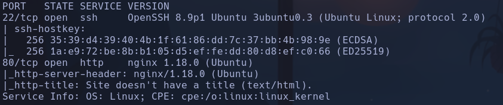

- Linux
- Launchpad -> Jammy
-
```bash
whatweb http://10.129.229.41
```

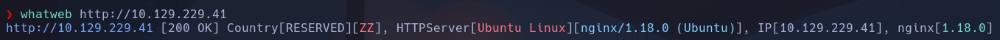

- Vemos un subdominio tickets.keeper.htb

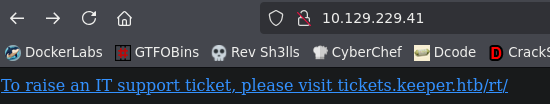

- Lo añadimos al /etc/hosts

- Vemos un portal de login

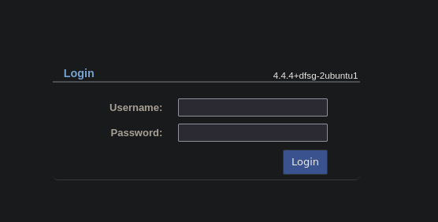

Si hacemos un whatweb vemos info de la pagina

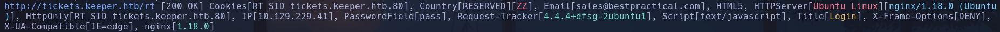

- Si probamos el dominio keeper.htb no redirige a ningún sitio al añadirlo en /etc/hosts

- Vemos que está hecha la web con *Request Tracker*


- Probamos con default credentials según google -> root:password
Conseguimos entrar

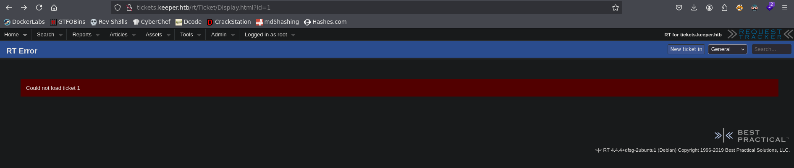

- Si visitamos All Dashboards vemos que hay otro dominio, con una url
http://keeper.htb/rt/Dashboards/Modify.html

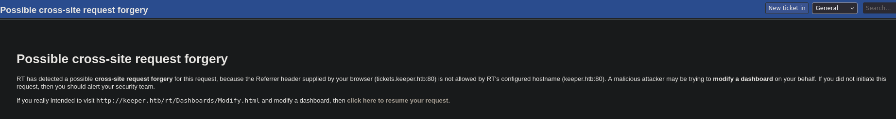

- Se da cuenta de que no está permitido el dominio keeper.htb aunque lo tengamos en /etc/hosts
- No encuentra la url

- Seguimos investigando y vemos un ticket que sí está visible acerca de una incidencia con Keepass

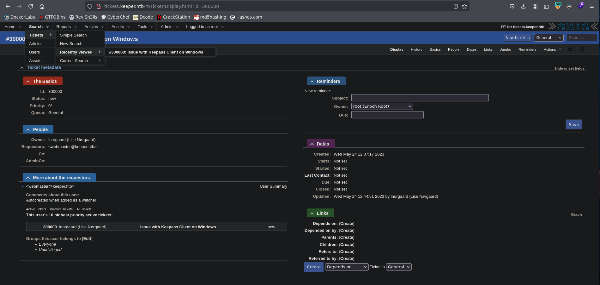

- El admin habla de que el user que ha habierto el tiquet ha subido el archivo de keepass en el adjunto del ticket, pero que lo ha borrado por seguridad y creado una copia en su escritorio

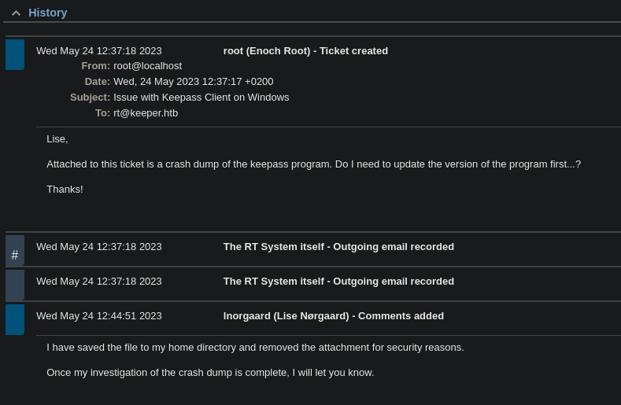

- En la conversación parece que el admin le envía varios correos en los que igual hay alguna contraseña por defecto por haber sido restablecida

- Encontramos en usuarios un comentario sobre el usuario

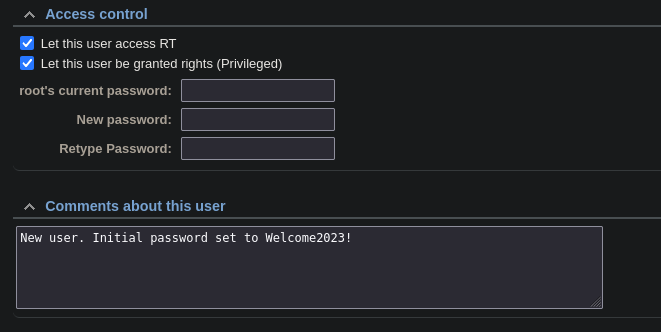

Donde efectivamente se dice que se ha seteado la contraseña a Welcome2023
Inorgaard:Welcome2023!
- Conseguimos entrar a RT con estas credenciales

- Por ssh no entra con estas credenciales, intentaremos enumerar algún usuario
Lise -> así empieza el correo del ticket de Inorgaard
Enoch -> en la info del usuario root

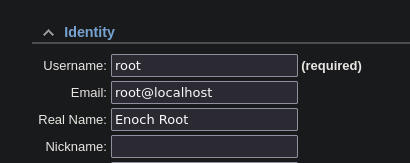

- SuperUser ->  en los comentarios del usuario root

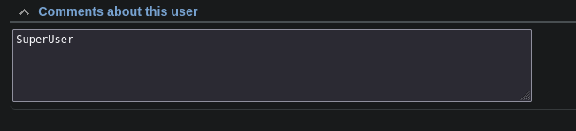

- Nos creamos un pequeño diccionario con los posibles usuarios
**no es inorgaard es lnorgaard con L xd**

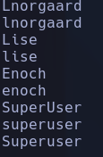

- Usamos Hydra
```bash
hydra -L users.txt -p Welcome2023! ssh://10.129.229.41 -V
```

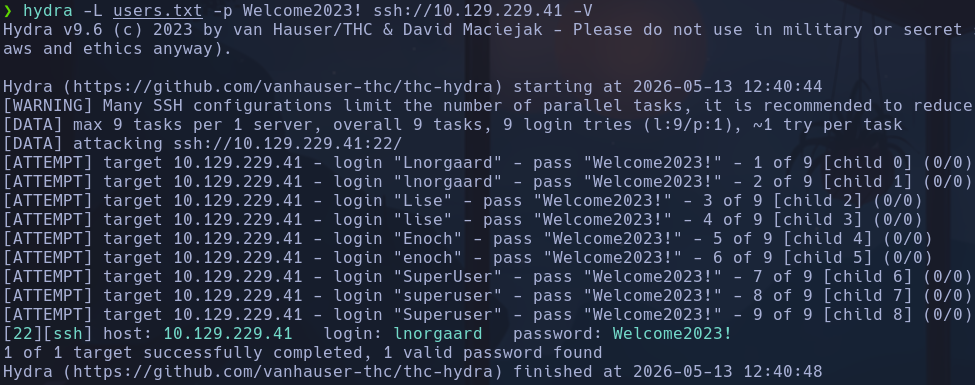

lnorgaard:Welcome2023!

## Escalada

En el propio directorio del usuario se ve un archivo *RT30000.zip*

- Nos lo pasamos a nuestro Kali por serv http con python3
Lo descomprimimos
```bash
unzip RT30000.zip
```

- Se nos descargan dos archivos de keepass binarios

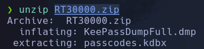

- Es de tipo Mini DuMP

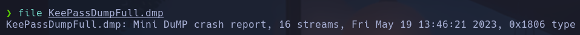

- Usaremos alguna herramienta para leer este tipo de archivo
Instalamos **keepass-dump-masterkey**
```bash
git clone https://github.com/matro7sh/keepass-dump-masterkey
```

- Vemos que se usa de la forma
```bash
python3 poc.py -d KeePassDumpFull.dmp
```

- Obtenemos posibles contraseñas que siguen un patrón parecido

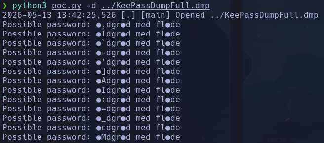

Si buscamos en google qué puede ser vemos que es un postre danés (coincide con el nombre y el idioma del usuario lnorgaard)

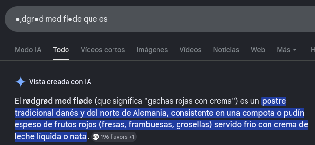

rødgrød med fløde

- Esta es la master key, abriremos el archivo con esta contraseña y el cliente de keepass **keepass2**
```bash
sudo apt update
sudo apt install keepass2
```

Abrimos el archivo
```bash
keepass2 passcodes.kdbx
```

Ponemos **rødgrød med fløde**
Entramos

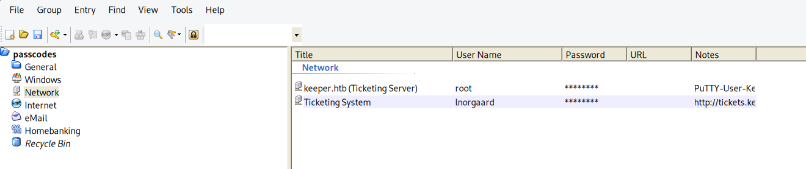

- Copiamos la contraseña con click derecho en root y obtenemos la pass **F4><3K0nd!**
NO funciona para acceder por ssh

- Vemos en notas que lo que hay es la private key de rsa por PuTTY (cliente ssh en windows), asique nos la guardaremos en un archivo *key.ppk* (.ppk es formato PuTTY)

- Nos descargamos la herramienta *putty-tools* para pasar la clave PuTTY a OpenSSH (cliente ssh en linux)
```bash
puttygen key.ppk -O private-openssh -o id_rsa
```

-0: output type (private-openssh)
-o: arhivo en el que se guarda
Nos genera el archivo **id_rsa**

- Accedemos ahora por ssh con la clave
```bash
ssh -i id_rsa root@keeper.htb
```

root
