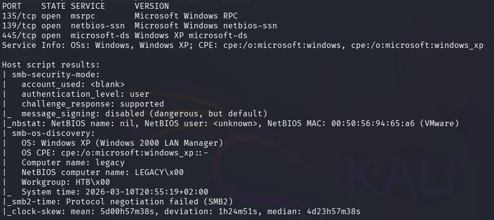
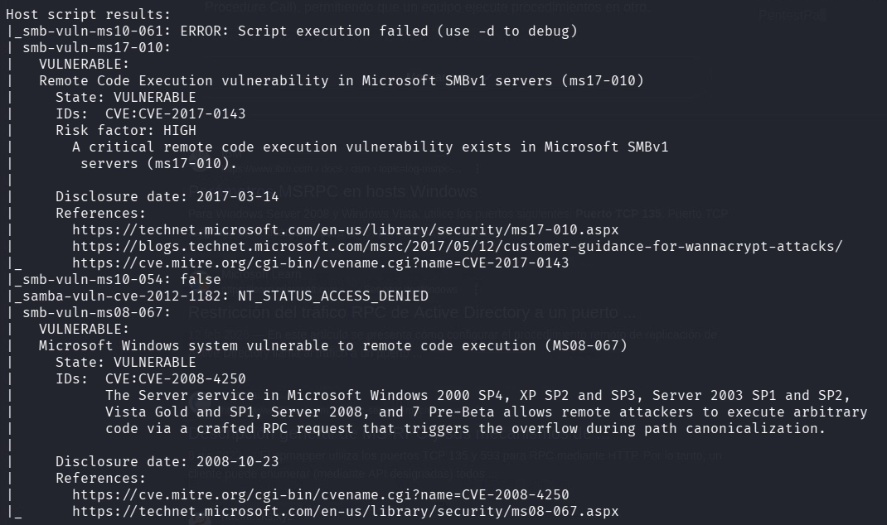
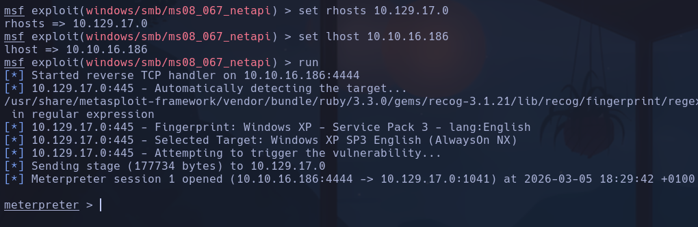

# Legacy

```bash
nmap -p- -sCV --open --min-rate=5000 -n 10.129.17.182 -oN nmapScan.txt
```



- Ejecutamos reconocimiento de scripts de vulnerabilidades
```bash
nmap --script vuln -sV 10.129.17.182
```



- Explotando el exploit *windows/smb/ms08_067_netapi*



NT AUTHORITY\SYSTEM

**ESCALADA**

Ya tenemos permisos privilegiados
