# SolidState

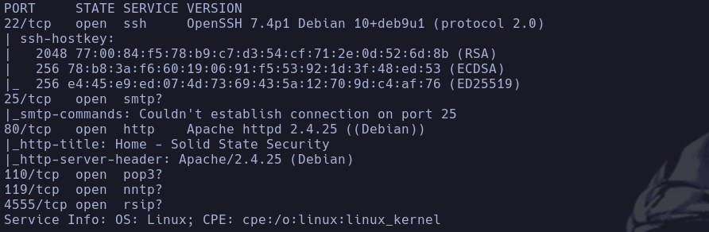

- Whatweb
http://10.129.49.215 [200 OK] Apache[2.4.25], Country[RESERVED][ZZ], Email[webadmin@solid-state-security.com], HTML5, HTTPServer[Debian Linux][Apache/2.4.25 (Debian)], IP[10.129.49.215], JQuery, Script, Title[Home - Solid State Security]

- 80
Vemos una web de servicios de ciberseguridad pero no vemos nada a priori

- 110
Vemos que es común que haya un *pop3*

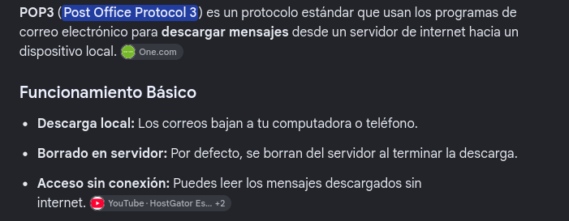

Intentamos conectarnos con telnet al *pop3*
```bash
telnet 10.129.49.215 110
```

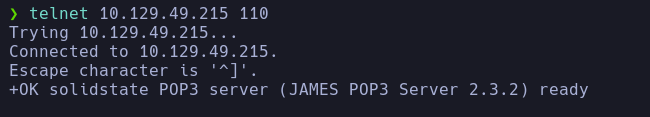

Buscamos comandos que podamos usar

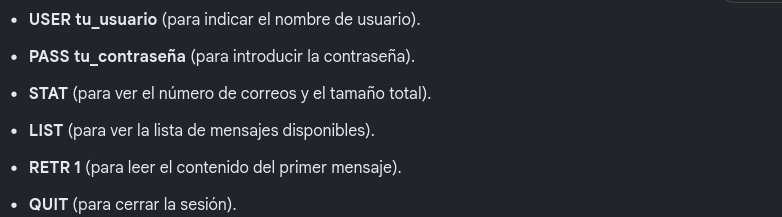

En principio tenemos que logearnos y no tenemos credenciales, nos pone **-ERR** cuando intentamos conectanos con el usuario webadmin@solid-state-security.com

- 119
Servidor NNTP

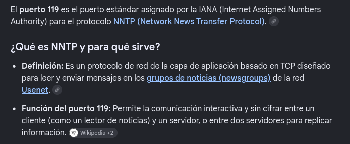

Intentamos conectarnos con nc
```bash
nc 10.129.49.215 119
```

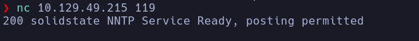

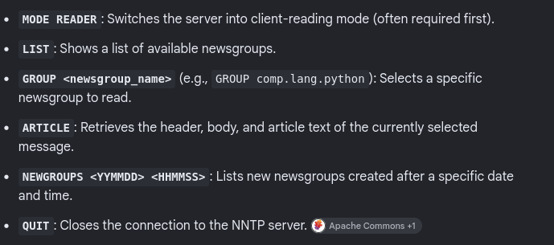

- Intentamos enumerar información
```bash
list
```

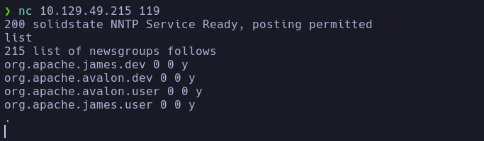

No vemos ningún contenido dentro de los grupos de noticias

- 4555
Vemos que por defecto puede ser que corra un Apache James Server

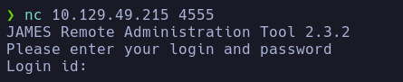

Nos pide un id
- buscamos en google que las credenciales por defecto de *JAMES Remote Administration Tool* es root:root

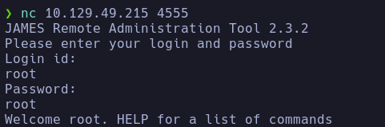

- Estamos dentro, vamos a ver qué comandos podemos usar con help

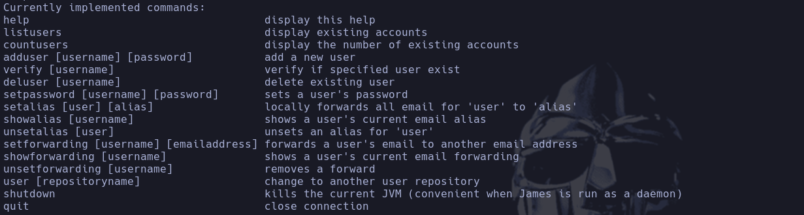

```bash
listusers
```

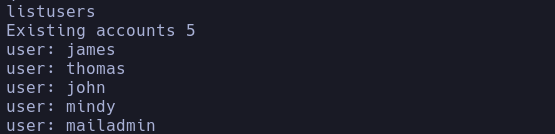

Vemos 5 cuentas
james, thomas, john, mindy y mailadmin

- Podemos cambiarle la contraseña a james por ejemplo


Intentaremos cambiarsela a **mailadmin** para intentar acceder desde el **POP3**
```bash
setpassword mailadmin mailadmin
```

- Conseguimos conectarnos al POP3

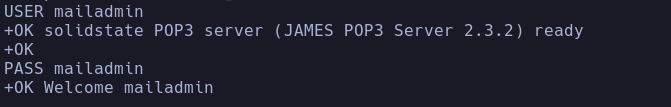

mailadmin:mailadmin
Enumeramos el contenido de la bandeja de entrada con STAT pero no hay ningún correo

- Cambiamos la contraseña al resto de usuarios

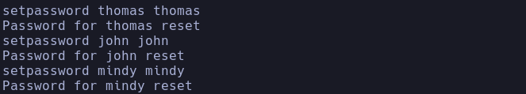

- Para el usuario **mindy** vemos dos correos

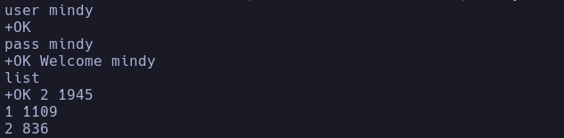

```bash
retr 1
```

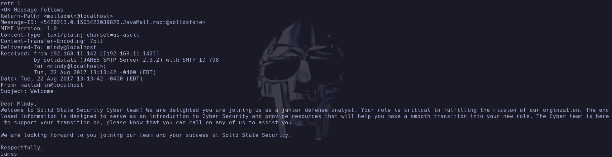

```bash
retr 2
```

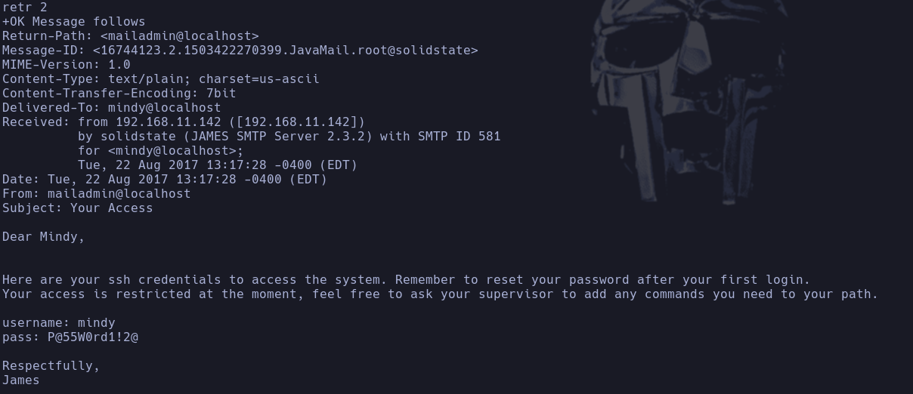

Vemos unas credenciales en ssh
mindy:P@55W0rd1!2@

- Nos intentamos conectar por ssh
```bash
ssh mindy@10.129.49.215
```

mindy

## Escalada

- Tenemos una restricted bash
Pulsamos dos veces *Tab* para ver posibles comandos que podemos usar
No vemos ninguno explotable como *tar* a priori

- Buscando encuentro que podemos ejecutar una bash por ssh
```bash
ssh mindy@10.129.49.215 bash
```

Conseguimos spawnear una bash

- Usuarios -> *mindy*, *james*, *root*

- Vemos que corre un CUPS en el puerto 631 y que no es accesible desde fuera, hacemos un local port forwarding y  accedemos a un panel de control de cups en nuestra máquina

- Vemos un proceso que corre por root -> */bin/sh /opt/james-2.3.2/bin/run.sh*
```bash
ssh mandy@10.129.49.215 -L 631:127.0.0.1:631 bash
```

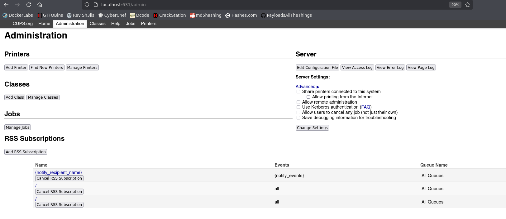

Probamos varias vulnerabilidades de **CUPS 2.2.1** pero no funciona ninguno a priori por tener el puerto 631 no expuesto

- Nos creamos un script en bash que monitorice los procesos que corren en la máquina

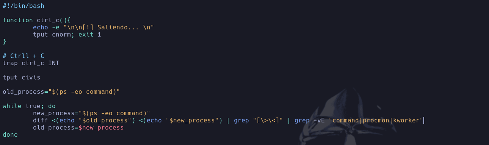

Al ejecutarlo vemos el siguiente proceso:
Lo ejecutamos
```bash
./procmon.sh
```

Vemos un .py ejecutado

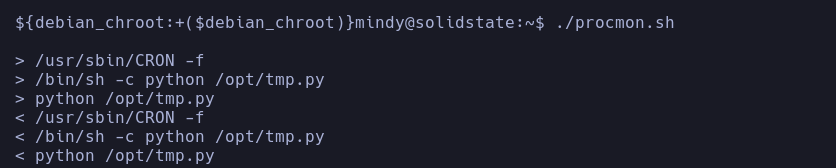

Pertenece a root y es modificable por todo el mundo

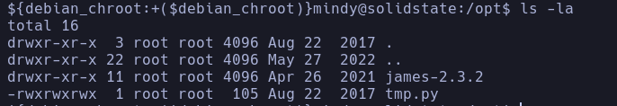

- Modificamos el archivo

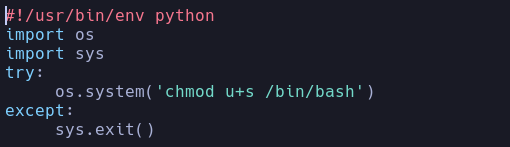

- Esperamos a que se ejecute de nuevo el proceso a ver si es ejecutado por root y cambia el permiso SUID a la bash
```bash
watch n1 ls -l /bin/bash
```

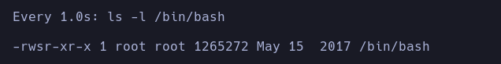

```bash
/bin/bash
```

root
