# Waldo

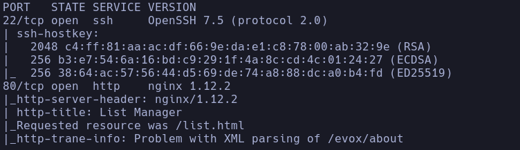

- Whatweb
http://10.129.229.141 [302 Found] Country[RESERVED][ZZ], HTTPServer[nginx/1.12.2], IP[10.129.229.141], PHP[7.1.16], RedirectLocation[/list.html], X-Powered-By[PHP/7.1.16], nginx[1.12.2]
http://10.129.229.141/list.html [200 OK] Country[RESERVED][ZZ], HTTPServer[nginx/1.12.2], IP[10.129.229.141], Script, Title[List Manager], nginx[1.12.2]

-
```bash
sudo nmap --script http-enum 10.129.229.141
```

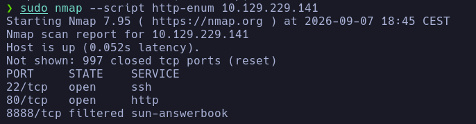

Vemos un puerto filtrado
- 8888 sun-answerbook ->

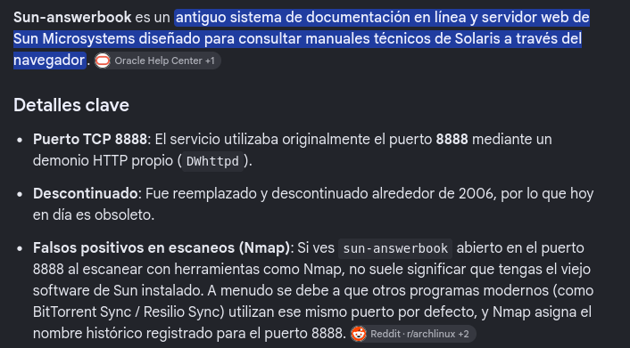

Vemos que puede ser un falso positivo de nmap
Probamos a conectarnos al servicio expuesto con nc

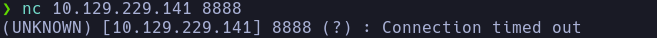

Parece que no hay nada corriendo en principio

- 80
Vemos una serie de listas y de elementos editables

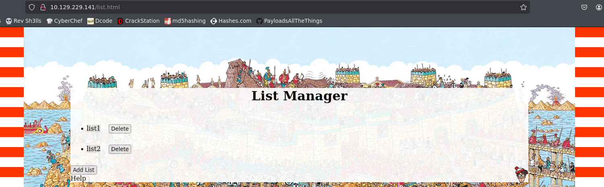

En la lista dos vemos un elemento PWN

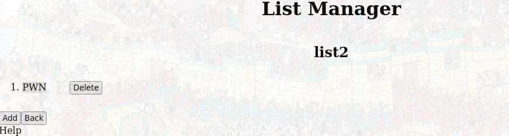

Algo raro aunque tampoco nos da ninguna pista feaciente

- Vemos que debajo de "List Manager" aparece el nombre de la lista a priori no editable, pero podríamos intentar un XSS con burp
Vemos esto en la petición/respuesta

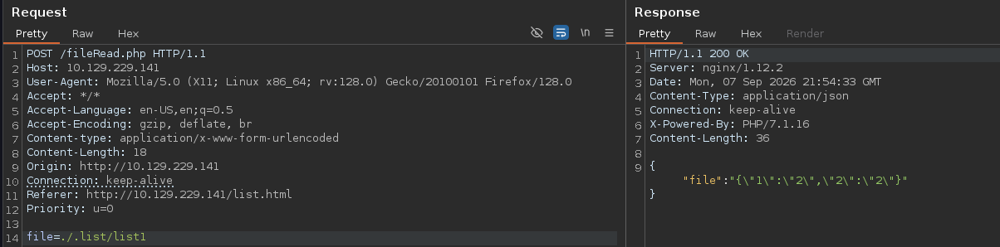

Accede a un recurso *./.list/listX*
Devuelve el contenido de los elementos

- Vemos que la petición se realiza a un recurso */fileRead.php* del cual no podemos ver el contenido a priori, solo llamarlo por petición POST

- Esta es la petición/respuesta para crear una lista o añadir objetos nuevos

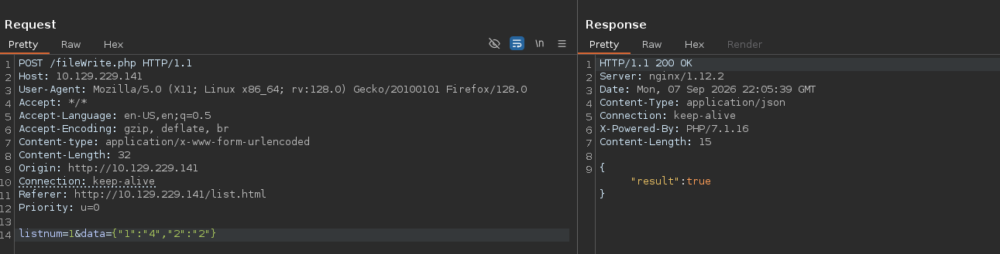

- Fuzzeamos el servidor

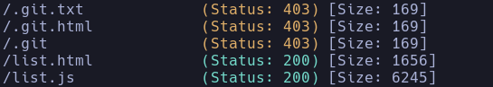

- /git.txt -> Nos devuelve un forbidden 403
- /list.js -> Vemos el js que controla la lógica de listas y elementos al completo

- En *list.js* vemos una función que es */dirRead.php*

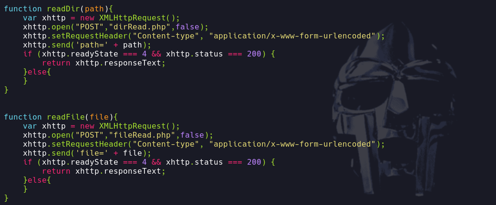

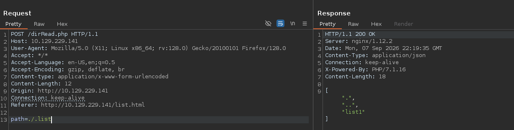

Si intentamos un Path Traversal conseguimos enumerar archivos del servidor

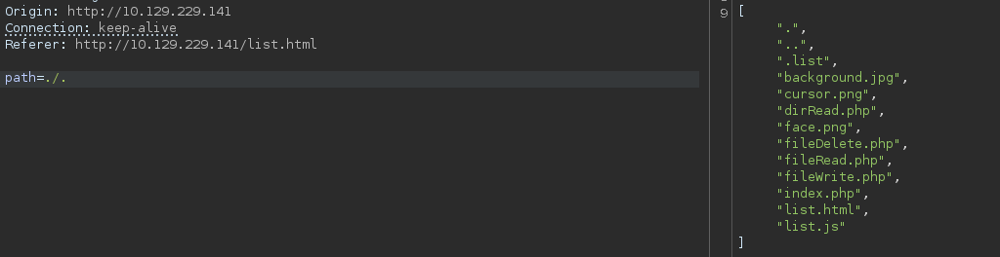

- Probando vemos que la navegación por los directorios no es */../../../* sino que .. hace referencia al directorio anterior

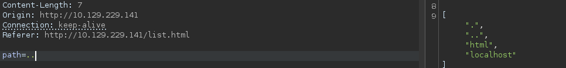

Vemos */html* lo cual es común dentro de /var/html y vemos un localhost

- Parece que el servidor está haciendo una sustitución de *"../"* pero no hace bien la regex puesto que si añadimos un *....//* bypasearemos el control y podremos acontecer un Path Traversal
```bash
....//....//....//home//nobody//.ssh//
```

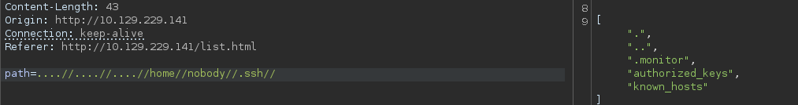

Si queremos acceder a **.monitor** con la url
```bash
....//....//....//home//nobody//.ssh//.monitor
```

-> nos dará un error

- Me da que pensar que está utilizando la otra función del js de **fileRead.php** que vemos al haber enumerado la carpeta raíz del servidor con *./.*
Podemos comprobar en el js que ahora el parámetro es **file** en lugar de **path**
formaremos con curl la petición
```bash
curl -X POST "http://10.129.229.141/fileRead.php" -H  "Content-Type: application/x-www-form-urlencoded" -d "file=....//....//....//home//nobody//.ssh//.monitor"
```

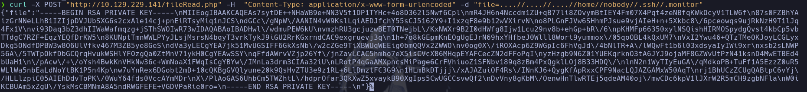

Enumeramos la clave privada
Para verla bien usaremos
```bash
| jq -r '.file'
```

para filtrar por el elemento *file* del json

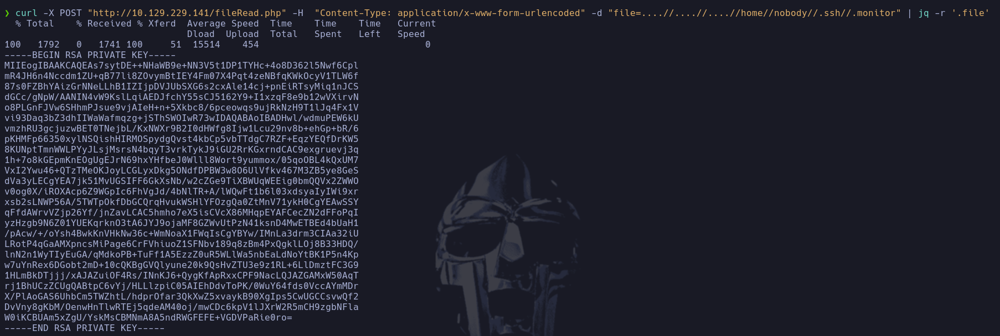

- Intentaremos conectarnos por ssh al usuario **monitor** que parece tener una carpeta en home (podemos también ver el /etc/passwd)

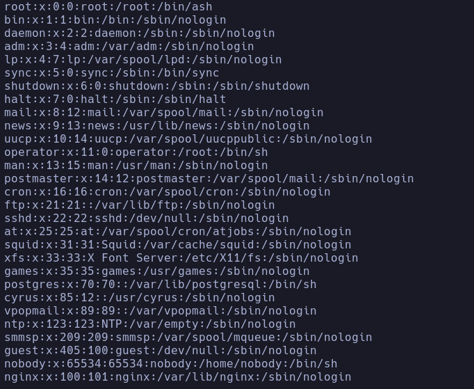

Vemos que efectivamente existe el usuario **nobody**
nobody

## Escalada

- Accedemos con una *sh* pero parece ser que no existe /bin/bash en la maquina ni *script* para hacer
```bash
script /dev/null -c bash
```

- Parece que parece haber un contenedor levantado en la máquina con IP 127.0.1.1
Vemos una interfaz docker0, la cual tiene como IP 172.17.0.1

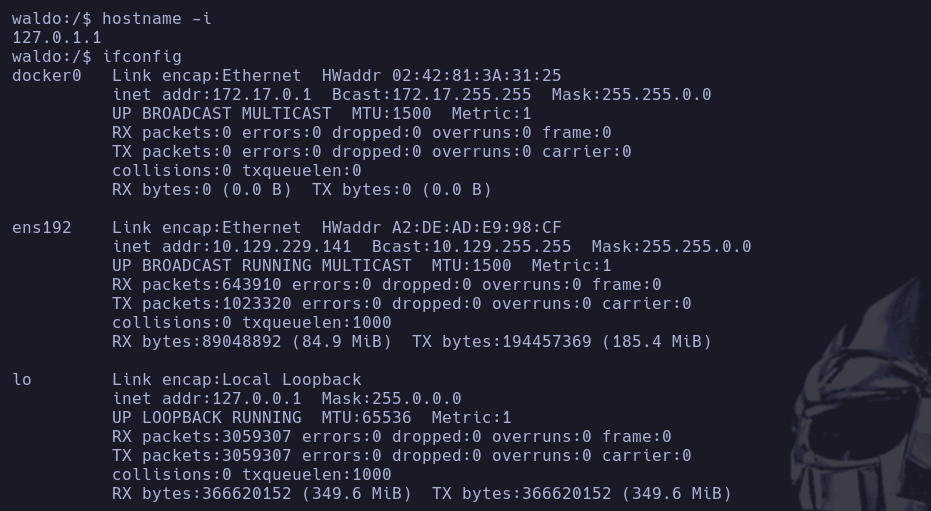

- Vemos varios procesos interesantes en la máquina
```bash
netstat -nat
```

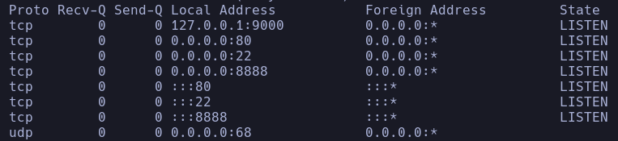

- Vemos que existen puertos levantados para todas las interfaces con **0.0.0.0** -> el 22, 80 (anteriormente expuestos) y 8888
- Y también en IPv6 -> **:::** -> 22, 80, 8888

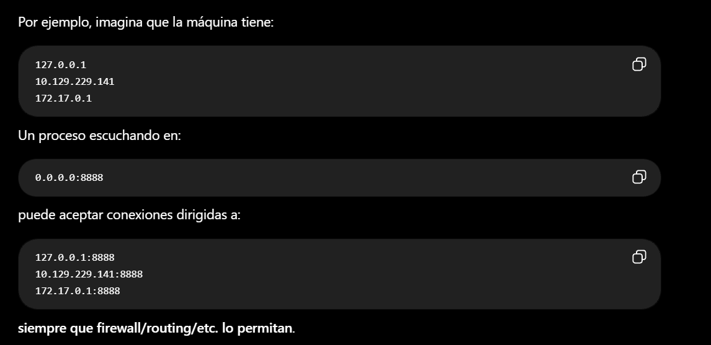

- Recordamos que este puerto aparecía *filtered* en el primer escaneo que hicimos, por lo que podemos confirmar que NO es un falso positivo de nmap

- Vemos los procesos que hay corriendo en la máquina
```bash
ps -faux
```

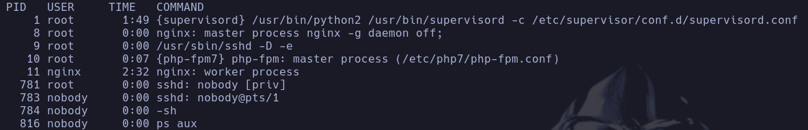

Vemos un proceso runeado por root con python2 llamado *supervisord*

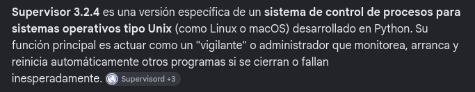

- Vamos a intentar buscar vulnerabilidades conocidas para este programa
En principio nada

- Vamos a investigar el puerto 9000

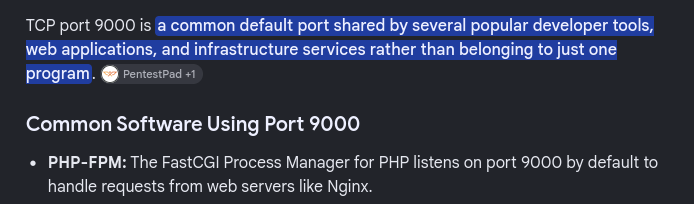

Coincide con el proceso con PID 10 corrido por root, el cual tira de un archivo de configuración */etc/php7/php-fpm.conf*
- No conseguimos averiguar exploit ni vulnerabilidad a simple vista

- Vemos que el comando
```bash
lsb_release -a
```

no funciona, pero tenemos la alternativa del archivo */etc/os-release*

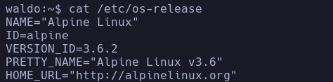

Estamos en un **Alpine Linux**

- Si volvemos a */home/nobody/.ssh* y leemos el archivo **authorized_keys**, vemos que hay una clave pública del usuario **monitor**, el cual a priori no consta en el /etc/passwd de la máquina

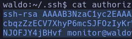

- Vamos a intentar conectarnos al usuario monitor en el localhost
Con la clave pública solo no sirve, tendremos que pasarle la clave privada **.monitor** con la que accedimos en un principio al sistema como nobody
```bash
ssh -i .monitor monitor@127.0.0.1
```


monitor (rbash)

- Parece que nos hemos conectado al contenedor, a la otra interfaz que aparecía de docker en la máquina

- Entramos en una rbash
Intentaremos bypassearla con
```bash
ssh -i .monitor monitor@127.0.0.1 bash
```

monitor

- Es algo rara la distribución de esta máquina, parece que estamos en la IP víctima pero sigue habiendo un contenedor

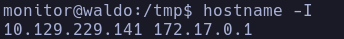

- Tratamos la tty normal aunque el ctrl+z nos devuelva a *nobody* en lugar de a nuestro kali

- Vemos una capability sospechosa

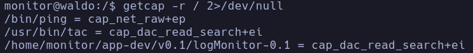

En */home/monitor/app-dev/v0.1/logMonitor-0.1* -> **cap_dac_read_search+ei**
- No conseguimos

- Vemos que con **tac** podemos visualizar archivos del sistema
```bash
tac /etc/shadow
```

Lo que hace tac es darle la vuelta a las líneas del archivo, es decir, la primera la pone la última y viceversa

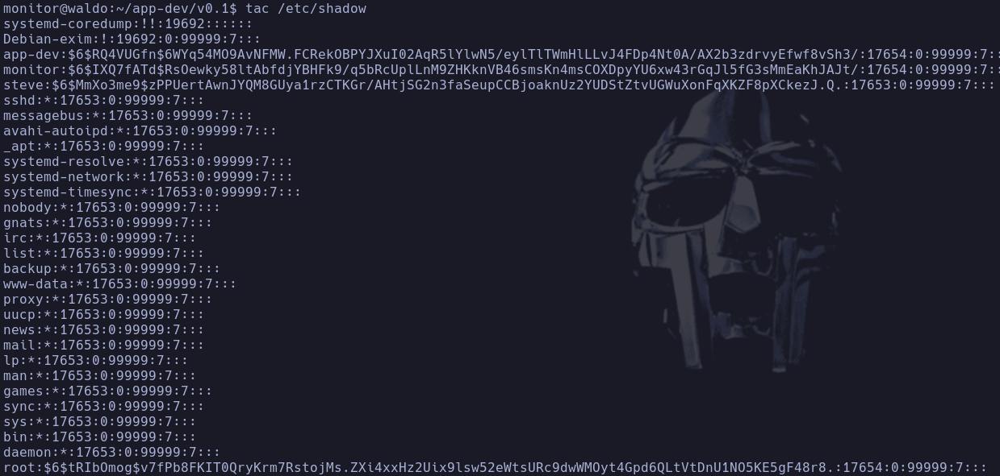

Intentaremos enumerar alguna clave privada de root
```bash
tac /root/.ssh/id_rsa
```

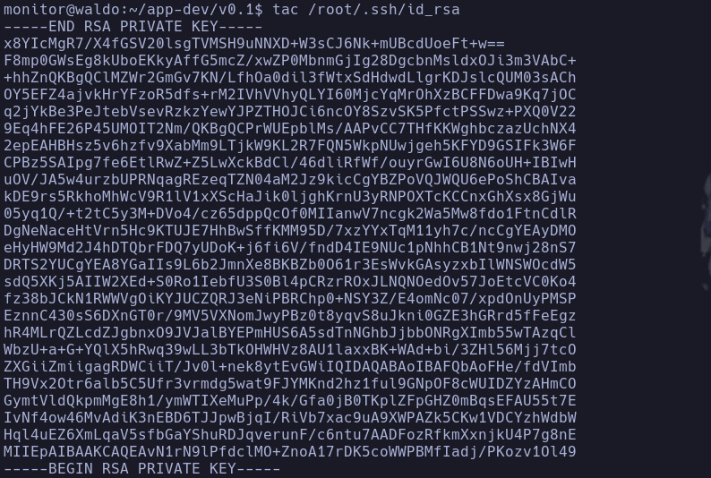

Si le aplicamos otro tac en paralelo conseguiremos ver el archivo original
```bash
tac /root/.ssh/id_rsa | tac
```

(tac es cat al revés)

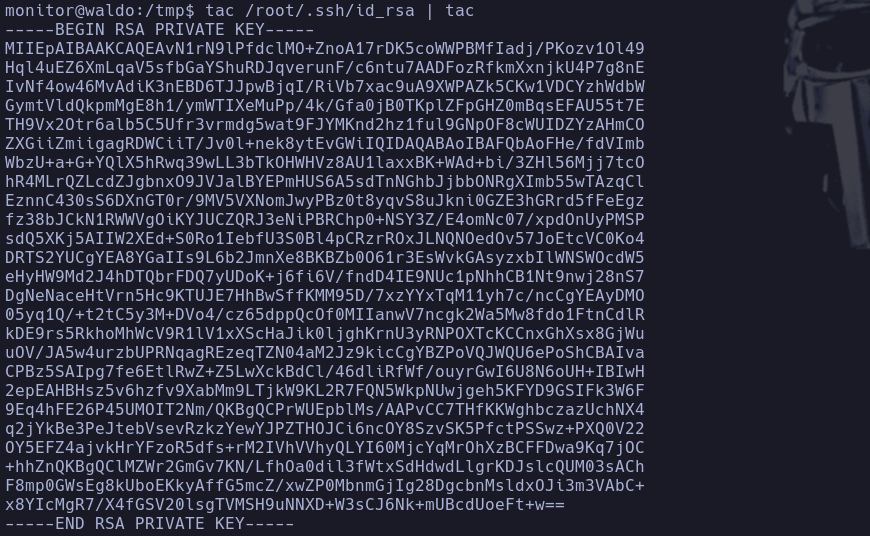

- Nos guardamos la id_rsa y nos conectamos al localhost por ssh con el usuario root
```bash
ssh -i id_rsa root@127.0.0.1
```

NO nos deja
- Si lo intentamos desde fuera tampoco podemos parece que no le gusta

- Revisamos la configuración de ssh en */etc/ssh/sshd_config*
Vemos que no está habilidatada la autenticación de root

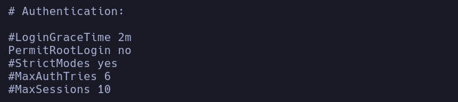

No podemos conectarnos como root pero podemos ejecutar comandos como tal

## Fin labs ejpt
