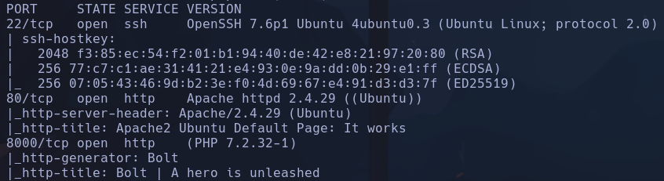
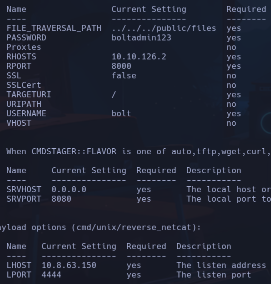

# Bolt

Aparece info sobre fingerprint-strings y un servicio no reconocido que devuelve un estring bastante largo

Es un CMS llamado bolt
En texto de la web:
Jake (Admin) -> bolt
passwd -> boltadmin123

metasploit:
unix/webapp/bolt_authenticated_rce

**root** xd
