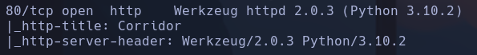
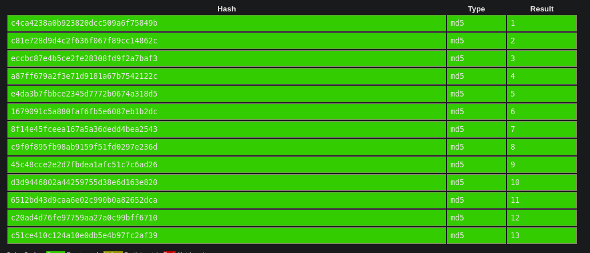
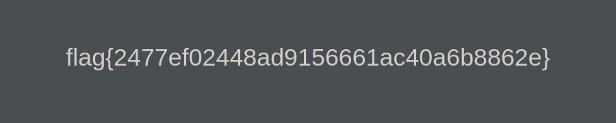

# Corridor

integrity:
sha384-9aIt2nRpC12Uk9gS9baDl411NQApFmC26EwAOH8WgZl5MYYxFfc+NcPb1dKGj7Sk
crossorigin="anonymous"

Puerta1
c4ca4238a0b923820dcc509a6f75849b
Puerta2
c81e728d9d4c2f636f067f89cc14862c
Puerta3
eccbc87e4b5ce2fe28308fd9f2a7baf3
puerta4
a87ff679a2f3e71d9181a67b7542122c
Puerta5
e4da3b7fbbce2345d7772b0674a318d5
Puerta6
1679091c5a880faf6fb5e6087eb1b2dc
Puerta7
8f14e45fceea167a5a36dedd4bea2543
Puerta8
c9f0f895fb98ab9159f51fd0297e236d
Puerta9
45c48cce2e2d7fbdea1afc51c7c6ad26
puerta10
d3d9446802a44259755d38e6d163e820
Puerta11
6512bd43d9caa6e02c990b0a82652dca
Puerta12
c20ad4d76fe97759aa27a0c99bff6710
Puerta13
c51ce410c124a10e0db5e4b97fc2af39

Calculamos el hash de 14 a ver si cuela:
aab3238922bcc25a6f606eb525ffdc56

Y el de 0
cfcd208495d565ef66e7dff9f98764da
Con el de 0 hay suerte

