# Easy Peasy

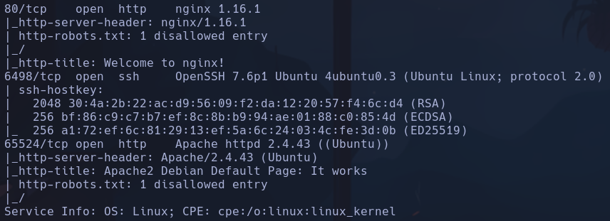

Con Gobuster solo encontramos un directorio /hidden
Volvemos a hacer gobuster sobre ese directorio y encontramos /hidden/whatever

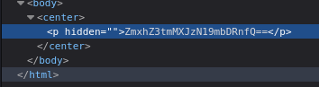

flag{f1rs7_fl4g}

en 10.10.13.124:65524/robots.txt hay un hash que averiguo que es md5
a18672860d0510e5ab6699730763b250
flag{1m_s3c0nd_fl4g}

En el index.html de apache de 10.10.13.124:65524/robots.txt encontramos la terceraflag
flag{9fdafbd64c47471a8f54cd3fc64cd312}

También otro código que parece el directorio oculto

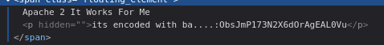

ObsJmP173N2X6dOrAgEAL0Vu
--> Probando con cyberchef vemos en está en base62:
/n0th1ng3ls3m4tt3r

Encontramos

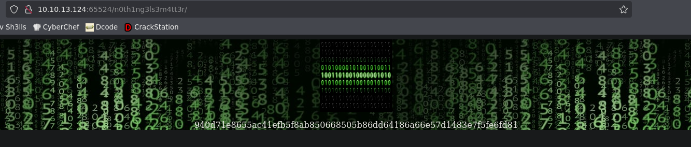

Haremos
`hash-identifier 940d71e8655ac41efb5f8ab850668505b86dd64186a66e57d1483e7f5fe6fd81`

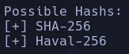

Pag https://md5hashing.net y seleccionando "search all types" para los hashes encontramos el valor
mypasswordforthatjob

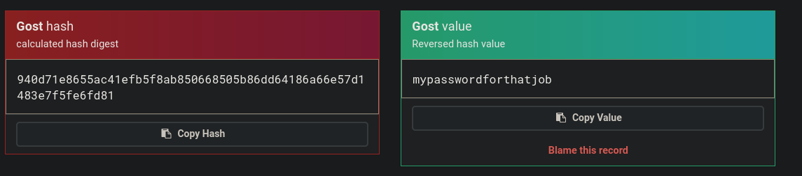

La imagen del banner parece tener un archivo oculto

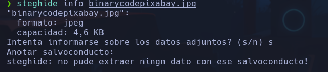

Probamos la contraseña deshasheada y se nos descarga

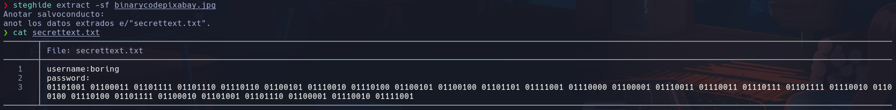

El archivo tiene un cifrado binario
Intentamos descifrarlo
Vemos que es ASCII con dcode.fr

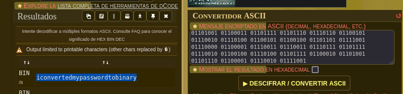

iconvertedmypasswordtobinary

en secret aparece también el usuario
**boring:iconvertedmypasswordtobinary**

Intentamos conectarnos por ssh
`ssh boring@10.10.13.124 -p 6498`
**boring**

## Escalada

`export TERM=xterm-256color` -> no funciona xterm normal

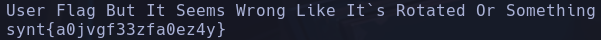

synt{a0jvgf33zfa0ez4y}  --> Flag rotada xd

Con dcode.fr usamos ROT cypher (de rotar) y encontramos opciones válidas:
flag{n0wits33msn0rm4l}

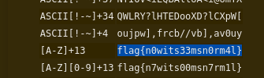

Usamos linpeas
`cp /usr/share/peass/linpeas/linpeas.sh /home/qarlg/Labs/TryHackMe/easypeasy`
`chmod 666 linpeas.sh `
`scp -P 6498 linpeas.sh boring@10.10.13.124:/tmp/`
En boring
`chmod +x linpeas.sh`
`./linpeas.sh`

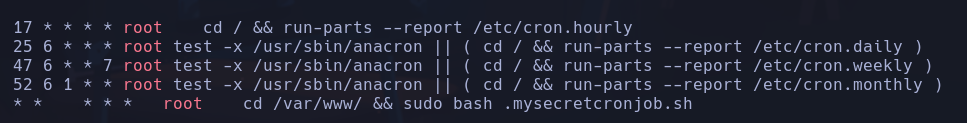

Vemos un servicio cron llamado /var/www/.mysecretcronjob.sh

Nos lanzamos una revshell

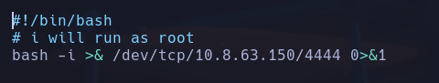

**root**

Última flag:
`cd /root`
`ls -la`
`cat .root.txt`

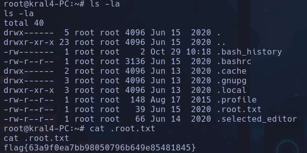
